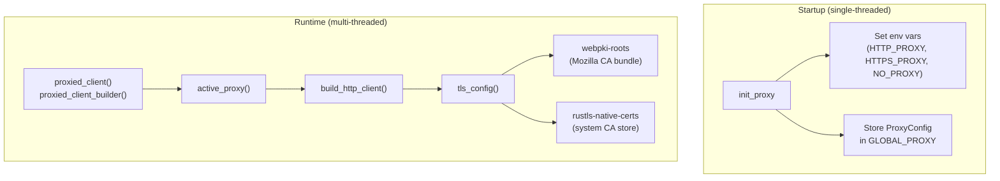

# Infrastructure & Utilities — librefang-http-src

# librefang-http

Centralized HTTP client construction with TLS fallback and proxy management.

Every outbound HTTP connection in the codebase should route through this module so that proxy settings and TLS configuration are applied uniformly. The module solves two practical problems:

1. **Missing system CA certificates** — On musl builds (Termux/Android), minimal Docker images, or corporate Linux with partial CA bundles, `reqwest`'s default TLS initialization panics. This module seeds the trust store with bundled Mozilla CA roots first, then supplements with whatever system certs are available.

2. **Proxy consistency** — Proxy settings from `config.toml` are applied both as explicit `reqwest::Proxy` entries *and* as environment variables, ensuring that crates which build their own clients independently still pick up the configuration.

## Architecture



## Initialization

### `init_proxy(cfg: ProxyConfig)`

Call **once** at daemon startup with the `[proxy]` section from `config.toml`. Can be called again during hot-reload.

On the initial call (when `GLOBAL_PROXY` is `None`), the function:

1. Validates `http_proxy` and `https_proxy` URLs — must use `http://`, `https://`, `socks5://`, or `socks5h://` schemes. Invalid URLs are logged with a warning and skipped.
2. Exports validated values to environment variables (`HTTP_PROXY`, `http_proxy`, `HTTPS_PROXY`, `https_proxy`, `NO_PROXY`, `no_proxy`).
3. Stores the `ProxyConfig` in `GLOBAL_PROXY` for use by `proxied_client_builder`.

On subsequent calls (hot-reload), only `GLOBAL_PROXY` is updated. Environment variables are **not** re-set because `std::env::set_var` is inherently racy in a multi-threaded Tokio runtime.

```rust
// At startup, before spawning worker threads:
init_proxy(config.proxy);
```

## TLS Configuration

### `tls_config() -> rustls::ClientConfig`

Returns a cached `rustls::ClientConfig` built on the first call:

1. Seeds the root store with **bundled Mozilla CA roots** (`webpki_roots::TLS_SERVER_ROOTS`) — this guarantees common public CAs are always trusted.
2. Supplements with **system CA certificates** via `rustls_native_certs::load_native_certs()` — adds org-internal/self-signed CAs and keeps trust anchors current.
3. If no system certs are found, a debug-level log is emitted; the Mozilla roots still provide coverage for public endpoints.

The result is stored in a `OnceLock` and cloned on subsequent calls.

## Client Builders

### Primary API

| Function | Returns | Use when |
|---|---|---|
| `proxied_client()` | `reqwest::Client` | You need a ready-to-use client with global proxy settings |
| `proxied_client_builder()` | `reqwest::ClientBuilder` | You need to customize timeouts, headers, or other options before building |
| `proxied_client_with_override(proxy_url)` | `reqwest::Client` | A specific provider requires a different proxy than the global config |

### Legacy aliases

- `new_client()` → `proxied_client()`
- `client_builder()` → `proxied_client_builder()`

These exist for backward compatibility and delegate directly to the primary functions.

### `build_http_client(proxy: &ProxyConfig) -> reqwest::ClientBuilder`

The core builder function. It:

- Applies the preconfigured TLS config via `use_preconfigured_tls`.
- Sets a `User-Agent` header: `librefang/<version>`.
- Sets default timeouts:
  - **Connect timeout**: 30 seconds (TCP + TLS handshake).
  - **Read timeout**: 300 seconds (per-read inactivity, not total request time — streaming LLM responses stay alive as long as tokens arrive).
- Applies explicit proxy settings from the `ProxyConfig` argument. When a field is `None`, reqwest's built-in env-var detection (`HTTP_PROXY`, `HTTPS_PROXY`, `NO_PROXY`) provides the fallback automatically, avoiding double-application.
- Constructs a `NoProxy` filter from the `no_proxy` field and attaches it to each proxy.

Callers can override the default timeouts by calling `.timeout()` or `.connect_timeout()` on the returned builder.

### `proxied_client_with_override(proxy_url: &str) -> reqwest::Client`

Routes **all** traffic through the given proxy URL using `Proxy::all()`, ignoring the global config. Used by provider drivers that support per-provider proxy overrides (e.g., `chatgpt::with_proxy`, `anthropic::with_proxy_and_timeout`, `gemini::with_proxy_and_timeout`, `openai::with_proxy_and_timeout`, `openai::new_azure_with_proxy`).

If the URL is invalid, it logs a warning and falls back to `proxied_client()` (global proxy).

## Consumers

The module is used throughout the codebase by a wide range of components:

- **LLM provider drivers** — `chatgpt`, `anthropic`, `gemini`, `openai`, `copilot`, `bedrock` all construct clients via `proxied_client()` or `proxied_client_with_override()`.
- **Tool execution** — `tool_web_fetch_legacy`, `tool_web_search_legacy`, `tool_location_get` use `proxied_client_builder()` to build customized clients.
- **Media processing** — `whisper_transcribe`, `elevenlabs_transcribe`, `gemini_transcribe`, `generate_image`, `synthesize_elevenlabs`, `synthesize_openai` all use `proxied_client()`.
- **Infrastructure** — `provider_health::probe_model`, `model_catalog::probe_api_key`, `embedding::new`, `a2a::new`, `pairing::notify_devices`.

## Thread Safety

| Component | Mechanism | Notes |
|---|---|---|
| `TLS_CONFIG` | `OnceLock` | Write-once, read-many. Safe across threads. |
| `GLOBAL_PROXY` | `RwLock<Option<ProxyConfig>>` | Read on every client build; written on `init_proxy`. |
| Env var export | Guarded by `is_initial` check | Only runs during bootstrap before the Tokio runtime spawns workers. |

## Validation

`is_valid_proxy_url(url)` checks that the URL starts with one of the four supported schemes: `http://`, `https://`, `socks5://`, `socks5h://`. URLs with other schemes (or no scheme) are rejected with a logged warning. The function is called both in `init_proxy` (for env-var export) and implicitly in `build_http_client` (via `Proxy::http` / `Proxy::https` construction).