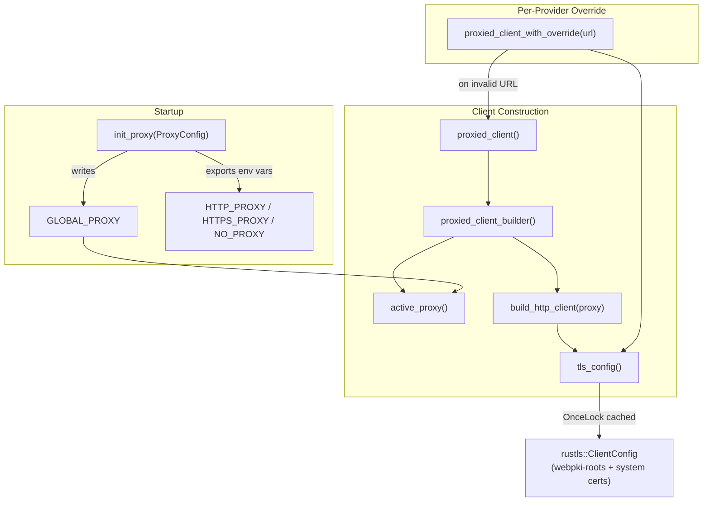
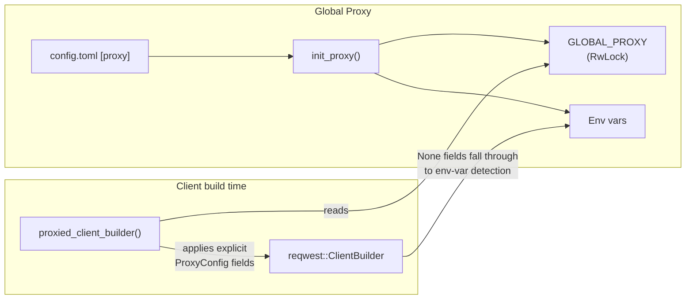

# Infrastructure & Utilities — librefang-http-src

# librefang-http

Centralized HTTP client factory that ensures every outbound connection from the daemon uses consistent proxy settings and a TLS stack that works even on systems without system CA certificates.

## Overview

All HTTP traffic in the project—LLM API calls, OAuth flows, webhook delivery, MCP transport, media transcription, web search/fetch—goes through this module. Using a single factory guarantees:

- **Proxy settings** from `config.toml` (or environment variables) are applied uniformly, including for crates that build their own `reqwest::Client` internally.
- **TLS trust anchors** are available on minimal systems (musl static builds, Termux, stripped Docker images) by bundling Mozilla CA roots via `webpki-roots`, supplemented by whatever system certificates exist.
- **Sensible timeouts** prevent stalled upstreams from hanging the agent loop.



## Initialization

### `init_proxy(cfg: ProxyConfig)`

Call **once** at daemon startup with the `[proxy]` section from `config.toml`. On the initial call (when `GLOBAL_PROXY` is still `None`), this function:

1. Validates proxy URLs against an allow-list of schemes (`http://`, `https://`, `socks5://`, `socks5h://`). Invalid schemes are logged and skipped.
2. Exports config values to `HTTP_PROXY` / `HTTPS_PROXY` / `NO_PROXY` (both upper and lower case) so that crates building their own `reqwest::Client` via reqwest's built-in env-var detection also pick up the settings.
3. Stores the config in the global `RwLock`.

On subsequent calls (hot-reload), only the in-memory `GLOBAL_PROXY` is updated—**no** environment variables are mutated, because `std::env::set_var` is unsound in a multi-threaded Tokio runtime.

```rust
// Typical startup sequence
let proxy_config: ProxyConfig = config.proxy.clone();
librefang_http::init_proxy(proxy_config);
```

### Thread-safety contract

`std::env::set_var` is inherently racy. This module avoids the problem by only setting env vars during the initial bootstrap call, which happens **before** the Tokio runtime spawns worker threads. Hot-reload calls update `GLOBAL_PROXY` exclusively.

## TLS Configuration

### `tls_config() -> rustls::ClientConfig`

Returns a cached `rustls::ClientConfig` (first call builds it, subsequent calls clone the cached instance via `OnceLock`). The root certificate store is populated in two layers:

| Layer | Source | Purpose |
|-------|--------|---------|
| 1 — Bundled | `webpki_roots::TLS_SERVER_ROOTS` | Mozilla CA roots compiled into the binary. Ensures common public CAs are trusted everywhere. |
| 2 — System | `rustls_native_certs::load_native_certs()` | OS certificate store. Adds org-internal / self-signed CAs and keeps trust anchors current. |

If no system certs are found, a debug-level log message is emitted and the bundled roots serve as the sole trust anchor.

The TLS config uses `aws_lc_rs` as the crypto provider (`rustls::crypto::aws_lc_rs::default_provider`).

## Client Builders

### Primary API

| Function | Returns | Use when |
|----------|---------|----------|
| `proxied_client_builder()` | `reqwest::ClientBuilder` | You need to customize the client further (e.g. add middleware, override timeouts) |
| `proxied_client()` | `reqwest::Client` | You just need a ready-to-use client |

Both read from `GLOBAL_PROXY` automatically and use the cached TLS config.

### `build_http_client(proxy: &ProxyConfig)`

The core builder function. Called by `proxied_client_builder()` internally, but also available directly when you have a specific `ProxyConfig` instance (not the global one).

Applied settings:

- **TLS**: preconfigured via `tls_config()`
- **User-Agent**: `librefang/<version>`
- **Connect timeout**: 30 seconds (TCP + TLS handshake)
- **Read timeout**: 300 seconds (per-read inactivity, not total request time; streaming LLM responses stay alive as long as tokens arrive)
- **Proxy**: explicit `http_proxy` / `https_proxy` from the `ProxyConfig`, with `no_proxy` filter. When config fields are `None`, reqwest's built-in env-var detection provides the fallback.

The timeouts are defaults on the builder—callers can override them with `.timeout()` / `.connect_timeout()` on the returned `ClientBuilder`.

### Per-Provider Override

`proxied_client_with_override(proxy_url: &str) -> reqwest::Client`

Routes all traffic through a specific proxy URL, ignoring the global config entirely. Used for per-provider proxy overrides. If the URL is invalid, falls back to `proxied_client()`.

### Backward-Compatible Aliases

- `client_builder()` → `proxied_client_builder()`
- `new_client()` → `proxied_client()`

These exist for compatibility and should not be used in new code.

## Proxy Resolution Strategy

The proxy system has two complementary mechanisms:



1. **Explicit config**: `build_http_client` sets `Proxy::http()` / `Proxy::https()` only when the corresponding `ProxyConfig` fields are `Some`. These are applied with the `no_proxy` filter from config.
2. **Env-var fallback**: When a field is `None`, reqwest's built-in env-var detection reads `HTTP_PROXY` / `HTTPS_PROXY` / `NO_PROXY` automatically. Because `init_proxy` exports these during bootstrap, crates that don't use this builder (e.g. `librefang-channels`) still get the right proxy.

This avoids double-applying proxy settings while keeping everything consistent.

## Integration with Other Modules

This module is a leaf dependency used across the codebase. Key consumers include:

| Consumer module | Functions called | Purpose |
|----------------|-----------------|---------|
| `librefang-runtime` (provider_health, tool_runner, embedding, web_fetch, web_search, media_understanding, image_gen, tts, a2a, model_catalog) | `proxied_client()`, `proxied_client_builder()` | LLM API calls, web search/fetch tools, embeddings, TTS, image generation |
| `librefang-runtime-oauth` (chatgpt_oauth, copilot_oauth) | `proxied_client()`, `proxied_client_builder()` | OAuth device flows, token refresh |
| `librefang-runtime-mcp` | `proxied_client_builder()`, `proxied_client()` | MCP SSE and HTTP-compatible transports |
| `librefang-runtime-wasm` (host_functions) | `proxied_client_builder()` | WASM host-side network fetch |
| `librefang-kernel` (pairing) | `proxied_client()` | Device notification webhooks |
| `librefang-cli` (http_client) | `tls_config()` | CLI uses the TLS config directly for its own client construction |

## Usage Examples

### Basic — get a client for an API call

```rust
let client = librefang_http::proxied_client();
let resp = client.get("https://api.openai.com/v1/models")
    .bearer_auth(api_key)
    .send()
    .await?;
```

### Customized builder with overridden timeout

```rust
let client = librefang_http::proxied_client_builder()
    .timeout(std::time::Duration::from_secs(600))
    .build()?;
```

### Per-provider proxy override

```rust
// Route only this provider's traffic through a SOCKS5 proxy
let client = librefang_http::proxied_client_with_override("socks5h://internal-proxy:1080");
```

### Direct TLS config reuse (e.g. for CLI or custom clients)

```rust
let client = reqwest::Client::builder()
    .use_preconfigured_tls(librefang_http::tls_config())
    .user_agent("my-tool/1.0")
    .build()?;
```