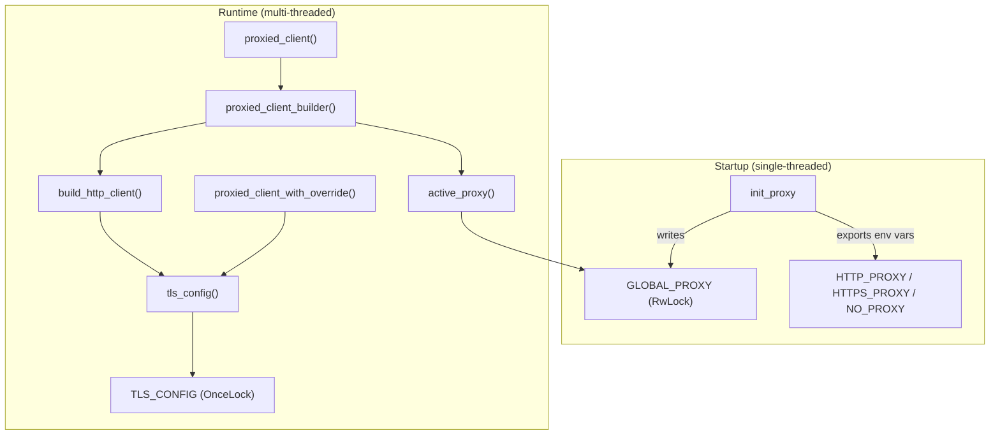

# Infrastructure & Utilities — librefang-http-src

# librefang-http

Centralized HTTP client factory with TLS fallback and proxy management.

Every outbound HTTP request in the codebase should go through this module. It guarantees that proxy settings from `config.toml` and environment variables are applied uniformly, and that TLS works even on systems without system CA certificates (minimal Docker images, Termux/Android, musl builds).

## Architecture



## Startup

At daemon boot, call `init_proxy` once with the `[proxy]` section from `config.toml`:

```rust
let proxy_cfg: ProxyConfig = config.proxy; // from config.toml
librefang_http::init_proxy(proxy_cfg);
```

This does two things:

1. **Sets global proxy state** in `GLOBAL_PROXY`, a `RwLock<Option<ProxyConfig>>` that is read by every subsequent client builder call.
2. **Exports environment variables** (`HTTP_PROXY`, `HTTPS_PROXY`, `NO_PROXY`) so that crates building their own `reqwest::Client` independently (e.g., `librefang-channels`) still pick up the proxy settings via reqwest's built-in env-var detection.

Environment variable export only happens during the initial call (when `GLOBAL_PROXY` is still `None`), which must occur before the Tokio runtime spawns worker threads. This avoids the unsound `std::env::set_var` in a multi-threaded context. Subsequent calls (hot-reload) update `GLOBAL_PROXY` only.

## TLS Configuration

On systems where native CA certificates are unavailable, the default `reqwest` TLS initialization panics. This module solves that by building a `rustls::ClientConfig` that layers two certificate sources:

1. **Bundled Mozilla CA roots** (`webpki_roots`) — always seeded first so common public CAs are trusted everywhere.
2. **System CA certificates** (`rustls_native_certs`) — supplements with org-internal and self-signed CAs.

The result is cached in a `OnceLock<rustls::ClientConfig>` after the first call to `tls_config()`. Every client builder clones this cached config, so the cert-loading work happens exactly once.

## Client Builders

### Primary API

| Function | Returns | Use When |
|---|---|---|
| `proxied_client_builder()` | `reqwest::ClientBuilder` | You need to customize the client further (add headers, cookies, custom timeouts) |
| `proxied_client()` | `reqwest::Client` | You just need a ready-to-use client |
| `proxied_client_with_override(url)` | `reqwest::Client` | A specific provider requires a different proxy than the global one |

### Backward-Compatible Aliases

- `client_builder()` → `proxied_client_builder()`
- `new_client()` → `proxied_client()`

These exist for compatibility and should not be used in new code.

### Default Timeouts

All clients are built with sensible per-request defaults to prevent the agent loop from hanging when an upstream stalls:

- **Connect timeout**: 30 seconds (TCP + TLS handshake)
- **Read timeout**: 300 seconds (per-read inactivity, not total request time)

Streaming LLM responses keep the read timeout alive as long as tokens arrive; a true upstream stall triggers it. Callers can override these via `.timeout()` / `.connect_timeout()` on the returned `ClientBuilder`.

### Proxy Resolution Order

`build_http_client` applies proxy settings in this priority:

1. **Explicit `ProxyConfig` values** (from `config.toml`) are set directly on the builder via `reqwest::Proxy::http()` / `reqwest::Proxy::https()` with the `no_proxy` filter.
2. **Environment variable fallback** — when a `ProxyConfig` field is `None`, reqwest's built-in env-var detection reads `HTTP_PROXY` / `HTTPS_PROXY` / `NO_PROXY` automatically.

This avoids double-applying settings that `init_proxy` already exported.

### User-Agent

Every client sends `librefang/<version>` as the User-Agent string, where `<version>` is the crate version at compile time.

## Internal Functions

### `active_proxy()`

Reads `GLOBAL_PROXY` and returns the current `ProxyConfig`. Returns `ProxyConfig::default()` (all fields `None`) if `init_proxy` has not been called yet, so clients always build successfully.

### `is_valid_proxy_url(url)`

Validates that a proxy URL uses one of the supported schemes: `http://`, `https://`, `socks5://`, or `socks5h://`. Used by `init_proxy` to reject invalid URLs before setting environment variables, and by `proxied_client_with_override` as a safety check.

## Usage Across the Codebase

The call graph shows this module is used pervasively:

- **Provider drivers** (`openai`, `gemini`, `chatgpt`, `copilot`) call `proxied_client_with_override` for per-provider proxy overrides and `proxied_client` for standard access.
- **Media generation** (`minimax`, `elevenlabs`, `google_tts`, `openai` media) call `proxied_client` for image, video, music, and speech synthesis.
- **Runtime services** (`provider_health`, `model_catalog`, `embedding`, `a2a`) call `proxied_client_builder` when they need to add custom request configuration.
- **CLI** (`librefang-cli`) calls `tls_config` directly to reuse the TLS setup in its own HTTP client.

## Hot-Reload

`init_proxy` is safe to call multiple times. On subsequent calls it updates `GLOBAL_PROXY` in place without touching environment variables, making it suitable for configuration hot-reload during runtime.