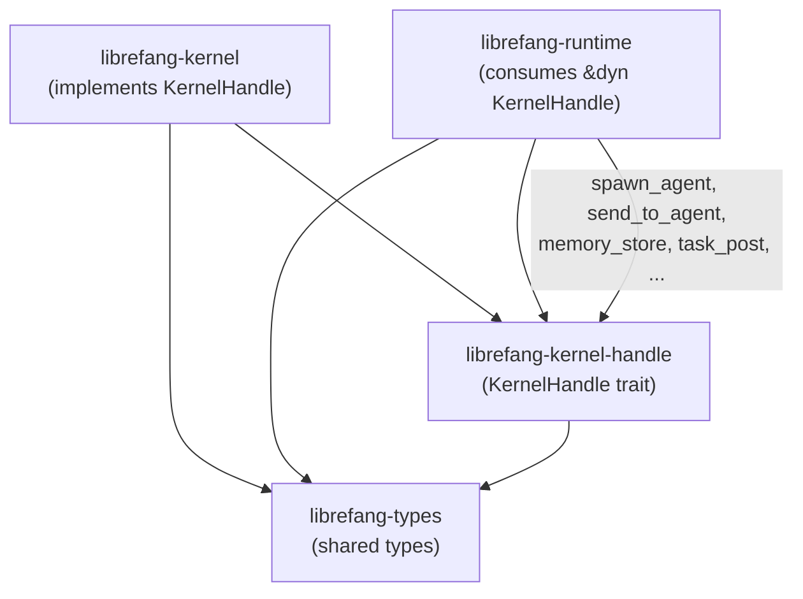

# Infrastructure & Utilities — librefang-kernel-handle-src

# librefang-kernel-handle

Kernel-to-runtime callback trait that breaks the circular dependency between `librefang-kernel` and `librefang-runtime`.

## Why This Module Exists

`librefang-runtime` drives the agent loop — it processes messages, invokes tools, and manages conversation state. Many of those tools need to call back into the kernel: spawning agents, reading shared memory, posting tasks, requesting approval, and so on. But `librefang-kernel` already depends on `librefang-runtime` (it owns the agent loop). A direct reverse-dependency would be circular.

`KernelHandle` solves this with a trait inversion:

1. This crate defines the trait.
2. `librefang-kernel` implements it on its concrete `Kernel` struct.
3. `librefang-runtime` accepts `&dyn KernelHandle` and calls through it.

Both crates depend on this thin trait crate, and neither depends on the other for callback logic.

## Architecture



## `AgentInfo`

A serializable snapshot returned by `list_agents` and `find_agents`:

| Field | Type | Description |
|---|---|---|
| `id` | `String` | Agent UUID |
| `name` | `String` | Human-readable name |
| `state` | `String` | Current lifecycle state |
| `model_provider` | `String` | LLM provider (e.g. `"openai"`) |
| `model_name` | `String` | Model identifier |
| `description` | `String` | Agent description from manifest |
| `tags` | `Vec<String>` | Categorization tags |
| `tools` | `Vec<String>` | Declared tool names |

## `KernelHandle` Trait

`#[async_trait]` applied to `KernelHandle: Send + Sync`. Every method has a default implementation so that test stubs, embedded callers, and partial implementations compile without boilerplate.

Methods are grouped by domain below. Default behaviors are noted — they matter for anyone implementing this trait.

### Agent Lifecycle

| Method | Signature | Default |
|---|---|---|
| `spawn_agent` | `async (manifest_toml, parent_id) → Result<(String, String), String>` | **required** |
| `spawn_agent_checked` | `async (manifest_toml, parent_id, parent_caps) → Result<(String, String), String>` | Delegates to `spawn_agent` without capability enforcement. The real kernel overrides this to validate that every capability in the child manifest is covered by `parent_caps`. |
| `list_agents` | `fn () → Vec<AgentInfo>` | **required** |
| `find_agents` | `fn (query) → Vec<AgentInfo>` | **required** — matches on name substring, tag, or tool name (case-insensitive). |
| `kill_agent` | `fn (agent_id) → Result<(), String>` | **required** |
| `touch_heartbeat` | `fn (agent_id)` | No-op. The runtime calls this during long LLM operations to prevent heartbeat false-positives. The kernel overrides to update `last_active`. |
| `fire_agent_step` | `fn (agent_id, step)` | No-op. Called at the start of each agent loop iteration to emit `agent:step` external hook events. |

### Inter-Agent Messaging

| Method | Signature | Notes |
|---|---|---|
| `send_to_agent` | `async (agent_id, message) → Result<String, String>` | **required**. Send and await response. |
| `send_to_agent_as` | `async (agent_id, message, parent_agent_id) → Result<String, String>` | Delegates to `send_to_agent`. Records the calling parent so `/stop` cascades to the callee (issue #3044). The default emits a `trace`-level log so operators can detect non-cascading handles. |

`send_to_agent_as` is called from `tool_agent_send` in the runtime's tool runner, which also checks `max_agent_call_depth` before dispatching.

### Shared Memory

All three methods accept `peer_id: Option<&str>` for namespace isolation. When `peer_id` is `Some`, keys are scoped to that peer — different users of the same agent get isolated memory.

| Method | Signature | Notes |
|---|---|---|
| `memory_store` | `fn (key, value, peer_id) → Result<(), String>` | **required** |
| `memory_recall` | `fn (key, peer_id) → Result<Option<Value>, String>` | **required** |
| `memory_list` | `fn (peer_id) → Result<Vec<String>, String>` | **required** |

### Task Queue

Asynchronous cooperative task system. Agents post, claim, complete, and query tasks.

| Method | Async | Default |
|---|---|---|
| `task_post(title, description, assigned_to, created_by) → Result<String, String>` | yes | **required** — returns task ID |
| `task_claim(agent_id) → Result<Option<Value>, String>` | yes | **required** |
| `task_complete(agent_id, task_id, result) → Result<(), String>` | yes | **required** |
| `task_list(status) → Result<Vec<Value>, String>` | yes | **required** |
| `task_delete(task_id) → Result<bool, String>` | yes | **required** |
| `task_retry(task_id) → Result<bool, String>` | yes | **required** — resets to pending |
| `task_get(task_id) → Result<Option<Value>, String>` | yes | **required** |
| `task_update_status(task_id, new_status) → Result<bool, String>` | yes | **required** |

### Knowledge Graph

| Method | Signature | Notes |
|---|---|---|
| `knowledge_add_entity` | `async (Entity) → Result<String, String>` | **required** |
| `knowledge_add_relation` | `async (Relation) → Result<String, String>` | **required** |
| `knowledge_query` | `async (GraphPattern) → Result<Vec<GraphMatch>, String>` | **required** |

Uses types from `librefang_types::memory`.

### Cron Scheduling

All three methods default to `Err("Cron scheduler not available")`. The kernel overrides when the scheduler subsystem is present.

| Method | Signature |
|---|---|
| `cron_create` | `async (agent_id, job_json) → Result<String, String>` |
| `cron_list` | `async (agent_id) → Result<Vec<Value>, String>` |
| `cron_cancel` | `async (job_id) → Result<(), String>` |

Called from the runtime tool runner (`tool_schedule_create`, `tool_schedule_list`, `tool_cron_cancel`, `tool_cron_create`, `tool_schedule_delete`).

### Approval System

Two-phase approval flow for gated tool execution:

1. **Check gates** — synchronous methods called before tool dispatch:
   - `requires_approval(tool_name) → bool` — default `false`
   - `requires_approval_with_context(tool_name, sender_id, channel) → bool` — delegates to `requires_approval`
   - `is_tool_denied_with_context(tool_name, sender_id, channel) → bool` — default `false` (hard deny)

2. **Request resolution** — async methods for the approval workflow:
   - `request_approval(agent_id, tool_name, action_summary, session_id) → Result<ApprovalDecision, String>` — default: immediately `Approved`
   - `submit_tool_approval(agent_id, tool_name, action_summary, deferred, session_id) → Result<ToolApprovalSubmission, String>` — non-blocking submit; default: error
   - `resolve_tool_approval(request_id, decision, decided_by, totp_verified, user_id) → Result<(ApprovalResponse, Option<DeferredToolExecution>), String>` — called from HTTP routes (`approve_request`, `reject_request`, `modify_request`, batch endpoints); default: error
   - `get_approval_status(request_id) → Result<Option<ApprovalDecision>, String>` — default: `Ok(None)`

### RBAC / User Policy (M3, issue #3054)

| Method | Return type | Default |
|---|---|---|
| `memory_acl_for_sender(sender_id, channel)` | `Option<UserMemoryAccess>` | `None` — no per-user memory restriction |
| `resolve_user_tool_decision(tool_name, sender_id, channel)` | `UserToolGate` | `Allow` |

`memory_acl_for_sender` is called during `setup_recalled_memories` in the agent loop to build a `MemoryNamespaceGuard`. `resolve_user_tool_decision` returns one of `Allow`, `Deny`, or `NeedsApproval`.

The default of `Allow` (not `NeedsApproval`) is deliberate — it was debated during PR #3205 review. Flipping the default broke ~8 unrelated runtime tests, and the loudness gain wasn't worth the fragile contract for stub kernels.

### Hands System

Autonomous specialized agents. All methods default to "not available" errors.

| Method | Signature |
|---|---|
| `hand_list` | `async () → Result<Vec<Value>, String>` |
| `hand_install` | `async (toml_content, skill_content) → Result<Value, String>` |
| `hand_activate` | `async (hand_id, config) → Result<Value, String>` |
| `hand_status` | `async (hand_id) → Result<Value, String>` |
| `hand_deactivate` | `async (instance_id) → Result<(), String>` |

### A2A (Agent-to-Agent) Discovery

| Method | Signature | Default |
|---|---|---|
| `list_a2a_agents` | `fn () → Vec<(String, String)>` | Empty vec |
| `get_a2a_agent_url` | `fn (name) → Option<String>` | `None` |

### Channel Messaging

Outbound messages to users via adapters (Telegram, Email, etc.). All default to "not available" errors.

| Method | Key parameters |
|---|---|
| `send_channel_message` | `channel, recipient, message, thread_id?, account_id?` |
| `send_channel_media` | `channel, recipient, media_type, media_url, caption?, filename?, thread_id?, account_id?` |
| `send_channel_file_data` | `channel, recipient, data: Vec<u8>, filename, mime_type, thread_id?, account_id?` |
| `send_channel_poll` | `channel, recipient, question, options, is_quiz, correct_option_id?, explanation?, account_id?` |

When `thread_id` is provided, the message is sent as a thread reply. When `account_id` is provided, it routes through a specific configured bot.

### Prompt Versioning & Experiments

| Method | Default |
|---|---|
| `auto_track_prompt_version(agent_id, system_prompt)` | No-op — called from `build_prompt_setup` in the agent loop |
| `get_prompt_version(version_id)` | `Ok(None)` |
| `list_prompt_versions(agent_id)` | `Ok(Vec::new())` |
| `create_prompt_version(version)` | Error |
| `delete_prompt_version(version_id)` | Error |
| `set_active_prompt_version(version_id, agent_id)` | Error |
| `get_running_experiment(agent_id)` | `Ok(None)` |
| `record_experiment_request(experiment_id, variant_id, latency_ms, cost_usd, success)` | `Ok(())` |
| `list_experiments(agent_id)` | `Ok(Vec::new())` |
| `create_experiment(experiment)` | Error |
| `get_experiment(experiment_id)` | `Ok(None)` |
| `update_experiment_status(experiment_id, status)` | Error |
| `get_experiment_metrics(experiment_id)` | `Ok(Vec::new())` |

### Configuration Queries

| Method | Return | Default |
|---|---|---|
| `tool_timeout_secs()` | `u64` | `120` |
| `tool_timeout_secs_for(tool_name)` | `u64` | Delegates to `tool_timeout_secs()` — the kernel overrides with config resolution: exact match → longest glob match → global default |
| `max_agent_call_depth()` | `u32` | `5` |

### Goals

| Method | Default |
|---|---|
| `goal_list_active(agent_id?)` | `Ok(Vec::new())` |
| `goal_update(goal_id, status?, progress?)` | Error |

### Workflows

| Method | Signature | Default |
|---|---|---|
| `run_workflow` | `async (workflow_id, input) → Result<(String, String), String>` | Error. `workflow_id` accepts UUID or workflow name. Returns `(run_id, output)`. |

### Forked Agent Execution

| Method | Signature |
|---|---|
| `run_forked_agent_oneshot` | `async (agent_id, prompt, allowed_tools?) → Result<String, String>` |

Advanced primitive for structured-output-via-forked-call. Spawns a temporary agent turn sharing the parent's prompt cache prefix (critical for Anthropic prompt cache alignment). The fork's messages do **not** persist into the canonical session. The turn-end hook fires with `is_fork: true` to prevent auto-dream recursion.

Pass `allowed_tools = Some(vec![])` to force a single text-only turn. Default: error (stubs fall back to standalone driver calls).

### Workspace Access Control

| Method | Return | Default |
|---|---|---|
| `readonly_workspace_prefixes(agent_id)` | `Vec<PathBuf>` | Empty — all writes allowed |
| `named_workspace_prefixes(agent_id)` | `Vec<(PathBuf, WorkspaceMode)>` | Empty — read-side resolution falls back to primary workspace root |

Used by file operation tools to enforce sandbox boundaries.

### Events

| Method | Signature | Default |
|---|---|---|
| `publish_event` | `async (event_type, payload) → Result<(), String>` | **required** — triggers proactive agents |

## Delegation Chains

Several methods delegate to simpler counterparts by default. Implementors who override the base method automatically affect the delegating method unless they override both:

```
tool_timeout_secs_for  →  tool_timeout_secs
requires_approval_with_context  →  requires_approval
send_to_agent_as  →  send_to_agent
spawn_agent_checked  →  spawn_agent
```

## Implementing `KernelHandle`

The trait is designed for one concrete implementor (`librefang-kernel::Kernel`). When implementing:

1. **Override every "required" method.** Methods marked as required above have no sensible default and will panic or return errors if unoverridden.

2. **Override the delegation chains as a group.** If you implement `send_to_agent` with real routing logic, also implement `send_to_agent_as` with cascade tracking. Same for `spawn_agent` / `spawn_agent_checked` (capability enforcement) and `requires_approval` / `requires_approval_with_context`.

3. **Leave defaults alone for subsystems you don't need.** The cron, hands, channel, workflow, and prompt-experiment methods all degrade gracefully — tools that call them will surface clear "not available" error messages to the agent.

4. **Don't change `resolve_user_tool_decision`'s default to `NeedsApproval`.** See PR #3205 — it breaks unrelated runtime tests that rely on the permissive default mock.

## Usage from the Runtime

The runtime receives a `&dyn KernelHandle` (or `Arc<dyn KernelHandle>`) and calls through it. Key call sites:

- **`agent_loop.rs`** — `touch_heartbeat`, `fire_agent_step`, `tool_timeout_secs_for`, `auto_track_prompt_version`, `memory_acl_for_sender`, `build_prompt_setup` reads prompt versions
- **`tool_runner.rs`** — nearly every tool method dispatches through the handle (`send_to_agent_as`, `memory_store`, `task_post`, `cron_create`, `hand_activate`, etc.)
- **HTTP routes** (`src/routes/`) — approval resolution (`resolve_tool_approval`), prompt management (`set_active_prompt_version`), workflow triggers (`run_workflow`)