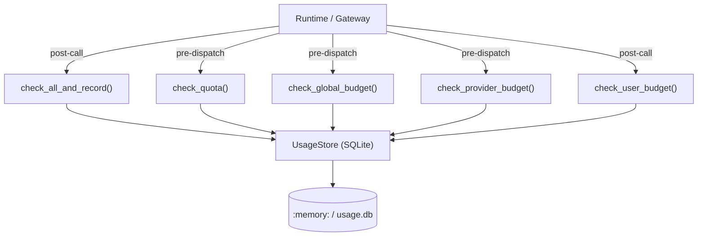

# Infrastructure & Utilities — librefang-kernel-metering-src

# librefang-kernel-metering

Cost tracking and quota enforcement for LLM usage. The metering engine records every LLM call's token consumption and cost, then enforces spending limits across four independent budget dimensions — per-agent, global, per-provider, and per-user — each segmented into hourly, daily, and monthly windows.

## Architecture



All persistence goes through `librefang_memory::usage::UsageStore`, which is SQLite-backed. The `MeteringEngine` itself holds no mutable state — it wraps an `Arc<UsageStore>` and delegates every query.

## Budget Hierarchy

There are four independent budget scopes, checked in isolation unless you use the atomic combined methods:

| Scope | Config type | What it limits | Check method |
|-------|------------|----------------|--------------|
| **Per-agent** | `ResourceQuota` | A single agent's spend | `check_quota` |
| **Global** | `BudgetConfig` | Total spend across all agents | `check_global_budget` |
| **Per-provider** | `ProviderBudget` | Spend routed to one provider (e.g. `moonshot`) | `check_provider_budget` |
| **Per-user** | `UserBudgetConfig` | Spend attributed to one user (RBAC) | `check_user_budget` |

Each scope defines up to three time windows: hourly (`max_cost_per_hour_usd`), daily (`max_cost_per_day_usd`), and monthly (`max_cost_per_month_usd`). The per-provider scope additionally supports `max_tokens_per_hour`.

**Zero means unlimited.** Any window set to `0.0` (or `0` for tokens) is skipped during enforcement. This is the default for all `Default`-derived config structs.

## MeteringEngine

### Construction

```rust
let store = Arc::new(UsageStore::new(substrate.usage_conn()));
let engine = MeteringEngine::new(store);
```

The engine borrows the `UsageStore` via `Arc`, so the same store can be shared across threads.

### Recording Usage

```rust
engine.record(&UsageRecord {
    agent_id,
    provider: "anthropic".into(),
    model: "claude-sonnet-4-20250514".into(),
    input_tokens: 1_500,
    output_tokens: 800,
    cache_read_input_tokens: 500,
    cache_creation_input_tokens: 0,
    cost_usd: 0.0034,
    user_id: Some(user_id),
    ..
})?;
```

`record` inserts a row into the SQLite usage table. It does **not** check quotas — use the atomic methods below if you need enforcement.

### Atomic Check-and-Record

The recommended call path after an LLM response:

```rust
engine.check_all_and_record(&record, &quota, &budget)?;
```

This performs all of the following inside a **single SQLite transaction**, closing the TOCTOU race where concurrent requests could both pass their quota checks before either writes:

1. Verify per-agent hourly / daily / monthly limits
2. Verify global hourly / daily / monthly limits
3. Verify per-provider hourly / daily / monthly and token limits (looked up from `budget.providers` using `record.provider`)
4. Insert the `UsageRecord`

On failure, the transaction rolls back — the record is **not** persisted, and the caller sees a `QuotaExceeded` error.

For partial combinations:

| Method | What it checks atomically |
|--------|--------------------------|
| `check_quota_and_record` | Per-agent only |
| `check_global_budget_and_record` | Global only |
| `check_all_and_record` | Per-agent + global + per-provider |

Per-user budgets are **not** included in the atomic path by design — see the note below.

### Per-User Budgets (Post-Call)

`check_user_budget` is intended as a **post-call** check, invoked after `check_all_and_record` succeeds:

```rust
engine.check_all_and_record(&record, &quota, &budget)?;
if let Some(user_budget) = &user.budget {
    engine.check_user_budget(user.id, user_budget)?;
}
```

The cost of the just-completed call is already in the rolled-up totals. If `check_user_budget` returns `QuotaExceeded`, the **next** call from that user is denied — the current call is not rolled back. This mirrors the per-agent/global/provider semantics: the LLM call already happened, so enforcement gates future calls.

### Non-Atomic Quota Checks

For pre-dispatch gating (before an LLM call is made) or dashboard display:

- `check_quota(agent_id, &quota)` — per-agent
- `check_global_budget(&budget)` — global
- `check_provider_budget("moonshot", &provider_budget)` — per-provider
- `check_user_budget(user_id, &user_budget)` — per-user

These issue individual SQL queries and are not transactionally consistent with each other. For enforcement, prefer the atomic variants.

### Budget Status Snapshot

`budget_status(&budget)` returns a `BudgetStatus` struct with current spend, limit, and percentage for each global window:

```rust
pub struct BudgetStatus {
    pub hourly_spend: f64,
    pub hourly_limit: f64,
    pub hourly_pct: f64,
    pub daily_spend: f64,
    pub daily_limit: f64,
    pub daily_pct: f64,
    pub monthly_spend: f64,
    pub monthly_limit: f64,
    pub monthly_pct: f64,
    pub alert_threshold: f64,
    pub default_max_llm_tokens_per_hour: u64,
}
```

Failed queries default to `0.0` spend so dashboards remain functional even if the store is degraded. The struct derives `serde::Serialize` for API responses.

### Usage Queries

```rust
// Aggregate summary, optionally filtered by agent
let summary: UsageSummary = engine.get_summary(Some(agent_id))?;

// Usage grouped by model
let by_model: Vec<ModelUsage> = engine.get_by_model()?;
```

### Cleanup

```rust
let removed = engine.cleanup(90)?; // delete records older than 90 days
```

## Cost Estimation

### Token Pricing

Cost is computed from four token counters:

| Token type | Pricing rule |
|-----------|-------------|
| Regular input | `(tokens / 1M) × input_rate` |
| Cache-read input | `(tokens / 1M) × input_rate × 0.10` |
| Cache-creation input | `(tokens / 1M) × input_rate × 1.25` |
| Output | `(tokens / 1M) × output_rate` |

Regular input tokens are derived as `input_tokens - cache_read - cache_creation` (saturating subtraction). The cache-read discount (10%) and cache-creation surcharge (125%) follow Anthropic's convention.

### Pricing Sources

Two methods exist:

**`estimate_cost`** — uses hardcoded default rates ($1.00 / $3.00 per million tokens for input/output). Intended for unit tests and environments without a model catalog.

```rust
let cost = MeteringEngine::estimate_cost(
    "any-model", 1_000_000, 1_000_000, 0, 0
);
// cost = $1.00 + $3.00 = $4.00
```

**`estimate_cost_with_catalog`** — looks up the model in the runtime `ModelCatalog`, which reads pricing from the registry. Falls back to default rates for unknown models.

```rust
let cost = MeteringEngine::estimate_cost_with_catalog(
    &catalog, "claude-sonnet-4-20250514", 1_000_000, 1_000_000, 0, 0
);
// cost = $3.00 + $15.00 = $18.00
```

Catalog lookup resolves aliases (e.g., `"sonnet"` → `"claude-sonnet-4-20250514"`).

### Special Cases

**ChatGPT session-auth models** (provider `"chatgpt"`) may have zero catalog pricing because they use session-based access rather than token billing. To keep budget enforcement meaningful, these models fall back to the default $1/$3 rates when both `input_cost_per_m` and `output_cost_per_m` are zero. This is controlled by the internal `should_use_legacy_budget_estimate` function.

**Local-tier models** (e.g., locally-hosted Llama) have genuine zero pricing — no fallback is applied, and cost is $0.00.

**Subscription-based providers** (e.g., `alibaba-coding-plan`) use request-based quotas rather than token billing. Models are registered with zero cost-per-token, and cost tracking shows $0.00. Users should monitor usage via the provider's console.

## Dependencies

| Crate | Usage |
|-------|-------|
| `librefang_memory` | `UsageStore`, `UsageRecord`, `UsageSummary`, `ModelUsage` — all SQLite persistence |
| `librefang_types` | `AgentId`, `UserId`, `ResourceQuota`, `BudgetConfig`, `ProviderBudget`, `UserBudgetConfig`, `LibreFangError`, `ModelCatalogEntry` |
| `librefang_runtime` | `ModelCatalog` — runtime model registry for pricing lookups |