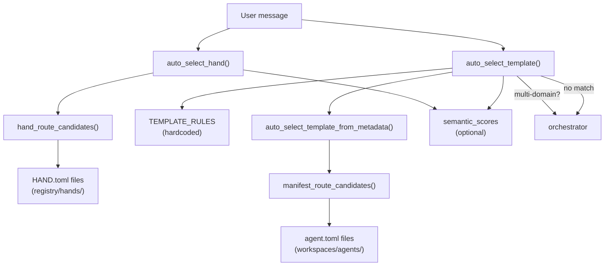

# Infrastructure & Utilities — librefang-kernel-router-src

# librefang-kernel-router

Message-to-specialist routing engine. Given a freeform user message, selects the best **hand** (multi-step workflow) or **template** (single-agent specialist) to handle it, using keyword matching, manifest metadata, and optional embedding-based semantic similarity.

## Architecture



## Public API

### `auto_select_hand(message, semantic_scores) → HandSelection`

Routes a message to the best hand. Returns a `HandSelection` containing:

| Field | Type | Description |
|-------|------|-------------|
| `hand_id` | `Option<String>` | Matched hand ID, or `None` if no hand scored above threshold |
| `reason` | `String` | Human-readable explanation of why this hand was selected |
| `score` | `usize` | Aggregate routing score |

```rust
use librefang_kernel_router::auto_select_hand;

let sel = auto_select_hand("open website and navigate to the login page", None);
// sel.hand_id == Some("browser".to_string())
```

### `auto_select_template(message, agents_dir, semantic_scores) → TemplateSelection`

Routes a message to the best agent template. Returns a `TemplateSelection`:

| Field | Type | Description |
|-------|------|-------------|
| `template` | `String` | Template name (e.g. `"coder"`, `"orchestrator"`) |
| `reason` | `String` | Human-readable routing rationale |
| `score` | `usize` | Aggregate routing score |

Falls back to `"orchestrator"` when no specialist matches, or when multiple specialties match and the message contains multi-domain signals (同时, 分别, 协作, 多个, multi, together).

```rust
use librefang_kernel_router::auto_select_template;

let sel = auto_select_template(
    "请实现一个新的 Rust API 并补丁修复它",
    Path::new("/path/to/agents"),
    None,
);
// sel.template == "coder"
```

### `load_template_manifest(home_dir, template) → Result<AgentManifest, String>`

Loads and parses an `agent.toml` manifest for a given template name from `{home_dir}/workspaces/agents/{template}/agent.toml`. Validates template names against safe characters (`[a-zA-Z0-9_-]`).

### `all_template_descriptions(agents_dir) → Vec<(String, String)>`

Returns `(template_name, embed_text)` pairs for all routable templates. Used by the kernel to build embedding vectors for semantic routing. Produces text in the format `"{name}: {description}. Tags: {tags}"`. Excludes templates listed in `ROUTING_EXCLUDED_TEMPLATES` (currently `["assistant"]`).

### Cache management

```rust
pub fn set_hand_route_home_dir(home_dir: &Path)
pub fn invalidate_hand_route_cache()
pub fn invalidate_manifest_cache()
```

`set_hand_route_home_dir` configures the base directory for hand discovery. `invalidate_hand_route_cache` and `invalidate_manifest_cache` clear their respective caches — call these after config hot-reload, agent install/uninstall, or hand install/uninstall. The skills route handlers (`install_hand`, `uninstall_hand`) call `invalidate_hand_route_cache` automatically.

## Routing algorithm

Both `auto_select_hand` and `auto_select_template` follow the same scoring model:

1. **Keyword matching** — check the message against strong and weak phrase lists for each candidate
2. **Score computation** — `strong_hits × 6 + weak_hits × 1` (hand routing uses `EXPLICIT_ALIAS_WEIGHT` for strong, `WEAK_PHRASE_WEIGHT` for weak; template routing additionally uses `GENERATED_PHRASE_WEIGHT = 2` for auto-generated phrases from metadata)
3. **Semantic blending** — if `semantic_scores` is provided, add `(similarity × 5.0).round()` bonus points per candidate
4. **Threshold filtering** — hands require `MIN_HAND_SCORE = 2`; templates accept any score > 0
5. **Semantic-only fallback** — when keyword matching yields zero candidates, check semantic scores against `SEMANTIC_ONLY_THRESHOLD = 0.55`
6. **Ranking** — sort by score descending, then by hit count descending as tiebreaker; select the top candidate

### Weight constants

| Constant | Value | Purpose |
|----------|-------|---------|
| `EXPLICIT_ALIAS_WEIGHT` | 6 | Hand-curated aliases and HAND.toml `routing.aliases` |
| `GENERATED_PHRASE_WEIGHT` | 2 | Auto-extracted phrases from names, descriptions, tags |
| `WEAK_PHRASE_WEIGHT` | 1 | Low-confidence signals (weak aliases, token fragments) |
| `MAX_SEMANTIC_BONUS` | 5.0 | Maximum points from embedding similarity |
| `SEMANTIC_ONLY_THRESHOLD` | 0.55 | Minimum cosine similarity for semantic-only fallback |
| `MIN_HAND_SCORE` | 2 | Minimum score for a hand match to be accepted |

## Hand routing

Hand routing is **data-driven** from `HAND.toml` files discovered in `{home_dir}/registry/hands/{hand_id}/HAND.toml`.

### Candidate construction

For each hand definition, `hand_route_candidate_from_definition` builds phrase lists:

- **Strong phrases** — `routing.aliases` from HAND.toml, plus phrases extracted from the hand's `description`
- **Weak phrases** — `routing.weak_aliases` from HAND.toml, plus non-generic tokens from the hand ID split on `-` and `_` (tokens must be ≥ 3 characters and not in `GENERIC_ENGLISH_WORDS`)

The `load_hand_route_candidates` function scans `registry/hands/`, parses each `HAND.toml` via `librefang_hands::registry::parse_hand_toml_with_agents_dir`, and logs a warning for any parse failures instead of silently dropping them.

### Home directory resolution

`resolve_hand_route_home_dir` checks sources in priority order:

1. Value set via `set_hand_route_home_dir`
2. `LIBREFANG_HOME` environment variable
3. `~/.librefang` (falls back to system temp directory if no home exists)

## Template routing

Template routing uses **two complementary sources** that are scored independently and then reconciled.

### Hardcoded rules (`TEMPLATE_RULES`)

A static array of 28 `RouteRule` entries covering common specialist domains. Each rule has:

- `target` — template name
- `strong` — labeled regex patterns (English + Chinese) with high confidence
- `weak` — labeled regex patterns with lower confidence

Rules cover: hello-world, coder, debugger, test-engineer, code-reviewer, architect, security-auditor, devops-lead, researcher, analyst, data-scientist, planner, writer, tutor, doc-writer, translator, email-assistant, meeting-assistant, social-media, sales-assistant, customer-support, recruiter, legal-assistant, personal-finance, recipe-assistant, travel-planner, health-tracker, home-automation, ops, and orchestrator.

### Manifest metadata

`auto_select_template_from_metadata` discovers agent templates from `{agents_dir}/*/agent.toml` and builds `ManifestRouteCandidate` entries with three tiers:

- **Explicit aliases** — from `[metadata.routing]` → `aliases` and `strong_aliases` (weight 6)
- **Generated phrases** — auto-extracted from template name, tags, and description (weight 2), unless `exclude_generated = true` is set in routing metadata
- **Weak phrases** — from `[metadata.routing]` → `weak_aliases` plus ID-derived tokens (weight 1)

### Multi-domain detection

When two or more distinct templates score above zero and the message contains multi-domain tokens (同时, 分别, 协作, 多个, multi, together), the router selects `orchestrator` instead of either individual template.

### Reconciliation

If manifest metadata produces a match on a *different* template than the hardcoded rules, the manifest wins only when its score strictly exceeds the rule score by at least 2 points (or the rule score is ≤ 1). This prevents low-confidence metadata from overriding strong rule matches.

## Phrase extraction

The module extracts routing phrases from template names, descriptions, and tags in a language-agnostic way.

### Description phrases

`description_phrases` splits text on phrase separators (punctuation, CJK punctuation like 。，；、), then for each chunk:

- **ASCII chunks** — strips leading/trailing generic English words, extracts word windows via `ascii_phrase_candidates`
- **Non-ASCII chunks** — kept as-is if length is 2–32 characters (via `is_meaningful_unicode_phrase`)

### Tag phrases

`tag_phrases` processes each tag identically to description chunks.

### Name variants

`english_variants` generates candidates from hyphenated/underscored names: `"code-reviewer"` → `["code-reviewer", "code reviewer", "code", "reviewer"]`.

### Phrase matching

`phrase_matches` handles both ASCII and non-ASCII phrases:

- **ASCII** — case-insensitive word-boundary regex match, treating spaces as `[\s_-]+` so `"code review"` matches `"code-review"` and `"code_review"`
- **Non-ASCII** — simple `contains` on lowercased text

Compiled regex patterns are cached globally via `REGEX_CACHE` to avoid recompilation on every message.

## Caching

Three `OnceLock<Mutex<...>>` caches are maintained:

| Cache | Key | Invalidated by |
|-------|-----|----------------|
| `HAND_ROUTE_CACHE` | Home directory path string | `invalidate_hand_route_cache()` |
| `MANIFEST_CACHE` | `agents_dir` path | `invalidate_manifest_cache()` |
| `REGEX_CACHE` | Pattern string (never evicted) | N/A |

Hand and manifest caches are invalidated automatically by install/uninstall handlers and on config hot-reload. The regex cache grows unboundedly but the pattern set is finite and small (~200 entries for the bundled rules).

## Integration with the kernel

The module depends on:

- `librefang_types::agent::AgentManifest` — manifest type for `agent.toml` parsing
- `librefang_hands::registry::parse_hand_toml_with_agents_dir` — HAND.toml parsing with agent template resolution
- `librefang_runtime::registry_sync::resolve_home_dir_for_tests` — test fixture home directory resolution

External callers:

- **Skills routes** (`install_hand`, `uninstall_hand`) call `invalidate_hand_route_cache` after filesystem changes
- **Kernel message dispatch** calls `auto_select_hand` and `auto_select_template` on each inbound user message, passing optional `semantic_scores` computed from embedding cosine similarity against `all_template_descriptions` output