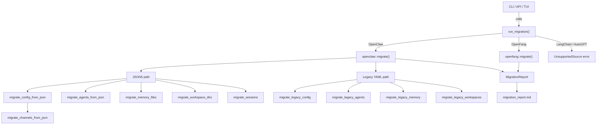

# Infrastructure & Utilities — librefang-migrate-src

# librefang-migrate-src

Migration engine for importing agents, configuration, memory, sessions, and channel definitions from external agent frameworks into LibreFang.

## Purpose

This module converts workspace data from other agent frameworks—primarily **OpenClaw**—into LibreFang's native TOML-based format. It handles two distinct OpenClaw layout generations (modern JSON5 and legacy YAML), migrates 13 channel types with policy mapping, extracts secrets into a dedicated `secrets.env` file, and produces a detailed report of everything imported, skipped, or warned about.

## Architecture



## Public API (`lib.rs`)

### `MigrateSource`

Enum identifying the source framework:

| Variant | Status |
|---|---|
| `OpenClaw` | Fully supported |
| `OpenFang` | Supported (same format, community fork) |
| `LangChain` | Planned (`UnsupportedSource` error) |
| `AutoGpt` | Planned (`UnsupportedSource` error) |

### `MigrateOptions`

```rust
pub struct MigrateOptions {
    pub source: MigrateSource,
    pub source_dir: PathBuf,   // Source workspace directory
    pub target_dir: PathBuf,   // LibreFang home directory
    pub dry_run: bool,         // Report-only, no filesystem writes
}
```

### `run_migration`

```rust
pub fn run_migration(options: &MigrateOptions) -> Result<MigrationReport, MigrateError>
```

Dispatches to the appropriate backend based on `options.source`. Returns a `MigrationReport` listing all imported items, skipped items, and warnings. On success (non-dry-run), writes `migration_report.md` into the target directory.

### `MigrateError`

Error variants covering the full migration failure surface:

- `SourceNotFound(PathBuf)` — source directory does not exist
- `ConfigParse(String)` — unparseable configuration file
- `AgentParse(String)` — unparseable agent definition
- `Io(std::io::Error)` — filesystem errors
- `Yaml(serde_yaml::Error)` — YAML deserialization failures
- `Json5Parse(String)` — JSON5 deserialization failures
- `TomlSerialize(toml::ser::Error)` — TOML serialization failures
- `UnsupportedSource(String)` — framework not yet implemented

## OpenClaw Migration (`openclaw.rs`)

### Supported Workspace Layouts

**Modern (JSON5)** — a single `openclaw.json` containing everything:

```
~/.openclaw/
├── openclaw.json          # Global config, agents, channels, models, tools, cron, hooks
├── auth-profiles.json     # Credentials (not migrated — security)
├── sessions/*.jsonl       # Conversation logs
├── memory/<agent>/MEMORY.md
├── workspaces/<agent>/    # Per-agent working directories
└── skills/
```

Legacy directory names `~/.clawdbot`, `~/.moldbot`, `~/.moltbot` are also detected.

**Legacy (YAML)** — scattered YAML files:

```
~/.openclaw/
├── config.yaml            # Global model/provider config
├── agents/<name>/
│   ├── agent.yaml         # Agent definition
│   ├── MEMORY.md          # Agent memory
│   └── workspace/         # Agent workspace
├── messaging/<channel>.yaml
└── skills/{community,custom}/
```

### Auto-Detection

`detect_openclaw_home()` searches these locations in order:

1. `OPENCLAW_STATE_DIR` environment variable
2. `~/.openclaw`, `~/.clawdbot`, `~/.moldbot`, `~/.moltbot`, `~/openclaw`, `~/.config/openclaw`
3. `%APPDATA%/openclaw`, `%LOCALAPPDATA%/openclaw` (Windows)

A candidate is accepted if it contains a config file (any of the known names) or has `sessions/` or `memory/` subdirectories.

### Scanning

`scan_openclaw_workspace(path)` returns a `ScanResult` listing:

- Whether a config file exists
- All agents found (name, provider, model, tool count, whether memory/sessions/workspace exist)
- All channels present
- All installed skills
- Whether memory data exists

This is used by the CLI and API to preview a migration before running it.

### Migration Pipeline

The `migrate()` function determines the format via `find_config_file()`, then delegates to `migrate_from_json5()` or `migrate_from_legacy_yaml()`. Both paths follow the same sequence:

1. **Config** — Converts global settings (provider, model, memory decay rate, channels) into `config.toml`
2. **Agents** — Converts each agent into `agents/<id>/agent.toml` with model, tools, capabilities, system prompt
3. **Memory** — Copies `MEMORY.md` files to `agents/<id>/imported_memory.md`
4. **Workspaces** — Recursively copies workspace directories to `agents/<id>/workspace/`
5. **Sessions** — Copies `.jsonl` session files to `imported_sessions/`
6. **Skipped features** — Reports cron, hooks, auth profiles, skills, vector indexes as skipped with explanations

### Config Conversion

The output `config.toml` is a minimal subset of `KernelConfig`. Because `KernelConfig` uses `#[serde(default)]` on every field, omitted fields simply take their defaults. The migration explicitly writes:

- `config_version` — set to `CONFIG_VERSION` so the kernel skips versioned migration
- `api_listen` — set to `DEFAULT_API_LISTEN`
- `default_model` — provider, model name, `api_key_env`, optional `base_url`
- `memory.decay_rate` — carried from OpenClaw config or defaults to `0.05`
- `channels` — TOML table of all migrated channels

### Agent Conversion

Each agent becomes a self-contained TOML manifest with:

**Top-level fields:**
- `name`, `version`, `description`, `author`, `module` (`"builtin:chat"`)
- `profile` — mapped from OpenClaw tool profile name via `map_profile_to_librefang()`
- `skills` — per-agent skill allowlist (from `entry.skills`)
- `tool_blocklist` — mapped from OpenClaw `tools.deny` list
- `workspace` — custom workspace path if specified

**`[model]` section:**
- `provider`, `model` — extracted from `provider/model` string via `split_model_ref()`
- `system_prompt` — extracted from OpenClaw `identity` field (supports both raw strings and structured objects)
- `api_key_env` — derived from provider via `default_api_key_env()`

**`[[fallback_models]]` array:**
- Each fallback model gets its own entry with provider, model, and `api_key_env`

**`[capabilities]` section:**
- `tools` — mapped tool list, resolved from allow-lists or tool profiles
- `memory_read`, `memory_write` — default grants
- `network`, `shell`, `agent_message` — derived from tool names via `derive_capabilities()`
- `agent_spawn` — enabled if agent-messaging tools are present

### Tool Mapping

Tools are resolved in this order per agent:

1. `tools.allow` explicit list — each name checked against `is_known_librefang_tool()` then `map_tool_name()`
2. `tools.also_allow` supplementary list — same mapping logic
3. `tools.profile` — converted via `tools_for_profile()` which maps profile names to `ToolProfile` variants
4. Agent defaults — same resolution chain from `agents.defaults.tools`
5. Hardcoded fallback: `["file_read", "file_list", "web_fetch"]`

Unrecognized tool names are collected and reported as warnings rather than failing the migration.

The tool deny list from OpenClaw's `tools.deny` is now preserved as `tool_blocklist` in the output manifest, preventing unintended privilege widening during migration.

### Channel Migration

13 channel types are handled, each with its own config struct and conversion logic:

| Channel | Status | Notes |
|---|---|---|
| Telegram | Migrated | Token → `secrets.env`, `allow_from` → `allowed_users` |
| Discord | Migrated | Token → `secrets.env` |
| Slack | Migrated | Bot + app tokens → `secrets.env`; `allow_from` warned (no per-user field) |
| WhatsApp | Migrated | Baileys credentials directory copied |
| Signal | Migrated | API URL constructed from host + port |
| Matrix | Migrated | Access token → `secrets.env`, rooms → `allowed_rooms` |
| Google Chat | Migrated | Service account file copied |
| Teams | Migrated | App password → `secrets.env`, tenant → `allowed_tenants` |
| IRC | Migrated | Password → `secrets.env`, channels array preserved |
| Mattermost | Migrated | Bot token → `secrets.env` |
| Feishu | Migrated | App secret → `secrets.env`, domain → region mapping |
| iMessage | Skipped | macOS-only, manual setup required |
| BlueBubbles | Skipped | No LibreFang adapter |

Unknown channel types in the catch-all `other` map are reported as skipped.

**Policy mapping:**

| OpenClaw DM Policy | LibreFang DM Policy |
|---|---|
| `open` | `respond` |
| `allowlist` / `allow_list` | `allowed_only` |
| `pairing` / `disabled` | `ignore` |

| OpenClaw Group Policy | LibreFang Group Policy |
|---|---|
| `open` / `all` | `all` |
| `mention` / `mention_only` | `mention_only` |
| `commands` / `commands_only` / `slash_only` | `commands_only` |
| `disabled` / `ignore` | `ignore` |

### Secrets Handling

Channel tokens and passwords are extracted from the OpenClaw config and written to `secrets.env` in the target directory. The file format is one `KEY=value` per line, with upsert semantics for existing keys. On Unix, file permissions are restricted to `0600` (owner read/write only).

### Identity / System Prompt Extraction

OpenClaw's `identity` field can be a raw string or a deeply nested structured object. `extract_identity_prompt()` handles both forms, searching nested objects for common prompt-bearing keys in priority order:

`systemPrompt` → `system_prompt` → `prompt` → `instructions` → `instruction` → `content` → `text` → `value` → `persona` → `identity` → `description`

If no prompt is found anywhere, a default is generated using the agent's display name.

### Provider Mapping

`map_provider()` normalizes OpenClaw provider names to LibreFang conventions:

| OpenClaw Names | LibreFang Provider |
|---|---|
| `anthropic`, `claude` | `anthropic` |
| `openai`, `gpt` | `openai` |
| `groq` | `groq` |
| `ollama` | `ollama` |
| `openrouter` | `openrouter` |
| `deepseek` | `deepseek` |
| `google`, `gemini` | `google` |
| `xai`, `grok` | `xai` |
| Others | Passed through unchanged |

`default_api_key_env()` maps each provider to its standard environment variable name (e.g., `ANTHROPIC_API_KEY`, `OPENAI_API_KEY`). Ollama returns an empty string since it needs no key.

### Skipped Features

These OpenClaw features are explicitly reported as skipped:

- **Cron** — not yet supported; LibreFang's `ScheduleMode::Periodic` is the alternative
- **Hooks** — not supported; LibreFang's event system is the replacement
- **Auth profiles** — not migrated for security; users must set env vars manually
- **Skills** — must be reinstalled via `librefang skill install`
- **Vector index** (`memory-search/index.db`) — not portable; LibreFang rebuilds embeddings
- **Memory backend config** — LibreFang uses SQLite with vector embeddings
- **Session config** — LibreFang uses per-agent sessions by default

## Integration Points

### Callers

| Caller | Module | Usage |
|---|---|---|
| `cmd_migrate` | `librefang-cli/src/main.rs` | CLI command, uses `run_migration()` + `print_summary()` + `to_markdown()` |
| `run_migrate` | `src/routes/config.rs` | HTTP API endpoint |
| `handle_migration_key` | `tui/screens/init_wizard.rs` | TUI init wizard flow |
| `migrate_detect` | `src/routes/config.rs` | API endpoint using `detect_openclaw_home()` + `scan_openclaw_workspace()` |
| `run` | `tui/screens/init_wizard.rs` | TUI wizard using `detect_openclaw_home()` + `scan_openclaw_workspace()` |

### Dependencies

- **`librefang_types`** — `CONFIG_VERSION`, `DEFAULT_API_LISTEN`, `VERSION`, `ToolProfile`, tool compatibility functions (`is_known_librefang_tool`, `map_tool_name`)
- **`json5`** — parsing OpenClaw's JSON5 config files
- **`serde_yaml`** — parsing legacy YAML config files
- **`toml`** — serializing LibreFang output
- **`walkdir`** — counting files in workspace directories
- **`chrono`** — timestamps in generated config comments
- **`dirs`** — locating home directory for auto-detection
- **`thiserror`** — error type derivation

## Testing

The test suite uses `tempfile::TempDir` to create isolated workspace fixtures:

- `create_legacy_yaml_workspace()` — builds a legacy YAML layout with config, one agent, one channel
- `create_json5_workspace()` — builds a comprehensive JSON5 layout with 2 agents, 13 channels, memory, sessions, workspaces

Test coverage includes:

- Full JSON5 migration with assertions on every output file
- Legacy YAML migration roundtrip
- Dry-run mode (no filesystem writes)
- Secret extraction into `secrets.env`
- Session file migration
- Schema drift detection (OpenFang)
- Tool profile resolution
- Missing source directory error
- Skip-existing behavior (OpenFang)
- Roundtrip validation that generated TOML parses into real `KernelConfig`/`AgentManifest` structs