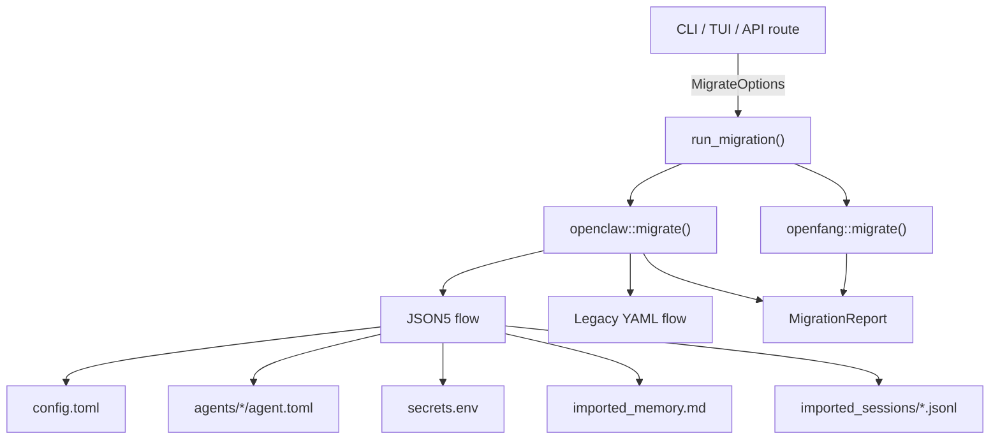

# Infrastructure & Utilities — librefang-migrate-src

# librefang-migrate

Migration engine for importing agents, configuration, memory, sessions, and channel configs from other agent frameworks into LibreFang.

## Overview

The crate provides a single public entry point — `run_migration` — that takes a source framework identifier and directory paths, then produces a fully-formed LibreFang home directory plus a `MigrationReport` describing what was imported, skipped, or warned about.

Supported sources:

| Source | Status |
|---|---|
| `MigrateSource::OpenClaw` | Fully supported (JSON5 + legacy YAML) |
| `MigrateSource::OpenFang` | Supported (same-format community fork) |
| `MigrateSource::LangChain` | Planned |
| `MigrateSource::AutoGpt` | Planned |

## Architecture



## Public API

### `run_migration`

```rust
pub fn run_migration(options: &MigrateOptions) -> Result<MigrationReport, MigrateError>
```

Dispatches to the appropriate source handler based on `options.source`. Returns a `MigrationReport` or a `MigrateError`.

### `MigrateOptions`

| Field | Type | Purpose |
|---|---|---|
| `source` | `MigrateSource` | Which framework to migrate from |
| `source_dir` | `PathBuf` | Path to the source workspace |
| `target_dir` | `PathBuf` | Path to the LibreFang home directory to write |
| `dry_run` | `bool` | If `true`, report what would happen without writing files |

### `MigrateError` variants

| Variant | When |
|---|---|
| `SourceNotFound(PathBuf)` | `source_dir` does not exist |
| `ConfigParse(String)` | Config file exists but cannot be parsed |
| `AgentParse(String)` | An agent definition is malformed |
| `Io(std::io::Error)` | Filesystem I/O failure |
| `Yaml(serde_yaml::Error)` | Legacy YAML parsing failure |
| `Json5Parse(String)` | JSON5 parsing failure |
| `TomlSerialize(toml::ser::Error)` | TOML serialization failure |
| `UnsupportedSource(String)` | LangChain or AutoGPT selected |

### OpenClaw auto-detection

```rust
pub fn detect_openclaw_home() -> Option<PathBuf>
pub fn scan_openclaw_workspace(path: &Path) -> ScanResult
```

`detect_openclaw_home` checks standard install locations (`~/.openclaw`, `~/.clawdbot`, `~/.moldbot`, `~/.moltbot`, `~/.config/openclaw`, Windows `APPDATA`) and the `OPENCLAW_STATE_DIR` env var.

`scan_openclaw_workspace` returns a `ScanResult` listing discovered agents, channels, skills, and memory — used by the TUI wizard and API to preview what will be migrated.

## OpenClaw migration

OpenClaw is the primary migration target. The engine handles two distinct workspace layouts:

### JSON5 (modern)

A single `openclaw.json` file at the workspace root containing all configuration. The engine also accepts `clawdbot.json`, `moldbot.json`, and `moltbot.json` for historical installs.

```
~/.openclaw/
├── openclaw.json          ← THE config
├── auth-profiles.json     ← skipped (security)
├── sessions/*.jsonl       ← copied to imported_sessions/
├── memory/<agent>/MEMORY.md  ← copied to agents/<agent>/imported_memory.md
├── workspaces/<agent>/    ← copied to agents/<agent>/workspace/
├── memory-search/         ← skipped (rebuilt by LibreFang)
├── skills/                ← skipped (reinstall required)
└── cron/                  ← skipped
```

The JSON5 flow (`migrate_from_json5`) runs six phases in order:

1. **Config** — Extracts default model, provider, memory settings; writes `config.toml`
2. **Agents** — Iterates `agents.list`, converts each to `agents/<id>/agent.toml`
3. **Memory** — Copies `MEMORY.md` files from both `memory/` and `agents/` layouts
4. **Workspaces** — Copies `workspaces/<agent>/` directories
5. **Sessions** — Copies `.jsonl` session logs
6. **Skipped features** — Reports cron, hooks, auth profiles, skills, vector index as skipped

### Legacy YAML (very old installs)

Separate files for each concern:

```
~/.openclaw/
├── config.yaml            ← global model/provider
├── agents/<name>/agent.yaml  ← per-agent config
├── agents/<name>/MEMORY.md   ← per-agent memory
├── messaging/<channel>.yaml  ← per-channel config
└── skills/community|custom/  ← skill packages
```

The legacy flow (`migrate_from_legacy_yaml`) handles the same six phases but reads from the file-per-entity layout.

## Channel migration

The engine maps 13 channel types from OpenClaw's config into LibreFang's TOML channel format. Each channel gets:

- A TOML section under `[channels.<name>]`
- Secret values (tokens, passwords) extracted into `secrets.env`
- Policy mapping via `map_dm_policy` and `map_group_policy`
- Allow-from lists converted to TOML arrays

### Policy mapping

| OpenClaw DM policy | LibreFang DM policy |
|---|---|
| `open` | `respond` |
| `allowlist`, `allow_list` | `allowed_only` |
| `pairing`, `disabled` | `ignore` |

| OpenClaw group policy | LibreFang group policy |
|---|---|
| `open`, `all` | `all` |
| `mention`, `mention_only` | `mention_only` |
| `commands`, `commands_only`, `slash_only` | `commands_only` |
| `disabled`, `ignore` | `ignore` |

### Channel-specific notes

**Telegram, Discord, WhatsApp, Signal:** Full migration including allow-from lists.

**Slack, Mattermost, Matrix, Teams:** Allow-from lists cannot be mapped (LibreFang uses channel/room/tenant IDs instead of user IDs). A warning is emitted.

**IRC:** Server, port, TLS, nick, channels list, and password are all migrated.

**Feishu:** The `domain` field is mapped to a `region` value — domains containing `lark` or `intl` become `"intl"`, others become `"cn"`.

**Google Chat:** Service account JSON file is copied to `credentials/google_chat_sa.json`.

**WhatsApp:** Baileys credential directory is copied; a warning notes re-authentication may be required.

**iMessage:** Skipped — macOS-only, requires manual setup.

**BlueBubbles:** Skipped — no LibreFang adapter exists.

## Agent migration

Each OpenClaw agent entry is converted to a LibreFang `agent.toml` manifest. Key transformations:

### Model resolution

Agent-level model takes priority, falling back to `agents.defaults.model`. Model references in `"provider/model"` format are split and the provider name is normalized via `map_provider`.

Fallback models from `model.fallbacks` are written as `[[fallback_models]]` sections.

### Tool mapping

Tool names are mapped through `librefang_types::tool_compat::{is_known_librefang_tool, map_tool_name}`. Unrecognized tools are collected and reported as warnings, not errors.

Tool profiles (`"minimal"`, `"coding"`, `"research"`, etc.) are resolved via `librefang_types::agent::ToolProfile::tools()`.

### Tool blocklist

OpenClaw's `tools.deny` list is now migrated to `tool_blocklist` in the agent manifest, preserving the original restriction rather than silently widening agent access.

### Skill allowlist

Per-agent `skills` fields are preserved in the manifest as a `skills` array.

### Identity / system prompt

The `identity` field can be a raw string or a nested JSON object. `extract_identity_prompt` recursively searches for prompt-bearing keys in priority order:

`systemPrompt` → `system_prompt` → `prompt` → `instructions` → `instruction` → `content` → `text` → `value` → `persona` → `identity` → `description`

If no prompt is found in a structured identity, nested objects and arrays are searched recursively.

### Capabilities derivation

Tool presence drives capability grants:

| Tool | Capability granted |
|---|---|
| `*` | `shell = ["*"]`, `network = ["*"]`, `agent_message = ["*"]`, `agent_spawn = true` |
| `shell_exec` | `shell = ["*"]` |
| `web_fetch`, `web_search`, `browser_navigate` | `network = ["*"]` |
| `agent_send`, `agent_list` | `agent_message = ["*"]`, `agent_spawn = true` |

### Custom workspace path

Agent-level `workspace` paths are now preserved in the manifest instead of being dropped.

## Security handling

Secret values (bot tokens, API keys, passwords) are never written into `config.toml`. Instead:

1. Tokens are extracted from the OpenClaw config
2. Written to `secrets.env` as `KEY=value` lines via `write_secret_env`
3. `config.toml` references them via `_env` fields (e.g. `bot_token_env = "TELEGRAM_BOT_TOKEN"`)
4. On Unix, `secrets.env` is chmod'd to `0o600`

API key env var names are derived per-provider (e.g. `ANTHROPIC_API_KEY`, `OPENAI_API_KEY`, `GROQ_API_KEY`). Ollama gets an empty string since it needs no key.

Auth profile files (`auth-profiles.json`) and raw credential objects are explicitly skipped and flagged in the report.

## Provider mapping

| OpenClaw provider | LibreFang provider |
|---|---|
| `anthropic`, `claude` | `anthropic` |
| `openai`, `gpt` | `openai` |
| `groq` | `groq` |
| `ollama` | `ollama` |
| `openrouter` | `openrouter` |
| `deepseek` | `deepseek` |
| `together` | `together` |
| `mistral` | `mistral` |
| `fireworks` | `fireworks` |
| `google`, `gemini` | `google` |
| `xai`, `grok` | `xai` |
| `cerebras` | `cerebras` |
| `sambanova` | `sambanova` |

Any unrecognized provider name is passed through unchanged.

## Migration report

The `report` submodule provides `MigrationReport` with three collections:

- **`imported: Vec<MigrateItem>`** — Successfully migrated items (config, agents, channels, secrets, memory, sessions)
- **`skipped: Vec<SkippedItem>`** — Items that cannot be auto-migrated, with reasons
- **`warnings: Vec<String>`** — Non-fatal issues (unmapped tools, unmappable allow-lists, copy failures)

`MigrationReport::to_markdown()` generates a human-readable summary. The report is written to `migration_report.md` in the target directory after a non-dry-run migration.

## Integration points

The crate is consumed by three surfaces:

1. **CLI** — `librefang-cli` calls `run_migration` from `cmd_migrate`, then prints the summary via `report::print_summary` and the full markdown via `report::to_markdown`
2. **TUI init wizard** — `tui/screens/init_wizard` calls `detect_openclaw_home` and `scan_openclaw_workspace` to offer migration as a setup option, then invokes `run_migration`
3. **API** — `src/routes/config` exposes `migrate_detect`, `migrate_scan`, and `run_migrate` endpoints

## Dry run mode

When `dry_run` is `true`, the engine performs all parsing and conversion logic but skips all filesystem writes. The returned `MigrationReport` still contains the full set of `imported`, `skipped`, and `warnings` items with their intended destination paths, allowing callers to preview the migration plan.