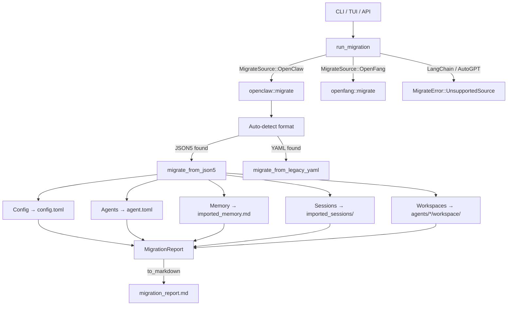

# Infrastructure & Utilities — librefang-migrate-src

# librefang-migrate-src

Migration engine for importing workspaces from other agent frameworks into LibreFang. Handles config translation, agent conversion with tool/capability mapping, credential extraction, memory files, session logs, and workspace directories.

## Architecture



## Entry Point

### `run_migration(options: &MigrateOptions) -> Result<MigrationReport, MigrateError>`

Dispatches to the appropriate source handler based on `MigrateSource`. Returns a `MigrationReport` listing every imported item, skipped feature, and warning.

```rust
let options = MigrateOptions {
    source: MigrateSource::OpenClaw,
    source_dir: PathBuf::from("/home/user/.openclaw"),
    target_dir: PathBuf::from("/home/user/.librefang"),
    dry_run: false,
};
let report = run_migration(&options)?;
```

Set `dry_run: true` to run the full scan and report without writing any files.

### `MigrateSource`

| Variant | Status |
|---|---|
| `OpenClaw` | Fully supported |
| `OpenFang` | Supported (same config format as LibreFang) |
| `LangChain` | Not yet implemented |
| `AutoGpt` | Not yet implemented |

### `MigrateError`

All errors are enumerated in `MigrateError` with thiserror derives:

- `SourceNotFound(PathBuf)` — source directory doesn't exist
- `ConfigParse(String)` — config file couldn't be parsed
- `AgentParse(String)` — agent definition malformed
- `Io(std::io::Error)` — filesystem errors
- `Yaml(serde_yaml::Error)` — YAML parse failures (legacy format)
- `Json5Parse(String)` — JSON5 parse failures (modern OpenClaw)
- `TomlSerialize(toml::ser::Error)` — output serialization failure
- `UnsupportedSource(String)` — requested source has no handler

---

## OpenClaw Migration (`openclaw` module)

The largest and most feature-complete migrator. Supports two source layouts.

### Source Format Detection

`find_config_file(dir)` checks for config files in priority order:

1. **Modern JSON5** (preferred): `openclaw.json`, `clawdbot.json`, `moldbot.json`, `moltbot.json`
2. **Legacy YAML** (fallback): `config.yaml`

The auto-detection feeds into `migrate()`, which branches to `migrate_from_json5()` or `migrate_from_legacy_yaml()`.

### Auto-Detection of OpenClaw Install

`detect_openclaw_home() -> Option<PathBuf>` searches standard locations:

- `$OPENCLAW_STATE_DIR` environment override
- `~/.openclaw`, `~/.clawdbot`, `~/.moldbot`, `~/.moltbot`
- `~/openclaw`, `~/.config/openclaw`
- `%APPDATA%/openclaw`, `%LOCALAPPDATA%/openclaw` (Windows)

Returns `Some(path)` only if the directory contains a recognized config file or has `sessions/` or `memory/` subdirectories.

### Workspace Scanning

`scan_openclaw_workspace(path: &Path) -> ScanResult` performs a read-only inventory of what's available for migration. Returns:

| Field | Description |
|---|---|
| `has_config` | Whether a config file was found |
| `agents: Vec<ScannedAgent>` | Agent names, models, tool counts, memory/session/workspace presence |
| `channels: Vec<String>` | Channel names found (telegram, discord, etc.) |
| `skills: Vec<String>` | Skill entry names |
| `has_memory` | Whether any agent has MEMORY.md |

Used by the TUI init wizard and API to preview migration scope.

### JSON5 Migration Flow

Processes the modern single-file `openclaw.json` workspace:

```
~/.openclaw/
├── openclaw.json          # JSON5 — everything lives here
├── auth-profiles.json     # Credentials (skipped for security)
├── sessions/              # JSONL conversation logs
│   ├── main.jsonl
│   └── agent:coder:main.jsonl
├── memory/                # Per-agent MEMORY.md files
│   ├── default/MEMORY.md
│   └── coder/MEMORY.md
├── memory-search/         # SQLite vector index (skipped)
├── skills/                # Installed skills
├── cron/                  # Cron run state (skipped)
├── hooks/                 # Webhook modules (skipped)
└── workspaces/            # Per-agent working directories
```

#### Config Translation

`migrate_config_from_json()` extracts:

- **Default model** from `agents.defaults.model` → `[default_model]` in TOML
- **Channel configs** from `channels.*` → `[channels.<name>]` sections
- **Memory decay rate** (defaults to 0.05)
- Writes `config_version` from `librefang_types::config::CONFIG_VERSION` so the kernel recognizes it as current

#### Channel Migration

`migrate_channels_from_json()` handles 13 channel types. The behavior per channel:

| Channel | Tokens → secrets.env | Notes |
|---|---|---|
| telegram | `TELEGRAM_BOT_TOKEN` | `allowFrom` → `allowed_users` |
| discord | `DISCORD_BOT_TOKEN` | `allowFrom` → `allowed_users` |
| slack | `SLACK_BOT_TOKEN`, `SLACK_APP_TOKEN` | `allowFrom` unmappable — warning emitted |
| whatsapp | Credentials dir copied | Baileys auth; user may need to re-auth |
| signal | None (URL constructed) | `httpHost`+`httpPort` → `api_url` |
| matrix | `MATRIX_ACCESS_TOKEN` | `rooms` → `allowed_rooms`; `allowFrom` unmappable |
| google_chat | SA file copied | Service account JSON to `credentials/` |
| teams | `TEAMS_APP_PASSWORD` | `tenantId` → `allowed_tenants` |
| irc | `IRC_PASSWORD` | Full field mapping: server, port, nick, TLS, channels |
| mattermost | `MATTERMOST_TOKEN` | `baseUrl` → `server_url` |
| feishu | `FEISHU_APP_SECRET` | `domain` auto-maps to `region` (cn/intl) |
| imessage | Skipped | macOS-only; manual setup required |
| bluebubbles | Skipped | No LibreFang adapter |

Secret writing uses `write_secret_env()`, which upserts keys into `secrets.env` and restricts file permissions to `0o600` on Unix.

**Policy mapping:**

| OpenClaw DM Policy | LibreFang DM Policy |
|---|---|
| `open` | `respond` |
| `allowlist` / `allow_list` | `allowed_only` |
| `pairing` / `disabled` | `ignore` |

| OpenClaw Group Policy | LibreFang Group Policy |
|---|---|
| `open` / `all` | `all` |
| `mention` / `mention_only` | `mention_only` |
| `commands` / `commands_only` / `slash_only` | `commands_only` |
| `disabled` / `ignore` | `ignore` |

#### Agent Migration

`migrate_agents_from_json()` converts each agent entry into a TOML manifest at `agents/<id>/agent.toml`. Each agent TOML includes:

- **Model resolution**: agent-level → defaults-level → fallback `"anthropic/claude-sonnet-4-20250514"`
- **Fallback models**: `[[fallback_models]]` array from `model.fallbacks`
- **Tool mapping**: via `librefang_types::tool_compat::map_tool_name()`
- **Tool profiles**: `"minimal"` / `"coding"` / `"research"` / `"messaging"` / `"automation"` → LibreFang `ToolProfile`
- **Tool blocklist**: `tools.deny` → `tool_blocklist` (preserves deny semantics)
- **Skill allowlist**: `skills` field preserved as `skills = [...]`
- **Capabilities derivation**: `shell`, `network`, `agent_message`, `agent_spawn` inferred from tool list
- **System prompt**: extracted from `identity` field (handles string, structured object, and nested shapes)
- **Workspace path**: preserved if non-default

**Provider mapping** (`map_provider`):

| OpenClaw Provider | LibreFang Provider |
|---|---|
| `anthropic`, `claude` | `anthropic` |
| `openai`, `gpt` | `openai` |
| `groq` | `groq` |
| `ollama` | `ollama` |
| `openrouter` | `openrouter` |
| `deepseek` | `deepseek` |
| `together` | `together` |
| `mistral` | `mistral` |
| `fireworks` | `fireworks` |
| `google`, `gemini` | `google` |
| `xai`, `grok` | `xai` |
| `cerebras` | `cerebras` |
| `sambanova` | `sambanova` |
| (other) | passed through as-is |

Model references in `"provider/model"` format are split by `split_model_ref()`. If no slash is present, defaults to `("anthropic", input)`.

**Identity extraction**: `extract_identity_prompt()` handles OpenClaw's polymorphic identity field:
- Raw string → used directly
- Structured object → searches for keys in priority order: `systemPrompt`, `system_prompt`, `prompt`, `instructions`, `instruction`, `content`, `text`, `value`, `persona`, `identity`, `description`
- Nested objects/arrays → recursive descent

#### Memory Migration

`migrate_memory_files()` checks two layouts:

1. `memory/<agent>/MEMORY.md` (modern)
2. `agents/<agent>/MEMORY.md` (legacy)

Files are copied as `agents/<agent>/imported_memory.md`. Empty files are skipped. Deduplication prevents copying the same agent's memory twice.

#### Workspace Migration

`migrate_workspace_dirs()` copies `workspaces/<agent>/` directories to `agents/<agent>/workspace/`. Also checks the legacy `agents/<agent>/workspace/` layout. Skips empty directories.

#### Session Migration

`migrate_sessions()` copies `.jsonl` files from `sessions/` to `imported_sessions/`. No format conversion is applied.

#### Skipped Features

`report_skipped_features()` logs items that have no LibreFang equivalent:

- **Cron jobs** — use `ScheduleMode::Periodic` instead
- **Webhook hooks** — use LibreFang's event system
- **Auth profiles** — set API keys as env vars manually (security)
- **Skills** — reinstall via `librefang skill install`
- **SQLite vector index** — LibreFang rebuilds embeddings
- **Memory backend config** — LibreFang uses SQLite with vector embeddings
- **Session scope config** — LibreFang uses per-agent sessions by default

### Legacy YAML Migration Flow

For very old OpenClaw installations with split YAML files:

```
~/.openclaw/
├── config.yaml              # Global config
├── agents/
│   ├── coder/
│   │   ├── agent.yaml       # Agent definition
│   │   ├── MEMORY.md
│   │   └── workspace/
│   └── researcher/
├── messaging/
│   ├── telegram.yaml
│   ├── discord.yaml
│   └── ...
└── skills/
    ├── community/
    └── custom/
```

The legacy flow follows the same pipeline (config → agents → memory → workspaces → skills) but reads from individual YAML files. Channel configs reference env var names rather than raw tokens, so no secrets extraction is needed.

---

## OpenFang Migration (`openfang` module)

OpenFang uses the same TOML config format as LibreFang. The migrator copies files while checking for schema drift and handling field renames. Uses `warn_on_schema_drift()` to detect unknown fields via `librefang_types::config::validation`.

---

## Reporting (`report` module)

`MigrationReport` tracks:

- `imported: Vec<MigrateItem>` — each item migrated with `ItemKind` (Config, Agent, Channel, Memory, Session, Secret, Skill), name, and destination path
- `skipped: Vec<SkippedItem>` — items that couldn't be migrated, with reason
- `warnings: Vec<String>` — non-fatal issues (unmappable fields, partial conversions)
- `dry_run: bool` — whether this was a dry run

`to_markdown()` generates a human-readable summary. `print_summary()` formats it for terminal output.

---

## Integration Points

| Caller | Function Called |
|---|---|
| `librefang-cli/src/main.rs` (`cmd_migrate`) | `run_migration`, `print_summary`, `to_markdown` |
| `tui/screens/init_wizard.rs` | `detect_openclaw_home`, `scan_openclaw_workspace`, `run_migration` |
| `src/routes/config.rs` | `detect_openclaw_home`, `scan_openclaw_workspace`, `run_migration` |

### Dependencies on Other Crates

- `librefang_types::config` — `CONFIG_VERSION`, `DEFAULT_API_LISTEN` for output config
- `librefang_types::tool_compat` — `is_known_librefang_tool()`, `map_tool_name()` for tool translation
- `librefang_types::agent::ToolProfile` — profile-to-tool-list resolution
- `librefang_types::VERSION` — stamped into migrated agent manifests

---

## Security Considerations

- Raw tokens from OpenClaw JSON5 configs are written to `secrets.env`, never to `config.toml`. The config references them via `_env` field names.
- `write_secret_env()` sets `0o600` permissions on Unix.
- Auth profile files (`auth-profiles.json`) are explicitly skipped and reported, not copied.
- WhatsApp Baileys credentials are copied but the user is warned that re-authentication may be required.