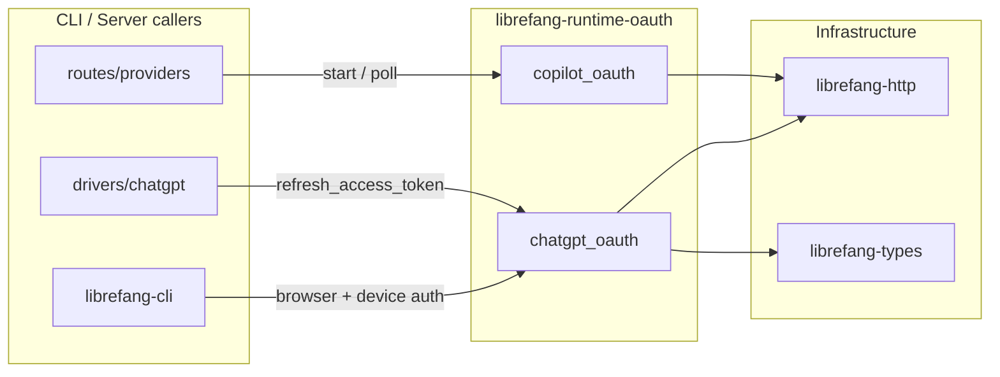

# Infrastructure & Utilities — librefang-runtime-oauth-src

# librefang-runtime-oauth

OAuth 2.0 authentication module providing browser-based and device-authorization flows for ChatGPT (OpenAI) and GitHub Copilot. All tokens are held in `Zeroizing` wrappers to minimize credential exposure in memory.

## Module Structure

```
librefang-runtime-oauth/src/
├── lib.rs               # Re-exports chatgpt_oauth and copilot_oauth
├── chatgpt_oauth.rs     # OpenAI ChatGPT OAuth 2.0 + PKCE (browser & device flows)
└── copilot_oauth.rs     # GitHub Copilot device authorization grant (RFC 8628)
```

## Architecture Overview



---

## chatgpt_oauth

Implements two OAuth 2.0 flows for OpenAI's Codex endpoints: a browser-based authorization code flow with PKCE, and a device authorization flow for headless environments. Also provides token refresh and model discovery.

### Constants

| Constant | Value | Purpose |
|---|---|---|
| `CHATGPT_BASE_URL` | `https://chatgpt.com/backend-api` | Backend API base; OAuth tokens with `api.connectors` scopes target the Responses API here, **not** `/v1/chat/completions` |
| `DEVICE_AUTH_URL` | `https://auth.openai.com/codex/device` | Verification page shown to users during device auth |
| `DEVICE_AUTH_REDIRECT_URI` | `https://auth.openai.com/deviceauth/callback` | Redirect URI used in device flow token exchange |
| `CALLBACK_BIND` | `127.0.0.1:1455` | Local callback server bind address (matches OpenAI's registered redirect URI) |
| `AUTH_TIMEOUT_SECS` | 300 | Browser flow callback timeout (5 minutes) |
| `DEVICE_AUTH_TIMEOUT_SECS` | 900 | Device auth polling timeout (15 minutes) |
| `SCOPE` | `openid profile email offline_access api.connectors.read api.connectors.invoke` | OAuth scopes requested |

### Key Types

#### `ChatGptAuthResult`

Returned by every successful token acquisition. All string fields use `Zeroizing<String>` to zero memory on drop.

```rust
pub struct ChatGptAuthResult {
    pub access_token: Zeroizing<String>,
    pub refresh_token: Option<Zeroizing<String>>,
    pub expires_in: Option<u64>,
}
```

#### `DeviceAuthPrompt`

Details presented to the user before device auth polling begins.

```rust
pub struct DeviceAuthPrompt {
    pub device_auth_id: String,   // Server-issued identifier for polling
    pub user_code: String,        // One-time code the user enters
    pub interval_secs: u64,       // Recommended poll interval from server
}
```

#### `DeviceAuthFlowError`

Distinguishes recoverable fallback from fatal failures:

- **`BrowserFallback { message }`** — Device auth is not enabled for the account/workspace. The caller should fall back to the browser flow.
- **`Fatal(String)`** — Unrecoverable error; do not silently retry.

#### `PkceChallenge`

PKCE code verifier and S256 challenge pair, generated by `generate_pkce()`.

```rust
pub struct PkceChallenge {
    pub verifier: String,    // 64 random bytes, base64url-encoded (86 chars)
    pub challenge: String,   // SHA-256(verifier), base64url-encoded
}
```

### Public Functions

#### PKCE and State Generation

**`generate_pkce() -> PkceChallenge`** — Generates a random 64-byte verifier and its SHA-256 S256 challenge. Used internally by `start_oauth_flow()` and by the device auth poll path (server returns its own verifier).

**`create_state() -> String`** — Generates a 32-character hex-encoded random state parameter (16 random bytes).

#### Browser Authorization Flow

The browser flow binds a localhost TCP server, opens the user's browser to OpenAI's authorization endpoint, and waits for the callback.

**`start_oauth_flow() -> Result<(String, u16, String, String), String>`**

Binds port 1455, generates PKCE and state, and returns:
- The full authorization URL (open this in the browser)
- The port number
- The PKCE verifier (needed for token exchange)
- The state parameter (needed for callback validation)

Drops the initial `TcpListener` immediately so the async callback server can re-bind. Callers must open the URL in a browser and then call `run_oauth_callback_server`.

**`run_oauth_callback_server(port, expected_state) -> Result<String, String>`**

Starts a tokio TCP server on the given port that handles `GET /auth/callback?code=...&state=...`. Validates the `state` parameter against `expected_state` to prevent CSRF. Returns the authorization code. Serves a success or error HTML page to the browser. Times out after `AUTH_TIMEOUT_SECS` (300s).

**`exchange_code_for_tokens(code, code_verifier, port) -> Result<ChatGptAuthResult, String>`**

Exchanges an authorization code for tokens, constructing the redirect URI as `http://localhost:{port}/auth/callback`.

#### Device Authorization Flow

For headless environments where opening a browser is impractical. The user visits a URL on another device and enters a one-time code.

**`start_device_auth_flow() -> Result<DeviceAuthPrompt, DeviceAuthFlowError>`**

POSTs to the device auth usercode endpoint with the client ID. Returns a `DeviceAuthPrompt` containing the `device_auth_id`, `user_code`, and polling `interval_secs`. Returns `DeviceAuthFlowError::BrowserFallback` on HTTP 404 (device auth not enabled), signaling the caller to fall back to the browser flow.

**`poll_device_auth_flow(prompt) -> Result<ChatGptAuthResult, String>`**

Polls the device auth token endpoint at the server-recommended interval until the user completes verification. HTTP 403/404 are treated as "still pending." On success, the server returns an `authorization_code` and `code_verifier`, which are immediately exchanged via `exchange_code_for_tokens_with_redirect_uri` using `DEVICE_AUTH_REDIRECT_URI`. Times out after 15 minutes.

#### Token Refresh

**`refresh_access_token(refresh_token) -> Result<ChatGptAuthResult, String>`**

Posts a `refresh_token` grant to OpenAI's token endpoint. Called by `src/drivers/chatgpt.rs` when an access token expires.

#### Token Exchange (Internal-ish)

**`exchange_code_for_tokens_with_redirect_uri(code, code_verifier, redirect_uri) -> Result<ChatGptAuthResult, String>`**

The core token exchange function. Both browser and device flows ultimately call this. Posts an `authorization_code` grant with PKCE verifier to the token endpoint. Used directly by `poll_device_auth_flow` and indirectly by `exchange_code_for_tokens`.

#### Model Discovery

**`fetch_best_codex_model(access_token) -> String`**

Calls `GET {CHATGPT_BASE_URL}/codex/models?client_version={VERSION}` with the access token. Parses the response's `models` array, sorts by `priority` descending, and returns the highest-priority model slug. Falls back to `"gpt-5.1-codex-mini"` on any failure. Called by `librefang-cli` after authentication to determine which model to use.

#### Utility

**`build_authorization_url(port, code_challenge, state) -> String`** — Constructs the full authorization URL with all required query parameters including `codex_cli_simplified_flow=true` and `originator=codex_cli_rs`.

**`chatgpt_session_available() -> bool`** — Returns `true` if the `CHATGPT_SESSION_TOKEN` environment variable is set and non-empty.

### Browser Flow Sequence

```
┌────────┐    ┌──────────────┐    ┌─────────────┐    ┌─────────────┐
│ Caller │    │ chatgpt_oauth│    │  Browser     │    │  OpenAI Auth│
└───┬────┘    └──────┬───────┘    └──────┬───────┘    └──────┬──────┘
    │ start_oauth_flow()  │                   │                   │
    │─────────────────────>│                   │                   │
    │  (auth_url, port,    │                   │                   │
    │   verifier, state)   │                   │                   │
    │<─────────────────────│                   │                   │
    │                      │                   │                   │
    │ open browser ──────────────────────────>│                   │
    │                      │                   │ GET /authorize    │
    │                      │                   │──────────────────>│
    │                      │                   │  login + consent  │
    │                      │                   │<──────────────────│
    │                      │                   │  redirect to      │
    │                      │                   │  localhost:1455   │
    │ run_oauth_callback_server()              │                   │
    │─────────────────────>│                   │                   │
    │                      │<─────────────────────────────────────│
    │                      │  code + state     │                   │
    │                      │                   │                   │
    │ exchange_code_for_tokens()               │                   │
    │─────────────────────>│  POST /oauth/token                   │
    │                      │──────────────────────────────────────>│
    │                      │  access + refresh tokens              │
    │                      │<──────────────────────────────────────│
    │ ChatGptAuthResult    │                   │                   │
    │<─────────────────────│                   │                   │
```

### Device Auth Flow Sequence

```
┌────────┐    ┌──────────────┐    ┌──────────┐    ┌─────────────┐
│ Caller │    │ chatgpt_oauth│    │  User    │    │  OpenAI Auth│
└───┬────┘    └──────┬───────┘    └────┬─────┘    └──────┬──────┘
    │ start_device_auth_flow()          │                  │
    │─────────────────────>│            │                  │
    │                      │ POST /deviceauth/usercode     │
    │                      │──────────────────────────────>│
    │                      │ device_auth_id, user_code     │
    │                      │<──────────────────────────────│
    │ DeviceAuthPrompt     │            │                  │
    │<─────────────────────│            │                  │
    │                      │            │                  │
    │  (show user_code and DEVICE_AUTH_URL to user)        │
    │─────────────────────────────────>│                  │
    │                      │            │ visit + enter    │
    │                      │            │ code             │
    │                      │            │─────────────────>│
    │ poll_device_auth_flow()           │                  │
    │─────────────────────>│            │                  │
    │                      │ POST /deviceauth/token        │
    │                      │──────────────────────────────>│
    │                      │  (pending 403/404)            │
    │                      │<──────────────────────────────│
    │                      │            │                  │
    │      ... polls at interval_secs until timeout ...   │
    │                      │            │                  │
    │                      │ POST /deviceauth/token        │
    │                      │──────────────────────────────>│
    │                      │ authorization_code + verifier │
    │                      │<──────────────────────────────│
    │                      │                               │
    │                      │ POST /oauth/token (exchange)  │
    │                      │──────────────────────────────>│
    │                      │ tokens                        │
    │                      │<──────────────────────────────│
    │ ChatGptAuthResult    │            │                  │
    │<─────────────────────│            │                  │
```

### Error Handling Strategy

The device auth flow uses a two-tier error model via `DeviceAuthFlowError`:

1. **`BrowserFallback`** — HTTP 404 from the usercode endpoint indicates device auth isn't available for this account. Callers (specifically `authenticate_chatgpt` in `librefang-cli`) catch this and transparently switch to the browser flow.

2. **`Fatal`** — All other failures (network errors, unexpected HTTP status codes, malformed responses). These propagate as error strings.

The browser flow uses `Result<_, String>` throughout, with descriptive error messages including HTTP status codes and response bodies for debugging.

---

## copilot_oauth

Implements GitHub's OAuth 2.0 Device Authorization Grant (RFC 8628) for obtaining a GitHub personal access token via the Copilot OAuth client.

### Constants

| Constant | Value |
|---|---|
| `GITHUB_DEVICE_CODE_URL` | `https://github.com/login/device/code` |
| `GITHUB_TOKEN_URL` | `https://github.com/login/oauth/access_token` |
| `COPILOT_CLIENT_ID` | `Iv1.b507a08c87ecfe98` (public client, same as VSCode Copilot extension) |

### Key Types

#### `DeviceCodeResponse`

Parsed response from the device code initiation request.

```rust
pub struct DeviceCodeResponse {
    pub device_code: String,
    pub user_code: String,
    pub verification_uri: String,
    pub expires_in: u64,
    pub interval: u64,
}
```

#### `DeviceFlowStatus`

Enum representing the result of each polling attempt. Callers use pattern matching to decide what to do:

```rust
pub enum DeviceFlowStatus {
    Pending,                                    // Keep polling
    Complete { access_token: Zeroizing<String> }, // Done
    SlowDown { new_interval: u64 },              // Increase poll interval
    Expired,                                    // Restart the flow
    AccessDenied,                               // User denied
    Error(String),                              // Unexpected error
}
```

### Public Functions

**`start_device_flow() -> Result<DeviceCodeResponse, String>`**

POSTs to GitHub's device code endpoint with `scope=read:user`. Returns a `DeviceCodeResponse` with the `device_code` (for polling), `user_code` (for the user to enter), `verification_uri` (for the user to visit), and timing parameters. Uses a 15-second HTTP timeout via `librefang_http::proxied_client_builder`.

**`poll_device_flow(device_code) -> DeviceFlowStatus`**

POSTs to GitHub's token endpoint with the device code. GitHub returns HTTP 200 with an `error` field while authorization is pending (unlike typical REST APIs that would use 4xx status codes). The function maps the `error` field to the appropriate `DeviceFlowStatus` variant:

| GitHub error | Status |
|---|---|
| `authorization_pending` | `Pending` |
| `slow_down` | `SlowDown { new_interval }` |
| `expired_token` | `Expired` |
| `access_denied` | `AccessDenied` |
| Other | `Error(description)` |
| No error + `access_token` present | `Complete` |

### Integration with the Server

The Copilot device flow is driven by the web server's provider routes (`src/routes/providers.rs`):

- `copilot_oauth_start` calls `start_device_flow()` and returns the `DeviceCodeResponse` to the frontend
- `copilot_oauth_poll` calls `poll_device_flow()` and returns the `DeviceFlowStatus` to the frontend

The frontend is responsible for displaying the user code, opening the verification URL, and polling at the specified interval. The `SlowDown` variant signals the frontend to increase its polling interval.

---

## Security Considerations

- **Zeroizing**: All tokens (`access_token`, `refresh_token`) are wrapped in `Zeroizing<String>`, which zeroizes memory on drop.
- **PKCE**: The browser flow uses Proof Key for Code Exchange (S256 method) to prevent authorization code interception attacks. The verifier is 64 random bytes.
- **State parameter**: The browser flow validates the `state` parameter on callback to prevent CSRF attacks.
- **No credential logging**: Token values are never logged; only success/failure messages are emitted via `tracing`.
- **HTTPS-only**: All external endpoints use HTTPS.

## Dependencies on Other Crates

| Crate | Usage |
|---|---|
| `librefang_http` | `proxied_client()` and `proxied_client_builder()` for HTTP requests with proxy support |
| `librefang_types` | `VERSION` constant for the Codex models API query parameter |
| `zeroize` | `Zeroizing<String>` wrapper for credential memory safety |
| `sha2` + `base64` | PKCE challenge generation (SHA-256 + base64url) |
| `tokio` | Async runtime, TCP listener, oneshot channels, timeouts |
| `reqwest` | HTTP client (via `librefang_http`) |