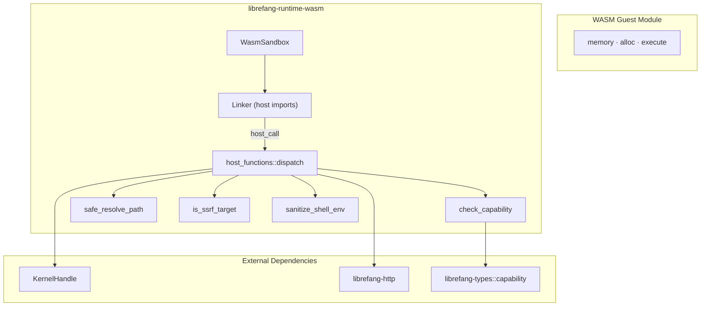

# Infrastructure & Utilities — librefang-runtime-wasm-src

# librefang-runtime-wasm — WASM Skill Sandbox

## Overview

This crate provides a secure WASM-based sandbox for executing untrusted skill and plugin code within LibreFang. Built on [Wasmtime](https://wasmtime.dev/), it enforces a **deny-by-default capability model**: WASM guests start with zero permissions and must be explicitly granted access to filesystem, network, shell, environment, memory, or inter-agent operations.

The sandbox has no incoming calls from other crates — it is a leaf runtime invoked by the kernel or higher-level orchestration layers. It depends on `librefang-types` for capability definitions, `librefang-kernel-handle` for kernel communication, and `librefang-http` for DNS-pinned HTTP clients.

## Architecture



---

## Module Structure

```
src/
├── lib.rs            # Crate root — re-exports sandbox and host_functions
├── sandbox.rs        # WasmSandbox engine, Wasmtime integration, Guest ABI
└── host_functions.rs # Capability-checked host operations and security guards
```

---

## Sandbox Engine (`sandbox.rs`)

### `WasmSandbox`

The main entry point. Create one `WasmSandbox` per kernel process and reuse it across skill invocations — the Wasmtime `Engine` is expensive to construct but compiles/instantiates many modules.

```rust
let sandbox = WasmSandbox::new()?;
```

Construction enables two Wasmtime features:
- **Fuel metering** — deterministic per-instruction CPU budget
- **Epoch interruption** — wall-clock timeout via a watchdog thread

### `SandboxConfig`

Controls per-invocation limits:

| Field | Default | Purpose |
|-------|---------|---------|
| `fuel_limit` | 1,000,000 | Max WASM instructions; `0` = unlimited |
| `max_memory_bytes` | 16 MiB | Linear memory cap (reserved for future enforcement) |
| `capabilities` | `[]` | Capability grant list |
| `timeout_secs` | 30 | Wall-clock timeout before epoch interrupt |

### `GuestState`

Carried inside every Wasmtime `Store`, accessible by host functions:

```rust
pub struct GuestState {
    pub capabilities: Vec<Capability>,
    pub kernel: Option<Arc<dyn KernelHandle>>,
    pub agent_id: String,
    pub tokio_handle: tokio::runtime::Handle,
}
```

### Execution Flow

1. **Compile** — `Module::new` accepts `.wasm` binary or `.wat` text format.
2. **Create Store** — initialized with `GuestState` and fuel budget.
3. **Spawn watchdog** — an RAII-guarded thread that calls `Engine::increment_epoch` if the guest exceeds its wall-clock timeout. On clean completion, the guard flips an `AtomicBool` and unparks the watchdog so it exits immediately — no leaked threads, no cross-store false interrupts.
4. **Link host imports** — registers `host_call` and `host_log` in the `"librefang"` module namespace.
5. **Instantiate** — links the guest module to host imports. No WASI is provided.
6. **Call guest `execute`** — passes JSON input, receives packed `i64` result.
7. **Return** `ExecutionResult` — contains the guest's JSON output and fuel consumed.

### Guest ABI

WASM modules **must** export:

| Export | Signature | Purpose |
|--------|-----------|---------|
| `memory` | `(memory N)` | Linear memory |
| `alloc` | `(func (param i32) (result i32))` | Bump allocator; guest returns a pointer to `size` bytes |
| `execute` | `(func (param i32 i32) (result i64))` | Entry point: `(input_ptr, input_len) → packed (ptr << 32 \| len)` |

The guest's `execute` function receives JSON bytes and returns JSON bytes using the packed pointer convention.

### Host ABI

The host provides two imports in the `"librefang"` module:

| Import | Signature | Description |
|--------|-----------|-------------|
| `host_call` | `(func (param i32 i32) (result i64))` | RPC: reads `{"method":"...","params":{...}}`, returns packed pointer to `{"ok":...}` or `{"error":"..."}` |
| `host_log` | `(func (param i32 i32 i32))` | `(level, msg_ptr, msg_len)` — maps to `tracing` macros. Level 0=trace, 1=debug, 2=info, 3=warn, 4+=error. No capability check. |

### Error Handling

`SandboxError` covers all failure modes:

| Variant | Trigger |
|---------|---------|
| `Compilation` | Wasmtime module compilation failed |
| `Instantiation` | Linking or missing exports |
| `Execution` | Runtime trap, timeout, or JSON parse error |
| `FuelExhausted` | Guest consumed all fuel (`Trap::OutOfFuel`) |
| `AbiError` | Missing exports, bounds violations, pointer overflow |

The engine distinguishes `Trap::OutOfFuel` from `Trap::Interrupt` (epoch timeout) to surface the correct error.

### Memory Safety

All pointer arithmetic uses `checked_add` to prevent wrapping on 32-bit hosts. Both input writes and output reads validate that `ptr + len` falls within the guest's linear memory bounds.

---

## Host Functions (`host_functions.rs`)

### Dispatch

`dispatch(state, method, params)` routes method names to handlers. Every handler (except `time_now`) runs through `check_capability` before executing.

Return format is always JSON: `{"ok": <value>}` on success, `{"error": "<message>"}` on failure.

### Method Reference

#### Unrestricted

| Method | Returns |
|--------|---------|
| `time_now` | `{"ok": <unix_timestamp_secs>}` |

#### Filesystem (requires `FileRead` / `FileWrite`)

| Method | Params | Capability |
|--------|--------|------------|
| `fs_read` | `{path}` | `FileRead(path)` |
| `fs_write` | `{path, content}` | `FileWrite(path)` |
| `fs_list` | `{path}` | `FileRead(path)` |

#### Network (requires `NetConnect`)

| Method | Params | Capability |
|--------|--------|------------|
| `net_fetch` | `{url, method?, body?}` | `NetConnect(host:port)` |

#### Shell (requires `ShellExec`)

| Method | Params | Capability |
|--------|--------|------------|
| `shell_exec` | `{command, args?}` | `ShellExec(command)` |

#### Environment (requires `EnvRead`)

| Method | Params | Capability |
|--------|--------|------------|
| `env_read` | `{name}` | `EnvRead(name)` |

#### Memory KV (requires `MemoryRead` / `MemoryWrite`)

| Method | Params | Capability | Kernel |
|--------|--------|------------|--------|
| `kv_get` | `{key}` | `MemoryRead(key)` | `kernel.memory_recall` |
| `kv_set` | `{key, value}` | `MemoryWrite(key)` | `kernel.memory_store` |

Both methods require a `KernelHandle` in `GuestState`. Returns `{"error": "No kernel handle available"}` if absent.

#### Agent Interaction (requires `AgentMessage` / `AgentSpawn`)

| Method | Params | Capability | Kernel |
|--------|--------|------------|--------|
| `agent_send` | `{target, message}` | `AgentMessage(target)` | `kernel.send_to_agent` |
| `agent_spawn` | `{manifest}` | `AgentSpawn` | `kernel.spawn_agent_checked` |

`agent_spawn` enforces **capability inheritance**: the child agent's capabilities must be a subset of the parent's. The kernel validates this via `spawn_agent_checked`.

---

## Security Mechanisms

### Capability Checking

Every privileged operation calls `check_capability(state.capabilities, &required)`, which iterates granted capabilities and delegates to `librefang_types::capability::capability_matches`. Wildcard capabilities (e.g., `FileRead("*")`) match any specific resource. If no match is found, the operation is rejected with `{"error": "Capability denied: ..."}`.

Capability checks happen **before** any filesystem or network resolution, preventing information leaks from error messages about paths that the guest isn't authorized to access.

### Path Traversal Protection

Two functions guard filesystem operations:

**`safe_resolve_path(path)`** — for reads and listings where the target must exist:
1. Rejects any path containing `..` components (even if they'd resolve safely).
2. Calls `std::fs::canonicalize` to resolve symlinks and normalize.

**`safe_resolve_parent(path)`** — for writes where the file may not yet exist:
1. Rejects `..` components.
2. Canonicalizes the parent directory.
3. Extracts the filename, double-checking it doesn't contain `..`.
4. Returns `canonical_parent / filename`.

### SSRF Protection

`is_ssrf_target(url)` prevents Server-Side Request Forgery in `net_fetch`:

1. **Scheme allowlist** — only `http://` and `https://` are permitted. Rejects `file://`, `gopher://`, `ftp://`, etc.
2. **Hostname blocklist** — blocks `localhost`, cloud metadata endpoints (`metadata.google.internal`, `metadata.aws.internal`, `169.254.169.254`).
3. **DNS resolution and IP validation** — resolves the hostname, canonicalizes IPv4-mapped IPv6 addresses (`::ffff:X.X.X.X` → IPv4 via `canonical_ip`), then checks every returned address against private ranges:
   - IPv4: `10.0.0.0/8`, `172.16.0.0/12`, `192.168.0.0/16`, `169.254.0.0/16`, loopback, unspecified
   - IPv6: `fc00::/7` (unique-local), `fe80::/10` (link-local)
4. **DNS pinning** — returns the resolved addresses so `host_net_fetch` can build an HTTP client with `builder.resolve(hostname, addr)`, pinning the connection to the validated IPs and preventing DNS-rebinding TOCTOU attacks.

### Shell Environment Sanitization

`host_shell_exec` uses `std::process::Command::new` directly (no shell — immune to injection). Before execution, `sanitize_shell_env` clears the child's environment and restores only a hardcoded allowlist:

```rust
const WASM_SHELL_SAFE_ENV_VARS: &[&str] = &[
    "PATH", "HOME", "TMPDIR", "TMP", "TEMP", "LANG", "LC_ALL", "TERM",
];
```

On Windows, additional system-critical variables (`SYSTEMROOT`, `COMSPEC`, etc.) are preserved. This prevents accidental exfiltration of API keys, vault tokens, or cloud metadata credentials that may exist in the daemon's environment.

### Epoch Watchdog

The watchdog thread uses `park_timeout` with an RAII `WatchdogGuard`:

- On timeout expiry → calls `Engine::increment_epoch()`, triggering `Trap::Interrupt` in the running guest.
- On clean completion → the `WatchdogGuard::drop` sets an `AtomicBool` and unparks the thread, which then exits without touching the epoch. The guard also joins the thread, ensuring no OS thread leak even under error paths.
- The `AtomicBool` uses `Release`/`Acquire` ordering to guarantee the flag write is visible to the watchdog's re-read after unpark.

This avoids the previous problem where fire-and-forget watchdog threads accumulated under sustained workloads and caused false epoch interrupts on concurrently running guests (since `increment_epoch` is engine-global).

---

## Integration with Other Crates

| Dependency | Usage |
|------------|-------|
| `librefang-types` | `Capability` enum, `capability_matches` function |
| `librefang-kernel-handle` | `KernelHandle` trait — `memory_recall`, `memory_store`, `send_to_agent`, `spawn_agent_checked` |
| `librefang-http` | `proxied_client_builder` for building DNS-pinned HTTP clients |

---

## Writing a WASM Guest

Guests must implement the ABI described above. A minimal echo module in WAT:

```wat
(module
    (memory (export "memory") 1)
    (global $bump (mut i32) (i32.const 1024))

    (func (export "alloc") (param $size i32) (result i32)
        (local $ptr i32)
        (local.set $ptr (global.get $bump))
        (global.set $bump (i32.add (global.get $bump) (local.get $size)))
        (local.get $ptr)
    )

    (func (export "execute") (param $ptr i32) (param $len i32) (result i64)
        (i64.or
            (i64.shl (i64.extend_i32_u (local.get $ptr)) (i64.const 32))
            (i64.extend_i32_u (local.get $len))
        )
    )
)
```

To call a host function, import `host_call` from the `"librefang"` module and pass JSON:

```wat
(import "librefang" "host_call" (func $host_call (param i32 i32) (result i64)))
```

The request format is `{"method": "<method>", "params": {...}}`. The response is a packed `(ptr << 32 | len)` pointing to `{"ok": ...}` or `{"error": "..."}` in guest memory.