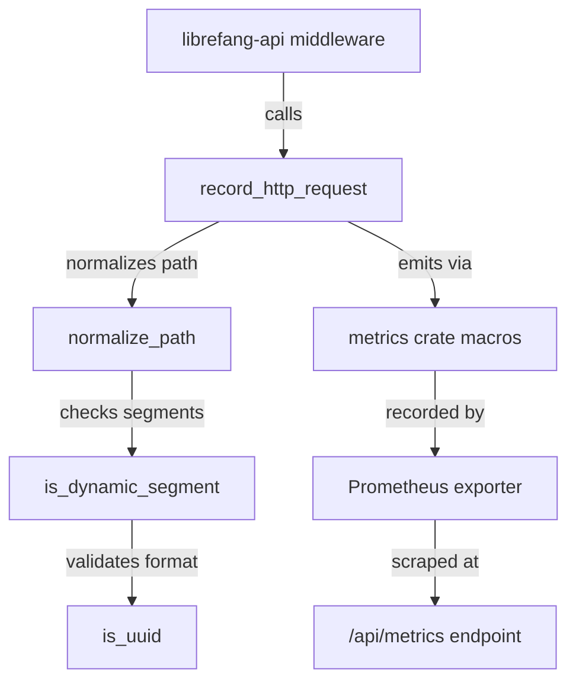

# Infrastructure & Utilities — librefang-telemetry-src

# librefang-telemetry

OpenTelemetry + Prometheus metrics instrumentation for LibreFang.

This crate provides centralized HTTP metrics and telemetry for monitoring the LibreFang Agent OS. It acts as a thin, reusable layer consumed by the API layer's middleware and telemetry setup.

## Architecture



## Module Structure

| Module | Purpose |
|--------|---------|
| `config` | Re-exports `TelemetryConfig` from `librefang-types` for backward-compatible imports |
| `metrics` | HTTP metrics recording, path normalization, and metrics summary |
| `lib` | Crate root — re-exports the primary public API |

## Public API

Three symbols are exported at the crate root:

- **`record_http_request`** — Main entry point called by request-logging middleware.
- **`normalize_path`** — Collapses dynamic path segments (UUIDs, hex IDs) into `{id}`.
- **`get_http_metrics_summary`** — Legacy helper; returns a comment string directing callers to the Prometheus endpoint.

Additionally, `config::TelemetryConfig` is available for configuration imports.

---

## `record_http_request`

```rust
pub fn record_http_request(path: &str, method: &str, status: u16, duration: Duration)
```

Records a single HTTP request as two metrics:

1. **Counter** `librefang_http_requests_total` — labeled with `method`, `path` (normalized), and `status`.
2. **Histogram** `librefang_http_request_duration_seconds` — labeled with `method` and `path` (normalized), recording the request duration in seconds.

This function is called by `request_logging` middleware in `librefang-api/src/middleware.rs`. It delegates to `metrics::counter!` and `metrics::histogram!` macros, so data flows through whichever recorder has been installed at runtime (typically the Prometheus exporter set up in `librefang-api/src/telemetry.rs`).

**Path normalization** is applied automatically before recording, preventing high-cardinality labels from exploding metric cardinality.

---

## `normalize_path`

```rust
pub fn normalize_path(path: &str) -> String
```

Normalizes an HTTP path by replacing dynamic segments with `{id}`. This collapses potentially unbounded cardinality into a fixed set of labels.

### How it works

1. Splits the path on `/`.
2. Preserves known structural segments: `api`, `v1`, `v2`, `a2a`.
3. For each remaining segment, checks if the **next** segment is dynamic. If so, keeps the current segment as a resource name and replaces the next with `{id}`, skipping ahead.
4. Otherwise, keeps the segment unchanged.

### Examples

| Input | Output |
|-------|--------|
| `/api/health` | `/api/health` |
| `/api/agents/550e8400-e29b-41d4-a716-446655440000/message` | `/api/agents/{id}/message` |
| `/api/agents/deadbeef01234567/message` | `/api/agents/{id}/message` |
| `/.well-known/agent.json` | `/.well-known/agent.json` |
| `/api/my-agent/status` | `/api/my-agent/status` |

Notice that hyphenated words like `well-known` and `my-agent` are **not** treated as dynamic segments — only UUIDs and pure hex strings qualify.

### Dynamic segment detection

A segment is classified as dynamic by `is_dynamic_segment` if it matches either of two patterns:

- **UUID**: Exactly 5 hyphen-separated groups of hex digits with lengths `[8, 4, 4, 4, 12]` — the standard `xxxxxxxx-xxxx-xxxx-xxxx-xxxxxxxxxxxx` format.
- **Pure hex string**: 8–64 hex characters with no hyphens — covers SHA-256 hashes, short hex IDs, and similar identifiers.

Strings like `well-known`, `my-agent`, `agents`, or short tokens like `abc` are explicitly **not** matched, ensuring normal resource names pass through unchanged.

---

## `get_http_metrics_summary`

```rust
pub fn get_http_metrics_summary() -> String
```

Legacy function retained for backward compatibility. Returns a comment string:

```
# HTTP metrics are exported via the Prometheus recorder.
# Use the /api/metrics endpoint or the PrometheusHandle for full output.
```

For actual metrics collection, use the `PrometheusHandle` installed in `librefang-api/src/telemetry.rs` or scrape the `/api/metrics` endpoint directly.

---

## `config` Module

```rust
pub use librefang_types::config::TelemetryConfig;
```

Re-exports `TelemetryConfig` from `librefang-types` so that code importing from `librefang_telemetry::config` continues to compile. The canonical definition lives in `librefang_types::config::types` alongside all other kernel configuration structs.

---

## Integration with the Rest of LibreFang

This crate has no outgoing dependencies beyond the `metrics` crate macros and `librefang-types`. Its single inbound caller is the `request_logging` middleware:

```
librefang-api/src/middleware.rs::request_logging
    → librefang-telemetry::record_http_request
        → normalize_path
        → metrics::counter! / metrics::histogram!
```

The metrics recorder itself is installed elsewhere — in `librefang-api/src/telemetry.rs` — which sets up the Prometheus exporter. This separation means `librefang-telemetry` stays focused on metric definitions and path normalization, while the API layer owns the exporter lifecycle and endpoint exposure.