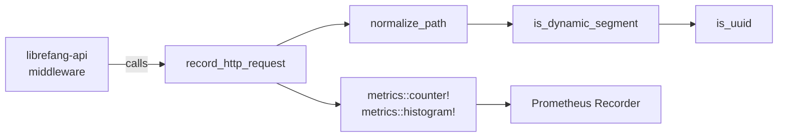

# Infrastructure & Utilities — librefang-telemetry-src

# librefang-telemetry

OpenTelemetry + Prometheus metrics instrumentation for LibreFang. This crate provides centralized HTTP metrics and tracing utilities used across the Agent OS.

## Architecture



The crate acts as a thin abstraction over the `metrics` crate macros. Actual recorder installation (Prometheus exporter setup) happens in `librefang-api/src/telemetry.rs`. This crate focuses on the recording interface and path normalization logic.

## Module Structure

| Module | Purpose |
|--------|---------|
| `config` | Re-exports `TelemetryConfig` from `librefang-types` |
| `metrics` | HTTP request recording and path normalization |

## Public API

The crate re-exports three items at the root level:

```rust
pub use metrics::{get_http_metrics_summary, normalize_path, record_http_request};
```

---

### `record_http_request`

```rust
pub fn record_http_request(path: &str, method: &str, status: u16, duration: Duration)
```

Main entry point called by the request-logging middleware in `librefang-api`. Records two metrics:

| Metric | Type | Labels |
|--------|------|--------|
| `librefang_http_requests_total` | Counter | `method`, `path` (normalized), `status` |
| `librefang_http_request_duration_seconds` | Histogram | `method`, `path` (normalized) |

The path is normalized before recording to prevent cardinality explosions from dynamic URL segments.

### `normalize_path`

```rust
pub fn normalize_path(path: &str) -> String
```

Collapses dynamic segments in HTTP paths by replacing UUIDs and hex identifiers with `{id}`. This keeps metric label cardinality manageable.

**Normalization rules:**

- Segments matching a UUID pattern (`xxxxxxxx-xxxx-xxxx-xxxx-xxxxxxxxxxxx`) are replaced.
- Segments that are pure hex strings (length 8–64, no hyphens) are replaced.
- The segment *preceding* a dynamic segment is preserved (e.g., `agents` in `/api/agents/{id}/message`).
- Literal segments like `api`, `v1`, `v2`, `a2a` are always preserved.

| Input | Output |
|-------|--------|
| `/api/health` | `/api/health` |
| `/api/agents/550e8400-e29b-41d4-a716-446655440000/message` | `/api/agents/{id}/message` |
| `/api/agents/deadbeef01234567/message` | `/api/agents/{id}/message` |
| `/.well-known/agent.json` | `/.well-known/agent.json` |
| `/api/my-agent/status` | `/api/my-agent/status` |

The last two examples illustrate what is **not** treated as dynamic: `well-known` contains a hyphen but doesn't match the UUID 8-4-4-4-12 pattern, and `my-agent` is too short and contains hyphens.

### `get_http_metrics_summary`

```rust
pub fn get_http_metrics_summary() -> String
```

Returns a comment string directing callers to the `/api/metrics` endpoint or the `PrometheusHandle` directly. Kept for backward compatibility — actual metric rendering happens through the Prometheus exporter installed at startup.

### `TelemetryConfig`

Re-exported from `librefang-types::config`. Configuration for telemetry behavior, defined alongside all other kernel configuration structs.

## Internal Functions

### `is_dynamic_segment`

```rust
fn is_dynamic_segment(s: &str) -> bool
```

Returns `true` if the segment is a UUID or a pure hex string of length 8–64. Does **not** match general hyphenated words like `well-known` or `my-agent`.

### `is_uuid`

```rust
fn is_uuid(s: &str) -> bool
```

Validates the standard UUID format: five hyphen-separated hex groups of lengths 8, 4, 4, 4, 12.

## Integration Points

**Incoming calls:** The `request_logging` middleware in `librefang-api/src/middleware.rs` calls `record_http_request` for every HTTP request passing through the API layer.

**Recorder installation:** This crate does **not** install a metrics recorder. That happens in `librefang-api/src/telemetry.rs`, which sets up the Prometheus exporter. All `metrics::counter!` and `metrics::histogram!` macros emit to whatever global recorder is active.

**Configuration:** `TelemetryConfig` lives canonically in `librefang-types::config::types` and is re-exported here for import convenience.