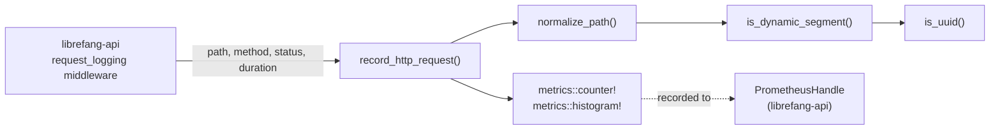

# Infrastructure & Utilities — librefang-telemetry-src

# librefang-telemetry-src

OpenTelemetry + Prometheus metrics instrumentation for LibreFang.

This crate provides centralized telemetry (metrics and tracing) for monitoring the LibreFang Agent OS. It acts as a thin wrapper around the `metrics` crate, normalizing HTTP request data before recording it to whichever metrics recorder has been installed globally (typically a Prometheus exporter set up in `librefang-api`).

## Architecture



## Module Layout

| File | Purpose |
|------|---------|
| `lib.rs` | Crate root. Re-exports the public API: `record_http_request`, `normalize_path`, `get_http_metrics_summary`. |
| `config.rs` | Re-exports `TelemetryConfig` from `librefang-types::config` for backward compatibility. |
| `metrics.rs` | All HTTP metrics recording logic and path normalization. |

## Public API

### `record_http_request`

```rust
pub fn record_http_request(path: &str, method: &str, status: u16, duration: Duration)
```

The primary entry point, called by the `request_logging` middleware in `librefang-api`. It:

1. Normalizes `path` via `normalize_path` to collapse high-cardinality segments.
2. Emits a `librefang_http_requests_total` counter with labels `method`, `path`, and `status`.
3. Records `librefang_http_request_duration_seconds` histogram with labels `method` and `path`.

The actual recorder is whichever one has been installed globally (the Prometheus exporter configured in `crates/librefang-api/src/telemetry.rs`).

### `normalize_path`

```rust
pub fn normalize_path(path: &str) -> String
```

Collapses dynamic path segments into `{id}` to prevent metric label explosion. Splits the path on `/`, then walks the segments. Known static tokens (`api`, `v1`, `v2`, `a2a`) are kept verbatim. When a segment is immediately followed by a dynamic identifier (detected by `is_dynamic_segment`), that identifier is replaced with `{id}`.

**Examples:**

| Input | Output |
|-------|--------|
| `/api/health` | `/api/health` |
| `/api/agents/550e8400-e29b-41d4-a716-446655440000/message` | `/api/agents/{id}/message` |
| `/api/agents/deadbeef01234567/message` | `/api/agents/{id}/message` |
| `/.well-known/agent.json` | `/.well-known/agent.json` |
| `/api/my-agent/status` | `/api/my-agent/status` |

### `get_http_metrics_summary`

```rust
pub fn get_http_metrics_summary() -> String
```

A backward-compatibility shim. It returns a comment string explaining that the full Prometheus output is available at `/api/metrics` or through the `PrometheusHandle` directly. Callers needing the complete metrics scrape should use the handle rather than this function.

### `TelemetryConfig` (re-export)

```rust
pub use librefang_types::config::TelemetryConfig;
```

Importable as `librefang_telemetry::config::TelemetryConfig` for crates that already depend on this crate but not on `librefang-types` directly.

## Path Normalization Internals

The normalization logic depends on two private helpers:

### `is_dynamic_segment(s: &str) -> bool`

Returns `true` when the segment matches either:

- **Standard UUID format** — five hyphen-separated hex groups matching the pattern `8-4-4-4-12` (e.g., `550e8400-e29b-41d4-a716-446655440000`).
- **Pure hex strings** — 8 to 64 ASCII hex characters with no hyphens (e.g., `deadbeef01234567`, a SHA-256 hash).

This deliberately excludes general hyphenated words like `well-known` or `my-agent`, which should be preserved as meaningful path labels.

### `is_uuid(s: &str) -> bool`

Validates the `8-4-4-4-12` UUID group structure. Called only by `is_dynamic_segment`.

## Integration with the Rest of the Codebase

The telemetry pipeline works as follows:

1. **Middleware** (`librefang-api/src/middleware.rs`): The `request_logging` middleware intercepts every HTTP response and calls `record_http_request` with the request path, method, response status, and elapsed duration.

2. **Recorder installation** (`librefang-api/src/telemetry.rs`): At startup, the API crate installs a Prometheus-backed `metrics` recorder via `metrics_exporter_prometheus`. This is what actually captures the `counter!` and `histogram!` macro emissions.

3. **Scraping**: The `/api/metrics` endpoint exposes the Prometheus text output from the `PrometheusHandle`. External monitoring systems scrape this endpoint.

This crate has **no outgoing calls** to other LibreFang crates — it depends only on `librefang-types` (for the config re-export) and the `metrics` facade crate. All coupling is inbound: other crates call into `librefang-telemetry`.