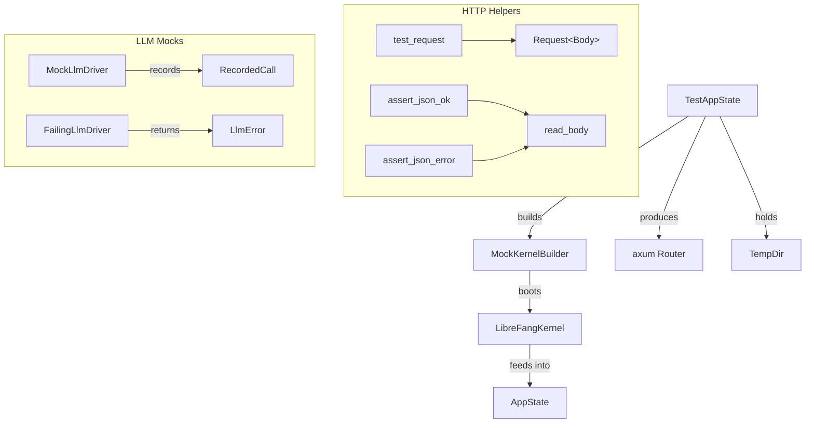

# Infrastructure & Utilities — librefang-testing-src

# librefang-testing — Test Infrastructure

## Purpose

`librefang-testing` provides reusable mock infrastructure for testing LibreFang API routes and runtime logic without starting a full daemon or making real network calls. It supplies in-memory databases, fake LLM providers, temp directories, and a pre-wired axum `Router` so tests can exercise the full HTTP stack from request to response.

All public items are re-exported from the crate root, so consumers only need `use librefang_testing::...`.

## Architecture



## Key Components

### `MockKernelBuilder` — Minimal Kernel Construction

Builds a real `LibreFangKernel` instance using `boot_with_config`, but with all heavyweight subsystems disabled:

- **In-memory-equivalent SQLite** — database file lives under a temp directory (deleted on drop).
- **Temp directory tree** — creates `data/`, `skills/`, `workspaces/agents/`, `workspaces/hands/` under a `tempfile::TempDir`.
- **Networking disabled** — `network_enabled` is set to `false`.

The builder accepts an optional `with_config` closure to override any `KernelConfig` field before boot.

```rust,ignore
let (kernel, _tmp) = MockKernelBuilder::new()
    .with_config(|cfg| {
        cfg.default_model.provider = "test".into();
    })
    .build();

// kernel is a fully booted LibreFangKernel
// _tmp MUST stay in scope for the kernel's file paths to remain valid
```

**Critical:** `build()` returns `(LibreFangKernel, TempDir)`. The caller must keep `TempDir` alive — dropping it deletes the directory tree the kernel references.

For the simplest case, use the `test_kernel()` convenience function:

```rust,ignore
let (kernel, _tmp) = librefang_testing::test_kernel();
```

### `TestAppState` — Full axum Testing Harness

Wraps `MockKernelBuilder` output into an `AppState` (the same type used in production) and exposes a pre-configured `Router` with all API routes mounted under `/api`.

Construction paths:

| Method | Use When |
|---|---|
| `TestAppState::new()` | Default mock kernel is sufficient |
| `TestAppState::with_builder(builder)` | You need custom `KernelConfig` |
| `TestAppState::from_kernel(kernel, tmp)` | You already have a booted kernel |

The `router()` method returns a `Router` covering all major endpoints: health, agents CRUD, profiles, skills, config, memory, usage, tools, commands, models, providers, and sessions. Tests use `tower::ServiceExt` to send requests through this router:

```rust,ignore
use tower::ServiceExt;
use librefang_testing::{TestAppState, test_request, assert_json_ok};
use axum::http::Method;

let app = TestAppState::new();
let router = app.router();

let response = router
    .oneshot(test_request(Method::GET, "/api/health", None))
    .await
    .unwrap();

let json = assert_json_ok(response).await;
assert_eq!(json["status"], "ok");
```

Internally, `build_state` constructs `AppState` with sensible test defaults — no peer registry, no bridge manager, empty caches, fresh webhook store, no Prometheus handle.

### `MockLlmDriver` — Configurable Fake LLM Provider

Implements the `LlmDriver` trait. Returns canned responses in sequence (wrapping to the last response when the list is exhausted), and records every call for post-test assertions.

**Configuration:**

```rust,ignore
let driver = MockLlmDriver::new(vec![
    "First response".into(),
    "Second response".into(),
])
.with_tokens(100, 50)                    // override default token counts
.with_stop_reason(StopReason::MaxTokens); // override default EndTurn
```

**Call recording:** After exercising code that uses the driver, inspect what was sent:

```rust,ignore
let calls = driver.recorded_calls();
assert_eq!(calls.len(), 2);
assert_eq!(calls[0].model, "test-model");
assert_eq!(calls[0].message_count, 3);
assert_eq!(calls[0].tool_count, 1);
assert_eq!(calls[0].system, Some("You are helpful".into()));
```

`RecordedCall` captures: `model`, `message_count`, `tool_count`, and `system` prompt.

**Streaming:** `MockLlmDriver::stream` delegates to `complete`, then emits a `TextDelta` event followed by `ContentComplete` — sufficient for testing streaming consumers without complex async setup.

**`FailingLlmDriver`** — always returns `LlmError::Api { status: 500, ... }` for testing error-handling paths. Reports `is_configured() == false`.

### HTTP Helper Functions

Three functions for building requests and asserting responses:

#### `test_request(method, path, body)`

Constructs an `axum::http::Request<Body>`. When a body is provided, sets `content-type: application/json`.

```rust
let get_req = test_request(Method::GET, "/api/agents", None);
let post_req = test_request(
    Method::POST,
    "/api/agents",
    Some(r#"{"name": "test-agent"}"#),
);
```

#### `assert_json_ok(response)` → `serde_json::Value`

Asserts status `200 OK`, parses the body as JSON. Panics with a descriptive message (including the raw body) on failure.

#### `assert_json_error(response, expected_status)` → `serde_json::Value`

Same, but asserts the response status matches the provided `StatusCode` (e.g. `StatusCode::NOT_FOUND`, `StatusCode::BAD_REQUEST`). Useful for verifying error responses.

Both assertion functions use an internal `read_body` helper that collects the response body bytes into a `String`.

## Re-exports

The crate root re-exports the primary types for convenience:

```
librefang_testing::{
    test_request,
    assert_json_ok,
    assert_json_error,
    MockLlmDriver,
    FailingLlmDriver,
    MockKernelBuilder,
    TestAppState,
}
```

## Typical Test Patterns

### Testing an API endpoint

```rust,ignore
#[tokio::test]
async fn test_list_agents_empty() {
    let app = TestAppState::new();
    let response = app.router()
        .oneshot(test_request(Method::GET, "/api/agents", None))
        .await
        .unwrap();
    
    let json = assert_json_ok(response).await;
    assert!(json.as_array().unwrap().is_empty());
}
```

### Testing an error path

```rust,ignore
#[tokio::test]
async fn test_get_nonexistent_agent() {
    let app = TestAppState::new();
    let response = app.router()
        .oneshot(test_request(Method::GET, "/api/agents/does-not-exist", None))
        .await
        .unwrap();
    
    let json = assert_json_error(response, StatusCode::NOT_FOUND).await;
    assert!(json["error"].is_string());
}
```

### Testing with a custom kernel config

```rust,ignore
#[tokio::test]
async fn test_custom_provider() {
    let app = TestAppState::with_builder(
        MockKernelBuilder::new().with_config(|cfg| {
            cfg.default_model.provider = "ollama".into();
        })
    );
    // ... send requests ...
}
```

### Testing LLM driver integration

```rust,ignore
#[test]
fn test_driver_records_calls() {
    let driver = MockLlmDriver::with_response("Hello!");
    
    let response = driver.complete(CompletionRequest {
        model: "test-model".into(),
        messages: vec![/* ... */],
        tools: vec![/* ... */],
        system: Some("Be helpful".into()),
    }).await.unwrap();
    
    assert_eq!(response.text(), "Hello!");
    assert_eq!(driver.call_count(), 1);
    
    let call = &driver.recorded_calls()[0];
    assert_eq!(call.model, "test-model");
    assert_eq!(call.system.as_deref(), Some("Be helpful"));
}
```

## Dependencies and Integration

This crate sits at the boundary between the application and the test suite:

- **`librefang-kernel`** — provides `LibreFangKernel` and `KernelConfig`; `MockKernelBuilder` calls `boot_with_config`.
- **`librefang-api`** — provides `AppState` and route handler functions; `TestAppState::build_state` and `router()` wire these together.
- **`librefang-runtime`** — provides the `LlmDriver` trait that `MockLlmDriver` and `FailingLlmDriver` implement.
- **`librefang-types`** — shared types (`StopReason`, `TokenUsage`, `ContentBlock`, etc.) used in mock responses.
- **`axum`**, **`tower`** — HTTP infrastructure for request building and router testing.
- **`tempfile`** — temporary directory management for isolated test kernels.

The crate is used directly by tests in its own `tests.rs` module and by integration tests across the workspace that need to exercise API routes or kernel behavior in isolation.