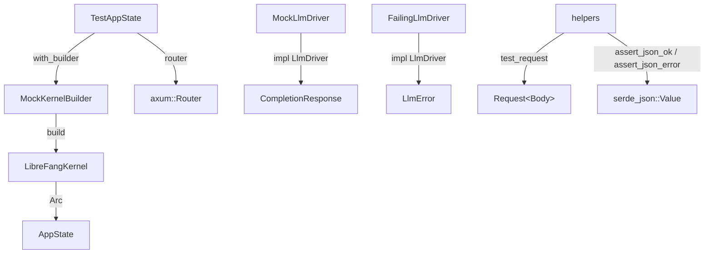

# Infrastructure & Utilities — librefang-testing-src

# librefang-testing — Test Infrastructure

The `librefang-testing` crate provides reusable mock infrastructure for writing unit and integration tests against LibreFang API routes, kernel services, and LLM integrations — without starting a full daemon or connecting to external services.

All types are re-exported from the crate root for convenience:

```rust
use librefang_testing::{
    test_request, assert_json_ok, assert_json_error,
    MockKernelBuilder, MockLlmDriver, FailingLlmDriver, TestAppState,
};
```

## Architecture



The four modules break down as follows:

| Module | Purpose |
|---|---|
| `mock_kernel` | Builds a real `LibreFangKernel` with in-memory SQLite, temp directories, and no networking |
| `test_app` | Wraps the kernel into an `AppState` and mounts all API routes onto a testable `Router` |
| `mock_driver` | Provides `MockLlmDriver` (canned responses + call recording) and `FailingLlmDriver` (always errors) |
| `helpers` | HTTP request construction and response assertion functions |

## MockKernelBuilder

Produces a real `LibreFangKernel` instance booted with a minimal configuration: in-memory-equivalent SQLite file inside a temp directory, networking disabled, no OFP/cron/channel initialization.

The builder creates the required directory layout (`data/`, `skills/`, `workspaces/agents/`, `workspaces/hands/`) under a temp directory and calls `LibreFangKernel::boot_with_config`.

### Usage

```rust
let (kernel, _tmp) = MockKernelBuilder::new().build();
```

The returned `TempDir` **must be held by the caller**. Dropping it deletes the temp directory and invalidates any file paths the kernel references.

### Custom configuration

Apply arbitrary modifications to `KernelConfig` before boot:

```rust
let (kernel, _tmp) = MockKernelBuilder::new()
    .with_config(|cfg| {
        cfg.language = "zh".into();
        cfg.default_model.provider = "test".into();
    })
    .build();
```

`with_config` accepts a closure that runs after the builder sets up its defaults (home dir, data dir, `network_enabled: false`, SQLite path) but before `boot_with_config` is called. This lets you override anything without fighting the builder's internal setup.

### Quick-start function

`test_kernel()` is a shorthand for `MockKernelBuilder::new().build()`.

### Callers across the codebase

`MockKernelBuilder` is used extensively outside this crate — any test that needs a kernel instance (HTTP client construction, plugin installation, channel auth, provider health probes, cron delivery, hook firing, MCP OAuth discovery) calls `build()` to get one. This makes it the central fixture for the project's test infrastructure.

## TestAppState

Wraps `MockKernelBuilder` output into a fully constructed `AppState` (the same type used in production) and provides a `Router` with all API routes mounted under `/api`.

### Construction

Three constructors, depending on how much control you need:

| Method | Description |
|---|---|
| `TestAppState::new()` | Default mock kernel, zero configuration |
| `TestAppState::with_builder(builder)` | Custom `MockKernelBuilder` for config overrides |
| `TestAppState::from_kernel(kernel, tmp)` | Supply a pre-built kernel (you manage the `TempDir`) |

### Getting a testable router

`test_app.router()` returns an `axum::Router` with every API endpoint mounted. This is the same routing layout as production. Use `tower::ServiceExt::oneshot` to send requests:

```rust
let app = TestAppState::new();
let router = app.router();

let req = test_request(Method::GET, "/api/health", None);
let resp = router.oneshot(req).await.unwrap();
let json = assert_json_ok(resp).await;
```

### Covered routes

The router mounts endpoints for: health/status/version/metrics, agents CRUD (spawn, get, list, kill, patch, message, stop, model, mode, session, tools, skills, logs), profiles, skills, config (get/schema/set/reload), memory (search/stats), usage/summary, tools, commands, models, providers, and sessions.

### AppState internals

`build_state` constructs a full `AppState` with sensible test defaults: no peer registry, no bridge manager, empty caches, no Prometheus handle, and a webhook store backed by a temp file. This mirrors the production `AppState` structure exactly so that route handlers don't encounter missing fields.

## MockLlmDriver

A configurable fake that implements the `LlmDriver` trait. It returns pre-defined response strings, records every call, and simulates streaming.

### Canned responses

Provide a list of responses at construction. They're returned in order; once exhausted, the last response is reused:

```rust
let driver = MockLlmDriver::new(vec!["first".into(), "second".into()]);
```

For a single fixed response:

```rust
let driver = MockLlmDriver::with_response("always this");
```

### Builder methods

Chain these to customize behavior:

| Method | Default | Override |
|---|---|---|
| `with_tokens(input, output)` | `input=10`, `output=5` | Custom token counts in `TokenUsage` |
| `with_stop_reason(reason)` | `StopReason::EndTurn` | Different stop reason in responses |

### Call recording

Every call to `complete` (including calls made internally by `stream`) is recorded as a `RecordedCall`:

```rust
pub struct RecordedCall {
    pub model: String,
    pub message_count: usize,
    pub tool_count: usize,
    pub system: Option<String>,
}
```

Retrieve recordings:

- `driver.recorded_calls()` → `Vec<RecordedCall>` (cloned snapshot)
- `driver.call_count()` → `usize`

### Streaming

`stream` delegates to `complete` internally, then emits a `TextDelta` event followed by `ContentComplete`. This means call recording captures streaming requests too.

## FailingLlmDriver

A simpler mock that always returns an `LlmError::Api` with a status of 500 and your chosen message:

```rust
let driver = FailingLlmDriver::new("something went wrong");
let result = driver.complete(request).await;
assert!(result.is_err());
```

`is_configured()` returns `false` for this driver, making it useful for testing code paths that check driver availability before making calls.

## Helpers

### test_request

Builds an `axum::http::Request<Body>` with minimal ceremony:

```rust
// GET with no body
let req = test_request(Method::GET, "/api/health", None);

// POST with JSON body (content-type header is set automatically)
let req = test_request(Method::POST, "/api/agents", Some(r#"{"name":"bot"}"#));
```

When a body is provided, the `content-type: application/json` header is added automatically.

### assert_json_ok

Asserts status 200, parses the response body as JSON, and returns `serde_json::Value`. Panics with the response body included in the message on either failure — useful for debugging test failures.

```rust
let json = assert_json_ok(resp).await;
assert_eq!(json["status"], "ok");
```

### assert_json_error

Same as `assert_json_ok` but takes an expected `StatusCode`:

```rust
let json = assert_json_error(resp, StatusCode::NOT_FOUND).await;
assert!(json.get("error").is_some());
```

Both assertion functions internally call `read_body`, which collects the response body bytes into a UTF-8 string. This string is included in panic messages when assertions fail, so you see the actual response content in test output.

## Test patterns

The crate's `tests.rs` module demonstrates the standard testing patterns used throughout the project:

**Testing a happy-path GET endpoint:**
```rust
let app = TestAppState::new();
let req = test_request(Method::GET, "/api/agents", None);
let resp = app.router().oneshot(req).await.unwrap();
let json = assert_json_ok(resp).await;
assert!(json["items"].is_array());
```

**Testing an error response:**
```rust
let req = test_request(Method::GET, "/api/agents/not-a-uuid", None);
let resp = app.router().oneshot(req).await.unwrap();
let json = assert_json_error(resp, StatusCode::BAD_REQUEST).await;
```

**Testing with custom kernel config:**
```rust
let app = TestAppState::with_builder(
    MockKernelBuilder::new().with_config(|cfg| { cfg.language = "zh".into(); })
);
assert_eq!(app.state.kernel.config_ref().language, "zh");
```

**Testing LLM driver behavior in isolation:**
```rust
let driver = MockLlmDriver::with_response("hi").with_tokens(100, 50);
let resp = driver.complete(request).await.unwrap();
assert_eq!(resp.usage.input_tokens, 100);
assert_eq!(driver.call_count(), 1);
```

All endpoint tests use `#[tokio::test(flavor = "multi_thread")]` because `LibreFangKernel::boot_with_config` requires a multi-threaded runtime. Driver-only tests can use the default `#[tokio::test]`.