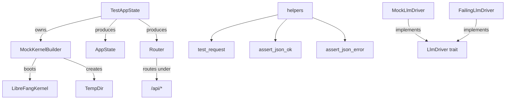

# Infrastructure & Utilities — librefang-testing-src

# librefang-testing — Test Infrastructure

## Purpose

`librefang-testing` provides reusable mock infrastructure for unit and integration tests across the entire LibreFang workspace. It lets you test API routes, kernel behavior, and LLM interactions **without** starting a full daemon, connecting to external services, or touching real databases.

Everything runs against an in-memory SQLite database, temporary filesystem directories, and configurable mock LLM drivers.

## Architecture



## Re-exports

The crate root re-exports the most commonly used items for convenient imports:

```rust
use librefang_testing::{
    MockKernelBuilder, MockLlmDriver, FailingLlmDriver,
    TestAppState,
    test_request, assert_json_ok, assert_json_error,
};
```

---

## MockKernelBuilder

Builds a minimal `LibreFangKernel` with sane defaults for testing: an in-memory SQLite database, a temporary home directory, and networking disabled. Internally calls `LibreFangKernel::boot_with_config`.

### Default behavior

- Creates a `tempfile::TempDir` under the system temp location.
- Sets up `data/`, `skills/`, `workspaces/agents/`, and `workspaces/hands/` directories inside it.
- SQLite database is a file at `<tmp>/data/test.db` (not in-memory, because the kernel expects file paths).
- `network_enabled` is set to `false`, skipping all network-dependent initialization.
- Heavy subsystems (OFP, cron, networking) are not started.

### Usage

```rust,ignore
// Default kernel
let (kernel, _tmp) = MockKernelBuilder::new().build();

// With custom config overrides
let (kernel, _tmp) = MockKernelBuilder::new()
    .with_config(|cfg| {
        cfg.default_model.provider = "test-provider".into();
        cfg.default_model.model = "test-model".into();
    })
    .build();
```

### Critical: hold the `TempDir`

`build()` returns `(LibreFangKernel, TempDir)`. **You must keep `TempDir` alive** for the duration of the test. When it drops, the temporary directory is deleted, and any kernel file paths become invalid.

```rust,ignore
// ✗ WRONG — TempDir dropped immediately, kernel paths are dangling
let kernel = MockKernelBuilder::new().build().0;

// ✓ CORRECT — hold TempDir for the test lifetime
let (kernel, _tmp) = MockKernelBuilder::new().build();
```

### Convenience function

`test_kernel()` is a shorthand for `MockKernelBuilder::new().build()`.

### Where it's used across the codebase

The call graph shows `MockKernelBuilder::build` is widely consumed across the workspace — it's the standard way to create a kernel in tests for:

| Consumer crate | Usage context |
|---|---|
| `librefang-cli` | Daemon client construction, API key testing, launcher tests |
| `librefang-runtime` | Plugin manager, A2A, provider health probes, model catalog |
| `librefang-kernel` | Cron delivery, hooks |
| `librefang-http` | Proxy client construction |
| `librefang-channels` | WeChat, Reddit, QQ, Viber, Revolt, ntfy, RocketChat channel tests |
| `librefang-extensions` | HTTP client construction |

---

## MockLlmDriver

A configurable fake LLM provider implementing the `LlmDriver` trait. It returns canned responses in sequence and records every call for test assertions.

### Basic usage

```rust,ignore
// Single canned response (repeats indefinitely)
let driver = MockLlmDriver::with_response("I am a test assistant.");

// Multiple responses (returned in order, last one repeats)
let driver = MockLlmDriver::new(vec![
    "First response".into(),
    "Second response".into(),
    "Final response (repeats)".into(),
]);
```

### Configuration chain

```rust,ignore
let driver = MockLlmDriver::with_response("Hello!")
    .with_tokens(100, 50)          // input=100, output=50 (defaults: 10, 5)
    .with_stop_reason(StopReason::MaxTokens);  // (default: EndTurn)
```

### Call recording

Every call to `complete()` or `stream()` records a `RecordedCall`:

```rust,ignore
pub struct RecordedCall {
    pub model: String,         // Model name from the request
    pub message_count: usize,  // Number of messages sent
    pub tool_count: usize,     // Number of tool definitions
    pub system: Option<String>, // System prompt if provided
}
```

Assert on call history in tests:

```rust,ignore
assert_eq!(driver.call_count(), 3);
let calls = driver.recorded_calls();
assert_eq!(calls[0].model, "test-model");
assert_eq!(calls[1].message_count, 5);
```

### Response sequencing

Responses are returned in order by index. When the index exceeds the list, the **last response** is reused indefinitely. This lets you set up distinct responses for the first N interactions and a stable default afterward.

### Streaming support

`stream()` simulates streaming by calling `complete()` internally, then sending a `StreamEvent::TextDelta` followed by `StreamEvent::ContentComplete` over the provided channel.

### FailingLlmDriver

A separate mock that always returns `LlmError::Api { status: 500, ... }`. Use it to test error-handling paths:

```rust,ignore
let driver = FailingLlmDriver::new("provider is down");
// driver.complete(...) always returns Err(LlmError::Api { status: 500, message: "provider is down" })
// driver.is_configured() returns false
```

---

## TestAppState

Builds a production-identical `AppState` and `Router` for axum route testing. Wraps `MockKernelBuilder` output and wires up all the same state fields used in production (kernel handle, webhook store, caches, shutdown signal, etc.).

### Construction

```rust,ignore
// Default — uses MockKernelBuilder::new() internally
let test = TestAppState::new();

// Custom kernel configuration
let test = TestAppState::with_builder(
    MockKernelBuilder::new().with_config(|cfg| {
        cfg.default_model.provider = "openai".into();
    })
);

// From an existing kernel (e.g., one you've further configured)
let (kernel, tmp) = MockKernelBuilder::new().build();
let test = TestAppState::from_kernel(kernel, tmp);
```

### Getting a Router

`router()` returns an `axum::Router` with all API routes nested under `/api`, matching the production setup. Use it with `tower::ServiceExt` to send test requests:

```rust,ignore
use tower::ServiceExt;
use axum::http::Method;

let test = TestAppState::new();
let app = test.router();

let response = app
    .oneshot(test_request(Method::GET, "/api/health", None))
    .await
    .unwrap();

let body = assert_json_ok(response).await;
assert_eq!(body["status"], "ok");
```

### Covered routes

The test router registers all main API endpoints:

- **System** — `/health`, `/health/detail`, `/status`, `/version`, `/metrics`
- **Agents CRUD** — `/agents`, `/agents/{id}`, `/agents/{id}/message`, `/agents/{id}/stop`, `/agents/{id}/model`, `/agents/{id}/mode`, `/agents/{id}/session`, `/agents/{id}/sessions`, `/agents/{id}/session/reset`, `/agents/{id}/tools`, `/agents/{id}/skills`, `/agents/{id}/logs`
- **Profiles** — `/profiles`, `/profiles/{name}`
- **Skills** — `/skills`, `/skills/create`
- **Config** — `/config`, `/config/schema`, `/config/set`, `/config/reload`
- **Memory** — `/memory/search`, `/memory/stats`
- **Usage** — `/usage`, `/usage/summary`
- **Tools & Commands** — `/tools`, `/tools/{name}`, `/commands`
- **Models & Providers** — `/models`, `/providers`
- **Sessions** — `/sessions`

### Accessing AppState directly

If you need the `AppState` for something other than routing:

```rust,ignore
let state: Arc<AppState> = test.app_state();
```

---

## HTTP Test Helpers

Three functions for building requests and asserting on responses. All are re-exported from the crate root.

### `test_request`

Builds an `axum::http::Request<Body>` suitable for passing to `Router::oneshot()`:

```rust,ignore
// GET with no body
let req = test_request(Method::GET, "/api/health", None);

// POST with JSON body (automatically sets Content-Type: application/json)
let req = test_request(
    Method::POST,
    "/api/agents",
    Some(r#"{"name": "test-agent", "model": "gpt-4"}"#),
);
```

When `body` is `Some(...)`, the `content-type: application/json` header is set automatically. When `None`, the body is empty with no content-type header.

### `assert_json_ok`

Asserts the response has status `200 OK` and the body is valid JSON. Returns the parsed `serde_json::Value`. Panics with a descriptive message on failure (includes the raw response body for debugging):

```rust,ignore
let body = assert_json_ok(response).await;
assert_eq!(body["agents"].as_array().unwrap().len(), 3);
```

### `assert_json_error`

Same as `assert_json_ok` but checks for a specific error status code:

```rust,ignore
let body = assert_json_error(response, StatusCode::NOT_FOUND).await;
assert_eq!(body["error"], "agent not found");
```

---

## Putting It All Together

A typical integration test combines all components:

```rust,ignore
#[tokio::test]
async fn test_spawn_and_message_agent() {
    // 1. Set up mock LLM
    let llm = MockLlmDriver::with_response("Hello! I am a test agent.")
        .with_tokens(50, 20);

    // 2. Build test app
    let test = TestAppState::new();
    let app = test.router();

    // 3. Spawn an agent
    let spawn_req = test_request(
        Method::POST,
        "/api/agents",
        Some(r#"{"name": "testy", "model": "mock"}"#),
    );
    let response = app.clone().oneshot(spawn_req).await.unwrap();
    let body = assert_json_ok(response).await;
    let agent_id = body["id"].as_str().unwrap();

    // 4. Send a message
    let msg_req = test_request(
        Method::POST,
        &format!("/api/agents/{agent_id}/message"),
        Some(r#"{"content": "Hello!"}"#),
    );
    let response = app.oneshot(msg_req).await.unwrap();
    let body = assert_json_ok(response).await;
    assert!(body["response"].is_string());

    // 5. Verify LLM was called
    assert_eq!(llm.call_count(), 1);
}
```