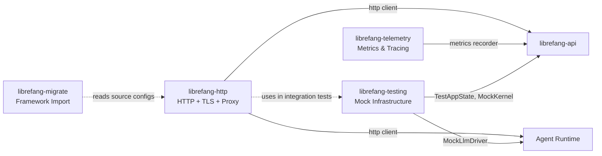

# Infrastructure & Utilities

# Infrastructure & Utilities

Shared foundations that every other LibreFang crate depends on — HTTP networking, observability, framework migration, and test tooling.

## How the crates relate

All outbound HTTP traffic flows through [librefang-http](librefang-http-src.md), which ensures consistent proxy handling and survives environments with missing CA certificates (musl, minimal Docker, etc.). [librefang-telemetry](librefang-telemetry-src.md) normalizes request paths and feeds `metrics::counter!` / `metrics::histogram!` calls into whatever global recorder `librefang-api` has installed — typically a Prometheus exporter.

[librefang-migrate](librefang-migrate-src.md) is a standalone tool that imports agents, sessions, and configuration from other agent frameworks (OpenClaw, OpenFang, with more planned). It produces a complete LibreFang home directory and a `MigrationReport`.

[librefang-testing](librefang-testing-src.md) provides `MockKernelBuilder`, `MockLlmDriver`, `FailingLlmDriver`, and `TestAppState` so that integration tests across the codebase can exercise API routes and kernel services without a live daemon or external LLM connection. The other infrastructure crates use it in their own test suites — for example, `librefang-http` validates proxy behaviour through `MockKernelBuilder`.

## Key cross-cutting workflows

| Workflow | Path |
|---|---|
| **Authenticated HTTP request** | `librefang-http` builds a `reqwest::Client` with TLS roots + proxy env vars → caller issues request → `librefang-telemetry` records the normalized request via `record_http_request()` |
| **Framework migration** | User calls `run_migration(MigrateSource::OpenClaw, …)` → `librefang-migrate` parses source configs → writes LibreFang home directory → returns `MigrationReport` |
| **Integration test** | `MockKernelBuilder` constructs a kernel → `TestAppState::with_builder(…)` wires it into an `axum::Router` → `test_request()` exercises a route → `assert_json_ok` / `assert_json_error` validates the response |