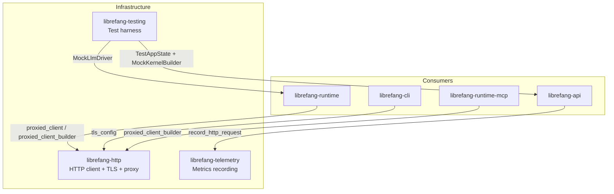

# Infrastructure Utilities

# Infrastructure Utilities

Three crates that provide shared foundational services used across the entire LibreFang codebase: a centralized HTTP client, telemetry/metrics collection, and a test harness for integration testing.



---

## `librefang-http` — Centralized HTTP Client

All outbound HTTP connections in LibreFang go through this crate. It provides a single entry point for building `reqwest::Client` instances that carry the correct proxy settings, TLS configuration, and timeouts.

### Why this exists

Two problems this crate solves:

1. **Missing system CA certificates.** On minimal Docker images, Termux/Android (musl builds), or corporate Linux with partial CA bundles, `reqwest`'s default TLS initialization panics because it can't find any trust anchors. The solution: always seed with bundled Mozilla CA roots (`webpki-roots`), then supplement with whatever system certs are available.

2. **Inconsistent proxy settings.** Without a central builder, different crates would read proxy config independently, leading to some connections bypassing the proxy. `librefang-http` ensures every outbound request respects the same `[proxy]` config section.

### Initialization sequence

At daemon startup, call `init_proxy(cfg)` once with the `[proxy]` section from `config.toml`. This:

- Stores the `ProxyConfig` in a process-global `RwLock<Option<ProxyConfig>>`
- Exports the values as environment variables (`HTTP_PROXY`, `HTTPS_PROXY`, `NO_PROXY`) during the initial bootstrap call (before the Tokio runtime spawns worker threads), so crates that build their own `reqwest::Client` via env-var detection also pick up the settings

Subsequent calls (e.g. hot-reload) update only the `RwLock` — they do **not** call `std::env::set_var`, which is unsound in a multi-threaded context.

### Key functions

| Function | Returns | Purpose |
|---|---|---|
| `init_proxy(cfg)` | `()` | Set global proxy config. Call once at boot; safe to re-call for hot-reload. |
| `proxied_client_builder()` | `reqwest::ClientBuilder` | Builder with proxy + TLS + timeouts from global config. |
| `proxied_client()` | `reqwest::Client` | Ready-to-use client (calls `proxied_client_builder().build()`). |
| `proxied_client_fallback()` | `reqwest::Client` | Like `proxied_client` but adds a 300s total request timeout. Used when a per-provider proxy override is invalid. |
| `proxied_client_with_override(url)` | `Result<reqwest::Client>` | Routes all traffic through a specific proxy URL, ignoring global config. Returns `Err` on invalid URLs — no silent fallback. |
| `tls_config()` | `rustls::ClientConfig` | Cached TLS config with bundled Mozilla roots + system certs. |
| `build_http_client(proxy)` | `reqwest::ClientBuilder` | Lower-level: build a client with an explicit `ProxyConfig`. Prefer `proxied_client_builder()` for normal use. |

`client_builder()` and `new_client()` are backward-compatible aliases for `proxied_client_builder()` and `proxied_client()` respectively.

### TLS configuration details

`init_tls_config()` runs once (cached via `OnceLock`):

1. Seeds `RootCertStore` with `webpki_roots::TLS_SERVER_ROOTS` (bundled Mozilla CA roots)
2. Calls `rustls_native_certs::load_native_certs()` to add system certificates (org-internal CAs, self-signed, etc.)
3. Builds a `rustls::ClientConfig` using `aws_lc_rs` as the crypto provider

If no system certs are found, a debug log is emitted but the client still works — the bundled roots cover all major public CAs.

### Timeout defaults

Every client built through `build_http_client` gets:

- **`connect_timeout`**: 30 seconds — caps TCP + TLS handshake
- **`read_timeout`**: 300 seconds — per-read inactivity timeout (not total request time). Streaming LLM responses keep this alive as long as tokens trickle in.

Callers can override these on the returned `ClientBuilder`.

### Proxy resolution priority

1. Explicit values from `ProxyConfig` (set via `init_proxy`) are applied as `reqwest::Proxy` objects with `NoProxy` filters
2. When `ProxyConfig` fields are `None`, reqwest's built-in env-var detection provides the fallback (since `init_proxy` already exported them)
3. Invalid proxy URLs are logged as warnings (via `tracing::warn` with redacted URLs) and skipped — the client still builds

### Valid proxy schemes

`is_valid_proxy_url()` accepts: `http://`, `https://`, `socks5://`, `socks5h://`.

---

## `librefang-telemetry` — Metrics Instrumentation

Provides HTTP request metrics via the standard `metrics` crate. The actual Prometheus recorder is installed by `librefang-api::telemetry`; this crate provides the recording helpers and path normalization.

### Key functions

| Function | Purpose |
|---|---|
| `record_http_request(path, method, status, duration)` | Records a counter (`librefang_http_requests_total`) and histogram (`librefang_http_request_duration_seconds`) with labels for method, normalized path, and status. |
| `normalize_path(path)` | Replaces dynamic path segments (UUIDs, hex IDs) with `{id}` to avoid high-cardinality metric labels. |
| `get_http_metrics_summary()` | Returns a comment string pointing to the `/api/metrics` endpoint. Full Prometheus output comes from the `PrometheusHandle` in `librefang-api`. |

### Path normalization

`normalize_path` collapses dynamic segments so metric labels stay low-cardinality:

```
/api/agents/550e8400-e29b-41d4-a716-446655440000/message
→ /api/agents/{id}/message
```

Detection rules for `is_dynamic_segment`:

- **UUID pattern**: 8-4-4-4-12 hex groups separated by hyphens
- **Pure hex string**: 8–64 hex characters, no hyphens (covers SHA-256 hashes, short hex IDs)

Regular hyphenated words like `well-known` or `my-agent` are **not** treated as dynamic — they pass through unchanged.

The `api`, `v1`, `v2`, and `a2a` path prefixes are always preserved as-is.

---

## `librefang-testing` — Test Harness

Provides mock infrastructure for testing API routes without starting a full daemon. The main components:

### `MockKernelBuilder`

Builds a minimal `LibreFangKernel` using in-memory SQLite and a temp directory, skipping heavy initialization (networking, OFP, cron). Uses `LibreFangKernel::boot_with_config` internally.

```rust
let (kernel, _tmp) = MockKernelBuilder::new()
    .with_config(|cfg| {
        cfg.language = "zh".into();
    })
    .build();
```

**Important**: The caller must hold the returned `TempDir` for the lifetime of the test — dropping it deletes the temp directory and invalidates kernel file paths.

A deterministic vault master key (`TEST_VAULT_KEY_B64`) is pinned via `Once` on first build to prevent race conditions between parallel tests sharing the process-wide keyring file.

`test_kernel()` is a convenience function equivalent to `MockKernelBuilder::new().build()`.

### `MockLlmDriver`

A configurable fake LLM provider that returns canned responses and records all calls for test assertions.

```rust
let driver = MockLlmDriver::new(vec!["First response".into(), "Second response".into()])
    .with_tokens(100, 50)
    .with_stop_reason(StopReason::MaxTokens);

let resp = driver.complete(request).await.unwrap();
assert_eq!(driver.call_count(), 1);
```

Behavior:

- Returns responses in order; when exhausted, repeats the last one
- Records each call as a `RecordedCall` (model name, message count, tool count, system prompt)
- Supports streaming via `LlmDriver::stream` — sends `TextDelta` then `ContentComplete`
- `is_configured()` always returns `true`

`FailingLlmDriver` is the error-path counterpart — always returns `LlmError::Api` with a configurable message, and `is_configured()` returns `false`.

### `TestAppState`

Wraps `MockKernelBuilder` output into a production-equivalent `AppState` and provides an axum `Router` with all API routes registered under `/api`.

```rust
let app = TestAppState::new();
let router = app.router();

let req = test_request(Method::GET, "/api/health", None);
let resp = router.oneshot(req).await.unwrap();
let json = assert_json_ok(resp).await;
```

Builder methods:

| Method | Effect |
|---|---|
| `with_api_key(key)` | Sets the global API key so auth middleware accepts it |
| `with_user_api_keys(keys)` | Pre-populates per-user API key list |
| `with_config_path(path)` | Serializes kernel config to a TOML file (for config-reload tests) |
| `from_kernel(kernel, tmp)` | Builds from an existing kernel you've constructed yourself |

`into_parts()` returns `(Arc<AppState>, TempDir, Option<PathBuf>)` for tests that need direct ownership.

### Request/response helpers

| Function | Purpose |
|---|---|
| `test_request(method, path, body)` | Builds an `axum::http::Request<Body>`. Sets `content-type: application/json` when body is present. |
| `assert_json_ok(response)` | Asserts status 200, parses body as JSON, returns `serde_json::Value`. Panics with body content on failure. |
| `assert_json_error(response, expected_status)` | Asserts status matches expected code, parses body as JSON, returns `serde_json::Value`. |

---

## How they connect

The call graph shows the dependency chain clearly:

- **Every outbound HTTP call** in the codebase (`librefang-runtime`, `librefang-runtime-mcp`, `librefang-api`, `librefang-cli`) goes through `proxied_client_builder()` or `proxied_client()`, which internally calls `build_http_client(active_proxy())` → `tls_config()`.
- **Every API request** passes through middleware that calls `record_http_request()` → `normalize_path()` to emit Prometheus metrics.
- **Every integration test** uses `TestAppState` → `MockKernelBuilder` → `LibreFangKernel::boot_with_config`, and tests that exercise agent endpoints typically inject `MockLlmDriver` to avoid real LLM API calls.