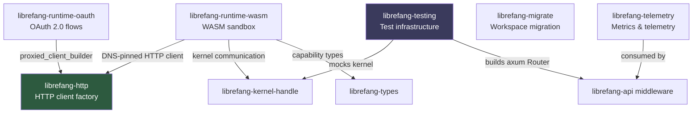

# Infrastructure & Utilities

# Infrastructure & Utilities

Shared runtime services that every other layer of LibreFang depends on—from HTTP connections and authentication to sandboxing, observability, migration, and test tooling.

## Architecture

## How the modules fit together

### Foundational layer

[**librefang-http**](librefang-http-src.md) is the base of the stack. Every outbound HTTP connection—LLM API calls, OAuth token exchanges, webhook delivery, media transcription, web search—flows through its factory. It guarantees uniform proxy configuration (from `config.toml` or env vars) and a working TLS stack on minimal systems via bundled `webpki-roots`. Other infrastructure modules call `proxied_client_builder` or `build_http_client` rather than constructing their own `reqwest::Client`.

### Authentication

[**librefang-runtime-oauth**](librefang-runtime-oauth-src.md) provides OAuth 2.0 flows for ChatGPT (PKCE browser + device flows) and GitHub Copilot (RFC 8628 device authorization). It relies on `librefang-http` for its token-endpoint connections and holds all tokens in `Zeroizing` wrappers. The CLI, drivers, and provider routes all call into this module.

### Sandboxed execution

[**librefang-runtime-wasm**](librefang-runtime-wasm-src.md) is a leaf runtime: the kernel invokes it, and nothing else calls into it. It runs untrusted skill/plugin WASM under Wasmtime with a deny-by-default capability model. Host functions gate access to filesystem, network, shell, environment, and inter-agent operations. It depends on `librefang-http` for DNS-pinned clients when a guest needs outbound network access.

### Observability

[**librefang-telemetry**](librefang-telemetry-src.md) provides `record_http_request` and path normalization helpers that `librefang-api` middleware consumes directly. Metrics flow through the `metrics` crate macros to a Prometheus exporter, scraped at `/api/metrics`.

### Migration

[**librefang-migrate**](librefang-migrate-src.md) is self-contained: it auto-detects source formats (JSON5, legacy YAML) from OpenClaw or OpenFang installations, translates configs, converts agents with tool/capability mapping, extracts credentials, and copies memory/session files into LibreFang workspace directories. It does not depend on the other infrastructure modules at runtime.

### Testing

[**librefang-testing**](librefang-testing-src.md) ties everything together for the test suite. `TestAppState` builds a `MockKernelBuilder`, boots an in-memory `LibreFangKernel`, and produces a fully-wired axum `Router`. Tests can exercise the full HTTP stack—routes, middleware, telemetry—without a live daemon or network.

## Key cross-module workflows

| Flow | Path |
|------|------|
| **OAuth token exchange** | `copilot_oauth::start_device_flow` → `http::proxied_client_builder` → proxy + TLS → token endpoint |
| **Authenticated API request** | CLI or route handler → `runtime-oauth` token → `http` client with proxy → external API |
| **WASM skill with network access** | Kernel → `runtime-wasm` sandbox → capability check → `http` DNS-pinned client |
| **Request metrics** | Incoming request → `api` middleware → `telemetry::record_http_request` → `normalize_path` → Prometheus exporter |
| **Integration test** | `testing::TestAppState` → mock kernel + temp DB → axum `Router` → HTTP request → response assertion |