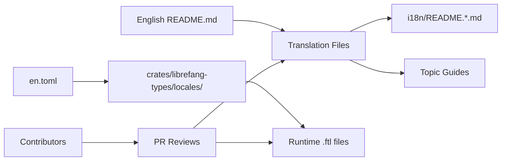

# Internationalization

# Internationalization (i18n) Module

The `i18n/` directory contains translated documentation and error message catalogs for LibreFang's multi-language support.

## Overview

LibreFang serves a global community of developers and users. The i18n module ensures that documentation, error messages, and user-facing strings are available in multiple languages. This module follows a **full-document translation** approach for documentation, where each language has a complete translated version of the source document, rather than fragment-by-fragment translation.

## Directory Structure

```
i18n/
├── README.md              # This module's guide for translators
├── README.de.md           # German translation
├── README.es.md           # Spanish translation
├── README.ja.md           # Japanese translation
├── README.ko.md           # Korean translation
├── README.pl.md           # Polish translation
├── README.zh.md           # Chinese translation
├── en.toml                # English error message catalog
├── zh.toml                # Chinese error message catalog
├── getting-started.fr.md  # French getting started guide
└── skill-development.zh.md # Chinese skill development guide
```

## Translation Types

### Full-Document Translations

The README translations (`README.*.md`) are complete translations of the project's root `README.md`. Each file maintains:

- The same heading structure and hierarchy
- Identical HTML/markdown formatting
- Matching image paths and badge URLs
- Consistent multi-language navigation bars

### Error Message Catalogs

The `.toml` files (`en.toml`, `zh.toml`) provide human-readable reference catalogs for translatable error messages. These map string keys to translated messages:

```toml
[agent]
not-found = "Agent not found"
spawn-failed = "Agent spawn failed"
```

> **Note:** The runtime uses Fluent (`.ftl`) files under `crates/librefang-types/locales/` for actual translation lookup. The TOML files serve as a human-readable catalog and reference for external tooling.

### Topic-Specific Guides

Additional translated guides cover specialized topics:
- `getting-started.fr.md` — French quickstart guide
- `skill-development.zh.md` — Chinese skill development documentation

## Adding a New Language

### Step 1: Create the Translation File

Copy the English `README.md` into `i18n/` with the appropriate ISO 639-1 language code:

```bash
cp README.md i18n/README.fr.md  # For French
```

### Step 2: Translate Content

Translate all content while preserving:

- **Heading levels** — `##` remains `##`
- **Code blocks** — Commands and code examples stay in English
- **Placeholders** — `{reason}`, `{error}`, `{name}` remain unchanged
- **Technical terms** — Keep "LibreFang", "Rust", "crate", "API" in English
- **Brand names** — "LibreFang", "Hands", "FangHub" are never translated

### Step 3: Update Navigation Bars

Add your language to the multi-language navigation bar in **all translation files**:

```html
<p align="center">
    <a href="../README.md">English</a> | 
    <a href="README.zh.md">中文</a> | 
    <a href="README.ja.md">日本語</a> | 
    <!-- Add your language here -->
    <a href="README.fr.md">Français</a>
</p>
```

Update the navigation bar in:
- The new translation file itself
- All existing translation files
- The root `README.md`

### Step 4: Submit Changes

```bash
git checkout -b i18n/add-french
git add i18n/README.fr.md
# Update navigation bars in existing files
git add README.md i18n/README.de.md i18n/README.es.md ...
git commit -m "docs(i18n): add French translation"
git push origin i18n/add-french
```

## Adding Translation Keys

When the English `README.md` receives new sections:

1. **Review the diff** to identify what changed
2. **Add translated sections** to each language file at the same position
3. **If you cannot translate all languages:**
   - Update the languages you know
   - Open GitHub issues for remaining languages
   - Tag them with `i18n` and the language code (e.g., `i18n:fr`, `i18n:de`)

## Style Guidelines

### Keep Translations Concise

Match the tone and length of the English original. Avoid adding explanatory footnotes or commentary that isn't in the source.

### Preserve All Markup

```markdown
<!-- Keep these exactly as-is -->

<a href="https://discord.gg/...">Discord</a>
[]
```

### Use Natural Phrasing

Prefer idiomatic expressions over literal word-for-word translation:

```diff
- "Agentes que trabajan para ti"     # Literal
+ "Agentes trabajando para ti"         # Idiomatic
```

### Maintain Terminology Consistency

If you translate "agent" as a specific word in your language, use that word everywhere:

```toml
# German example - consistent terminology
agent = "Agent"           # First occurrence
"Research Agent" = "Recherche-Agent"   # Consistent
"Lead Agent" = "Lead-Agent"             # Consistent
```

### Handle Technical Terms

| Category | Example | Recommendation |
|----------|---------|----------------|
| Product names | LibreFang, FangHub, Hands | Never translate |
| Languages | Rust, Python, Go | Never translate |
| Protocols | API, REST, WebSocket, MCP | Never translate |
| Technical concepts | WebAssembly, sandbox, CLI | Translate surrounding text only |
| Feature names | SKILL.md, HAND.toml | Keep format, translate description |

## Error Message Translation

The TOML catalogs cover runtime error messages. To add a new language's error catalog:

### 1. Copy the English Catalog

```bash
cp i18n/en.toml i18n/ja.toml
```

### 2. Translate Each Value

```toml
# en.toml
[agent]
not-found = "Agent not found"

# ja.toml
[agent]
not-found = "エージェントが見つかりません"
```

### 3. Preserve Placeholders

```toml
# en.toml
[message]
delivery-failed = "Message delivery failed: {reason}"

# ja.toml
[message]
delivery-failed = "メッセージの配信に失敗しました: {reason}"
```

## Testing Translations

### Visual Review

Open the markdown file in a GitHub preview or local markdown viewer to verify:

- Headings render at correct levels
- Tables align properly
- Code blocks display correctly
- Images load

### Link Verification

Check all relative links resolve correctly from the `i18n/` directory:

```bash
# From repo root
cd i18n

# Verify relative paths work
# These should resolve to existing files:
../README.md              # Root README
../docs/CONTRIBUTING.md   # Contributing guide
../public/assets/logo.png # Logo image
```

### Navigation Bar Testing

Click through each language link in the navigation bar to confirm:

- All links point to existing files
- The current language is correctly highlighted
- Return links work bidirectionally

### Diff Comparison

Compare your translation against the English original section by section:

```bash
# Show side-by-side diff
diff -y --suppress-common-lines README.md i18n/README.fr.md | head -100
```

## Integration with Build System

The i18n module integrates with the broader LibreFang build system:



Translations are **not compiled** into binaries directly. They serve as:

1. **User-facing documentation** — Rendered on GitHub or the documentation site
2. **Reference for runtime i18n** — The TOML catalogs define message keys
3. **Onboarding resources** — Help non-English speakers contribute to the project

## Related Documentation

- [`docs/CONTRIBUTING.md`](../docs/CONTRIBUTING.md) — General contribution guidelines
- [`docs/GOVERNANCE.md`](../docs/GOVERNANCE.md) — Project governance structure
- [`crates/librefang-types/locales/`](../crates/librefang-types/locales/) — Runtime Fluent files
- [ISO 639-1 Language Codes](https://en.wikipedia.org/wiki/List_of_ISO_639-1_codes) — Reference for language codes