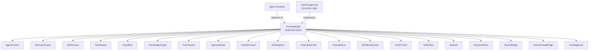

# Kernel (Core Engine) — librefang-kernel-handle-src

# librefang-kernel-handle

Role traits defining the contract between the kernel (core engine) and the agent runtime.

## Overview

This crate provides the seam that separates the agent runtime from the concrete kernel implementation. The runtime consumes `Arc<dyn KernelHandle>` (or narrower role-trait bounds) without knowing whether the backing implementation is a full `LibreFangKernel`, a test stub, or a partial mock.

The crate was refactored from a single 50+ method god-trait (issue #3746) into focused role traits so that:

- Callers express only the capabilities they need (e.g. `T: ApprovalGate`) instead of pulling in the entire kernel surface.
- Test stubs and mocks group fakes by capability; a missing capability becomes a compile error at the role-trait impl site, not a silent `Err("not available")` at first runtime call.
- Each role's contract can be tightened independently without atomic cross-cutting PRs.

## Architecture



## Error Model

All trait methods return `KernelResult<T>`, which is `Result<T, KernelOpError>`. `KernelOpError` is a re-export of `librefang_types::error::LibreFangError` — the workspace's canonical structured error enum. This lets callers pattern-match directly on variants (`AgentNotFound`, `CapabilityDenied`, `Unavailable`) instead of substring-matching error strings.

## Default Implementations

Every role trait provides default implementations for its methods. These fall into two categories:

| Default behavior | Meaning |
|---|---|
| `Err(KernelOpError::unavailable(...))` | The capability is not wired in this kernel (test stub, embedded caller, feature flag off). |
| `Ok(empty)` / `Ok(None)` / `Ok(false)` | The capability exists but has nothing to return (no cron jobs, no workflows registered). |
| `Ok(Approved)` / `Ok(Allow)` | The gate is pass-through (no policy configured, no RBAC users). |

The real kernel overrides every default. Tests and stubs only override what they need. This is intentional: a follow-up PR can tighten individual role contracts (e.g. remove the `run_forked_agent_oneshot` default) without touching the other 19 traits.

## Role Traits Reference

### AgentControl

Agent lifecycle: spawning, inter-agent messaging, listing, killing, heartbeats, and forked one-shot LLM calls.

Key methods:
- `spawn_agent` / `spawn_agent_checked` — Create agents from TOML manifests. `spawn_agent_checked` enforces capability inheritance (the kernel verifies the child's requested capabilities are covered by the parent's).
- `send_to_agent` / `send_to_agent_as` / `send_to_agent_with_key` / `send_to_agent_as_with_key` — Inter-agent messaging with optional cancel-cascade tracking (`_as` variants) and session pinning (`_with_key` variants). The `conversation_key` maps deterministically to `SessionId::for_channel(target, "agent_send:<key>")`.
- `run_forked_agent_oneshot` — Spawns a forked agent turn that shares the parent's prompt prefix for cache alignment, drains it to completion, and returns the final text. Fork messages do not persist into the agent's canonical session.
- `max_agent_call_depth` — Configurable inter-agent call depth limit (default: 5).

### MemoryAccess

Per-agent key/value memory with optional peer scoping and RBAC ACL resolution.

All methods accept `agent_id: Option<&str>` and `peer_id: Option<&str>`:
- `Some(agent_id)` scopes to that agent's isolated namespace.
- `None` uses the shared namespace (internal kernel subsystems; not for LLM-facing tools).

`memory_acl_for_sender` resolves per-user RBAC for proactive-memory reads. Returns `None` when RBAC is disabled or the sender is unattributed — callers treat this as "no restriction."

### WikiAccess

Durable markdown knowledge vault (`librefang-memory-wiki`). Results are `serde_json::Value` to avoid a dependency on the wiki crate's owned types. All methods default to `Err(unavailable("wiki"))` so stubs compile when the `[memory_wiki]` feature is off.

- `wiki_get` — Returns `{ "topic": ..., "frontmatter": {...}, "body": "..." }`.
- `wiki_search` — Substring search returning `{ "topic": ..., "snippet": ..., "score": ... }` sorted by score.
- `wiki_write` — Write with provenance (monotonic append, never overwritten). `force = false` refuses to silently overwrite a page whose on-disk content has drifted, returning `KernelOpError::conflict(...)`. Supports `[[topic]]` cross-references rewritten per render mode.

### TaskQueue

Shared task queue: post, claim, complete, list, delete, retry, and status updates. All operations are agent-scoped (the claiming agent's ID is passed explicitly).

### EventBus

Single method: `publish_event`. Fire-and-forget custom events that can trigger proactive agents.

### KnowledgeGraph

Entity/relation insertion and pattern querying against the knowledge graph substrate.

`knowledge_add_entity` and `knowledge_add_relation` take their arguments by reference (not by move) so callers that may retry (e.g. proactive memory extractors) avoid forced moves and downstream clone chains. The kernel clones into the store internally.

### CronControl

Agent-owned scheduled jobs: create, list, cancel. All methods default to `Err(unavailable("Cron scheduler"))`.

### ApprovalGate

Approval policy queries and the pending-approval lifecycle. This is the most complex role trait due to RBAC integration:

- `requires_approval` / `requires_approval_with_context` — Policy checks for tool invocations.
- `is_tool_denied_with_context` — Hard-deny gate for sender/channel context.
- `resolve_user_tool_decision` — Returns `UserToolGate::{Allow, Deny, NeedsApproval}` combining user policy, channel rules, tool categories, and role-based escalation. Defaults to `Allow` so stubs without `AuthManager` keep pre-M3 behaviour.
- `request_approval` — Blocking approval request (waits for decision).
- `submit_tool_approval` / `resolve_tool_approval` — Non-blocking submission + resolution with deferred execution payloads.

### HandsControl

Hand (specialized autonomous agent) lifecycle: list, install, activate, status, deactivate. All methods default to `Err(unavailable("Hands system"))`.

### A2ARegistry

Read-only directory of discovered external A2A agents. Returns `(name, url)` pairs. Defaults to empty.

### ChannelSender

Outbound channel adapters for text, media, files, and polls. Also includes group roster management.

Key design points:
- `send_channel_file_data` accepts `bytes::Bytes` so wrapping layers (metering, retry, fan-out) can clone the handle for free instead of copying the buffer (relevant after the 10 MiB upload bump, #3514).
- `resolve_channel_owner` maps a `(channel, chat_id)` pair to the owning agent's `AgentId`, used by `tool_channel_send` to mirror outbound messages into the inbound-routing session.
- Roster methods (`roster_upsert`, `roster_members`, `roster_remove_member`) bridge channel adapter events to persistent storage.

### PromptStore

Prompt versioning, experiment metadata, and auto-tracking. Manages the lifecycle of prompt versions (create, list, get, delete, set active) and A/B experiments (create, list, get, update status, record metrics).

`create_prompt_version` and `create_experiment` take arguments by reference so API handlers can keep a copy for the response JSON without double-cloning.

`auto_track_prompt_version` is a no-op hook that compares the current system prompt against the last tracked version and creates a new version record if it changed.

### WorkflowRunner

Declarative workflow execution with discovery, async launching, and status tracking.

Supporting types (all `#[non_exhaustive]`, constructed via `new()` methods):
- **`WorkflowSummary`** — Registered workflow definition metadata including `has_input_schema`.
- **`WorkflowInputParam`** — One parameter from the workflow's input schema. `param_type` is one of `string | number | boolean | file | image | agent_id`.
- **`WorkflowDescription`** — Full discovery surface: step names (in execution order) + input schema (sorted by name for deterministic LLM output).
- **`WorkflowRunSummary`** — Run instance state including per-step `StepOutputSummary` for structured results.
- **`StepOutputSummary`** — One step's name + final output.

Key methods:
- `run_workflow` — Synchronous execution, returns `(run_id, output)`.
- `start_workflow_async` / `start_workflow_async_tracked` — Fire-and-forget with optional `(agent_id, session_id)` for the async task tracker (#4983).
- `describe_workflow` — Discovery surface for agents to learn how to call a workflow (#4982).
- `cancel_workflow_run` — Cancel a running or paused workflow.

### GoalControl

Agent goals: list active goals (optionally filtered by agent) and update status/progress.

### ToolPolicy

Read-only configuration surface for tool execution parameterization. No mutation — pure config queries:

- `tool_timeout_secs` / `tool_timeout_secs_for` — Global and per-tool timeout resolution (exact match → longest glob → global default).
- `skill_env_passthrough_policy` — Operator gate over skill environment variable requests.
- `readonly_workspace_prefixes` / `named_workspace_prefixes` — Workspace access mode enforcement for file tools.
- `channel_file_download_dir` — Directory bridges write attachments to; runtime widens the sandbox accept-list.
- `effective_upload_dir` — Directory for runtime-generated uploads.
- `deduplicate_file_reads` — Whether to collapse repeated `file_read` calls within a session.

### ApiAuth

One-shot auth config snapshot for the HTTP server layer. Returns `ApiAuthSnapshot` (raw, unresolved config strings) so the API server can apply its own credential resolution without importing `KernelConfig`.

`auth_snapshot()` MUST acquire all values from a single config generation to prevent mixing pre-reload and post-reload config on hot-reload boundaries.

### SessionWriter

Pre-inject content blocks into agent sessions (used by HTTP attachment uploads) and mirror outbound messages.

**Session isolation invariant**: Callers MUST derive `session_id` with the same resolver the matching `send_message_*` call uses. Passing the agent's default registry session when the text part lands on a channel-derived session causes cross-chat leaks.

**Blocking I/O caveat**: The production implementation calls `MemorySubstrate::save_session` synchronously (SQLite write). Async callers should wrap in `tokio::task::spawn_blocking` until #3579 moves the substrate to async I/O.

### AcpFsBridge + AcpFsClient

Editor-backed file I/O via the Agent Client Protocol (#3313). The kernel stores `Arc<dyn AcpFsClient>` per ACP session; runtime tools route `fs/read_text_file` and `fs/write_text_file` through the editor instead of the local filesystem.

- `register_acp_fs_client` / `unregister_acp_fs_client` — Lifecycle management per session.
- `acp_fs_client` — Lookup; returns `None` when no editor is bound (runtime falls back to local fs).
- `acp_read_text_file` / `acp_write_text_file` — Convenience dispatchers that return `Unavailable` when unbound.

`AcpFsClient::capabilities()` returns `(can_read, can_write)` so tools can short-circuit before paying a round-trip.

### AcpTerminalBridge + AcpTerminalClient

Editor-backed terminal execution via ACP. Hosts the command's PTY in the editor so output appears in the terminal panel and the user can interact.

`AcpTerminalRunResult` carries:
- `output` — Captured stdout/stderr (interleaved).
- `truncated` — Whether the editor truncated output to fit the byte limit.
- `exit_code` / `signal` — Process termination details.

### CatalogQuery

Read-side model-catalog metadata for driver request-building:
- `reasoning_echo_policy_for` — How the OpenAI-compat driver handles `reasoning_content` for a given model. Defaults to `ReasoningEchoPolicy::None` (substring-based fallback).
- `proactive_memory_extraction_model_for` — Per-agent extraction model override, falling back to global config.

## KernelHandle Supertrait

`KernelHandle` is a supertrait alias requiring all 20 role traits. A blanket impl means any type satisfying all role traits automatically implements `KernelHandle`:

```rust
pub trait KernelHandle:
    AgentControl + MemoryAccess + WikiAccess + TaskQueue + EventBus
    + KnowledgeGraph + CronControl + ApprovalGate + HandsControl
    + A2ARegistry + ChannelSender + PromptStore + WorkflowRunner
    + GoalControl + ToolPolicy + ApiAuth + SessionWriter
    + AcpFsBridge + AcpTerminalBridge + CatalogQuery
    + Send + Sync
{}
```

Existing call sites (117 at split time) taking `Arc<dyn KernelHandle>` continue working unchanged. New code should narrow to only the required role bounds:

```rust
// Legacy — pulls in everything
fn process(handle: &Arc<dyn KernelHandle>) { ... }

// Preferred — only what's needed
fn approve<T: ApprovalGate + Send + Sync>(gate: &T) { ... }
```

## Usage

Import the prelude to bring `KernelHandle` and all role traits into scope:

```rust
use librefang_kernel_handle::prelude::*;
```

### Implementing a test stub

Only implement the role traits your test needs. Unimplemented traits use their defaults (no-ops or `unavailable` errors):

```rust
struct MyStub;

impl ApprovalGate for MyStub {} // all defaults
impl MemoryAccess for MyStub {
    // override only the methods under test
    fn memory_recall(&self, key: &str, _: Option<&str>, _: Option<&str>)
        -> Result<Option<serde_json::Value>, KernelOpError>
    {
        Ok(Some(serde_json::json!({"test": true})))
    }
    // remaining methods use their defaults
}
```

### Constructing non-exhaustive types

All `#[non_exhaustive]` structs provide `new()` constructors. Future field additions will be `with_<field>(self, ...)` setters:

```rust
let summary = WorkflowSummary::new(
    "wf-123".into(),
    "deploy".into(),
    "Deploys the service".into(),
    4,
    true,
);
```