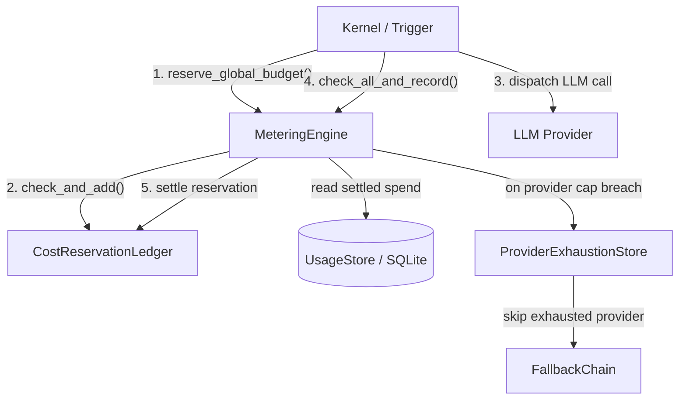

# Kernel (Core Engine) — librefang-kernel-metering-src

# Metering Engine (`librefang-kernel-metering`)

Tracks LLM spending and enforces budget quotas across four independent axes — global, per-agent, per-provider, and per-user — backed by a SQLite usage store with an in-memory reservation ledger for pre-call gating.

## Architecture



## Budget Enforcement Layers

Every LLM call passes through up to four independent budget checks. Each layer has hourly, daily, and monthly windows. A window with a limit of `0.0` is treated as unlimited and skipped.

| Layer | Method | Scope | Typical config key |
|-------|--------|-------|--------------------|
| **Global** | `check_global_budget` / `reserve_global_budget` | All agents, all providers | `budget.max_hourly_usd` |
| **Per-agent** | `check_quota` | Single agent's spend | `quota.max_cost_per_hour_usd` |
| **Per-provider** | `check_provider_budget` | Single provider (e.g. `"openai"`) | `budget.providers.openai.max_cost_per_day_usd` |
| **Per-user** | `check_user_budget` | RBAC user across all their agents | `user_budget.max_hourly_usd` |

The recommended entry point for post-call recording is `check_all_and_record`, which atomically checks per-agent, global, *and* per-provider limits in a single SQLite transaction — closing the TOCTOU race between a standalone `check_quota` and a separate `record`.

## Pre-Call Reservation System

**Problem (#3616):** When N triggers fire concurrently, they all read the same settled spend from SQLite, all pass the budget gate, all dispatch — and the collective cost overshoots the cap by Nx.

**Solution:** `reserve_global_budget` reserves an estimated USD cost in an in-memory `CostReservationLedger` *before* the LLM call is dispatched. The key atomicity guarantee lives in `CostReservationLedger::check_and_add`:

```rust
// Single critical section: check all caps AND commit the reservation
// under one mutex acquisition. No other thread can observe the
// pre-add total and also commit.
fn check_and_add(&self, usd: f64, caps: &[(f64, f64)]) -> Result<(f64, f64), CapBreach>
```

### Reservation lifecycle

1. **Reserve** — call `reserve_global_budget(&budget, estimated_usd)` before dispatching the LLM request. This reads settled spend from SQLite, then atomically checks that `settled + already_pending + estimated_usd` stays under every non-zero cap. Uses `>` (not `>=`) so a single call exactly at the cap is allowed through.
2. **Dispatch** — make the LLM call. If it fails, call `.release()` on the reservation.
3. **Settle** — after recording the actual usage with `check_all_and_record`, call `.settle()` to release the pending hold so the ledger doesn't double-count against the now-settled SQLite row.
4. **Drop safety** — if code panics between reserve and settle, the `Drop` impl on `MeteringReservation` releases the hold automatically.

```rust
let reservation = engine.reserve_global_budget(&budget, estimated_usd)?;

match dispatch_llm_call().await {
    Ok(response) => {
        let record = build_usage_record(&response);
        engine.check_all_and_record(&record, &quota, &budget)?;
        reservation.settle();
    }
    Err(_) => reservation.release(),
}
```

### Concurrency note

The in-memory ledger only synchronizes in-process callers. Two separate processes (or an out-of-band SQL writer) can still race on the same caps. The post-call `check_all_and_record` path provides the SQLite-level atomicity for that scenario.

### Comparison operators

`reserve_global_budget` uses `>` (projected cost must *exceed* the limit to be rejected), while `check_global_budget` uses `>=` (cost at the limit is already rejected). The asymmetry is intentional: the pre-call gate allows a call that exactly reaches the cap, while the post-call gate prevents further calls once the cap is fully consumed.

## Provider Exhaustion Integration (#4807)

When a per-provider budget gate refuses a provider and a `ProviderExhaustionStore` is attached, the engine marks that provider as `BudgetExceeded` for `DEFAULT_LONG_BACKOFF`. The LLM fallback chain reads the same exhaustion store and skips the slot instead of attempting a call that would only be denied again.

Wire the shared store during engine construction:

```rust
let exhaustion = ProviderExhaustionStore::new();
let engine = MeteringEngine::new(store)
    .with_exhaustion_store(exhaustion.clone());
// Pass the same `exhaustion` to the FallbackChain.
```

If no exhaustion store is attached, the flag call is a no-op — legacy callers are unaffected.

Retrieve the attached store later with `exhaustion_store()` to pass it to other layers (e.g. an `AuxClient` built after the engine).

## Cost Estimation

### `estimate_cost` (static, catalog-free)

Uses fixed default rates ($1.00 / $3.00 per million input / output tokens). Intended for unit tests or environments without a catalog.

### `estimate_cost_with_catalog` (preferred)

Looks up the model in the `ModelCatalog` and uses catalog pricing. Falls back to default rates for unknown models.

Cache token pricing:
- **Cache-read tokens** — priced at **10%** of the input rate
- **Cache-creation tokens** — priced at **125%** of the input rate
- **Regular input tokens** — `input_tokens - cache_read - cache_creation` (with saturating arithmetic to handle overflow from buggy provider responses)

Subscription-based providers (e.g. `alibaba-coding-plan`) register models with zero cost-per-token; cost tracking shows $0.00. For `chatgpt` provider models that have zero catalog pricing, the function falls back to default rates so budgets still have a conservative non-zero estimate.

### Token overflow safety

The inner sum of `cache_read_input_tokens + cache_creation_input_tokens` uses `saturating_add` to prevent panics on overflow from malformed provider responses. The subsequent subtraction from `input_tokens` uses `saturating_sub`, clamping regular input to zero when cache totals exceed reported input.

## Key Types

### `MeteringEngine`

The main public struct. Constructed with `new(store)` and optionally configured with `with_exhaustion_store(store)`.

| Method | Purpose |
|--------|---------|
| `reserve_global_budget` | Pre-call: reserve estimated USD against in-memory ledger |
| `check_quota` | Post-call: check per-agent hourly/daily/monthly caps |
| `check_global_budget` | Post-call: check global caps (includes in-flight pending) |
| `check_provider_budget` | Pre- or post-call: check per-provider caps; flags exhaustion store on breach |
| `check_user_budget` | Post-call: check per-user RBAC spending caps |
| `check_all_and_record` | **Preferred:** atomically check per-agent + global + per-provider, then record usage in one SQLite transaction |
| `check_quota_and_record` | Atomically check per-agent quotas, then record |
| `check_global_budget_and_record` | Atomically check global budget, then record |
| `record` | Persist a `UsageRecord` without any quota checks |
| `budget_status` | Snapshot: current spend, limits, and percentages for all windows |
| `get_summary` | Query usage summary, optionally filtered by agent |
| `get_by_model` | Query usage grouped by model |
| `cleanup` | Delete records older than N days |
| `pending_reserved_usd` | Diagnostic: current in-flight reserved total |

### `MeteringReservation`

`#[must_use]` RAII guard returned by `reserve_global_budget`. Methods:
- `settle()` — release after recording actual usage
- `release()` — release without settling (call failed)
- `estimated_usd()` — the reserved amount
- `Drop` — releases automatically if neither `settle` nor `release` was called

### `BudgetStatus`

Serializable snapshot returned by `budget_status` with `hourly_spend`, `hourly_limit`, `hourly_pct` (and daily/monthly equivalents), plus `alert_threshold` and `default_max_llm_tokens_per_hour`.

## Dependencies

| Crate | Usage |
|-------|-------|
| `librefang-memory` | `UsageStore` (SQLite-backed persistence), `UsageRecord`, `UsageSummary`, `ModelUsage` |
| `librefang-llm-driver` | `ProviderExhaustionStore`, `ExhaustionReason`, `DEFAULT_LONG_BACKOFF` — narrow dependency, nothing else from the driver crate is imported |
| `librefang-types` | `AgentId`, `UserId`, `ResourceQuota`, `BudgetConfig`, `ProviderBudget`, `UserBudgetConfig`, `LibreFangError` |
| `librefang-runtime` | `ModelCatalog` for `estimate_cost_with_catalog` |