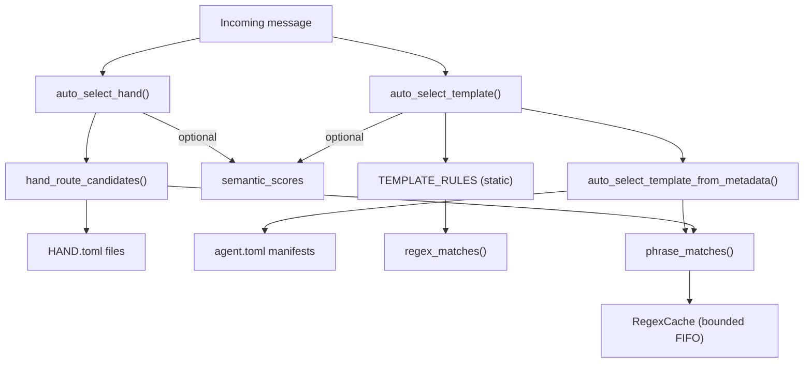

# Kernel (Core Engine) — librefang-kernel-router-src

# Kernel Router (`librefang-kernel-router`)

## Purpose

The router resolves an incoming user message to the best-matching **hand** (a multi-agent orchestration unit) or **template** (a single specialist agent). It combines keyword matching with optional embedding-based semantic similarity to support both English-centric rule matching and cross-lingual routing (Chinese, Japanese, Korean, etc.).

## Architecture



## Two Routing Targets

### Hand Routing — `auto_select_hand`

Routes to a **hand** defined in `HAND.toml` files under `<home>/registry/hands/`. Each hand contributes strong and weak phrase sets built from its `[routing]` section, description, and ID tokens.

```rust
pub fn auto_select_hand(
    message: &str,
    semantic_scores: Option<&HashMap<String, f32>>,
) -> HandSelection
```

Returns `HandSelection { hand_id, reason, score }`. When no hand meets the minimum score threshold (`MIN_HAND_SCORE = 2`), `hand_id` is `None`.

### Template Routing — `auto_select_template`

Routes to a **template** (specialist agent). Uses two parallel keyword systems, then merges results:

1. **Static `TEMPLATE_RULES`** — hand-curated regex patterns covering ~30 templates across English and Chinese.
2. **Manifest metadata** — auto-generated phrases from each installed agent's `agent.toml` plus user-configured explicit aliases in `[metadata.routing]`.

```rust
pub fn auto_select_template(
    message: &str,
    agents_dir: &Path,
    semantic_scores: Option<&HashMap<String, f32>>,
) -> TemplateSelection
```

When multiple templates score equally and the message contains multi-domain tokens (e.g. "同时", "multi", "协作"), the router falls back to `"orchestrator"` to coordinate across specialties.

## Scoring System

All routing uses a unified weighted scoring model:

| Source | Weight | Applies to |
|---|---|---|
| Explicit alias match | 6 (`EXPLICIT_ALIAS_WEIGHT`) | User-configured aliases from HAND.toml or `[metadata.routing]` |
| Generated phrase match | 2 (`GENERATED_PHRASE_WEIGHT`) | Auto-derived from template name, description, tags |
| Weak phrase match | 1 (`WEAK_PHRASE_WEIGHT`) | ID tokens, `weak_aliases` |
| Semantic bonus | up to 5 (`MAX_SEMANTIC_BONUS`) | `similarity × 5.0`, rounded |

**Minimum thresholds:**

- **Hand routing**: `MIN_HAND_SCORE = 2`. A single weak hit (score 1) is rejected as too noisy. Requires at least one strong hit or two weak hits.
- **Semantic-only matching**: `SEMANTIC_ONLY_THRESHOLD = 0.55`. When no keywords match at all, a template or hand with embedding similarity ≥ 0.55 is still considered.

### Score combination

Keyword and semantic scores are additive. A message with one strong keyword hit (6) plus a 0.7 similarity bonus (3.5 → 3) totals 9. Keyword scores dominate at high confidence; semantic fills the gap for non-English input.

### Resolution order

When multiple candidates score equally, the router breaks ties by number of matching phrases (more hits wins), then by template/hand name lexicographic order.

## Data Sources

### Static `TEMPLATE_RULES`

A compile-time array of `RouteRule` entries, each containing:

- `target` — template name (e.g. `"coder"`, `"debugger"`, `"architect"`)
- `strong` — labeled regex patterns with high confidence
- `weak` — labeled regex patterns with lower confidence

Each rule includes both English and Chinese patterns (e.g., `r"\bdebug\b"` alongside `r"报错|异常|错误日志"`). Patterns are compiled with the `(?i)` case-insensitive flag.

### HAND.toml files

Loaded from `<home>/registry/hands/<hand-id>/HAND.toml`. The `[routing]` section provides:

```toml
[routing]
aliases = ["deep research", "systematic review"]
weak_aliases = ["research"]
```

Phrase sets are augmented with:
- **Description-derived phrases** via `description_phrases()` — splits on punctuation, strips generic English words (`GENERIC_ENGLISH_WORDS`), keeps meaningful n-grams
- **ID-derived tokens** — the hand ID split on `-`/`_`, filtered for length ≥ 3 and non-generic

The parser (`librefang_hands::registry::parse_hand_toml_with_agents_dir`) receives the agents registry directory so that hands declaring `base = "<template>"` can resolve without warnings.

### Agent manifests (`agent.toml`)

Each template's manifest contributes a `ManifestRouteCandidate`:

```toml
[metadata.routing]
aliases = ["release notes", "changelog generator"]
weak_aliases = ["changelog"]
exclude_generated = false
```

When `exclude_generated = true`, auto-derived phrases from name/description/tags are skipped — only explicit aliases apply.

Generated phrases come from:
- `english_variants(template_name)` — splits `code-reviewer` into `["code-reviewer", "code reviewer", "code", "reviewer"]`
- `tag_phrases(manifest.tags)` — extracts meaningful tokens from each tag
- `description_phrases(manifest.description)` — language-agnostic phrase extraction (keeps CJK segments intact, strips English stop words)

## Phrase Matching

Two matching strategies are used depending on the phrase content:

- **ASCII phrases** (`is_ascii_phrase`): compiled as a regex with word-boundary-aware wrapping via `regex_matches()`. The pattern `code reviewer` becomes `(?i)(^|[^a-z0-9])code[\s_-]+reviewer([^a-z0-9]|$)`, allowing flexible separator matching (` `, `_`, `-`).
- **Unicode phrases**: simple case-insensitive `contains()` check. CJK phrases like `"安全审计"` match directly against the lowercased message.

## Caching

Three independent caches prevent redundant work across routing calls:

### RegexCache (global, bounded FIFO)

- **What**: Compiled `Regex` objects keyed by raw pattern string
- **Cap**: `MAX_REGEX_CACHE_ENTRIES = 4096`
- **Eviction**: FIFO — oldest pattern evicted when cap is exceeded
- **Failure caching**: Invalid patterns store `None` so a flood of bad patterns doesn't recompile on every call
- **Thread safety**: `Mutex<RegexCache>` behind `OnceLock`

### ManifestCache (global)

- **What**: `Vec<ManifestRouteCandidate>` keyed by `agents_dir` path
- **Invalidation**: `invalidate_manifest_cache()` — call after config hot-reload or agent install/uninstall
- **Thread safety**: `Mutex<Option<(PathBuf, Vec<ManifestRouteCandidate>)>>` behind `OnceLock`

### HandRouteCache (global)

- **What**: `Vec<HandRouteCandidate>` keyed by resolved home directory string
- **Invalidation**: `invalidate_hand_route_cache()` — call alongside manifest cache invalidation
- **Thread safety**: `Mutex<Option<HandRouteCacheEntry>>` behind `OnceLock`

## Public API

### Routing Functions

| Function | Returns | Description |
|---|---|---|
| `auto_select_hand(message, semantic_scores)` | `HandSelection` | Best hand for the message |
| `auto_select_template(message, agents_dir, semantic_scores)` | `TemplateSelection` | Best template for the message |
| `load_template_manifest(home_dir, template)` | `Result<AgentManifest, String>` | Load an agent manifest from `<home>/workspaces/agents/<template>/agent.toml` |

### Cache Management

| Function | When to call |
|---|---|
| `set_hand_route_home_dir(path)` | During initialization, before any routing |
| `invalidate_manifest_cache()` | After agent install/uninstall or config hot-reload |
| `invalidate_hand_route_cache()` | After hand install/uninstall or config hot-reload |

### Embedding Support

| Function | Purpose |
|---|---|
| `all_template_descriptions(agents_dir)` | Returns `(template_name, embed_text)` pairs for building semantic embeddings. Text format: `"<name>: <description>. Tags: <tags>"`. Excludes templates in `ROUTING_EXCLUDED_TEMPLATES` (currently `["assistant"]`). |

### Return Types

```rust
pub struct HandSelection {
    pub hand_id: Option<String>,  // None when no match meets threshold
    pub reason: String,           // Human-readable routing explanation
    pub score: usize,             // Aggregate score
}

pub struct TemplateSelection {
    pub template: String,   // Always set; defaults to "orchestrator"
    pub reason: String,
    pub score: usize,
}
```

## Home Directory Resolution

`resolve_hand_route_home_dir()` checks in order:

1. Explicitly set via `set_hand_route_home_dir()`
2. `LIBREFANG_HOME` environment variable
3. `~/.librefang` (falls back to temp dir if no home)

## Integration Points

- **`librefang_types::agent::AgentManifest`** — manifest struct used for deserialization
- **`librefang_hands::registry::parse_hand_toml_with_agents_dir`** — parses HAND.toml with optional agents directory for base template resolution
- **`librefang_runtime::registry_sync::resolve_home_dir_for_tests`** — test-only home directory setup

The caller is responsible for computing `semantic_scores` (a map from template/hand ID to cosine similarity) and passing it into the routing functions. When `None`, routing degrades gracefully to keyword-only matching — non-English input without keyword coverage simply returns no match rather than erroring.