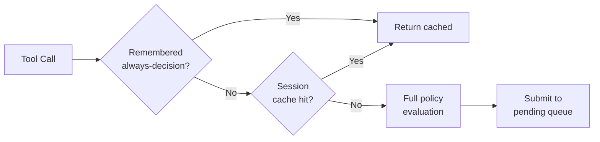

# Kernel (Core Engine) — librefang-kernel-src

# librefang-kernel — Core Engine

The kernel crate implements the central runtime services that all other LibreFang components build on: agent identity management, execution approval gating, authentication/authorization, configuration loading, and lifecycle orchestration. Everything else in the daemon either calls into or is configured by this crate.

## Architecture Overview

```mermaid
graph TD
    subgraph "Approval Path"
        A[Tool Invocation] --> B{Policy Check}
        B -->|Trusted sender| C[Auto-approve]
        B -->|Channel allow rule| C
        B -->|Remembered "always allow"| C
        B -->|Session cache hit| C
        B -->|Requires approval| D[Submit Request]
        D --> E[UI / ACP / Dashboard]
        E --> F[Resolve]
        F --> G[Execute or Deny]
    end
    subgraph "Identity Path"
        H[Agent Spawn] --> I[register_if_absent]
        I --> J[TOML Persist]
        H --> K[Agent Kill]
        K -->|purge_identity=false| L[Entry retained]
        K -->|purge_identity=true| M[purge + Persist]
    end
```

---

## Agent Identity Registry

**File:** `agent_identity_registry.rs`

### Purpose

Agent identity must survive process restarts. When an agent panics, its manifest reloads, or an operator kills and respawns it, every downstream resource—sessions, memories, cron jobs—is keyed on the agent's UUID. Generating a fresh UUID on each spawn silently orphans all of that data.

The registry persists `agent_name → canonical_uuid` mappings independently of the main SQLite agent store so that a respawn reuses the same `AgentId`.

### Key Design Decisions

**First-write-wins.** `register_if_absent` never overwrites an existing mapping. If the UUID derivation algorithm changes (namespace bump, name normalization), existing agents keep their original UUID rather than requiring a data migration.

**Delete vs. purge separation.** A normal `kill_agent` retains the registry entry—the next spawn of the same agent name lands on the same UUID. Only an explicit `?purge_identity=true` drops the entry, starting from a clean slate.

### Storage Format

A TOML file at `<home_dir>/agent_identities.toml`, written atomically (write to temporary file, fsync, rename). Not intended for hand-editing, but human-readable for emergency recovery:

```toml
[agents.nika]
canonical_uuid = "660bef7c-04d5-4480-8af2-0ce029981a14"
created_at = "2026-04-01T10:00:00Z"
```

### Concurrency Model

- A `DashMap` handles concurrent reads and inserts. The DashMap entries are the source of truth for the running process.
- A separate `Mutex` serializes on-disk writes so two concurrent `register` calls never produce an interleaved file.
- Persistence failures are logged but do not fail the in-memory write—the in-memory map is authoritative for the running process.

### Core API

| Method | Behavior |
|--------|----------|
| `AgentIdentityRegistry::load(home_dir)` | Loads existing TOML or starts empty. Load errors are logged and treated as empty—the file is never overwritten on load. |
| `AgentIdentityRegistry::in_memory()` | Empty registry with no persistence (test helper). |
| `register_if_absent(name, uuid)` | Inserts if absent, returns the canonical UUID (existing or new). Persists on insert. |
| `get(name)` | Returns the canonical `AgentId` for the name, if recorded. |
| `purge(name)` | Removes the entry, persists, returns the dropped UUID. |
| `list()` | Snapshot as a `BTreeMap` (deterministic key order). |
| `persist()` | Atomic write of current state to disk. No-op when no persist path. |

### Error Handling Philosophy

- **Load failure:** Log a warning, start with an empty in-memory map, and leave the malformed file on disk untouched. The operator can investigate and recover manually.
- **Persist failure:** Log a warning, retain the in-memory entry. The kernel prefers in-memory correctness over failing a registration because the disk is momentarily wedged.

---

## Approval Manager

**File:** `approval.rs`

### Purpose

Gates dangerous tool invocations behind human approval. Tools like `shell_exec`, `file_write`, `file_delete`, and `apply_patch` are flagged as requiring explicit approval before execution. The approval manager handles the full lifecycle: policy evaluation, request queuing, escalation on timeout, second-factor verification (TOTP), persistence across daemon restarts, and audit logging.

### Core Concepts

#### Approval Policies

`ApprovalPolicy` (from `librefang_types::approval`) defines:

- **`require_approval`** — glob patterns for tools that need approval (`"shell_exec"`, `"file_*"`, `"skill_evolve_*"`).
- **`trusted_senders`** — sender IDs that bypass all approval checks.
- **`channel_rules`** — per-channel allow/deny lists that override the default policy.
- **`timeout_fallback`** — what happens on timeout: `Escalate` (re-notify with longer timeout, up to 3 rounds), `Skip`, or `TimedOut`.
- **`second_factor`** — `Totp` or `None`.
- **`totp_grace_period_secs`** — seconds after a successful TOTP verification before the next approval requires TOTP again.
- **`cache_approvals_per_session`** — when `true`, approving a tool once in a chat session auto-approves future calls of that same tool.

#### Two Submission Paths

1. **Blocking** (`request_approval`) — the agent loop awaits a `oneshot` channel. Used by the synchronous approval flow. On timeout, the request escalates or resolves based on policy.

2. **Deferred** (`submit_request`) — returns immediately with a UUID. The `DeferredToolExecution` payload is stored and returned atomically on resolution. Used by the tool execution pipeline so the agent loop is not blocked.

#### Resolution

`resolve()` is called by the API/UI/ACP when a human makes a decision. It:
- Removes the pending request from the in-memory map and the persistent database.
- Fires the `oneshot` sender (blocking path) or returns the deferred payload (deferred path).
- Records the outcome in the recent history and the persistent audit log.
- Broadcasts an `ApprovalEvent` so all connected surfaces (TUI, dashboard, ACP) see the resolution even if they didn't initiate it.
- Optionally populates the per-session approval cache.

### Caching Layers

Three independent caches short-circuit the full approval flow:



1. **Remembered decisions** (`remembered: DashMap<(agent_id, tool_name), Decision>`) — populated when a user chooses "allow always" or "reject always" via the ACP permission UI. In-memory only; cleared on daemon restart.

2. **Per-session approvals** (`session_approvals: DashMap<(session_id, tool_name), ()>`) — once a user approves a tool in a chat session, subsequent calls auto-approve. Controlled by `policy.cache_approvals_per_session`. Not populated when the deferred call has `force_human=true` (RBAC M3 per-call approval requirement).

3. **TOTP grace period** (`totp_grace: HashMap<user_id, Instant>`) — after a successful TOTP verification, subsequent approvals within the grace window skip TOTP.

### TOTP and Security

#### Verification Flow

1. `check_and_record_totp_failure` atomically checks lockout status and records failures under a single mutex, eliminating the TOCTOU race (#3584).
2. After `TOTP_MAX_FAILURES` (5) consecutive failures, the sender is locked out for `TOTP_LOCKOUT_SECS` (300 seconds).
3. A successful verification resets the failure counter and starts the grace period.
4. TOTP codes are checked for replay within a 60-second window using SHA-256 hashes stored in `totp_used_codes`.

#### Persistence

Lockout state (`sender_id → (failure_count, locked_at)`) is persisted to `totp_lockout` in SQLite so it survives daemon restarts. On load, entries whose lockout window has already expired are discarded. If the database write fails, `record_totp_failure` returns `Err(())` — callers must reject the request fail-secure.

#### Recovery Codes

Two formats supported:
- **Current:** `XXXX-XXXX-XXXX-XXXX` (16 hex characters, 64 bits of entropy from OsRng)
- **Legacy:** `DDDD-DDDD` (8 decimal digits, backward compatibility)

`verify_recovery_code` uses constant-time comparison (`subtle::ConstantTimeEq`) across all stored codes to prevent timing side-channels (#3591).

### Persistence and Crash Recovery

When constructed with `new_with_db`, the approval manager:

- Persists every new pending request to `pending_approvals` in SQLite **before** inserting it into the in-memory map. This ensures the entry survives a daemon crash (#3611).
- On restart, `restore_pending_approvals` reloads surviving entries. Restored entries have no live `oneshot::Sender`, so they surface in the dashboard as "needs operator action."
- The deferred payload is serialized as JSON into `pending_approvals.deferred_payload`. On restore, the kernel cross-checks the payload's `agent_id`, `tool_name`, and `session_id` against the row's separate columns — a local writer with SQLite access cannot retarget a deferred execution to a different agent or session (#3313 security review).

### Request Expiry

`expire_pending_requests` is called periodically (~10 seconds) by `spawn_approval_sweep_task`. It:

- Sweeps timed-out requests from the pending map.
- Escalating requests get their `escalation_count` bumped and are re-inserted.
- Terminal requests are resolved, moved to recent history, and their deferred payloads returned for the kernel to execute.
- Piggybacks `gc_expired_totp_entries` to prune stale grace/failure entries, keeping those maps bounded by currently-relevant sender IDs rather than growing forever (#5144).

### Audit Logging

Every resolved request writes an `ApprovalAuditEntry` to `approval_audit` in SQLite. The `prune_audit(older_than_days)` method hard-deletes rows beyond the retention window (#3468). `query_audit` and `audit_count` support paginated, filtered queries for dashboard/API consumption.

### OAuth Nonce Replay Prevention

`is_oauth_nonce_used` / `record_oauth_nonce_used` track consumed OIDC state nonces (SHA-256 hashed) in `oauth_used_nonces` with a 1-hour window. Prevents replay of captured callback URLs from browser history or proxy logs.

### Broadcast Events

`subscribe()` returns a `broadcast::Receiver<ApprovalEvent>` with a 256-event buffer. The ACP adapter listens on this so editor-side permission requests fire instantly rather than polling `list_pending`. Slow consumers may see `Lagged` errors — they should re-sync via `list_pending` rather than treating the broadcast as the source of truth.

### Key Constants

| Constant | Value | Purpose |
|----------|-------|---------|
| `MAX_PENDING_PER_AGENT` | 5 | Rejects 6th+ concurrent request for the same agent |
| `MAX_RECENT_APPROVALS` | 100 | In-memory recent history ring buffer |
| `MAX_ESCALATIONS` | 3 | Escalation rounds before falling back to `TimedOut` |
| `TOTP_MAX_FAILURES` | 5 | Consecutive TOTP failures before lockout |
| `TOTP_LOCKOUT_SECS` | 300 | Lockout duration after max failures |

### Core API Summary

| Method | Path | Description |
|--------|------|-------------|
| `new(policy)` | — | In-memory only, no audit DB |
| `new_with_db(policy, pool)` | — | With persistent audit and crash recovery |
| `requires_approval(tool_name)` | Sync | Check against `require_approval` glob patterns |
| `requires_approval_with_context(tool, sender, channel)` | Sync | Full policy check with sender/channel overrides |
| `requires_approval_with_context_for(agent, tool, sender, channel)` | Sync | Agent-aware: consults remembered decisions first |
| `is_tool_denied_with_context_for(agent, tool, sender, channel)` | Sync | Checks remembered denials then channel policy |
| `request_approval(req)` | Async | Blocking: awaits resolution, handles escalation loop |
| `submit_request(req, deferred)` | Sync | Non-blocking: returns UUID immediately |
| `resolve(id, decision, decided_by, totp_verified, user_id)` | Sync | Resolves a pending request, returns deferred payload |
| `resolve_batch(ids, decision, decided_by)` | Sync | Batch resolve (no TOTP support) |
| `resolve_all_for_session(session_id, decision, decided_by)` | Sync | Resolve every pending request in a session |
| `expire_pending_requests()` | Sync | Sweep timed-out requests, return escalated/expired lists |
| `list_pending()` / `list_recent(n)` | Sync | Dashboard queries |
| `query_audit(limit, offset, filters)` | Sync | Paginated audit log query |
| `verify_totp(secret, code, issuer)` | Sync | TOTP code verification (RFC 6238, SHA-1, 30s step) |
| `check_and_record_totp_failure(sender_id)` | Sync | Atomic lockout check + failure record |
| `is_totp_code_used(code)` | Sync | Replay detection within 60s window |
| `record_totp_code_used_for(code, bound_to)` | Sync | Record used code, bind to action |
| `remember(agent, tool, decision)` | Sync | Cache an "always" decision |
| `recall(agent, tool)` | Sync | Retrieve a cached "always" decision |
| `has_session_approval(session, tool)` | Sync | Check per-session cache |
| `subscribe()` | Sync | Get broadcast receiver for `ApprovalEvent`s |

---

## Integration Points

### Boot Sequence

`AgentIdentityRegistry::load` is called during `boot_with_config` (`src/kernel/boot.rs`) with the daemon's home directory. The registry is shared across the kernel for all agent spawn/kill operations.

`ApprovalManager::new_with_db` is constructed with the SQLite connection pool during boot so pending approvals survive restarts.

### API Layer

The HTTP API routes (`librefang-api`) call into both components:
- Agent spawn/kill routes call `register_if_absent` and `purge` on the identity registry.
- Approval routes (`/api/approvals/*`) call `submit_request`, `resolve`, `list_pending`, `query_audit`, TOTP endpoints, and session-scoped resolution on the approval manager.
- Auth middleware calls `from_str_role` and `StaticRoleQuery` (in `auth.rs`) to map channel/sender context to RBAC roles.

### ACP Bridge

The Agent Communication Protocol adapter subscribes to `ApprovalEvent` via `subscribe()` for low-latency permission prompts in editor integrations, and records "always" decisions via `remember()`.

### Auto-Dream / Background Tasks

`spawn_approval_sweep_task` periodically calls `expire_pending_requests()` to drive escalation and timeout resolution for deferred requests.