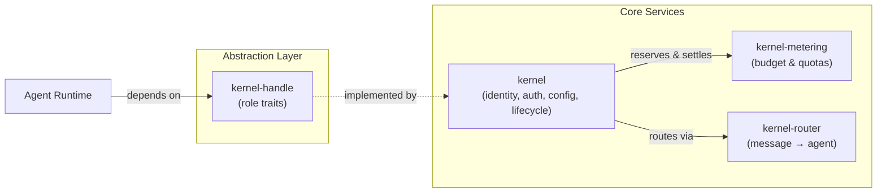

# Kernel (Core Engine)

# Kernel (Core Engine)

The kernel is the backbone of LibreFang. It provides the central runtime services — agent identity management, execution approval gating, authentication/authorization, configuration loading, and lifecycle orchestration — that every other component depends on. If another crate needs to know *who* is running, *whether* they're allowed, or *how much* it costs, it comes through the kernel.

## Sub-modules

| Crate | Responsibility |
|---|---|
| [librefang-kernel](librefang-kernel-src.md) | Main crate. Agent identity registry, approval gating, auth, config loading, and lifecycle orchestration. |
| [librefang-kernel-handle](librefang-kernel-handle-src.md) | Focused role traits (`ApprovalGate`, etc.) that decouple the agent runtime from the concrete kernel implementation. Replaces the former god-trait so callers only require the capabilities they use. |
| [librefang-kernel-metering](librefang-kernel-metering-src.md) | Budget tracking and enforcement across four axes (global, per-agent, per-provider, per-user). Uses an in-memory reservation ledger for pre-call gating and SQLite for settled spend. |
| [librefang-kernel-router](librefang-kernel-router-src.md) | Resolves incoming messages to the best-matching hand or template via keyword matching and optional embedding-based semantic similarity. |

## How They Fit Together

The **agent runtime** never touches the concrete kernel directly. It holds `Arc<dyn KernelHandle>` (or a narrower bound like `T: ApprovalGate`) from [kernel-handle](librefang-kernel-handle-src.md), keeping testability high and coupling low.

## Key Cross-Module Workflows

### 1. Incoming Message → Agent Selection

A user message arrives and the kernel asks [kernel-router](librefang-kernel-router-src.md) to resolve it. The router runs `auto_select_hand()` or `auto_select_template()`, combining keyword rules from `HAND.toml` files and `TEMPLATE_RULES` with optional embedding-based semantic scores for cross-lingual support. The selected hand or template is then dispatched by the kernel's lifecycle orchestrator.

### 2. Tool Invocation → Approval Gate

When an agent invokes a tool, the kernel's approval system checks policy: trusted senders, channel allow-rules, remembered "always allow" entries, and the session cache all lead to auto-approval. If none match, the request is submitted (returning a UUID immediately) and surfaces in the UI, ACP, or dashboard for human resolution. Callers interact with this through the `ApprovalGate` role trait from [kernel-handle](librefang-kernel-handle-src.md).

### 3. LLM Call → Budget Enforcement

Before any LLM dispatch, [kernel-metering](librefang-kernel-metering-src.md) reserves budget from its in-memory `CostReservationLedger`. After the call completes, the kernel settles the reservation and records the actual spend to the SQLite-backed usage store. If a provider cap is breached, a `ProviderExhaustionStore` is updated so downstream logic can skip that provider. This four-axis model (global / per-agent / per-provider / per-user) ensures no single actor can silently blow past quotas.

### 4. Agent Identity & Auth

The kernel's identity registry and auth module ([kernel](librefang-kernel-src.md)) are consulted throughout — routing decisions may depend on who the caller is, approval policies vary by role, and metering quotas are per-user. Role parsing (`from_str_role`) is shared with external routes like user persistence and budget management, keeping the auth model consistent across the daemon.