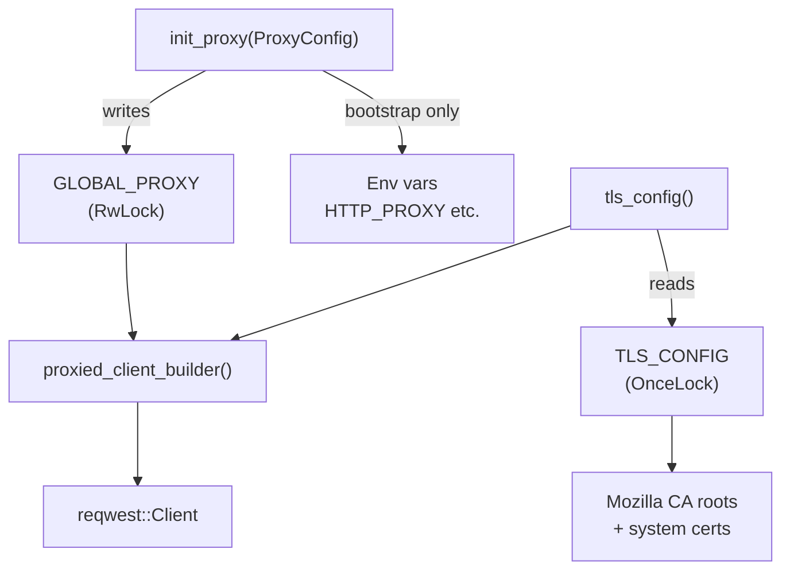

# Kernel Core — librefang-http-src

# librefang-http

Centralized HTTP client construction with proxy support and portable TLS trust roots.

All outbound HTTP traffic in librefang should flow through this crate's builder functions so that proxy settings and TLS configuration are applied uniformly. The crate solves two practical problems:

1. **Missing system CA certificates** — On musl-based Termux/Android, minimal Docker images, or corporate Linux with partial CA bundles, `reqwest`'s default TLS initialization panics. This crate bootstraps `rustls` with bundled Mozilla CA roots first, then layers in system certs if available.

2. **Scattered proxy configuration** — Rather than every consumer reading `HTTP_PROXY`/`HTTPS_PROXY` independently, proxy state is managed globally here and injected into every client at build time.

## Architecture



## Initialization

### TLS — `tls_config()`

Returns a cached `rustls::ClientConfig`. On first call it:

1. Seeds the root store with **bundled Mozilla CA roots** (`webpki_roots::TLS_SERVER_ROOTS`) — guarantees that common public CAs are always trusted.
2. Supplements with **system CA certificates** via `rustls_native_certs::load_native_certs()` — adds org-internal or self-signed CAs without requiring a librefang release.
3. Uses the `aws_lc_rs` crypto provider with safe default protocol versions.

The result is stored in a `OnceLock` and cloned on subsequent calls. Callers never need to worry about initialization ordering.

### Proxy — `init_proxy(cfg: ProxyConfig)`

Call once at daemon startup with the `[proxy]` section from `config.toml`. Can be called again during hot-reload — the `RwLock` guard is updated in place.

**Environment variable export** happens only during the initial bootstrap call (when `GLOBAL_PROXY` is still `None`). This is critical because `std::env::set_var` is inherently racy in a multi-threaded process. By restricting env-var writes to the synchronous bootstrap phase before the Tokio runtime spawns worker threads, the unsoundness is avoided. Subsequent hot-reload calls update `GLOBAL_PROXY` only.

Exported variables: `HTTP_PROXY`, `http_proxy`, `HTTPS_PROXY`, `https_proxy`, `NO_PROXY`, `no_proxy`.

Proxy URLs are validated with `is_valid_proxy_url` — accepted schemes are `http://`, `https://`, `socks5://`, and `socks5h://`. Invalid URLs trigger a `tracing::warn!` with the redacted value and are silently skipped.

## Client Builder Functions

### Primary entry points

| Function | Returns | Use when |
|---|---|---|
| `proxied_client_builder()` | `reqwest::ClientBuilder` | You need to customize timeouts, headers, or other options before building |
| `proxied_client()` | `reqwest::Client` | You just need a ready-to-use client with global proxy + TLS |
| `proxied_client_fallback()` | `reqwest::Client` | A per-provider proxy override failed and you need a safe fallback with a hard 300s total timeout |
| `proxied_client_with_override(url)` | `Result<reqwest::Client>` | A specific provider requires its own proxy, ignoring the global config |

### Backward-compatible aliases

- `client_builder()` → `proxied_client_builder()`
- `new_client()` → `proxied_client()`

### Core builder — `build_http_client(proxy: &ProxyConfig)`

The implementation shared by all public builders. Creates a `reqwest::ClientBuilder` with:

- **TLS**: preconfigured via `tls_config()` (bundled Mozilla roots + system certs).
- **User-Agent**: `librefang/<version>`.
- **Connect timeout**: 30 seconds — caps TCP/TLS handshake even on slow international links.
- **Read timeout**: 300 seconds — per-read inactivity timeout, not total request time. Streaming LLM responses keep this alive as long as tokens trickle in; a true upstream stall fires it.

Proxy application follows a deliberate strategy: only explicit `ProxyConfig` values are set on the builder. When fields are `None`, reqwest's built-in env-var detection (`HTTP_PROXY`, `HTTPS_PROXY`, `NO_PROXY`) provides the fallback. This avoids double-applying proxy settings that `init_proxy` already exported.

## Proxy Resolution Logic

```
┌─────────────────────────────────────────────────┐
│  build_http_client(proxy_config)                │
│                                                 │
│  http_proxy set in config?                      │
│    YES → Proxy::http(url) + NoProxy filter      │
│    NO  → reqwest reads HTTP_PROXY env var       │
│                                                 │
│  https_proxy set in config?                     │
│    YES → Proxy::https(url) + NoProxy filter     │
│    NO  → reqwest reads HTTPS_PROXY env var      │
│                                                 │
│  no_proxy set in config?                        │
│    YES → attached to both proxies above         │
│    NO  → no filter applied                      │
└─────────────────────────────────────────────────┘
```

The `no_proxy` filter is built once from the config string via `reqwest::NoProxy::from_string` and cloned to both HTTP and HTTPS proxies. Invalid proxy URLs produce a `tracing::warn!` (with the redacted URL) and are skipped — the client is still built, just without that proxy.

## Thread Safety

| Resource | Type | Safety model |
|---|---|---|
| `TLS_CONFIG` | `OnceLock` | Write-once, lock-free reads afterward |
| `GLOBAL_PROXY` | `RwLock<Option<ProxyConfig>>` | Multiple concurrent readers; writer only during `init_proxy` |
| Env vars | Process-global | Written only during single-threaded bootstrap, never during hot-reload |

## Usage Patterns

### Typical startup sequence

```rust
// In main(), before spawning the Tokio runtime:
let proxy_config: ProxyConfig = config.proxy.clone();
librefang_http::init_proxy(proxy_config);

// Later, anywhere in the codebase:
let client = librefang_http::proxied_client();
let resp = client.get("https://api.example.com/health").send().await?;
```

### Per-provider proxy override

```rust
match librefang_http::proxied_client_with_override(&provider.proxy_url) {
    Ok(client) => client,
    Err(e) => {
        tracing::warn!("invalid proxy for provider {}: {e}", provider.id);
        librefang_http::proxied_client_fallback()
    }
}
```

### Customizing the builder

```rust
let client = librefang_http::proxied_client_builder()
    .timeout(std::time::Duration::from_secs(60))
    .default_headers(headers)
    .build()?;
```

## Integration Points

The crate is consumed throughout the codebase. Major callers include:

- **Provider health probes** — `probe_client` in `librefang-runtime/src/provider_health.rs` uses `proxied_client_builder()`.
- **OAuth flows** — `discover_oauth_metadata`, `poll_device_flow`, `start_device_flow`, `exchange_code_for_tokens_with_redirect_uri`, and other OAuth functions across `librefang-runtime-oauth` and `librefang-runtime-mcp`.
- **Plugin management** — `install_plugin_with_deps`, `plugin_update_check`, `plugin_registry_search`.
- **Media processing** — `whisper_transcribe`, `gemini_transcribe`, `elevenlabs_transcribe`.
- **Channel delivery** — `send_channel_test_message`, `cron_deliver_response`.
- **Image generation** — `generate_image`.
- **WASM host functions** — `host_net_fetch` in `librefang-runtime-wasm`.
- **CLI** — `librefang-cli` accesses `tls_config()` directly for its own client construction.