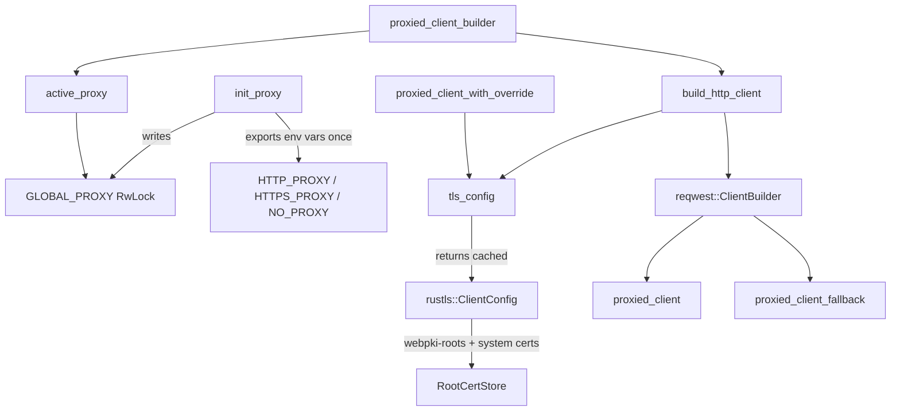

# Kernel Core — librefang-http-src

# librefang-http

Centralized HTTP client factory with proxy support and resilient TLS configuration.

Every outbound HTTP request in the kernel should go through this crate so that proxy settings and TLS roots are applied uniformly. Bypassing it risks certificate-validation failures on minimal hosts (Docker, Termux, musl) and inconsistent proxy routing.

## Architecture



## Initialization Sequence

At daemon startup, before the Tokio runtime spawns worker threads:

```rust
use librefang_http::init_proxy;
use librefang_types::config::ProxyConfig;

// Called once from synchronous bootstrap.
init_proxy(proxy_config_from_toml);
```

This does two things:

1. **Writes `GLOBAL_PROXY`** — a `RwLock<Option<ProxyConfig>>` that `proxied_client_builder()` reads on every call.
2. **Exports environment variables** — `HTTP_PROXY`, `HTTPS_PROXY`, `NO_PROXY` (and their lowercase equivalents) are set via `std::env::set_var`. This happens **only on the initial call** (when `GLOBAL_PROXY` is still `None`), because `set_var` is unsound in a multi-threaded context. Crates that build their own `reqwest::Client` (e.g. `librefang-channels`) rely on reqwest's built-in env-var detection, so these exports keep them consistent.

Subsequent calls (hot-reload) overwrite `GLOBAL_PROXY` but skip the env-var export.

## TLS Configuration

On systems without system CA certificates, reqwest's default TLS backend panics during initialization. This crate solves that by building a `rustls::ClientConfig` that:

1. **Always seeds with bundled Mozilla CA roots** (`webpki_roots::TLS_SERVER_ROOTS`) — ensures common public CAs are trusted everywhere.
2. **Supplements with system CA certificates** (`rustls_native_certs::load_native_certs`) — adds org-internal and self-signed CAs.

The config is built once and cached in a `OnceLock`. Access it via `tls_config()`, or more commonly, through any of the client builders which call it internally.

## Client Builders

### Primary entry points

| Function | Returns | Use when |
|---|---|---|
| `proxied_client()` | `reqwest::Client` | You need a ready client with global proxy settings |
| `proxied_client_builder()` | `reqwest::ClientBuilder` | You need to customize timeouts, headers, etc. before building |
| `proxied_client_fallback()` | `reqwest::Client` | A per-provider proxy override was invalid; enforces a 300 s total timeout as a safety net |
| `proxied_client_with_override(url)` | `Result<reqwest::Client>` | A provider has its own proxy URL that overrides the global config |

### Backward-compatible aliases

`client_builder()` → `proxied_client_builder()`  
`new_client()` → `proxied_client()`

### Lower-level

`build_http_client(&ProxyConfig)` — constructs a `ClientBuilder` from an explicit config rather than reading `GLOBAL_PROXY`. Prefer the higher-level functions unless you need this control.

## Proxy Resolution Logic

When `build_http_client` constructs a client:

- **Explicit `ProxyConfig` fields** (`http_proxy`, `https_proxy`, `no_proxy`) are applied directly to the builder.
- **`None` fields** are left unset, allowing reqwest's built-in env-var detection (`HTTP_PROXY`, `HTTPS_PROXY`, `NO_PROXY`) to provide the fallback.
- This avoids double-applying settings that `init_proxy` already exported as env vars.

Valid proxy URL schemes: `http://`, `https://`, `socks5://`, `socks5h://`. Invalid schemes are logged as warnings and skipped.

## Timeouts

All clients built through this crate carry sensible defaults:

| Timeout | Duration | Rationale |
|---|---|---|
| `connect_timeout` | 30 s | Caps TCP + TLS handshake; generous for slow international links to LLM providers |
| `read_timeout` | 300 s | Per-read inactivity timeout (not total request time). Streaming LLM responses keep it alive; a true upstream stall triggers it |
| `timeout` (fallback client) | 300 s | Total per-request budget; prevents a stuck upstream from wedging the agent loop |

Callers can override these on the `ClientBuilder` returned by `proxied_client_builder()`.

## User-Agent

All clients set `User-Agent: librefang/<version>` automatically, derived from `CARGO_PKG_VERSION`.

## Usage Across the Codebase

This crate is a leaf dependency consumed by nearly every subsystem that makes outbound HTTP calls:

- **OAuth flows** — `start_device_flow`, `poll_device_flow`, `refresh_access_token`, `discover_oauth_metadata`, `exchange_copilot_token`
- **LLM provider health** — `probe_client`, `probe_model`, `probe_api_key`
- **Media understanding** — `whisper_transcribe`, `elevenlabs_transcribe`, `gemini_transcribe`
- **Tool execution** — `tool_web_fetch_legacy`, `tool_web_search_legacy`, `tool_location_get`, `host_net_fetch`
- **Plugin management** — `install_plugin_with_deps`, `plugin_registry_search`, `plugin_update_check`
- **Webhooks and channels** — `test_webhook`, `send_channel_test_message`, `cron_deliver_response`
- **API surfaces** — `sync_dashboard`, `resolve_url_attachments`

## Thread Safety Notes

- `GLOBAL_PROXY` uses `RwLock` — readers (via `active_proxy`) are never blocked by each other; only hot-reload writes take a write lock briefly.
- `TLS_CONFIG` uses `OnceLock` — lock-free after first initialization.
- `std::env::set_var` is confined to the single-threaded bootstrap phase. The `is_initial` guard in `init_proxy` ensures it never runs after worker threads exist.