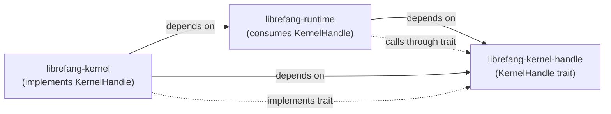

# Kernel Core — librefang-kernel-handle-src

# Kernel Handle (`librefang-kernel-handle`)

## Purpose

This crate defines the `KernelHandle` trait — the callback interface that allows agents to interact with the kernel and with each other at runtime. It exists specifically to **break a circular dependency**: `librefang-kernel` depends on `librefang-runtime` to drive agent loops, but those agent loops need to call back into the kernel for operations like spawning agents, sending messages, managing memory, and posting tasks.

The solution: the kernel implements `KernelHandle` and injects it into the agent loop. The runtime never imports the kernel directly — it only depends on this trait crate.

## Architecture

The kernel creates a concrete implementor of `KernelHandle`, passes it into `run_agent_loop_streaming` / `run_agent_loop`, and the runtime's tool runner and agent loop invoke trait methods to perform inter-agent operations.

## `AgentInfo`

A simple data struct returned by discovery methods (`list_agents`, `find_agents`):

| Field | Type | Description |
|---|---|---|
| `id` | `String` | Agent UUID |
| `name` | `String` | Human-readable name |
| `state` | `String` | Current lifecycle state |
| `model_provider` | `String` | LLM provider (e.g. `"openai"`) |
| `model_name` | `String` | Model identifier |
| `description` | `String` | Agent purpose description |
| `tags` | `Vec<String>` | Classification tags |
| `tools` | `Vec<String>` | Tool names available to the agent |

## `KernelHandle` Trait

The trait is `async_trait`-based, requiring `Send + Sync`. Methods fall into several functional groups. Many have **default implementations** that return errors or no-ops — this allows partial implementations in tests and stubs while the full kernel overrides everything.

### Agent Lifecycle

| Method | Sync/Async | Default | Description |
|---|---|---|---|
| `spawn_agent(manifest_toml, parent_id)` | async | — | Spawn a new agent from a TOML manifest. `parent_id` tracks lineage. Returns `(agent_id, agent_name)`. |
| `spawn_agent_checked(manifest_toml, parent_id, parent_caps)` | async | delegates to `spawn_agent` | Like `spawn_agent` but the kernel **must verify** that every capability in the child manifest is covered by `parent_caps`. |
| `list_agents()` | sync | — | Return all running agents. |
| `find_agents(query)` | sync | — | Case-insensitive search on name substring, tag, or tool name. |
| `kill_agent(agent_id)` | sync | — | Terminate an agent by ID. |
| `send_to_agent(agent_id, message)` | async | — | Send a message to another agent and return its response. |
| `touch_heartbeat(agent_id)` | sync | no-op | Refresh `last_active` to prevent heartbeat false-positives during long LLM calls. Called by the agent loop at each iteration. |
| `fire_agent_step(agent_id, step)` | sync | no-op | Fire an `agent:step` external hook event at the start of each loop iteration. |

### Inter-Agent Messaging

`send_to_agent` is the core primitive. The runtime's `tool_agent_send` reads `max_agent_call_depth()` to enforce a recursion guard before invoking it.

### Shared Memory

All memory methods accept an optional `peer_id` for namespace isolation — when provided, keys are scoped to that peer so different users of the same agent get independent memory.

| Method | Description |
|---|---|
| `memory_store(key, value, peer_id)` | Store a JSON value. |
| `memory_recall(key, peer_id)` | Retrieve a value, returns `None` if missing. |
| `memory_list(peer_id)` | List all keys in the namespace. |

### Task Queue

A cooperative task board for agents:

| Method | Async | Description |
|---|---|---|
| `task_post(title, description, assigned_to, created_by)` | yes | Create a task, returns task ID. |
| `task_claim(agent_id)` | yes | Claim the next available task. |
| `task_complete(agent_id, task_id, result)` | yes | Mark a task done. |
| `task_list(status)` | yes | List tasks, optionally filtered by status. |
| `task_delete(task_id)` | yes | Delete a task. |
| `task_retry(task_id)` | yes | Reset a task to pending for retry. |

### Knowledge Graph

| Method | Description |
|---|---|
| `knowledge_add_entity(entity)` | Add an `Entity` node. |
| `knowledge_add_relation(relation)` | Add a `Relation` edge. |
| `knowledge_query(pattern)` | Query with a `GraphPattern`, returns `GraphMatch` results. |

Uses types from `librefang_types::memory`.

### Event Publishing

- **`publish_event(event_type, payload)`** — Publish a custom event that can trigger proactive agents.

### Approval System

The approval flow is a two-phase design: agents submit tool executions for approval, and external users/admins resolve them.

| Method | Default | Description |
|---|---|---|
| `requires_approval(tool_name)` | `false` | Simple policy check. |
| `requires_approval_with_context(tool_name, sender_id, channel)` | delegates to `requires_approval` | Context-aware policy check. |
| `is_tool_denied_with_context(tool_name, sender_id, channel)` | `false` | Hard-deny check before approval flow. |
| `request_approval(agent_id, tool_name, action_summary, session_id)` | returns `Approved` | **Blocking** approval request. |
| `submit_tool_approval(agent_id, tool_name, action_summary, deferred, session_id)` | error | **Non-blocking** submit, returns `ToolApprovalSubmission` immediately. |
| `resolve_tool_approval(request_id, decision, decided_by, totp_verified, user_id)` | error | Resolve a pending request, returns the `DeferredToolExecution` payload if approved. |
| `get_approval_status(request_id)` | `None` | Poll current decision state. |

The API routes (`approve_request`, `reject_request`, `modify_request` in `src/routes/system.rs`) call `resolve_tool_approval` to finalize decisions.

### Hands System

Hands are specialized autonomous agents managed through this interface:

| Method | Description |
|---|---|
| `hand_list()` | List available Hands and activation status. |
| `hand_install(toml_content, skill_content)` | Install a new Hand. |
| `hand_activate(hand_id, config)` | Spawn a Hand's agent. |
| `hand_status(hand_id)` | Get dashboard metrics. |
| `hand_deactivate(instance_id)` | Stop a running Hand. |

All default to errors — only kernels with the Hands subsystem override these.

### Cron / Scheduling

| Method | Description |
|---|---|
| `cron_create(agent_id, job_json)` | Schedule a recurring job. |
| `cron_list(agent_id)` | List jobs for an agent. |
| `cron_cancel(job_id)` | Cancel a job. |

These are used by both the tool runner (`tool_schedule_create`, `tool_cron_list`, etc.) and the workflow routes.

### Channel Messaging

Agents can send messages, media, files, and polls through channel adapters (Telegram, Email, etc.):

- **`send_channel_message(channel, recipient, message, thread_id, account_id)`** — Text messages.
- **`send_channel_media(channel, recipient, media_type, media_url, caption, filename, thread_id, account_id)`** — Images or files by URL.
- **`send_channel_file_data(channel, recipient, data, filename, mime_type, thread_id, account_id)`** — Raw bytes (used when `file_path` is provided to the `channel_send` tool).
- **`send_channel_poll(channel, recipient, question, options, is_quiz, correct_option_id, explanation, account_id)`** — Interactive polls/quizzes.

All accept optional `thread_id` for reply threading and `account_id` for routing through a specific bot configuration.

### A2A (Agent-to-Agent External)

| Method | Default |
|---|---|
| `list_a2a_agents()` | empty vec |
| `get_a2a_agent_url(name)` | `None` |

Used by `tool_a2a_send` in the runtime to discover and message external agents.

### Prompt Versioning & Experiments

A suite of methods for tracking prompt changes and running A/B experiments:

**Prompt versions:** `get_prompt_version`, `list_prompt_versions`, `create_prompt_version`, `delete_prompt_version`, `set_active_prompt_version`, `auto_track_prompt_version`.

**Experiments:** `get_running_experiment`, `create_experiment`, `get_experiment`, `list_experiments`, `update_experiment_status`, `get_experiment_metrics`, `record_experiment_request`.

The agent loop calls `auto_track_prompt_version` during `build_prompt_setup` to detect system prompt changes, and `get_prompt_version` to load versioned prompts. Most experiment defaults are no-ops or empty results, with `create_*` / `delete_*` methods defaulting to errors.

### Goals

| Method | Description |
|---|---|
| `goal_list_active(agent_id)` | List pending/in-progress goals, optionally filtered by agent. |
| `goal_update(goal_id, status, progress)` | Update a goal's status and/or progress percentage. |

### Workflows

- **`run_workflow(workflow_id, input)`** — Execute a workflow by UUID or name. Returns `(run_id, output)`. Used by `tool_workflow_run` and workflow integration tests.

### Forked Agent Execution

- **`run_forked_agent_oneshot(agent_id, prompt, allowed_tools)`** — A primitive for "structured-output via forked call." The fork shares the parent turn's `(system + tools + messages)` prefix for prompt cache alignment with Anthropic. Key properties:
  - Fork messages do **not** persist into the agent's canonical session.
  - The turn-end hook fires with `is_fork: true` to prevent recursive auto-dream.
  - `allowed_tools = Some(vec![])` forces a single-turn text response (no tool calls).
  - Defaults to error — only kernels implementing full streaming override this.

### Configuration Accessors

| Method | Default | Description |
|---|---|---|
| `tool_timeout_secs()` | `120` | Maximum seconds a tool execution may run. Consumed by `execute_single_tool_call`. |
| `max_agent_call_depth()` | `5` | Maximum inter-agent call nesting. Checked by `tool_agent_send` before `send_to_agent`. |

## Design Patterns

### Default Method Strategy

Most methods have conservative defaults: sync methods return empty data or `false`, async methods return descriptive errors like `"Cron scheduler not available"`, and configuration accessors return safe constants. This serves two purposes:

1. **Test stubs** can implement only the methods they need.
2. **Feature-gated kernels** can omit entire subsystems without compilation errors.

The kernel implementation overrides every method it actually supports.

### Internal Delegation

Two methods delegate internally within the trait:

- `spawn_agent_checked` → `spawn_agent` (no-op enforcement by default; the real kernel overrides with capability checking)
- `requires_approval_with_context` → `requires_approval` (adds sender/channel context by default)

### Dependency Direction

`librefang-kernel-handle` has **no outgoing crate dependencies** beyond `async_trait`, `serde_json`, `uuid`, and `librefang_types`. It never imports the kernel or runtime. This keeps the interface crate lightweight and ensures the dependency graph stays acyclic.

## Adding New Methods

When adding a new kernel capability that agents need to access:

1. Add the method to the `KernelHandle` trait with a conservative default implementation.
2. Override it in the kernel's concrete implementation.
3. Add a corresponding tool in `librefang-runtime/src/tool_runner.rs` that calls through the trait.
4. Ensure the method signature uses borrowed arguments (`&str`, `Option<&str>`) where possible to avoid unnecessary allocations on the hot path.