# Kernel Core — librefang-kernel-handle-src

# Kernel Handle — `librefang-kernel-handle`

Role-trait surface for the agent runtime ↔ kernel seam.

## Purpose

This crate defines the abstract interface that the agent runtime uses to interact with the LibreFang kernel. Rather than coupling the runtime to a concrete kernel type, every operation crosses this trait boundary — agent lifecycle, memory, task queues, channel adapters, approval gates, and more.

```mermaid
graph TD
    KH["KernelHandle<br/>(supertrait alias)"]
    KH --> AC[AgentControl]
    KH --> MA[MemoryAccess]
    KH --> WA[WikiAccess]
    KH --> TQ[TaskQueue]
    KH --> EB[EventBus]
    KH --> KG[KnowledgeGraph]
    KH --> CC[CronControl]
    KH --> AG[ApprovalGate]
    KH --> HC[HandsControl]
    KH --> A2A[A2ARegistry]
    KH --> CS[ChannelSender]
    KH --> PS[PromptStore]
    KH --> WR[WorkflowRunner]
    KH --> GC[GoalControl]
    KH --> TP[ToolPolicy]
    KH --> AA[ApiAuth]
    KH --> SW[SessionWriter]
    KH --> AFB[AcpFsBridge]
    KH --> ATB[AcpTerminalBridge]
    KH --> CQ[CatalogQuery]
```

Historically this was a single `KernelHandle` god-trait with 50+ methods mixing 14 unrelated domains (issue #3746). The current design splits that into **19 focused role traits**, each covering one capability domain. `KernelHandle` survives as a supertrait alias with a blanket impl so the existing 117+ call sites taking `Arc<dyn KernelHandle>` keep working unchanged.



## Error Handling

All trait methods return [`KernelResult<T>`], an alias for `Result<T, KernelOpError>`. `KernelOpError` re-exports `librefang_types::error::LibreFangError` — the canonical structured error enum shared across runtime, kernel, and API layers (issue #3541). This means callers can pattern-match directly on variants (`AgentNotFound`, `CapabilityDenied`, `Unavailable`, etc.) instead of substring-matching error strings.

```rust
use librefang_kernel_handle::KernelResult;

async fn do_work(kernel: &dyn AgentControl) -> KernelResult<String> {
    kernel.send_to_agent("agent-123", "hello").await
}
```

## Role Traits

### AgentControl — Agent Lifecycle & Inter-Agent Communication

Spawning, killing, listing, and messaging agents. Key methods:

| Method | Purpose |
|--------|---------|
| `spawn_agent` | Create an agent from a TOML manifest |
| `spawn_agent_checked` | Create with capability inheritance enforcement (parent caps must cover child caps) |
| `send_to_agent` / `send_to_agent_as` | Inter-agent messaging; `_as` variant records parent for cancel-cascade (issue #3044) |
| `run_forked_agent_oneshot` | Forked single-turn call used for structured output via prompt-cache-aligned LLM calls |
| `touch_heartbeat` | Prevent heartbeat false-positives during long LLM calls |
| `max_agent_call_depth` | Config-sourced inter-agent call depth limit (default: 5) |

### MemoryAccess — Shared Cross-Agent Memory

Key-value store with optional per-peer namespace isolation and RBAC ACL resolution (issue #3054 Phase 2):

- `memory_store` / `memory_recall` / `memory_list` — CRUD with optional `peer_id` scoping
- `memory_acl_for_sender` — Resolves per-user `UserMemoryAccess` for RBAC gating; returns `None` when RBAC is disabled

### WikiAccess — Durable Markdown Knowledge Vault

Targets the `librefang-memory-wiki` vault (issue #3329). All results cross the seam as `serde_json::Value` to avoid a dependency on the wiki crate:

- `wiki_get` — Fetch a page; returns `Unavailable` when vault is disabled, `NotFound` when topic missing
- `wiki_search` — Case-insensitive substring search; topic-name hits outrank body hits
- `wiki_write` — Write with monotonic provenance and optional conflict detection (`force = false` refuses silent overwrites when on-disk content has drifted)

### TaskQueue — Shared Task Queue

Full task lifecycle: `task_post`, `task_claim`, `task_complete`, `task_list`, `task_delete`, `task_retry`, `task_get`, `task_update_status`.

### EventBus — Fire-and-Forget Custom Events

Single method: `publish_event`. Used for proactive agent triggers.

### KnowledgeGraph — Entity/Relation Graph

- `knowledge_add_entity` / `knowledge_add_relation` — Takes arguments by reference so callers that may retry avoid forced moves (issue #3553)
- `knowledge_query` — Pattern-based graph query returning `GraphMatch` results

### CronControl — Agent-Owned Scheduled Jobs

`cron_create`, `cron_list`, `cron_cancel`. All default to `Unavailable` when the cron scheduler is not wired.

### ApprovalGate — Approval Policy & Deferred Tool Execution

The most complex role trait. Covers:

- `requires_approval` / `requires_approval_with_context` — Policy checks, optionally scoped to sender + channel
- `is_tool_denied_with_context` — Hard deny check per sender/channel
- `resolve_user_tool_decision` — RBAC M3 gate (issue #3054 Phase 2); returns `Allow`, `Deny`, or `NeedsApproval`
- `request_approval` — Blocking approval request
- `submit_tool_approval` — Non-blocking submission returning a UUID immediately, paired with a `DeferredToolExecution` payload
- `resolve_tool_approval` — Resolve a pending request, returning the deferred payload for replay
- `get_approval_status` — Poll current status

### HandsControl — Specialized Agent (Hand) Lifecycle

Install, activate, deactivate, and query status of Hands — autonomous specialized agents. All methods default to `Unavailable`.

### A2ARegistry — External A2A Agent Directory

Read-only discovery of external A2A (Agent-to-Agent) agents: `list_a2a_agents`, `get_a2a_agent_url`.

### ChannelSender — Outbound Channel Adapters

Send text, media, files, and polls through channel adapters (Telegram, Email, etc.):

- `send_channel_message` / `send_channel_media` / `send_channel_file_data` / `send_channel_poll`
- `roster_upsert` / `roster_members` / `roster_remove_member` — Group roster management
- `resolve_channel_owner` — Maps a `(channel, chat_id)` pair to the owning `AgentId`

`send_channel_file_data` takes `bytes::Bytes` so wrapping layers (metering, retry, fan-out) can clone the handle cheaply instead of copying the underlying buffer (issue #3553).

### PromptStore — Prompt Versioning & Experiments

Full CRUD for prompt versions and A/B experiments: `create_prompt_version`, `set_active_prompt_version`, `list_prompt_versions`, `create_experiment`, `update_experiment_status`, `get_experiment_metrics`, `auto_track_prompt_version`, etc.

### WorkflowRunner — Declarative Workflow Execution

- `run_workflow` — Synchronous (blocking) execution, returns `(run_id, output)`
- `start_workflow_async` — Fire-and-forget, returns `run_id` immediately
- `cancel_workflow_run` — Cancel a running or paused workflow
- `get_workflow_run` / `list_workflows` — Status queries

### GoalControl — Agent Goals

`goal_list_active` and `goal_update` for managing agent goal state.

### ToolPolicy — Read-Side Tool & Workspace Configuration

Pure read-side surface used by the runtime to parameterize tool execution:

| Method | Purpose |
|--------|---------|
| `tool_timeout_secs` / `tool_timeout_secs_for` | Global and per-tool timeout (glob matching supported) |
| `skill_env_passthrough_policy` | Operator gate over skill `env_passthrough` requests |
| `readonly_workspace_prefixes` | Paths where writes are denied |
| `named_workspace_prefixes` | Full workspace allowlist with access modes |
| `channel_file_download_dir` | Directory bridges write attachments to |
| `effective_upload_dir` | Directory for runtime-generated uploads |

### ApiAuth — Raw Auth Config Snapshots

Returns `ApiAuthSnapshot` — a one-shot, self-contained snapshot of every auth-relevant config field (`api_key`, dashboard credentials, device keys, per-user entries) from a single config load. This prevents middleware from mixing pre-reload and post-reload config during hot-reload races.

### SessionWriter — Pre-Inject Session Content

Used by the HTTP attachment upload path (issue #3744) and channel-send message mirroring:

- `inject_attachment_blocks` — Insert `ContentBlock`s as a User-role message before the next LLM turn
- `append_to_session` — Append a message to an existing session

Both are **blocking I/O** (SQLite writes under the hood). Callers inside async contexts must wrap in `tokio::task::spawn_blocking` until issue #3579 lands.

### AcpFsBridge / AcpTerminalBridge — Editor-Backed File I/O & Terminal

Route `fs/*` and `terminal/*` operations through an attached ACP editor (issue #3313) instead of the agent's local filesystem:

- `AcpFsClient` / `AcpTerminalClient` — Object-safe client traits implemented by `librefang-acp`
- `register_acp_fs_client` / `register_acp_terminal_client` — Bind a client to a session
- `acp_read_text_file` / `acp_write_text_file` / `acp_run_terminal_command` — Convenience dispatchers

Runtime tools should treat `Unavailable` as "fall back to local fs/process spawning", not as a hard error.

### CatalogQuery — Model Catalog Metadata

Read-side projection for model-catalog lookups. Currently surfaces `reasoning_echo_policy_for(model)` so the OpenAI-compatible driver can dispatch the correct wire shape for `reasoning_content` without substring matching (issue #4842).

## Using Narrow Bounds

New code should express only the capabilities it needs:

```rust
// PREFER THIS — narrow bounds
fn approve_and_run<T: ApprovalGate + TaskQueue + Send + Sync>(kernel: &T) { ... }

// AVOID THIS — pulls in the full kernel surface
fn approve_and_run<T: KernelHandle>(kernel: &T) { ... }
```

Existing call sites using `Arc<dyn KernelHandle>` still compile because the blanket impl covers any type implementing all 19 role traits plus `Send + Sync`.

## Default Implementations

Many methods have defaults that return `Err(KernelOpError::unavailable(...))` or empty results. This is intentional — it allows test stubs and partial kernel implementations to compile without boilerplate. The real kernel overrides these with actual implementations. Missing capabilities surface as compile errors in the role-trait impl (not silent runtime failures), which was the core motivation for the split.

## Prelude

Glob-import the prelude to bring `KernelHandle` and every role trait into scope:

```rust
use librefang_kernel_handle::prelude::*;
```

This replaces the pre-#3746 pattern of importing only `KernelHandle`.