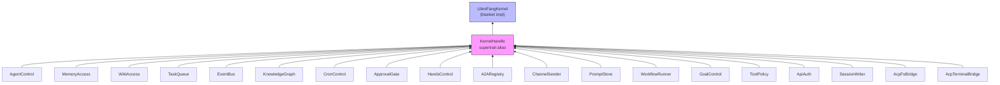

# Kernel Core — librefang-kernel-handle-src

# librefang-kernel-handle — Kernel Role Traits

## Purpose

This crate defines the **seam between the agent runtime and the kernel**: a set of role traits that express every capability the runtime needs from the kernel (agent lifecycle, memory, task queues, approvals, channel I/O, ACP bridges, etc.).

Prior to issue #3746, the entire surface was crammed into a single 50+ method `KernelHandle` god-trait. This crate now exposes **18 independent role traits** plus a `KernelHandle` supertrait alias that combines them all. Callers can express narrow bounds — `T: ApprovalGate` — instead of pulling the entire kernel surface into scope.

## Architecture



The blanket `impl KernelHandle for T` means any concrete type that implements all 18 role traits automatically satisfies `KernelHandle`. Existing `Arc<dyn KernelHandle>` call sites (117 at split time) keep working unchanged.

## Error Model

All trait methods return `KernelResult<T>`, an alias for `Result<T, KernelOpError>`:

```rust
pub use librefang_types::error::LibreFangError as KernelOpError;
pub type KernelResult<T> = Result<T, KernelOpError>;
```

`KernelOpError` is a re-export of the workspace's canonical `LibreFangError` enum. This gives callers structured pattern-matching across the runtime↔kernel seam instead of substring-matching on `String` errors:

```rust
match err {
    KernelOpError::AgentNotFound(_) => /* 404 */,
    KernelOpError::CapabilityDenied(_) => /* 403 */,
    KernelOpError::Unavailable(_) => /* 503 */,
    // ...
}
```

Use `KernelResult<T>` in all new method signatures rather than spelling out the full type.

## Role Trait Reference

### Agent Lifecycle & Communication

**`AgentControl`** *(async)* — Agent spawning, inter-agent messaging, listing, heartbeats, and forked one-shot calls.

| Method | Purpose |
|--------|---------|
| `spawn_agent` | Create an agent from a TOML manifest |
| `spawn_agent_checked` | Spawn with capability inheritance enforcement |
| `send_to_agent` | Send a message and await the response |
| `send_to_agent_as` | Send on behalf of a parent (enables cancel cascade) |
| `list_agents` | Return all running agents as `Vec<AgentInfo>` |
| `kill_agent` | Terminate an agent by ID |
| `find_agents` | Search by name, tag, or tool (case-insensitive) |
| `touch_heartbeat` | Refresh `last_active` during long LLM calls |
| `fire_agent_step` | Emit `agent:step` hook event |
| `run_forked_agent_oneshot` | Forked turn collapsing to a single text response |
| `max_agent_call_depth` | Config-derived inter-agent depth limit (default: 5) |

`spawn_agent_checked` defaults to delegating to `spawn_agent` without enforcement. The real kernel overrides this to verify every capability in the child manifest is covered by `parent_caps`.

`send_to_agent_as` has a default impl that falls back to `send_to_agent` with a trace-level log, so handles that don't support cancel cascading are discoverable at runtime.

`run_forked_agent_oneshot` errors by default. It exists for the proactive memory extractor: the fork shares the parent's prompt prefix for cache alignment rather than starting a cold `driver.complete()` call.

### Memory

**`MemoryAccess`** *(sync)* — Shared cross-agent key/value store with optional per-peer namespace isolation.

| Method | Notes |
|--------|-------|
| `memory_store` | Write a value; `peer_id` scopes the key namespace |
| `memory_recall` | Read a value; respects peer scoping |
| `memory_list` | List keys; respects peer scoping |
| `memory_acl_for_sender` | Resolve per-user RBAC ACL; returns `None` when RBAC is off |

**`WikiAccess`** *(sync)* — Durable markdown knowledge vault (`librefang-memory-wiki`). All methods default to `Unavailable` so stubs compile unchanged when the wiki feature is off.

| Method | Notes |
|--------|-------|
| `wiki_get` | Fetch a page as JSON; `not_found` vs `unavailable` |
| `wiki_search` | Substring search across page bodies |
| `wiki_write` | Write with `[[topic]]` cross-refs and monotonic provenance |

`wiki_write` with `force = false` refuses silent overwrites when the on-disk file has drifted (mtime or sha256), returning `KernelOpError::conflict(...)`. Provenance is append-only — the vault never overwrites the provenance list.

### Coordination

**`TaskQueue`** *(async)* — Shared task lifecycle: post, claim, complete, list, delete, retry, get, update status.

**`EventBus`** *(async)* — Fire-and-forget custom events for proactive agent triggers. Single method: `publish_event`.

**`KnowledgeGraph`** *(async)* — Entity/relation insert and pattern query. `knowledge_add_entity` and `knowledge_add_relation` take their arguments by reference so callers that may retry avoid forced moves.

**`CronControl`** *(async)* — Agent-owned scheduled jobs: `cron_create`, `cron_list`, `cron_cancel`. All default to `Unavailable`.

**`GoalControl`** *(sync)* — List active goals and update goal status/progress.

### Approval & Policy

**`ApprovalGate`** *(async + sync)* — Tool approval policy queries and the pending-approval lifecycle.

| Method | Notes |
|--------|-------|
| `requires_approval` | Simple policy check |
| `requires_approval_with_context` | Policy check with sender/channel context |
| `is_tool_denied_with_context` | Hard-deny check for sender/channel |
| `resolve_user_tool_decision` | Per-user RBAC gate → `Allow`/`Deny`/`NeedsApproval` |
| `request_approval` | Blocking approval wait |
| `submit_tool_approval` | Non-blocking submission with deferred payload |
| `resolve_tool_approval` | Resolve and retrieve deferred payload |
| `get_approval_status` | Poll current status |

`resolve_user_tool_decision` defaults to `Allow` to preserve pre-M3 behaviour for stubs and embedded callers without an `AuthManager`. The real kernel always overrides this.

**`ToolPolicy`** *(sync)* — Read-side configuration for tool execution: timeouts, env passthrough policy, workspace prefixes (read-only and named), channel file download directory, and upload directory.

Timeout resolution order for `tool_timeout_secs_for`:
1. Exact match in `config.tool_timeouts`
2. Longest glob match in `config.tool_timeouts`
3. Global `config.tool_timeout_secs`

### Agents & Hands

**`HandsControl`** *(async)* — Specialized agent ("Hand") lifecycle: list, install, activate, status, deactivate. All default to `Unavailable`.

**`A2ARegistry`** *(sync)* — Read-only directory of discovered external A2A agents. Returns `(name, url)` pairs.

### Channels & Messaging

**`ChannelSender`** *(async + sync)* — Outbound channel adapters for text, media, file data, and polls, plus group roster management.

| Method | Notes |
|--------|-------|
| `send_channel_message` | Text to a recipient via named adapter |
| `send_channel_media` | Image/file with optional caption |
| `send_channel_file_data` | Raw bytes (`bytes::Bytes` for zero-copy cloning) |
| `send_channel_poll` | Poll/quiz creation |
| `roster_upsert` / `roster_members` / `roster_remove_member` | Group roster CRUD |

All send methods accept `thread_id` and `account_id` for thread replies and multi-bot routing. File data uses `bytes::Bytes` to avoid buffer copies in wrapping layers (metering, retry, fan-out) — significant with the 10 MiB upload bump (#3514).

### Prompt Management

**`PromptStore`** *(sync)* — Prompt version CRUD, experiment lifecycle, metric recording, and auto-tracking of system prompt changes. Methods that accept owned types (`create_prompt_version`, `create_experiment`) take them by reference so callers keep a copy for response JSON without double-cloning.

### Workflow

**`WorkflowRunner`** *(async)* — Single method: `run_workflow`. Takes a workflow ID (UUID or name) and an input string; returns `(run_id, output)`.

### API Auth

**`ApiAuth`** *(sync)* — Single method returning an `ApiAuthSnapshot`:

```
ApiAuthSnapshot
├── api_key: String
├── dashboard: DashboardRawConfig { user, pass, pass_hash }
├── home_dir: PathBuf
├── device_api_keys: Vec<(device_id, api_key_hash)>
└── config_users: Vec<ApiUserConfigSnapshot>
```

Implementations must acquire all values from a single config snapshot so callers see a consistent view across hot-reload boundaries.

### Session Injection

**`SessionWriter`** *(sync)* — Pre-inject content blocks into an agent session before an LLM turn (used by HTTP attachment uploads). The production implementation calls `MemorySubstrate::save_session` synchronously (blocking SQLite write). Callers in async contexts should wrap in `tokio::task::spawn_blocking` until #3579 lands async substrate support.

### ACP Bridges

**`AcpFsBridge`** *(async + sync)* — Routes file I/O through an attached ACP editor instead of the local filesystem.

Client registration model:
- `register_acp_fs_client(session_id, client)` — called on editor connect
- `unregister_acp_fs_client(session_id)` — called on disconnect
- `acp_fs_client(session_id) → Option<Arc<dyn AcpFsClient>>` — lookup

Convenience methods `acp_read_text_file` and `acp_write_text_file` dispatch through the bound client, returning `Unavailable` when no editor is attached. Runtime tools should fall back to local fs in that case.

**`AcpTerminalBridge`** *(async + sync)* — Same registration model for terminal commands. `acp_run_terminal_command` runs a command through the editor's PTY (create → wait → output → release) and returns `AcpTerminalRunResult` with output, truncation flag, exit code, and signal.

**`AcpFsClient`** and **`AcpTerminalClient`** are object-safe traits implemented by `librefang-acp` handles. The kernel stores `Arc<dyn AcpFsClient>` / `Arc<dyn AcpTerminalClient>` per session.

## Data Types

### `AgentInfo`

```rust
pub struct AgentInfo {
    pub id: String,
    pub name: String,
    pub state: String,
    pub model_provider: String,
    pub model_name: String,
    pub description: String,
    pub tags: Vec<String>,
    pub tools: Vec<String>,
}
```

Returned by `list_agents` and `find_agents`.

### `AcpTerminalRunResult`

```rust
pub struct AcpTerminalRunResult {
    pub output: String,
    pub truncated: bool,
    pub exit_code: Option<i32>,
    pub signal: Option<String>,
}
```

## Usage Patterns

### Narrowing bounds on new code

Instead of accepting the full `KernelHandle`, express only what you need:

```rust
// Old (pulls in everything):
fn dispatch(h: &dyn KernelHandle) { ... }

// New (only what's needed):
fn dispatch(h: &dyn ApprovalGate) { ... }
fn tool_executor(h: &(dyn ToolPolicy + ApprovalGate)) { ... }
```

### Implementing test stubs

Role traits with default methods that return `Unavailable` or no-ops can be satisfied with an empty `impl`:

```rust
struct MyStub;
impl CronControl for MyStub {}        // all methods → Unavailable
impl ApprovalGate for MyStub {}       // requires_approval → false, etc.
impl ToolPolicy for MyStub {}         // tool_timeout_secs → 120, etc.
impl AcpFsBridge for MyStub {}        // register/unregister → no-op
```

Traits with required methods (`AgentControl`, `MemoryAccess`, `TaskQueue`, `EventBus`, `KnowledgeGraph`, `ApiAuth`, `SessionWriter`) need explicit stub implementations. Missing a required method is a compile error, not a silent runtime failure.

### Importing everything

```rust
use librefang_kernel_handle::prelude::*;
```

Brings in `KernelHandle`, all 18 role traits, and the associated data types.

## Default Implementation Strategy

Defaults that hide a missing capability behind `Err("X not available")` are preserved as-is to keep the role-trait split a pure structural refactor with zero behavior change. They are gathered onto the owning role trait so future PRs can tighten each contract independently — removing defaults one role at a time rather than landing 30+ removals atomically.