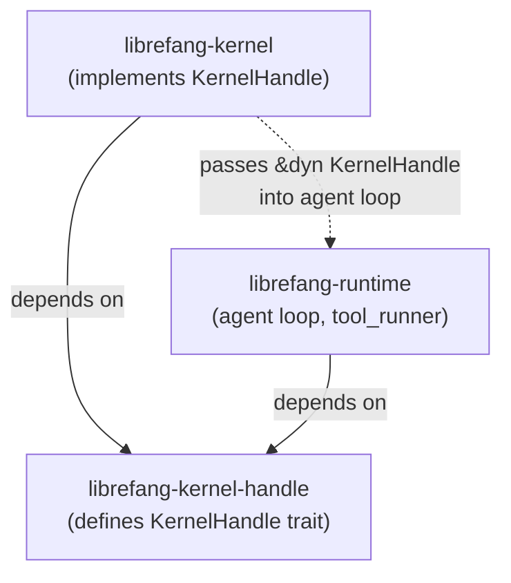

# Kernel Core — librefang-kernel-handle-src

# librefang-kernel-handle

The dependency-inversion layer that lets agents interact with the kernel without creating circular imports.

## Purpose

`librefang-runtime` drives the agent loop — processing LLM responses, executing tool calls, managing conversation state. Many of those tools need to reach back into the kernel: spawning child agents, reading shared memory, posting tasks, requesting human approval, and so on. But the kernel owns the runtime, so a direct `librefang-kernel → librefang-runtime → librefang-kernel` import cycle would be inevitable.

This crate breaks the cycle by defining `KernelHandle` — an `#[async_trait]` that enumerates every kernel operation an agent might need. The kernel implements the trait and injects it into the agent loop at startup. The runtime only depends on the trait, never on the kernel itself.



## Key Types

### `AgentInfo`

```rust
pub struct AgentInfo {
    pub id: String,
    pub name: String,
    pub state: String,
    pub model_provider: String,
    pub model_name: String,
    pub description: String,
    pub tags: Vec<String>,
    pub tools: Vec<String>,
}
```

Returned by `list_agents` and `find_agents`. Carries enough metadata for an agent to decide whether (and how) to interact with a peer.

### `KernelHandle` trait

The central abstraction. All methods are documented in source, but they fall into functional groups:

| Group | Methods | Sync / Async |
|---|---|---|
| **Agent lifecycle** | `spawn_agent`, `spawn_agent_checked`, `kill_agent`, `send_to_agent`, `list_agents`, `find_agents` | mixed |
| **Shared memory** | `memory_store`, `memory_recall`, `memory_list` | sync |
| **Task queue** | `task_post`, `task_claim`, `task_complete`, `task_list`, `task_delete`, `task_retry` | async |
| **Knowledge graph** | `knowledge_add_entity`, `knowledge_add_relation`, `knowledge_query` | async |
| **Events** | `publish_event` | async |
| **Cron scheduling** | `cron_create`, `cron_list`, `cron_cancel` | async |
| **Approval system** | `requires_approval*`, `is_tool_denied_with_context`, `request_approval`, `submit_tool_approval`, `resolve_tool_approval`, `get_approval_status` | mixed |
| **Hands** | `hand_list`, `hand_install`, `hand_activate`, `hand_status`, `hand_deactivate` | async |
| **External A2A** | `list_a2a_agents`, `get_a2a_agent_url` | sync |
| **Channel messaging** | `send_channel_message`, `send_channel_media`, `send_channel_file_data`, `send_channel_poll` | async |
| **Prompt versioning** | `get_prompt_version`, `list_prompt_versions`, `create_prompt_version`, `delete_prompt_version`, `set_active_prompt_version`, `auto_track_prompt_version` | sync |
| **Experiments** | `get_running_experiment`, `record_experiment_request`, `list_experiments`, `create_experiment`, `get_experiment`, `update_experiment_status`, `get_experiment_metrics` | sync |
| **Goals** | `goal_list_active`, `goal_update` | sync |
| **Workflows** | `run_workflow` | async |
| **Forked execution** | `run_forked_agent_oneshot` | async |
| **Heartbeat** | `touch_heartbeat` | sync |
| **Config queries** | `tool_timeout_secs`, `max_agent_call_depth` | sync |

## Design Patterns

### Default implementations for optional subsystems

Most methods have default implementations that return errors (`"… not available"`) or no-ops. This is intentional — it lets test harnesses and minimal kernel implementations provide only the surface area they need. The kernel overrides whichever methods it actually supports.

The pattern to follow when adding a new method:

```rust
// Default: unavailable. Kernel overrides for real behavior.
async fn hand_list(&self) -> Result<Vec<serde_json::Value>, String> {
    Err("Hands system not available".to_string())
}
```

### Internal delegation

Two methods delegate to sibling methods by default:

- **`spawn_agent_checked`** → calls `spawn_agent`. The kernel must override this to enforce that the child manifest's capabilities are a subset of `parent_caps`.
- **`requires_approval_with_context`** → calls `requires_approval`. The kernel overrides when approval policy varies by sender or channel.

### Scoped memory with `peer_id`

`memory_store`, `memory_recall`, and `memory_list` accept `peer_id: Option<&str>`. When `Some`, the key is namespaced to that peer, so different users talking to the same agent get isolated memory. When `None`, the key is global to the agent.

### Forked agent execution

`run_forked_agent_oneshot` is the "structured-output via forked call" primitive. It spawns a child agent turn that shares the parent's `(system + tools + messages)` prefix for prompt cache alignment, drains it to completion, and returns the final text. The fork's messages do not persist into the agent's canonical session. Used internally by the proactive memory extractor.

## How the runtime uses this trait

The runtime receives a `&dyn KernelHandle` (or `Arc<dyn KernelHandle>`) and calls methods from two primary call sites:

1. **`tool_runner.rs`** — almost every `tool_*` function receives the handle and calls the corresponding kernel method. Examples:
   - `tool_channel_send` → `send_channel_message` / `send_channel_media` / `send_channel_file_data` / `send_channel_poll`
   - `tool_agent_send` → `max_agent_call_depth` (guard check) then `send_to_agent`
   - `tool_cron_create` / `tool_cron_list` / `tool_cron_cancel` → the respective cron methods

2. **`agent_loop.rs`** — the main loop calls:
   - `touch_heartbeat` before each LLM call to prevent heartbeat false-positives
   - `auto_track_prompt_version` and `get_prompt_version` during prompt setup
   - `tool_timeout_secs` to set per-tool execution deadlines
   - `max_agent_call_depth` to guard against unbounded agent recursion

## Implementing `KernelHandle`

The real implementation lives in `librefang-kernel`, which holds references to the agent registry, shared memory store, task queue, channel adapters, and so on. A sketch:

```rust
struct LiveKernelHandle {
    agents: Arc<AgentRegistry>,
    memory: Arc<SharedMemory>,
    tasks: Arc<TaskQueue>,
    // ...
}

#[async_trait]
impl KernelHandle for LiveKernelHandle {
    async fn spawn_agent(
        &self,
        manifest_toml: &str,
        parent_id: Option<&str>,
    ) -> Result<(String, String), String> {
        let manifest = parse_manifest(manifest_toml)?;
        let agent = self.agents.spawn(manifest, parent_id).await?;
        Ok((agent.id, agent.name))
    }

    fn list_agents(&self) -> Vec<AgentInfo> {
        self.agents.all().into_iter().map(Into::into).collect()
    }

    // ... override every method that the kernel supports
}
```

### For testing

A stub or mock only needs to implement the methods the test exercises. Everything else falls back to its default (error or no-op), so test setup stays minimal.

## Adding a new method

1. Add the method signature with a default implementation to `KernelHandle` in `lib.rs`.
2. Default should either return an error (`"… not available"`) for subsystems the kernel may not have, or a sensible no-op/empty value.
3. Override in `LiveKernelHandle` inside `librefang-kernel`.
4. Add the corresponding `tool_*` function in `librefang-runtime/src/tool_runner.rs` if agents should call it as a tool.
5. Register the tool in the agent's tool manifest.