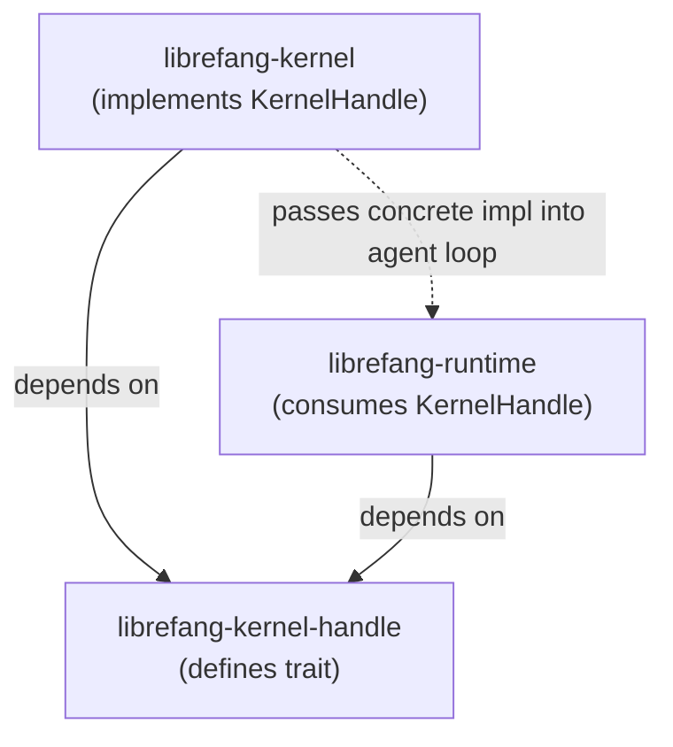

# Kernel Core — librefang-kernel-handle-src

# Kernel Handle — `librefang-kernel-handle`

## Purpose

This crate defines `KernelHandle`, an async trait that inverts the dependency between the agent runtime and the kernel. The runtime needs to invoke kernel-side operations (spawning agents, routing messages, managing memory, enforcing approvals) but cannot depend on the kernel crate directly without creating a circular dependency. `KernelHandle` solves this: the kernel implements the trait and injects it into the agent loop at startup.

Every tool that touches shared state — inter-agent messaging, the task queue, the knowledge graph, channel adapters, cron scheduling, approval gates, RBAC policies, prompt experiments — flows through this single interface.

## Architecture



The kernel crate provides a concrete struct (e.g., `LiveKernelHandle`) that implements every method with real state. The runtime receives `Arc<dyn KernelHandle>` and calls through the trait. Test suites and embedded callers can substitute stubs or mocks without pulling in the full kernel.

## `AgentInfo`

A flat data struct returned by `list_agents` and `find_agents`:

| Field | Type | Description |
|---|---|---|
| `id` | `String` | Agent UUID |
| `name` | `String` | Human-readable name |
| `state` | `String` | Current lifecycle state |
| `model_provider` | `String` | LLM provider identifier |
| `model_name` | `String` | Model identifier |
| `description` | `String` | Agent description |
| `tags` | `Vec<String>` | Categorisation tags |
| `tools` | `Vec<String>` | Tools available to the agent |

## `KernelHandle` Trait

The trait requires `Send + Sync` (safe to share across threads via `Arc`). Methods are grouped into functional domains below. Every method that has a body in the trait definition provides a **default implementation** — implementors only need to override the methods they support.

### Agent Lifecycle

| Method | Signature | Notes |
|---|---|---|
| `spawn_agent` | `async (manifest_toml, parent_id?) → Result<(id, name), String>` | Create an agent from a TOML manifest. `parent_id` tracks lineage. |
| `spawn_agent_checked` | `async (manifest_toml, parent_id?, parent_caps) → Result<(id, name), String>` | Delegates to `spawn_agent` by default. The kernel overrides to enforce that child capabilities are a subset of `parent_caps`. |
| `list_agents` | `sync → Vec<AgentInfo>` | Snapshot of all running agents. |
| `find_agents` | `sync (query) → Vec<AgentInfo>` | Case-insensitive substring match on name, tags, and tool names. |
| `kill_agent` | `sync (agent_id) → Result<(), String>` | Terminate an agent by ID. |

### Inter-Agent Messaging

| Method | Signature | Notes |
|---|---|---|
| `send_to_agent` | `async (agent_id, message) → Result<String, String>` | Send a message and await the response. |
| `send_to_agent_as` | `async (agent_id, message, parent_agent_id) → Result<String, String>` | Records the caller's parent so that `/stop` cascades (issue #3044). Default: logs a trace warning and falls back to `send_to_agent`. |

### Shared Memory

All memory methods accept an optional `peer_id` that scopes keys into per-user namespaces. When `peer_id` is `None`, the global namespace is used.

| Method | Signature |
|---|---|
| `memory_store` | `sync (key, value, peer_id?) → Result<(), String>` |
| `memory_recall` | `sync (key, peer_id?) → Result<Option<Value>, String>` |
| `memory_list` | `sync (peer_id?) → Result<Vec<String>, String>` |

### Task Queue

| Method | Signature | Notes |
|---|---|---|
| `task_post` | `async (title, description, assigned_to?, created_by?) → Result<String, String>` | Returns task ID. |
| `task_claim` | `async (agent_id) → Result<Option<Value>, String>` | Claims the next available task. |
| `task_complete` | `async (agent_id, task_id, result) → Result<(), String>` | Marks a task done. |
| `task_list` | `async (status?) → Result<Vec<Value>, String>` | Filter by status. |
| `task_delete` | `async (task_id) → Result<bool, String>` | |
| `task_retry` | `async (task_id) → Result<bool, String>` | Resets to pending. |
| `task_get` | `async (task_id) → Result<Option<Value>, String>` | Includes result and retry count. |
| `task_update_status` | `async (task_id, new_status) → Result<bool, String>` | Generic status transition. |

### Events and Knowledge Graph

| Method | Signature |
|---|---|
| `publish_event` | `async (event_type, payload) → Result<(), String>` |
| `knowledge_add_entity` | `async (Entity) → Result<String, String>` |
| `knowledge_add_relation` | `async (Relation) → Result<String, String>` |
| `knowledge_query` | `async (GraphPattern) → Result<Vec<GraphMatch>, String>` |

### Approval System

| Method | Signature | Notes |
|---|---|---|
| `requires_approval` | `sync (tool_name) → bool` | Default: `false`. |
| `requires_approval_with_context` | `sync (tool_name, sender_id?, channel?) → bool` | Delegates to `requires_approval`. Kernel overrides to factor in channel rules. |
| `is_tool_denied_with_context` | `sync (tool_name, sender_id?, channel?) → bool` | Hard deny gate. Default: `false`. |
| `request_approval` | `async (agent_id, tool_name, action_summary, session_id?) → Result<ApprovalDecision, String>` | Blocking. Default: auto-approve. |
| `submit_tool_approval` | `async (…) → Result<ToolApprovalSubmission, String>` | Non-blocking. Default: error. |
| `resolve_tool_approval` | `async (request_id, decision, decided_by?, totp_verified, user_id?) → Result<(ApprovalResponse, Option<DeferredToolExecution>), String>` | Default: error. |
| `get_approval_status` | `sync (request_id) → Result<Option<ApprovalDecision>, String>` | Default: `None`. |

### RBAC and User Policy (issue #3054)

| Method | Returns | Notes |
|---|---|---|
| `memory_acl_for_sender` | `Option<UserMemoryAccess>` | Resolves per-user memory namespace guard. Default: `None` (no restriction). |
| `resolve_user_tool_decision` | `UserToolGate` | Combines user policy, channel rules, tool categories, and role escalation. Default: `Allow`. |

The defaults are intentionally permissive so that installations without `AuthManager` (test stubs, embedded callers) retain pre-RBAC behaviour. The real kernel always overrides both.

### Channel Adapters

All channel methods route through a named adapter (e.g., `"email"`, `"telegram"`) and accept optional `thread_id` and `account_id` parameters.

| Method | Key Parameters |
|---|---|
| `send_channel_message` | `channel, recipient, message, thread_id?, account_id?` |
| `send_channel_media` | `…, media_type, media_url, caption?, filename?` |
| `send_channel_file_data` | `…, data: Vec<u8>, filename, mime_type` |
| `send_channel_poll` | `…, question, options, is_quiz, correct_option_id?, explanation?` |

### Hands (Autonomous Skill Agents)

| Method | Notes |
|---|---|
| `hand_list` | List available Hands. |
| `hand_install` | Install from TOML + skill content. |
| `hand_activate` | Spawn a specialised autonomous agent. |
| `hand_status` | Dashboard metrics for an active Hand. |
| `hand_deactivate` | Stop a running Hand. |

### Prompt Experiments

A family of methods for prompt versioning and A/B experiments. All defaults are no-ops or empty returns except `create_*` and `delete_*` which return errors:

- `get_running_experiment`, `record_experiment_request`
- `get_prompt_version`, `list_prompt_versions`, `create_prompt_version`, `delete_prompt_version`, `set_active_prompt_version`
- `list_experiments`, `create_experiment`, `get_experiment`, `update_experiment_status`, `get_experiment_metrics`
- `auto_track_prompt_version`

### Cron Scheduling

| Method | Notes |
|---|---|
| `cron_create` | Default: error. |
| `cron_list` | Default: error. |
| `cron_cancel` | Default: error. |

### Goals, Workflows, and Roster

| Method | Notes |
|---|---|
| `goal_list_active` | Active goals, optionally filtered by agent. |
| `goal_update` | Update status/progress. Default: error. |
| `run_workflow` | Execute a workflow by ID or name. Default: error. |
| `roster_upsert` / `roster_members` / `roster_remove_member` | Group chat roster management. Defaults are no-ops/empty. |

### A2A (Agent-to-Agent External)

| Method | Notes |
|---|---|
| `list_a2a_agents` | Returns `(name, url)` pairs. Default: empty. |
| `get_a2a_agent_url` | Lookup by name. Default: `None`. |

### Utility and Configuration

| Method | Notes |
|---|---|
| `touch_heartbeat` | Refresh `last_active` during long LLM calls. Called by both `run_agent_loop` and `run_agent_loop_streaming`. Default: no-op. |
| `tool_timeout_secs` | Global tool timeout. Default: `120`. |
| `tool_timeout_secs_for` | Per-tool override with glob matching. Delegates to `tool_timeout_secs`. |
| `max_agent_call_depth` | Recursion guard for inter-agent calls. Default: `5`. |
| `skill_env_passthrough_policy` | Operator gate for skill environment access. Default: `None`. |
| `readonly_workspace_prefixes` | Paths the agent can only read. Default: empty. |
| `named_workspace_prefixes` | All declared workspaces with access modes. Default: empty. |
| `fire_agent_step` | Hook fired at each loop iteration. Default: no-op. |

### Forked Execution

`run_forked_agent_oneshot` spawns a single-turn forked agent call that shares the parent's prompt cache prefix. The fork's messages do not persist into the canonical session, and the turn-end hook fires with `is_fork: true` to prevent recursive auto-dream cycles. Default: error — only the live kernel implements this.

## Internal Delegation Chains

Several methods delegate to sibling methods within the trait. This lets implementors override a single method and get the enriched variant for free:

```
send_to_agent_as          → send_to_agent
spawn_agent_checked       → spawn_agent
requires_approval_with_context → requires_approval
tool_timeout_secs_for     → tool_timeout_secs
```

When implementing the kernel, override the leaf method first. For example, if you implement `send_to_agent` but not `send_to_agent_as`, the default will log a trace warning about missing cancel-cascade support and call your `send_to_agent` implementation.

## Implementing `KernelHandle`

A minimal implementation overrides only the methods it needs. Every other method has a safe default:

- **Simple queries** (`list_agents`, `find_agents`, `list_a2a_agents`) default to returning empty vectors.
- **Mutations** (`cron_create`, `create_prompt_version`, `run_workflow`) default to returning `"X not available"` errors.
- **Gates** (`requires_approval`, `is_tool_denied_with_context`) default to permissive (`false`).
- **RBAC** (`memory_acl_for_sender`, `resolve_user_tool_decision`) default to unrestricted (`None` / `Allow`).

The production kernel (`librefang-kernel`) overrides nearly every method. Test suites typically override only the methods exercised by the test, letting everything else fall through to defaults.

## Callers

The primary consumer is `librefang-runtime`:

- **`agent_loop.rs`** calls `touch_heartbeat` (both streaming and non-streaming paths) and `memory_acl_for_sender` (during `setup_recalled_memories`).
- **`tool_runner.rs`** is the heaviest caller, dispatching tool invocations to `send_to_agent_as`, `hand_*`, `cron_*`, `send_channel_*`, `list_a2a_agents`, `get_a2a_agent_url`, and others.
- **`src/routes/system.rs`** calls `resolve_tool_approval` from `approve_request`, `reject_request`, `modify_request`, and the batch endpoints.

Contract tests live in `librefang-kernel/tests/kernel_handle_contract_*.rs` and verify that default implementations behave correctly (e.g., `test_list_a2a_agents_default_empty`, `test_memory_acl_for_sender_default_none_for_unconfigured_user`).