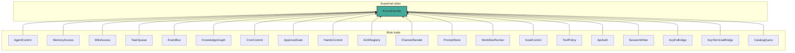

# Kernel Core — librefang-kernel-handle-src

# librefang-kernel-handle

Defines the trait boundary between the LibreFang agent runtime and the kernel. The crate exposes 19 role traits — each scoped to a single domain — plus a `KernelHandle` supertrait alias that bundles them all for backward compatibility.

## Purpose

Before issue #3746, every kernel operation lived in a single 50+ method `KernelHandle` god-trait. This forced callers to depend on the entire kernel surface even when they only needed one capability (e.g., approval gating), and made test mocks unwieldy.

The refactor splits that monolith into role traits so that:

1. **Narrow bounds** — callers express `T: ApprovalGate` instead of `T: KernelHandle`.
2. **Compile-time safety** — a missing capability becomes a compile error in the mock's trait impl, not a silent `Err("not available")` at runtime.
3. **Domain isolation** — trait files no longer mix 14+ unrelated domains.

`KernelHandle` survives as a supertrait alias with a blanket impl, so the 117+ existing `Arc<dyn KernelHandle>` call sites continue to work unchanged.

## Architecture


```mermaid
graph BT
    subgraph "Supertrait alias"
        KH["KernelHandle"]
    end

    subgraph "Role traits"
        AC[AgentControl]
        MA[MemoryAccess]
        WA[WikiAccess]
        TQ[TaskQueue]
        EB[EventBus]
        KG[KnowledgeGraph]
        CC[CronControl]
        AG[ApprovalGate]
        HC[HandsControl]
        A2A[A2ARegistry]
        CS[ChannelSender]
        PS[PromptStore]
        WR[WorkflowRunner]
        GC[GoalControl]
        TP[ToolPolicy]
        AA[ApiAuth]
        SW[SessionWriter]
        AFB[AcpFsBridge]
        ATB[AcpTerminalBridge]
        CQ[CatalogQuery]
    end

    AC & MA & WA & TQ & EB & KG & CC & AG & HC & A2A & CS & PS & WR & GC & TP & AA & SW & AFB & ATB & CQ --> KH

    style KH fill:#4a9,stroke:#333,stroke-width:2px
```

Any concrete type that implements all 19 role traits automatically satisfies `KernelHandle` via the blanket impl:

```rust
impl<T> KernelHandle for T where
    T: AgentControl + MemoryAccess + WikiAccess + /* …all 19… */ + Send + Sync + ?Sized
{}
```

## Error Handling

The crate re-exports the workspace's canonical error enum rather than defining its own:

```rust
pub use librefang_types::error::LibreFangError as KernelOpError;
pub type KernelResult<T> = Result<T, KernelOpError>;
```

This ensures every layer (runtime, kernel, API) operates on the same vocabulary — callers match on structured variants (`AgentNotFound`, `CapabilityDenied`, `Unavailable`) instead of substring-matching error strings. Use `KernelResult<T>` in all new method signatures.

## Role Traits

### Agent Lifecycle

| Trait | Domain | Key Methods |
|---|---|---|
| `AgentControl` | Spawning, messaging, listing, killing agents | `spawn_agent`, `send_to_agent`, `list_agents`, `kill_agent`, `run_forked_agent_oneshot` |
| `HandsControl` | Specialized autonomous "Hand" agents | `hand_install`, `hand_activate`, `hand_deactivate`, `hand_status` |
| `A2ARegistry` | Discovered external A2A agents (read-only) | `list_a2a_agents`, `get_a2a_agent_url` |

`AgentControl` includes several variants of `send_to_agent` for different communication patterns:
- `send_to_agent` — base message
- `send_to_agent_as` — records parent for cancel cascade (issue #3044)
- `send_to_agent_with_key` — pins to a deterministic session via `conversation_key`
- `send_to_agent_as_with_key` — combines both behaviors

`run_forked_agent_oneshot` is the "structured-output via forked call" primitive. The fork shares the parent's prompt prefix for Anthropic cache alignment, and its messages do NOT persist into the agent's canonical session.

### Memory & Knowledge

| Trait | Domain | Key Methods |
|---|---|---|
| `MemoryAccess` | Per-agent key/value store with RBAC ACLs | `memory_store`, `memory_recall`, `memory_list`, `memory_acl_for_sender` |
| `WikiAccess` | Durable markdown knowledge vault | `wiki_get`, `wiki_search`, `wiki_write` |
| `KnowledgeGraph` | Entity/relation graph | `knowledge_add_entity`, `knowledge_add_relation`, `knowledge_query` |

**MemoryAccess scoping** — `agent_id: Some(...)` scopes keys per-agent; `None` uses the shared kernel namespace (internal subsystems only). `peer_id: Some(...)` adds per-peer scoping. LLM-facing tools should always pass `agent_id: Some(caller_uuid)`.

**WikiAccess** returns `serde_json::Value` to avoid coupling this crate to `librefang-memory-wiki` types. The `wiki_write` provenance system is monotonic — provenance entries are appended, never overwritten. The `force` parameter controls overwrite protection based on on-disk mtime/sha256 drift.

### Task & Event Infrastructure

| Trait | Domain | Key Methods |
|---|---|---|
| `TaskQueue` | Shared task queue | `task_post`, `task_claim`, `task_complete`, `task_list`, `task_get`, `task_update_status` |
| `EventBus` | Fire-and-forget custom events | `publish_event` |
| `CronControl` | Agent-owned scheduled jobs | `cron_create`, `cron_list`, `cron_cancel` |
| `GoalControl` | Agent goal tracking | `goal_list_active`, `goal_update` |

### Approval & Policy

| Trait | Domain | Key Methods |
|---|---|---|
| `ApprovalGate` | Tool approval policy + lifecycle | `requires_approval`, `request_approval`, `submit_tool_approval`, `resolve_tool_approval`, `resolve_user_tool_decision` |
| `ToolPolicy` | Tool execution config (timeouts, env, workspaces) | `tool_timeout_secs_for`, `skill_env_passthrough_policy`, `readonly_workspace_prefixes`, `named_workspace_prefixes` |

`ApprovalGate` supports both blocking (`request_approval`) and deferred (`submit_tool_approval` + `resolve_tool_approval`) flows. The RBAC-aware `resolve_user_tool_decision` returns `Allow`, `Deny`, or `NeedsApproval` based on per-user policies, channel rules, and role escalation.

`ToolPolicy` is a pure read-side surface — runtime tools query it to parameterize execution against operator config. Timeout resolution follows the order: exact match → longest glob match → global default.

### Channel & Communication

| Trait | Domain | Key Methods |
|---|---|---|
| `ChannelSender` | Outbound channel adapters (text, media, file, poll) | `send_channel_message`, `send_channel_media`, `send_channel_file_data`, `send_channel_poll`, `roster_*`, `resolve_channel_owner` |

All send methods accept optional `thread_id` (thread reply) and `account_id` (specific bot routing). File data uses `bytes::Bytes` for zero-copy cloning in wrapping layers (up to 10 MiB, issue #3514).

### Workflow Engine

| Trait | Domain | Key Methods |
|---|---|---|
| `WorkflowRunner` | Declarative workflow execution | `run_workflow`, `list_workflows`, `describe_workflow`, `start_workflow_async`, `start_workflow_async_tracked`, `cancel_workflow_run` |

Supports both synchronous (`run_workflow`) and asynchronous fire-and-forget (`start_workflow_async`) execution. The tracked variant registers a `TaskKind::Workflow` entry against the originating session for completion event injection (#4983).

`describe_workflow` returns a `WorkflowDescription` with the declared input schema, enabling agents to discover how to call a workflow before invoking it (#4982).

### Prompt Management

| Trait | Domain | Key Methods |
|---|---|---|
| `PromptStore` | Prompt versions, experiments, auto-tracking | `create_prompt_version`, `set_active_prompt_version`, `create_experiment`, `auto_track_prompt_version` |

### Session & Editor Integration

| Trait | Domain | Key Methods |
|---|---|---|
| `SessionWriter` | Pre-inject content blocks into sessions | `inject_attachment_blocks`, `append_to_session` |
| `AcpFsBridge` | Editor-backed file I/O via ACP | `acp_read_text_file`, `acp_write_text_file`, `register_acp_fs_client` |
| `AcpTerminalBridge` | Editor-backed terminal via ACP | `acp_run_terminal_command`, `register_acp_terminal_client` |

`SessionWriter.inject_attachment_blocks` is a blocking API (SQLite write under the hood). Callers inside async contexts should wrap it in `tokio::task::spawn_blocking`.

ACP bridge traits follow a register → lookup → dispatch pattern: the kernel stores per-session `Arc<dyn AcpFsClient>` / `Arc<dyn AcpTerminalClient>` instances, and runtime tools look them up at call time. `None` means "no editor bound — fall back to local."

### Config & Catalog

| Trait | Domain | Key Methods |
|---|---|---|
| `ApiAuth` | Auth config snapshots for HTTP middleware | `auth_snapshot` |
| `CatalogQuery` | Model-catalog metadata for drivers | `reasoning_echo_policy_for`, `proactive_memory_extraction_model_for` |

`ApiAuth.auth_snapshot` returns an atomic `ApiAuthSnapshot` from a single config generation, preventing hot-reload races where middleware mixes pre- and post-reload values.

## Usage Patterns

### Full kernel access (legacy call sites)

```rust
use librefang_kernel_handle::prelude::*;

async fn legacy_call(kernel: &dyn KernelHandle) -> KernelResult<()> {
    kernel.send_to_agent("agent-123", "hello").await?;
    let agents = kernel.list_agents();
    Ok(())
}
```

### Narrow bounds (preferred for new code)

```rust
use librefang_kernel_handle::{ApprovalGate, ChannelSender};

async fn focused<T: ApprovalGate + ChannelSender + Send + Sync>(kernel: &T) {
    if kernel.requires_approval("shell_exec") {
        kernel.send_channel_message("telegram", "user", "needs approval", None, None).await;
    }
}
```

### Import everything

```rust
use librefang_kernel_handle::prelude::*;
```

This brings `KernelHandle`, all 19 role traits, and all public data types into scope.

## Data Types

The crate defines several `#[non_exhaustive]` structs for workflow and auth metadata. Because `#[non_exhaustive]` blocks external struct-literal construction, all such types expose `new()` constructors, and future field additions will ship as `with_field(self, …)` setters.

| Type | Used By | Notes |
|---|---|---|
| `AgentInfo` | `AgentControl::list_agents` | Debug/Clone |
| `WorkflowSummary` | `WorkflowRunner::list_workflows` | `#[non_exhaustive]` |
| `WorkflowInputParam` | `WorkflowRunner::describe_workflow` | `#[non_exhaustive]`, param_type ∈ {string, number, boolean, file, image, agent_id} |
| `WorkflowDescription` | `WorkflowRunner::describe_workflow` | `#[non_exhaustive]` |
| `WorkflowRunSummary` | `WorkflowRunner::get_workflow_run` | `#[non_exhaustive]`, carries `step_outputs` |
| `StepOutputSummary` | `WorkflowRunSummary` | `#[non_exhaustive]` |
| `AcpTerminalRunResult` | `AcpTerminalClient::run_command` | output + exit_code + signal + truncated |
| `ApiAuthSnapshot` | `ApiAuth::auth_snapshot` | Atomic auth config snapshot |
| `ApiUserConfigSnapshot` | `ApiAuthSnapshot` | Per-user API key hash |
| `DashboardRawConfig` | `ApiAuthSnapshot` | Unresolved dashboard credentials |

## Default Implementations and Migration Strategy

Methods that historically returned `Err("X not available")` at runtime retain those defaults. They are now grouped onto the owning role trait so a follow-up PR can tighten each role's contract independently — no need to land 30+ default removals atomically.

For methods with sensible no-op defaults (e.g., `touch_heartbeat`, `fire_agent_step`), the default silently does nothing. For capability-gated methods (e.g., `run_forked_agent_oneshot`, `cron_create`, all `WikiAccess` methods), the default returns `KernelOpError::unavailable(...)`.

This preserves the zero-behavior-change guarantee of the #3746 refactor while setting up individual traits for stricter contracts later.

## Object Safety

All 19 role traits are individually object-safe, verified by the `role_traits_are_individually_object_safe` test which constructs `Arc<dyn Trait>` for each one. The blanket `KernelHandle` impl supports `Arc<dyn KernelHandle>` through `?Sized`.

If any role trait gains a non-object-safe method (generic parameter, `Self` by value, etc.), the test will fail to compile — providing a compile-time guard.