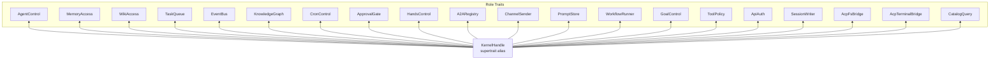

# Kernel Core — librefang-kernel-handle-src

# librefang-kernel-handle

Role traits that define the seam between the agent runtime and the kernel backend. Every runtime tool, dispatcher, and proactive subsystem calls into the kernel through one of these traits — never through concrete kernel types directly.

## Background

Prior to issue #3746, the entire kernel surface was a single `KernelHandle` trait with 50+ methods spanning 14 unrelated domains. This crate now exposes 19 focused **role traits**, each governing one capability area. `KernelHandle` survives as a supertrait alias with a blanket impl so the 117+ existing `Arc<dyn KernelHandle>` call sites compile unchanged. New code should narrow to only the role bounds it needs.


```mermaid
graph BT
    subgraph "Role Traits"
        AC[AgentControl]
        MA[MemoryAccess]
        WA[WikiAccess]
        TQ[TaskQueue]
        EB[EventBus]
        KG[KnowledgeGraph]
        CC[CronControl]
        AG[ApprovalGate]
        HC[HandsControl]
        A2A[A2ARegistry]
        CS[ChannelSender]
        PS[PromptStore]
        WR[WorkflowRunner]
        GC[GoalControl]
        TP[ToolPolicy]
        AA[ApiAuth]
        SW[SessionWriter]
        AF[AcpFsBridge]
        AT[AcpTerminalBridge]
        CQ[CatalogQuery]
    end

    KH[KernelHandle<br/>supertrait alias] --> AC & MA & WA & TQ & EB & KG
    KH --> CC & AG & HC & A2A & CS & PS & WR
    KH --> GC & TP & AA & SW & AF & AT & CQ
```

## Error handling

All trait methods return [`KernelResult<T>`], an alias for `Result<T, LibreFangError>` (re-exported as [`KernelOpError`]). This reuses the workspace's canonical business-error enum rather than introducing a parallel type, so pattern-matching works uniformly across the API, runtime, and kernel layers:

```rust
match err {
    LibreFangError::AgentNotFound(_) => /* 404 */,
    LibreFangError::CapabilityDenied(_) => /* 403 */,
    LibreFangError::Unavailable(_) => /* 503 */,
    // ...
}
```

Use `KernelResult<T>` in all new method signatures — never spell out `Result<T, KernelOpError>` manually.

## Role traits

### AgentControl (async)

Agent lifecycle: spawn, inter-agent messaging, listing, heartbeats, and forked one-shot calls.

| Method | Purpose |
|---|---|
| `spawn_agent` | Create an agent from a TOML manifest. Returns `(id, name)`. |
| `spawn_agent_checked` | Like `spawn_agent` but verifies the child's capabilities are covered by `parent_caps`. Default delegates to `spawn_agent` (no enforcement). |
| `send_to_agent` | Send a message to another agent and await its response. |
| `send_to_agent_as` | Like `send_to_agent` but records a `parent_agent_id` for cancel-cascade propagation (issue #3044). Default falls back to `send_to_agent` with a trace log. |
| `send_to_agent_with_key` | Pins the callee to a deterministic session derived from `conversation_key`. |
| `send_to_agent_as_with_key` | Combines `send_to_agent_as` + session pinning. |
| `list_agents` / `find_agents` | Enumerate running agents; `find_agents` matches on name, tag, or tool name (case-insensitive). |
| `kill_agent` | Terminate an agent by ID. |
| `touch_heartbeat` | Refresh `last_active` during long-running LLM calls. |
| `fire_agent_step` | Emit an `agent:step` hook event. |
| `run_forked_agent_oneshot` | Structured-output primitive: forked agent turn that collapses to a single text response. The fork's messages do not persist into the agent's canonical session. Default returns `Unavailable`. |
| `max_agent_call_depth` | Config-sourced inter-agent call depth limit. Default: 5. |

### MemoryAccess (sync)

Per-agent key/value memory with optional peer scoping. Internal kernel subsystems use the shared namespace (`agent_id: None`); LLM-facing tools always pass `agent_id: Some(caller_uuid)`.

| Method | Scoping parameters |
|---|---|
| `memory_store` | `key`, `value`, `agent_id: Option`, `peer_id: Option` |
| `memory_recall` | Same scoping as `memory_store` |
| `memory_list` | Returns keys within the specified namespace |
| `memory_acl_for_sender` | Resolves per-user RBAC ACL for a `(sender_id, channel)` pair. Returns `None` when RBAC is disabled. |

### WikiAccess (sync)

Durable markdown knowledge vault (issue #3329). Methods return `serde_json::Value` to avoid coupling to the `librefang-memory-wiki` crate.

| Method | Returns |
|---|---|
| `wiki_get(topic)` | JSON object with `topic`, `frontmatter`, `body`. `Unavailable` if vault disabled; `NotFound` if topic missing. |
| `wiki_search(query, limit)` | JSON array of `{ topic, snippet, score }` sorted by relevance. |
| `wiki_write(topic, body, provenance, force)` | Writes/updates a page. `body` supports `[[topic]]` cross-references. Provenance is append-only (monotonic). `force = false` refuses silent overwrite on mtime/sha256 drift, returning `Conflict`. |

All three default to `Unavailable`.

### TaskQueue (async)

Shared task queue operations.

| Method | Description |
|---|---|
| `task_post` | Post a task; returns task ID. |
| `task_claim` | Claim the next available task for an agent. |
| `task_complete` | Mark a task done with a result string. |
| `task_list` | List tasks, optionally filtered by status. |
| `task_delete` / `task_retry` / `task_get` | Standard CRUD. |
| `task_update_status` | Reset to `pending` or cancel. |

### EventBus (async)

Single method: `publish_event(event_type, payload)`. Fire-and-forget custom events that can trigger proactive agents.

### KnowledgeGraph (async)

Entity/relation insertion and pattern-based queries. `knowledge_add_entity` and `knowledge_add_relation` take their arguments by reference so callers that may retry avoid forced moves (issue #3553).

### CronControl (async)

Agent-owned scheduled jobs: `cron_create`, `cron_list`, `cron_cancel`. All default to `Unavailable`.

### ApprovalGate (sync + async)

Approval policy queries and the pending-approval lifecycle.

| Method | Notes |
|---|---|
| `requires_approval` | Simple tool-name check. Default: `false`. |
| `requires_approval_with_context` | Context-aware (sender + channel) check. Falls back to `requires_approval`. |
| `is_tool_denied_with_context` | Hard-deny check per sender/channel. Default: `false`. |
| `resolve_user_tool_decision` | Per-user RBAC gate returning `UserToolGate` (`Allow` / `Deny` / `NeedsApproval`). Default: `Allow`. |
| `request_approval` | Blocking approval request. Default: auto-approve. |
| `submit_tool_approval` | Non-blocking submission with `DeferredToolExecution` payload. |
| `resolve_tool_approval` | Resolve a pending request and retrieve the deferred payload. |
| `get_approval_status` | Poll approval status by request UUID. |

### HandsControl (async)

Hand (specialized agent) lifecycle: `hand_list`, `hand_install`, `hand_activate`, `hand_status`, `hand_deactivate`. All default to `Unavailable`.

### A2ARegistry (sync)

Read-only directory of discovered external A2A agents. `list_a2a_agents` returns `(name, url)` pairs; `get_a2a_agent_url` looks up by name. Defaults return empty/`None`.

### ChannelSender (async + sync)

Outbound channel adapters — text, media, file data, polls, and roster management.

| Method | Notes |
|---|---|
| `send_channel_message` | Text to a recipient on a named adapter. Optional `thread_id` and `account_id`. |
| `send_channel_media` | Image or file via URL. |
| `send_channel_file_data` | Raw bytes (`bytes::Bytes` for zero-copy clone in wrapping layers). |
| `send_channel_poll` | Poll/quiz with options. |
| `roster_upsert` / `roster_members` / `roster_remove_member` | Group roster CRUD. |
| `resolve_channel_owner` | Maps `(channel, chat_id)` to the owning `AgentId`. Used to mirror outbound messages into the channel-owner's session. |

### PromptStore (sync)

Prompt versioning, experiments, and auto-tracking. Defaults return empty/error. `create_prompt_version` and `create_experiment` take their arguments by reference to avoid double-clone when the caller needs the data for a response (issue #3553).

### WorkflowRunner (async)

Declarative workflow execution with both synchronous and fire-and-forget modes.

| Method | Returns |
|---|---|
| `run_workflow` | Blocking execution; returns `(run_id, output)`. |
| `start_workflow_async` | Fire-and-forget; returns `run_id`. |
| `start_workflow_async_tracked` | Tracker-aware variant that registers a `TaskKind::Workflow` entry for the originating session (#4983). |
| `list_workflows` | `Vec<WorkflowSummary>` sorted by name. |
| `describe_workflow` | `Option<WorkflowDescription>` with step names and input schema. |
| `get_workflow_run` | `Option<WorkflowRunSummary>` with per-step outputs. |
| `cancel_workflow_run` | Cancel a running or paused workflow. |

Supporting types — `WorkflowSummary`, `WorkflowInputParam`, `WorkflowDescription`, `StepOutputSummary`, `WorkflowRunSummary` — are `#[non_exhaustive]` with `new()` constructors. External crates must use the constructors; future field additions land as `with_<field>(self, …)` setters.

### GoalControl (sync)

`goal_list_active` (returns JSON array, default empty) and `goal_update` (status/progress, default `Unavailable`).

### ToolPolicy (sync)

Read-side config queries that parameterize tool execution. No mutations.

| Method | Default |
|---|---|
| `tool_timeout_secs` | 120 |
| `tool_timeout_secs_for(tool_name)` | Delegates to `tool_timeout_secs()` (no per-tool config) |
| `skill_env_passthrough_policy` | `None` |
| `readonly_workspace_prefixes(agent_id)` | Empty vec |
| `named_workspace_prefixes(agent_id)` | Empty vec |
| `channel_file_download_dir` | `None` |
| `deduplicate_file_reads` | `false` |
| `effective_upload_dir` | `<temp>/librefang_uploads` |

### ApiAuth (sync)

Single method `auth_snapshot() -> ApiAuthSnapshot`. Returns a consistent snapshot of every auth-relevant config field from a single `config.load()` generation, preventing race conditions during hot-reload.

### SessionWriter (sync)

Pre-injects content blocks or appends messages to agent sessions. Used by the HTTP attachment upload path (#3744) and channel-send mirroring. **Blocking I/O caveat**: the production implementation calls `MemorySubstrate::save_session` synchronously (SQLite write). Callers in async contexts should wrap in `tokio::task::spawn_blocking`.

Key invariant for `inject_attachment_blocks`: the `session_id` must be derived with the same resolver the matching `send_message_*` call will use, or a cross-chat leak occurs.

### AcpFsBridge (sync + async)

Routes file I/O through an attached ACP editor instead of the local filesystem (#3313). Three core operations: `register_acp_fs_client`, `unregister_acp_fs_client`, `acp_fs_client` (lookup), plus convenience methods `acp_read_text_file` and `acp_write_text_file`. Returns `Unavailable` when no editor is bound — tools should fall back to local fs.

The `AcpFsClient` sub-trait is the object-safe client side implemented by `librefang-acp::FsClientHandle`.

### AcpTerminalBridge (sync + async)

Routes terminal commands through the editor's PTY (#3313). Mirrors the register/unregister/lookup pattern of `AcpFsBridge`. The convenience method `acp_run_terminal_command` runs a full create→wait→output→release cycle.

The `AcpTerminalClient` sub-trait returns `AcpTerminalRunResult` with `output`, `truncated`, `exit_code`, and `signal` fields.

### CatalogQuery (sync)

Read-side model-catalog metadata. Currently surfaces `reasoning_echo_policy_for(model)` for OpenAI-compat driver dispatch, and `proactive_memory_extraction_model_for(agent_id)` for per-agent extraction model overrides (#5475). Both default to `None`/`None` policy.

## Using the traits

### Narrow bounds (preferred for new code)

Express only the capabilities you need:

```rust
async fn dispatch_tool<T: ApprovalGate + ChannelSender + Send + Sync>(
    kernel: &T,
    tool: &str,
) -> KernelResult<()> {
    if kernel.requires_approval(tool) {
        // ...
    }
    kernel.send_channel_message("email", "user@example.com", "done", None, None).await?;
    Ok(())
}
```

### Full kernel handle (existing code)

```rust
use librefang_kernel_handle::prelude::*;

async fn handler(kernel: Arc<dyn KernelHandle>) {
    kernel.spawn_agent(manifest, None).await.unwrap();
}
```

### Constructing non-exhaustive types

Use the `new()` constructors — struct-literal syntax is disabled outside this crate:

```rust
let summary = WorkflowSummary::new(
    id, name, description, step_count, has_input_schema,
);
```

## Testing patterns

Each role trait is individually object-safe (verified by the `role_traits_are_individually_object_safe` test). This means you can mock a single capability:

```rust
struct MockApproval;

impl ApprovalGate for MockApproval {
    fn requires_approval(&self, tool: &str) -> bool {
        tool == "dangerous_tool"
    }
    // all other methods keep their defaults
}
```

The `StubKernel` in the test module demonstrates the minimal set of required method impls (those without defaults). Traits where every method has a default — `CronControl`, `ApprovalGate`, `HandsControl`, etc. — need zero method impls; the trait is satisfied by writing `impl CronControl for MyStub {}`.

## Design notes

**Why default impls return `Err("not available")` instead of panicking or removing the default:** This preserves zero-behavior-change during the structural refactor (issue #3746). Follow-up PRs can tighten each role's contract independently — removing defaults method by method — without landing 30+ removals atomically.

**Why `&self` references in `KnowledgeGraph` and `PromptStore`:** Callers that may retry (e.g., proactive memory extractors) hold owned values and would otherwise be forced into premature `.clone()` chains. Taking `&T` lets the kernel decide when to clone (issue #3553).

**Why `bytes::Bytes` for file data:** With the 10 MiB upload bump (#3514), wrapping layers (metering, retry, fan-out) can `clone()` the handle for free instead of copying the underlying buffer (issue #3553).