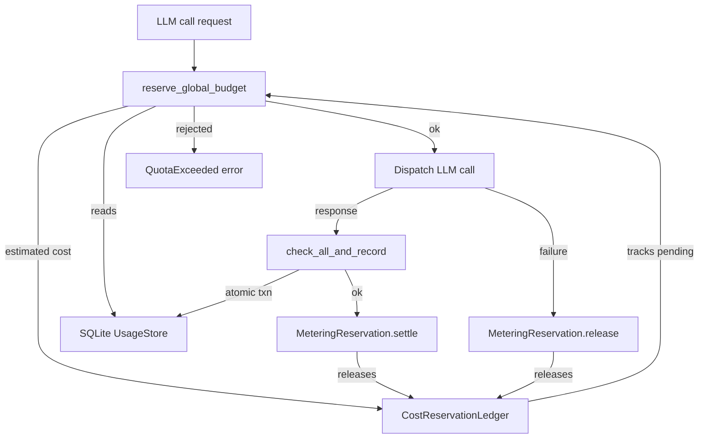

# Kernel Core — librefang-kernel-metering-src

# Kernel Core — librefang-kernel-metering

## Overview

The metering engine tracks LLM call costs and enforces spending quotas at four independent levels: per-agent, global, per-provider, and per-user. It wraps a SQLite-backed `UsageStore` and adds an in-memory reservation ledger to prevent concurrent requests from collectively overshooting budget caps.

## Architecture



## Key Types

### `MeteringEngine`

The main entry point. Holds two pieces of state:

- `store: Arc<UsageStore>` — persistent SQLite store for settled usage records
- `pending: Arc<CostReservationLedger>` — in-memory ledger of reserved-but-not-settled USD

Construct with `MeteringEngine::new(store)`.

### `MeteringReservation`

A `#[must_use]` RAII token returned by `reserve_global_budget`. Holds an `estimated_usd` reservation against the global budget. Consumers must call one of:

| Method | When to call |
|---|---|
| `settle()` | After the actual usage record has been persisted (the SQLite row now reflects the real cost) |
| `release()` | When the dispatch failed before any cost was incurred |

If neither is called (e.g. due to a panic), `Drop` releases the reservation as a safety net.

### `BudgetStatus`

A serializable snapshot of current spend versus configured limits across hourly/daily/monthly windows. Produced by `budget_status()`.

### `CostReservationLedger` (internal)

A `Mutex<f64>` tracking total reserved USD across all in-flight calls. The three operations are `add`, `release` (clamped at zero to defend against floating-point drift), and `current`.

## Budget Enforcement Layers

Each layer is independent — zero-valued limits are treated as "unlimited" and skipped.

| Layer | Config type | Method | Scopes |
|---|---|---|---|
| Per-agent | `ResourceQuota` | `check_quota` | hourly, daily, monthly cost |
| Global | `BudgetConfig` | `check_global_budget` | hourly, daily, monthly cost |
| Per-provider | `ProviderBudget` | `check_provider_budget` | hourly, daily, monthly cost; hourly tokens |
| Per-user | `UserBudgetConfig` | `check_user_budget` | hourly, daily, monthly cost |

Per-provider budgets are stored as a map in `BudgetConfig.providers`, keyed by provider name.

### Atomic vs. Non-Atomic Checks

The non-atomic methods (`check_quota`, `check_global_budget`, `check_provider_budget`) query SQLite and return a snapshot. They are suitable for dashboards or pre-dispatch gating but admit a TOCTOU race: concurrent requests can both pass the check before either records usage.

The atomic methods perform check + record inside a single SQLite transaction:

- `check_quota_and_record` — per-agent only
- `check_global_budget_and_record` — global only
- `check_all_and_record` — **preferred**. Checks per-agent, global, and per-provider budgets, then inserts the usage row, all in one transaction. On failure the record is not inserted.

## The Concurrent Overshoot Fix (#3616)

### Problem

When N triggers fire concurrently, each reads the same pre-call total from SQLite, each passes the budget gate, and each commits — producing an N× overshoot.

### Solution

`reserve_global_budget` adds an estimated cost to the in-memory `CostReservationLedger` *before* dispatching the LLM call. Subsequent callers see the pending hold reflected in their budget projection.

### Comparison-Operator Asymmetry

This is intentional and should be preserved:

- `reserve_global_budget` uses `>` — a single call that exactly reaches the cap is allowed through (a fresh kernel with its first call shouldn't be rejected).
- `check_global_budget` uses `>=` — once the limit is fully consumed, no further calls are dispatched.

### Limitations

The reservation ledger only synchronizes in-process callers. Two separate processes (or an out-of-band SQL writer) can still race. Full cross-process atomicity is the responsibility of the post-call `check_all_and_record` path.

## Cost Estimation

### `estimate_cost_with_catalog` (preferred)

Looks up pricing from the `ModelCatalog`. Falls back to default rates ($1/$3 per million tokens) for unknown models.

Special case: ChatGPT session-auth models (`provider == "chatgpt"`) with zero catalog prices use legacy default rates so budgets still have a conservative non-zero estimate.

Subscription-based providers (e.g. `alibaba-coding-plan`) have zero token costs — metering will show $0.00. Users must monitor usage via the provider's console.

### `estimate_cost` (fallback)

Always uses default rates. Useful in tests or when no catalog is available.

### Token Pricing

The `estimate_cost_from_rates` function applies these multipliers:

| Token type | Price multiplier |
|---|---|
| Regular input | 1.0× `input_per_m` |
| Cache-read input | 0.1× `input_per_m` |
| Cache-creation input | 1.25× `input_per_m` |
| Output | 1.0× `output_per_m` |

Regular input is computed as `total_input - cache_read - cache_creation`.

## Typical Call Flow

```
// 1. Pre-call: reserve estimated cost
let reservation = engine.reserve_global_budget(&budget, estimated_usd)?;

// 2. Dispatch the LLM call
let response = dispatch_llm_call(model, prompt).await;

match response {
    Ok(llm_response) => {
        // 3. Build the usage record from actual token counts
        let record = UsageRecord { cost_usd, input_tokens, output_tokens, ... };

        // 4. Atomically check all quotas + persist (single SQLite txn)
        engine.check_all_and_record(&record, &quota, &budget)?;

        // 5. Release the in-memory reservation (SQLite now has the real cost)
        reservation.settle();
    }
    Err(_) => {
        // No cost incurred — just release the reservation
        reservation.release();
    }
}
```

## Dependencies

| Crate | What it provides |
|---|---|
| `librefang_memory` | `UsageStore`, `UsageRecord`, `UsageSummary`, `ModelUsage`, `MemorySubstrate` |
| `librefang_types` | `AgentId`, `UserId`, `ResourceQuota`, `BudgetConfig`, `ProviderBudget`, `UserBudgetConfig`, `LibreFangError`, `ModelCatalogEntry` |
| `librefang_runtime` | `ModelCatalog` (for `estimate_cost_with_catalog`) |

## Record Cleanup

`cleanup(days)` delegates to `UsageStore::cleanup_old` and returns the number of rows deleted. Call periodically to prevent unbounded SQLite growth.