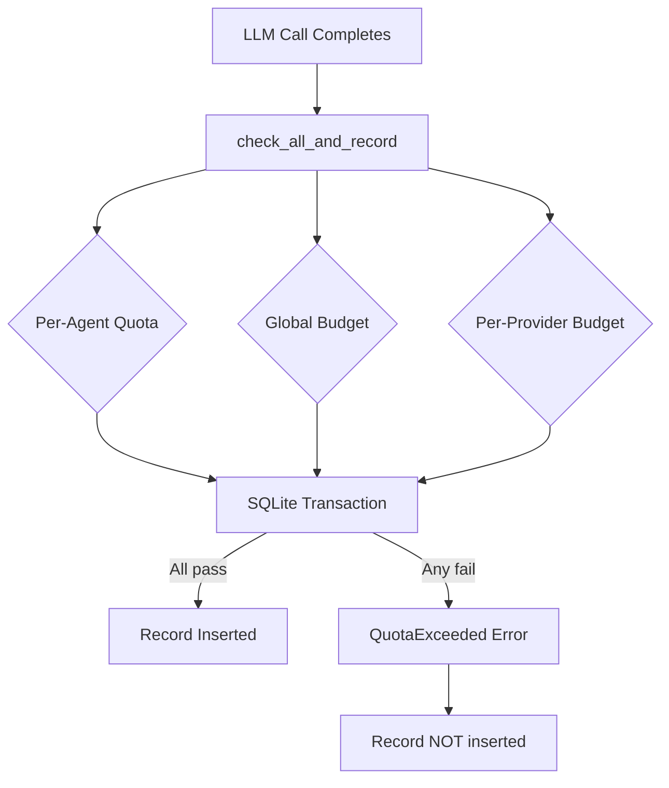

# Kernel Core — librefang-kernel-metering-src

# librefang-kernel-metering

LLM cost tracking and quota enforcement for the LibreFang kernel.

This crate provides the `MeteringEngine` — the central component responsible for recording LLM usage events, estimating call costs, and enforcing spending limits across three independent budget layers: per-agent, global, and per-provider.

## Architecture



All quota checks and the usage insert happen inside a single SQLite transaction when using the atomic APIs. This eliminates the TOCTOU race where two concurrent requests both pass independent quota checks before either records its spend.

## Core Types

### `MeteringEngine`

The single public struct. Wraps an `Arc<UsageStore>` (SQLite-backed persistence from `librefang-memory`) and exposes all recording, querying, and enforcement methods.

```rust
let store = Arc::new(UsageStore::new(substrate.usage_conn()));
let engine = MeteringEngine::new(store);
```

### `BudgetStatus`

A serializable snapshot of current spend versus configured limits across hourly, daily, and monthly windows. Returned by `budget_status()` for dashboard/alerting use.

Fields: `hourly_spend`, `hourly_limit`, `hourly_pct` (and equivalent for daily/monthly), `alert_threshold`, `default_max_llm_tokens_per_hour`.

## Cost Estimation

Two public methods compute the USD cost of an LLM call from token counts. Both handle cache-aware pricing:

| Token Type | Multiplier |
|---|---|
| Regular input | 1.0× input rate |
| Cache-read input | 0.10× input rate |
| Cache-creation input | 1.25× input rate |
| Output | 1.0× output rate |

Rates are expressed as USD per million tokens.

### `estimate_cost` (static fallback)

```rust
MeteringEngine::estimate_cost(
    model,                  // unused — pricing is model-independent
    input_tokens,
    output_tokens,
    cache_read_input_tokens,
    cache_creation_input_tokens,
)
```

Uses fixed default rates: **$1.00/M** input, **$3.00/M** output. Intended for unit tests and environments without a model catalog.

### `estimate_cost_with_catalog` (production path)

```rust
MeteringEngine::estimate_cost_with_catalog(
    &catalog,
    "claude-sonnet-4-20250514",
    input_tokens,
    output_tokens,
    cache_read_input_tokens,
    cache_creation_input_tokens,
)
```

Looks up the model in the `ModelCatalog` (from `librefang-runtime`) and uses provider-specific pricing. Falls back to the default rates if the model is not found.

**Special cases:**

- **Zero-priced local models** (e.g., Ollama): cost is `$0.00`. No override.
- **Zero-priced ChatGPT session-auth models** (provider `"chatgpt"`): despite the catalog reporting $0/$0, the engine applies the default $1/$3 rates so that budgets still provide a conservative spend estimate. This is gated by `should_use_legacy_budget_estimate`, which checks `entry.provider == "chatgpt"`.

## Quota Enforcement

### Three Budget Layers

The engine enforces limits at three independent levels. A zero-valued limit means "unlimited" and is skipped during enforcement.

**1. Per-Agent Quota** — `ResourceQuota`

Fields: `max_cost_per_hour_usd`, `max_cost_per_day_usd`, `max_cost_per_month_usd`.

Checked by `check_quota(agent_id, &quota)`.

**2. Global Budget** — `BudgetConfig`

Fields: `max_hourly_usd`, `max_daily_usd`, `max_monthly_usd`.

Aggregates spend across all agents. Checked by `check_global_budget(&budget)`.

**3. Per-Provider Budget** — `ProviderBudget`

Fields: `max_cost_per_hour_usd`, `max_cost_per_day_usd`, `max_cost_per_month_usd`, `max_tokens_per_hour`.

Providers are keyed by string name in `BudgetConfig.providers` (`HashMap<String, ProviderBudget>`). Provider budgets are isolated — spend on one provider does not affect another. Checked by `check_provider_budget(provider, &provider_budget)`.

All enforcement methods return `LibreFangResult<()>`. On violation, they return `LibreFangError::QuotaExceeded` with a message identifying the budget layer, provider/agent, and the actual vs. allowed amounts.

### Non-Atomic (Check-Then-Record)

```rust
engine.record(&usage_record)?;           // persists to SQLite
engine.check_quota(agent_id, &quota)?;   // reads from SQLite
engine.check_global_budget(&budget)?;
engine.check_provider_budget("openai", &provider_budget)?;
```

These are independent operations. Between a `check_quota` call and a subsequent `record`, another concurrent request could push spend over the limit. Use this pattern only for dashboards, pre-dispatch gating, or single-threaded contexts.

### Atomic (Check-and-Record)

For production LLM dispatch, use one of the atomic methods that wrap everything in a single SQLite transaction:

| Method | Checks |
|---|---|
| `check_quota_and_record(&record, &quota)` | Per-agent only |
| `check_global_budget_and_record(&record, &budget)` | Global only |
| `check_all_and_record(&record, &quota, &budget)` | Per-agent + global + per-provider |

`check_all_and_record` is the preferred entry point. It resolves the provider-specific budget from `budget.providers` using `record.provider` as the key, then delegates to `UsageStore::check_all_with_provider_and_record` which executes all checks and the insert atomically. On failure, the record is **not** inserted.

```rust
match engine.check_all_and_record(&record, &quota, &budget) {
    Ok(()) => { /* record persisted, all quotas satisfied */ },
    Err(LibreFangError::QuotaExceeded(msg)) => { /* record NOT persisted */ },
    Err(e) => { /* storage error */ },
}
```

## Querying Usage

| Method | Returns | Filter |
|---|---|---|
| `get_summary(agent_id)` | `UsageSummary` | Optional agent filter |
| `get_by_model()` | `Vec<ModelUsage>` | All agents, grouped by model |
| `budget_status(&budget)` | `BudgetStatus` | Global spend snapshot |
| `cleanup(days)` | `usize` (deleted count) | Removes records older than N days |

## Dependencies

- **`librefang-memory`** — provides `UsageStore` (SQLite persistence), `UsageRecord`, `UsageSummary`, `ModelUsage`
- **`librefang-types`** — provides `AgentId`, `ResourceQuota`, `BudgetConfig`, `ProviderBudget`, `ModelCatalogEntry`, error types
- **`librefang-runtime`** — provides `ModelCatalog` for pricing lookups (only needed for `estimate_cost_with_catalog`)