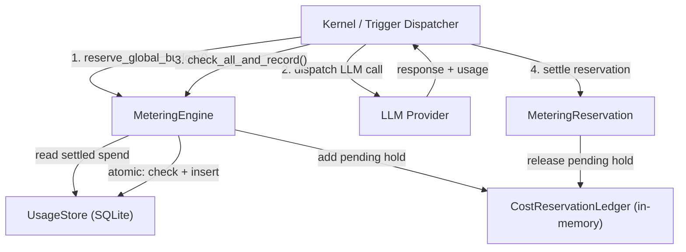

# Kernel Core — librefang-kernel-metering-src

# librefang-kernel-metering

LLM cost tracking and spending-quota enforcement engine. Every token that flows through the system is priced, recorded to SQLite, and checked against a hierarchy of budgets before and after each call.

## Architecture



The engine has two complementary enforcement paths that work together:

- **Pre-call reservation** — `reserve_global_budget` places an in-memory hold against the global cap *before* dispatching the network call. This prevents the race described in #3616 where N concurrent triggers all observe the same pre-call total and collectively overshoot the limit.
- **Post-call atomic check-and-record** — `check_all_and_record` checks per-agent, global, per-provider, and per-user budgets inside a single SQLite transaction, then inserts the usage row. No writer can sneak between the check and the insert.

## Budget Hierarchy

Budgets are enforced at four independent tiers. A call must pass **all** applicable checks to succeed.

| Tier | Scope | Pre-call | Post-call atomic | Method |
|------|-------|----------|-------------------|--------|
| Global | All agents, all providers | `reserve_global_budget` | `check_global_budget_and_record` | Hourly / daily / monthly USD |
| Per-agent | Single agent | — | `check_quota_and_record` | Hourly / daily / monthly USD |
| Per-provider | Single LLM provider | `check_provider_budget` | inside `check_all_and_record` | Hourly / daily / monthly USD, hourly tokens |
| Per-user | Single user (RBAC) | — | `check_user_budget` (post-settle) | Hourly / daily / monthly USD |

A `0.0` limit at any tier means **unlimited** — that window is skipped entirely.

## Key Types

### `MeteringEngine`

The primary entry point. Wraps an `Arc<UsageStore>` (SQLite-backed persistence) and a `CostReservationLedger` (in-memory pending reservations).

```rust
let engine = MeteringEngine::new(store);
```

### `MeteringReservation`

Returned by `reserve_global_budget`. A `#[must_use]` RAII guard that holds an estimated USD cost against the in-memory ledger. Three disposal paths:

- **`settle()`** — call after the actual usage is recorded to SQLite. Releases the in-memory hold so the ledger doesn't double-count alongside the settled row.
- **`release()`** — call when the dispatch failed before any cost was incurred.
- **`Drop`** — safety net. If the caller panics or forgets to settle, `Drop` releases the reservation automatically so the budget isn't permanently locked.

### `BudgetStatus`

A `serde::Serialize` snapshot returned by `budget_status` with current spend, limits, and percentage utilization for hourly/daily/monthly windows. Used by dashboards and alerting.

## Cost Estimation

Two methods estimate the USD cost of a call before the provider returns actual usage:

- **`estimate_cost(model, input_tokens, output_tokens, cache_read, cache_creation)`** — static fallback. Uses flat `$1.00/$3.00` per million tokens regardless of model name. The `model` parameter is accepted for API symmetry but ignored.
- **`estimate_cost_with_catalog(catalog, model, ...)`** — looks up per-model pricing from the model catalog, falling back to the static rates for unknown models. Zero-priced `chatgpt` provider models use the legacy budget estimate (`$1/$3`) so budgets remain meaningful.

### Cache token pricing

`estimate_cost_from_rates` applies differentiated pricing for prompt-cache tokens:

| Token type | Multiplier vs base input price |
|------------|-------------------------------|
| Regular input | 1.0× |
| Cache read | 0.1× (90% discount) |
| Cache creation | 1.25× (25% surcharge) |

Regular input tokens are computed as `input_tokens - cache_read_input_tokens - cache_creation_input_tokens` (saturating subtraction).

### Subscription providers

Models behind subscription plans (e.g. `alibaba-coding-plan`) register with zero cost-per-token. Cost tracking shows `$0.00` — usage quotas for these providers are enforced via request or token counts in the per-provider budget, not dollar amounts.

## Typical Call Flow

```rust
// 1. Reserve budget before the network call
let reservation = engine.reserve_global_budget(&budget, estimated_usd)?;

// 2. Dispatch the LLM call
let response = llm_client.chat(request).await;

// 3. Build the usage record from the response
let record = UsageRecord {
    agent_id,
    provider: "anthropic".into(),
    model: "claude-sonnet-4-6".into(),
    input_tokens: response.usage.input_tokens,
    output_tokens: response.usage.output_tokens,
    cache_read_input_tokens: response.usage.cache_read,
    cache_creation_input_tokens: response.usage.cache_creation,
    cost_usd: actual_cost,
    user_id: Some(user_id),
    ..
};

// 4. Atomically check all budgets and persist
engine.check_all_and_record(&record, &agent_quota, &budget)?;

// 5. Release the in-memory reservation
reservation.settle();
```

If step 2 fails before the provider returns, call `reservation.release()` instead of `settle()`. If code panics between steps 2–5, `Drop` handles cleanup.

## Comparison Operator Asymmetry

`reserve_global_budget` uses **`>`** (reject *past* limit) while `check_global_budget` uses **`>=`** (reject *at* limit). This is intentional:

- Pre-call: a single call that exactly reaches the cap is allowed through, because the actual cost may be slightly lower than the estimate.
- Post-call: once the limit is fully consumed, no further calls are dispatched. The settled SQLite row is authoritative.

## Data Retention

`cleanup(days)` delegates to `UsageStore::cleanup_old` to purge records older than the specified number of days.

## Concurrency and Process Safety

The `CostReservationLedger` synchronizes **in-process** callers via a `Mutex<f64>`. Two separate processes (or an out-of-band SQL writer) can still race. The post-call `check_all_and_record` path provides the SQLite-level atomicity for those cases — the pre-call reservation is a best-effort guard that eliminates the common in-process thundering-herd scenario.

## Dependencies

- **`librefang-memory`** — `UsageStore`, `UsageRecord`, `UsageSummary`, `ModelUsage`, `MemorySubstrate`
- **`librefang-types`** — `AgentId`, `UserId`, `ResourceQuota`, `BudgetConfig`, `ProviderBudget`, `UserBudgetConfig`, `ModelCatalogEntry`, `LibreFangError`
- **`librefang-runtime`** — `ModelCatalog` (for `estimate_cost_with_catalog`)