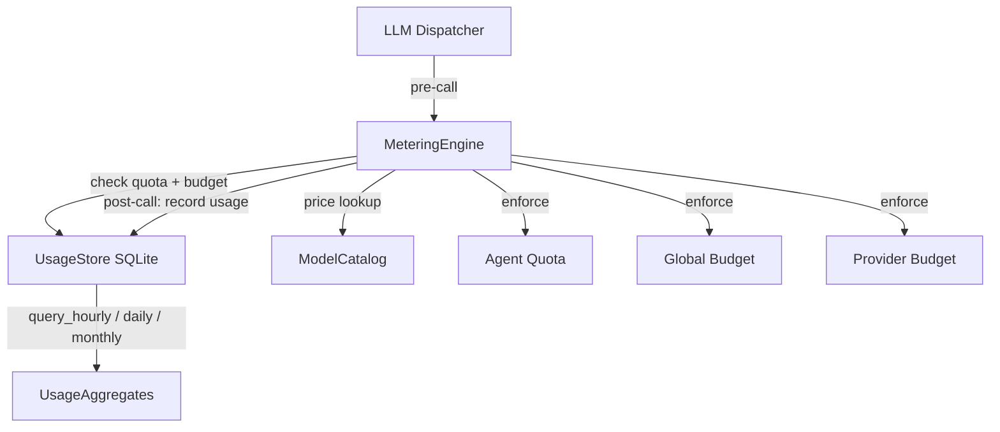

# Kernel Core — librefang-kernel-metering-src

# Kernel Core — librefang-kernel-metering-src

## Purpose

The metering engine tracks LLM usage costs in real time and enforces spending quotas at three levels: **per-agent**, **per-provider**, and **global**. Every LLM call flows through this module before and after execution — it gates requests that would exceed budget limits and persists a `UsageRecord` for analytics and billing.

## Architecture



`MeteringEngine` is a thin coordination layer. It holds an `Arc<UsageStore>` (the SQLite persistence layer from `librefang-memory`) and delegates all SQL to it. Cost estimation optionally consults `ModelCatalog` (from `librefang-runtime`) for provider-specific pricing, falling back to hardcoded defaults when the catalog is unavailable.

## `MeteringEngine`

The sole public struct. Construct it with a shared `UsageStore`:

```rust
let store = Arc::new(UsageStore::new(substrate.usage_conn()));
let engine = MeteringEngine::new(store);
```

All methods are `&self` — the engine is freely shareable across threads via `Arc`.

### Recording Usage

| Method | Scope |
|--------|-------|
| `record(&self, record: &UsageRecord)` | Persist a single usage event. No quota check. |
| `check_quota_and_record(&self, record, quota)` | Atomic: check per-agent quota, then record. Single SQLite transaction. |
| `check_global_budget_and_record(&self, record, budget)` | Atomic: check global budget, then record. Single SQLite transaction. |
| `check_all_and_record(&self, record, quota, budget)` | Atomic: check per-agent quota **and** global budget **and** per-provider budget, then record. Preferred method. |

The atomic variants close the TOCTOU race between checking and recording — concurrent requests cannot both pass the quota check before either writes its usage. On failure the record is **not** inserted.

### Quota Enforcement

Three independent enforcement axes, all following the same pattern:

1. **Per-agent** (`check_quota`) — checks hourly, daily, and monthly cost against `ResourceQuota` fields (`max_cost_per_hour_usd`, `max_cost_per_day_usd`, `max_cost_per_month_usd`), scoped to a single `AgentId`.

2. **Global** (`check_global_budget`) — checks the same three time windows across *all* agents, using `BudgetConfig` fields (`max_hourly_usd`, `max_daily_usd`, `max_monthly_usd`).

3. **Per-provider** (`check_provider_budget`) — checks cost per time window *and* an hourly token cap (`max_tokens_per_hour`), scoped to a provider string (e.g. `"moonshot"`, `"litellm"`). Provider budgets are defined in `BudgetConfig.providers` as a `HashMap<String, ProviderBudget>`.

**Zero limits mean unlimited.** Any limit set to `0.0` (cost) or `0` (tokens) is skipped entirely. This is intentional — it allows partial enforcement (e.g., cap daily spend but leave hourly unlimited).

On violation, all methods return `LibreFangError::QuotaExceeded` with a message identifying the axis, agent/provider, current spend, and limit.

### Querying Usage

| Method | Returns |
|--------|---------|
| `get_summary(agent_id: Option<AgentId>)` | `UsageSummary` — aggregate call count, token totals, cost. Pass `None` for global. |
| `get_by_model()` | `Vec<ModelUsage>` — usage grouped by model name. |
| `budget_status(budget: &BudgetConfig)` | `BudgetStatus` — current spend vs. limits for all windows, with percentage utilization. |

### Cleanup

`cleanup(&self, days: u32)` deletes records older than `days` days. Returns the number of rows removed.

## Cost Estimation

Two static methods estimate cost without touching the database:

### `MeteringEngine::estimate_cost` (fallback)

Uses hardcoded default rates of **$1.00/M input** and **$3.00/M output**. Takes token counts including cache breakdown. Use this when no catalog is available (unit tests, offline scenarios).

### `MeteringEngine::estimate_cost_with_catalog` (preferred)

Looks up the model in `ModelCatalog` for exact per-provider pricing. Falls back to defaults if the model is unknown.

Both methods delegate to the private `estimate_cost_from_rates`, which applies the token pricing formula:

```
regular_input      = total_input − cache_read − cache_creation
regular_input_cost = regular_input      × input_rate  / 1M
cache_read_cost    = cache_read_tokens  × input_rate  × 0.10 / 1M
cache_creation_cost= cache_creation     × input_rate  × 1.25 / 1M
output_cost        = output_tokens      × output_rate / 1M

total = regular_input_cost + cache_read_cost + cache_creation_cost + output_cost
```

Cache-read tokens are discounted to **10%** of the input rate. Cache-creation tokens carry a **25% surcharge** (125% of input rate). This mirrors Anthropic's prompt caching pricing and is applied universally across all providers.

### Special Cases

- **ChatGPT session-auth models** (`provider == "chatgpt"` with zero catalog prices): `should_use_legacy_budget_estimate` detects these and applies the default $1/$3 rates so budgets still function. These models don't expose billable pricing through the API.
- **Local-tier models** (zero catalog prices, non-ChatGPT provider): cost correctly computes as $0.
- **Subscription-based providers** (e.g. `alibaba-coding-plan`): registered with zero cost-per-token. Cost tracking shows $0; users should monitor via the provider console.

## `BudgetStatus`

A serializable snapshot returned by `budget_status`:

| Field | Description |
|-------|-------------|
| `hourly_spend` / `hourly_limit` / `hourly_pct` | Current hour spend, limit, and ratio |
| `daily_spend` / `daily_limit` / `daily_pct` | Current day spend, limit, and ratio |
| `monthly_spend` / `monthly_limit` / `monthly_pct` | Current month spend, limit, and ratio |
| `alert_threshold` | Configured threshold for budget alerts |
| `default_max_llm_tokens_per_hour` | Global default token cap per agent per hour |

Use this for dashboard rendering and alerting. Percentage fields are `0.0` when the corresponding limit is zero (unlimited).

## Dependencies

| Crate | Role |
|-------|------|
| `librefang-memory` | `UsageStore`, `UsageRecord`, `UsageSummary`, `ModelUsage`, `MemorySubstrate` — SQLite persistence and aggregation queries |
| `librefang-types` | `AgentId`, `ResourceQuota`, `LibreFangError`, `BudgetConfig`, `ProviderBudget`, `ModelCatalogEntry` — shared domain types |
| `librefang-runtime` | `ModelCatalog` — runtime pricing data loaded from the model registry |

## Integration Pattern

The typical call flow from an LLM dispatcher:

```rust
// 1. Pre-dispatch: estimate cost (optional, for preview/logging)
let estimated = MeteringEngine::estimate_cost_with_catalog(
    &catalog, model, input_tokens, output_tokens, cache_read, cache_creation,
);

// 2. Post-response: atomically check all budgets and record
let record = UsageRecord {
    agent_id,
    provider: provider_name.to_string(),
    model: model.to_string(),
    input_tokens,
    output_tokens,
    cost_usd: estimated,
    tool_calls,
    latency_ms,
};

engine.check_all_and_record(&record, &agent_quota, &global_budget)?;
```

If `check_all_and_record` returns `QuotaExceeded`, the dispatcher should abort the agent's next iteration or fall back to a cheaper model.