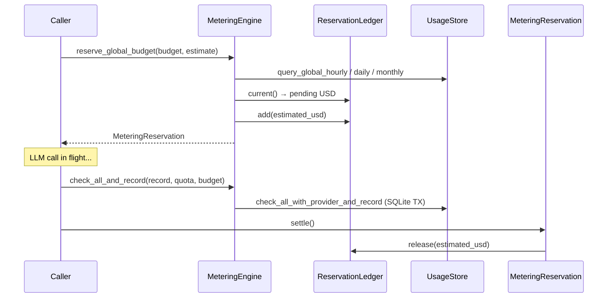

# Kernel Core — librefang-kernel-metering-src

# librefang-kernel-metering

LLM cost tracking and spending-quota enforcement for the LibreFang kernel.

## Overview

The metering engine sits between the LLM dispatch layer and the persistent usage store. Every LLM call flows through it twice: once **before** the call (to reserve budget and check quotas) and once **after** (to record actual usage and settle the reservation). This two-phase approach prevents concurrent requests from collectively overspending a configured cap.

## Architecture



## Key Types

### `MeteringEngine`

The primary entry point. Wraps a `UsageStore` (SQLite-backed) and an in-memory `CostReservationLedger`.

**Construction:**

```rust
let store = Arc::new(UsageStore::new(substrate.usage_conn()));
let engine = MeteringEngine::new(store);
```

### `MeteringReservation`

A `#[must_use]` RAII guard returned by `reserve_global_budget`. It holds a pre-charged USD amount in the in-memory ledger and releases it automatically on drop if the caller forgets to settle explicitly.

| Method | When to call |
|--------|-------------|
| `settle()` | After the LLM response has been recorded via `check_all_and_record` or `record`. |
| `release()` | When the dispatch failed before any cost was incurred. |
| (drop) | Safety net — releases the reservation if neither `settle` nor `release` was called. |

### `BudgetStatus`

A serializable snapshot of current spend versus configured limits across hourly, daily, and monthly windows. Used by dashboards and alerting.

## Budget Enforcement Layers

The engine enforces budgets at four independent levels, each with hourly/daily/monthly windows:

| Layer | Method | Scope | Comparison |
|-------|--------|-------|------------|
| Per-agent quota | `check_quota` | Single agent | `>=` (reject at limit) |
| Global budget | `check_global_budget` | All agents combined | `>=` (reject at limit) |
| Per-provider budget | `check_provider_budget` | Single provider | `>=` (reject at limit) |
| Per-user budget | `check_user_budget` | Single user (RBAC) | `>=` (reject at limit) |
| Pre-call reservation | `reserve_global_budget` | All agents, pre-call | `>` (allow exact-fit) |

The pre-call reservation uses `>` (strictly greater than) so a single call that exactly reaches the cap is still allowed. Post-call checks use `>=` so once the limit is fully consumed, no further calls are dispatched. This asymmetry is intentional.

**Zero limits are treated as unlimited** and are skipped entirely. This applies to all layers.

## Cost Estimation

### `estimate_cost` (catalog-free)

Fallback method that applies default rates of $1.00/M input and $3.00/M output. Use this when no model catalog is available (e.g., unit tests).

### `estimate_cost_with_catalog` (preferred)

Looks up per-model pricing from the `ModelCatalog`. Falls back to default rates if the model is not found. Special-cases ChatGPT session-auth models (`provider == "chatgpt"` with zero pricing) by applying the default legacy rates for budget estimation purposes.

### Cache token pricing

Both estimation methods account for prompt caching:

| Token type | Price multiplier |
|-----------|-----------------|
| Regular input | 1.0× input rate |
| Cache-read | 0.10× input rate |
| Cache-creation | 1.25× input rate |
| Output | 1.0× output rate |

Regular input tokens are computed as `input_tokens - cache_read_input_tokens - cache_creation_input_tokens`, clamped to zero via `saturating_sub`.

## Atomic Check-and-Record

The non-atomic pattern of `check_quota` → `record` has a TOCTOU race: concurrent requests both pass the check before either writes. The engine provides three atomic variants that wrap check + insert in a single SQLite transaction:

- **`check_quota_and_record`** — per-agent quota only.
- **`check_global_budget_and_record`** — global budget only.
- **`check_all_and_record`** — per-agent quota + global budget + per-provider budget, all in one transaction. This is the **preferred** method for post-call recording.

When `check_all_and_record` fails, the usage record is **not** inserted. The caller's `MeteringReservation` is still in flight and will be released via `settle` or drop.

## Concurrency and the Reservation Ledger (#3616)

The in-memory `CostReservationLedger` solves a specific concurrency bug: when N triggers fire simultaneously, they all read the same pre-call total from SQLite, all pass the budget gate, and all commit — producing multi-x overshoots.

The ledger holds the estimated cost of every in-flight call so that `reserve_global_budget` can include pending spend in its decision:

```
projected = sqlite_spent + in_flight_reserved + this_call_estimate
```

This synchronization is in-process only. Two processes (or a process plus an out-of-band SQL writer) can still race. The post-call `check_all_and_record` path provides the SQLite-level atomicity that catches any residual overrun.

## Usage Patterns

### Typical LLM dispatch flow

```rust
// 1. Reserve budget before the call
let reservation = engine.reserve_global_budget(&budget, estimated_usd)?;

// 2. Make the LLM call
let response = llm_client.complete(prompt).await?;

// 3. Atomically check all quotas and record usage
let record = UsageRecord { /* ... */ };
engine.check_all_and_record(&record, &quota, &budget)?;

// 4. Settle the reservation
reservation.settle();
```

### On dispatch failure

```rust
let reservation = engine.reserve_global_budget(&budget, estimated_usd)?;
match llm_client.complete(prompt).await {
    Ok(response) => { /* record and settle */ },
    Err(_) => reservation.release(),
}
```

### Diagnostic queries

```rust
// Current spend vs limits
let status: BudgetStatus = engine.budget_status(&budget);

// Usage summary, optionally filtered by agent
let summary = engine.get_summary(Some(agent_id))?;

// Usage grouped by model
let by_model = engine.get_by_model()?;

// Pending in-flight USD (for debugging)
let pending = engine.pending_reserved_usd();

// Clean up records older than N days
let removed = engine.cleanup(90)?;
```

## Dependencies

- **`librefang_memory::usage`** — `UsageStore`, `UsageRecord`, `UsageSummary`, `ModelUsage` (SQLite persistence layer)
- **`librefang_types`** — `AgentId`, `UserId`, `ResourceQuota`, `BudgetConfig`, `ProviderBudget`, `UserBudgetConfig`, `ModelCatalogEntry`, error types
- **`librefang_runtime::model_catalog`** — `ModelCatalog` for pricing lookups in `estimate_cost_with_catalog`