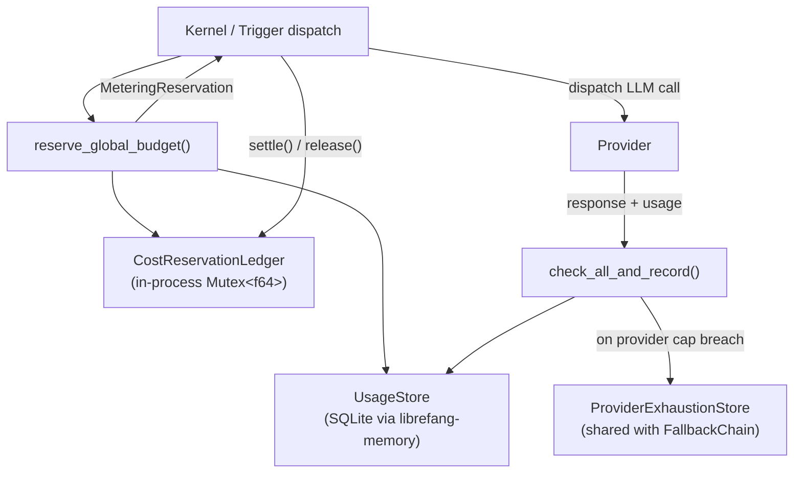

# Kernel Core — librefang-kernel-metering-src

# Kernel Core — `librefang-kernel-metering`

Cost-tracking and quota-enforcement engine for LLM calls. Every request that reaches an LLM provider passes through this module to record spend and verify that none of the configured budget ceilings have been breached.

## Architecture


```mermaid
graph TD
    Caller["Kernel / Trigger dispatch"] --> Reserve["reserve_global_budget()"]
    Reserve --> Ledger["CostReservationLedger<br/>(in-process Mutex&lt;f64&gt;)"]
    Reserve --> UsageStore["UsageStore<br/>(SQLite via librefang-memory)"]
    Caller -->|"dispatch LLM call"| LLM["Provider"]
    LLM -->|"response + usage"| Record["check_all_and_record()"]
    Record --> UsageStore
    Record -->|"on provider cap breach"| Exhaustion["ProviderExhaustionStore<br/>(shared with FallbackChain)"]
    Reserve -->|"MeteringReservation"| Caller
    Caller -->|"settle() / release()"| Ledger
```

The engine sits between the kernel's trigger-dispatch loop and the LLM provider layer. It does **not** call LLMs itself — it gates and records.

## Core Types

### `MeteringEngine`

The primary entry point. Holds three pieces of state:

| Field | Purpose |
|-------|---------|
| `store: Arc<UsageStore>` | SQLite-backed persistent usage store. All settled cost lives here. |
| `pending: Arc<CostReservationLedger>` | In-memory `Mutex<f64>` tracking reserved-but-unsettled USD. Prevents concurrent-request budget overshoot (#3616). |
| `exhaustion: Option<ProviderExhaustionStore>` | Shared with the LLM fallback chain. When a per-provider budget cap trips, the provider is flagged as `BudgetExceeded` so subsequent calls skip it entirely (#4807). |

Construction uses a builder pattern:

```rust
let engine = MeteringEngine::new(usage_store)
    .with_exhaustion_store(shared_exhaustion_store);
```

### `CostReservationLedger` (private)

An in-process `Mutex<f64>` that holds the total estimated USD for all in-flight LLM calls. The key method is `check_and_add`, which atomically validates a set of budget caps and commits the reservation under a single lock acquisition — closing the check-then-add race described in #3616.

### `MeteringReservation`

A `#[must_use]` RAII token returned by `reserve_global_budget`. It carries the reserved USD estimate and releases it on drop as a safety net (so panics between reserve and settle don't permanently lock the budget). Explicit lifecycle:

- **`settle()`** — call after the LLM response is recorded. Releases the reservation so the in-memory ledger stops double-counting against the now-persisted SQLite row.
- **`release()`** — call on dispatch failure when no cost was actually incurred.
- **`Drop`** — defensive fallback. Releases if neither `settle` nor `release` was called.

### `BudgetStatus`

A serializable snapshot of current spend versus configured limits across hourly, daily, and monthly windows. Used by dashboard/API routes.

## Budget Enforcement Layers

The engine enforces four independent budget scopes, each with hourly/daily/monthly windows:

### 1. Global Budget

Applies across all agents and providers.

| Method | When to use |
|--------|-------------|
| `reserve_global_budget` | **Pre-call.** Reserves estimated cost in the in-memory ledger. Rejects if `settled + pending + this_call > limit` (uses `>`, not `>=`, so a single call landing exactly at the cap is allowed). |
| `check_global_budget` | **Post-call or dashboard.** Reads settled spend from SQLite plus current pending. Uses `>=` (reject at limit). The asymmetry with `reserve_global_budget` is intentional: pre-call allows the final call that exactly fills the cap; post-call blocks everything after. |
| `check_global_budget_and_record` | **Atomic.** Checks and records in a single SQLite transaction. |

### 2. Per-Agent Quota

Each agent has its own `ResourceQuota` with `max_cost_per_hour_usd`, `max_cost_per_day_usd`, `max_cost_per_month_usd`.

- `check_quota(agent_id, quota)` — non-atomic check (pre-call gating or dashboards).
- `check_quota_and_record(record, quota)` — atomic check + insert in one transaction (closes the TOCTOU race between separate check and record calls).

### 3. Per-Provider Budget

Operator-configured caps in `BudgetConfig.providers`, keyed by provider name. Supports both cost (`max_cost_per_hour_usd`, etc.) and token (`max_tokens_per_hour`) limits.

- `check_provider_budget(provider, budget)` — non-atomic, for pre-dispatch gating. When a cap trips **and** an exhaustion store is wired, the provider is automatically flagged as `BudgetExceeded` for `DEFAULT_LONG_BACKOFF`. The LLM fallback chain reads this flag and skips the provider on subsequent calls instead of attempting a request that would only be denied again.
- Per-provider limits are also enforced atomically inside `check_all_and_record`.

### 4. Per-User Budget (RBAC M5)

Post-call enforcement keyed by `UserId`. Checked **after** `check_all_and_record` succeeds — the LLM call already happened, so "exceeded" means the *next* call from this user is denied, not that the current one is rolled back.

- `check_user_budget(user_id, budget)`

### Combined Atomic Check

`check_all_and_record(record, quota, budget)` is the preferred post-call method. It checks per-agent quota, global budget, and per-provider budget (including per-provider token limits) in a single SQLite transaction, then inserts the usage record. On failure, no row is inserted.

## Cost Estimation

Two paths exist for estimating USD cost from token counts:

### `estimate_cost` (catalog-free)

Uses hardcoded default rates ($1.00/M input, $3.00/M output). Exists as a fallback when no catalog is available (unit tests, bootstrapping).

### `estimate_cost_with_catalog` (preferred)

Looks up pricing from the `ModelCatalog`. Falls back to default rates when the model isn't found. Handles a special case for ChatGPT session-auth models (`provider == "chatgpt"`): when catalog pricing is $0/$0 (subscription-based, not token-billed), the function applies the default rates instead so budget enforcement still works with a conservative estimate. Local models with zero pricing remain at $0 — no legacy override.

### Token Pricing Rules

| Token type | Price multiplier |
|------------|-----------------|
| Regular input | 1.0× input rate |
| Cache-read input | 0.10× input rate |
| Cache-creation input | 1.25× input rate |
| Output | 1.0× output rate |

Cache tokens are deducted from the regular input count: `regular_input = input_tokens.saturating_sub(cache_read + cache_creation)`. Both the inner addition and outer subtraction use saturating arithmetic to prevent overflow from malicious or buggy provider responses (audit: `metering-token-overflow`).

## Integration Points

### `librefang-memory`

The `UsageStore` provides SQLite-backed persistence. Key queries used by this module:

- `query_hourly` / `query_daily` / `query_monthly` — per-agent spend in time windows.
- `query_global_hourly` / `query_today_cost` / `query_global_monthly` — global spend.
- `query_provider_hourly` / `query_provider_daily` / `query_provider_monthly` / `query_provider_tokens_hourly` — per-provider spend.
- `query_user_hourly` / `query_user_daily` / `query_user_monthly` — per-user spend.
- `check_all_with_provider_and_record` — atomic multi-scope check + insert.

### `librefang-llm-driver`

Only the `exhaustion` module is imported — specifically `ProviderExhaustionStore`, `ExhaustionReason`, and `DEFAULT_LONG_BACKOFF`. The metering engine writes to this store; the fallback chain reads from it. Both layers share the same instance so they observe a coherent view of provider availability.

### `librefang-types`

Domain types: `AgentId`, `UserId`, `ResourceQuota`, `BudgetConfig`, `ProviderBudget`, `UserBudgetConfig`, `ModelCatalogEntry`, `LibreFangError`.

### `librefang-runtime`

`ModelCatalog` for pricing lookups. The engine never constructs a catalog itself — callers pass a reference.

## Concurrency Model

`CostReservationLedger` uses a `std::sync::Mutex`. The critical section in `check_and_add` is deliberately tight: it reads the current pending total, validates against all caps, and either commits the addition or returns an error — all under one lock hold. SQLite queries run *outside* the lock because they can be slow and may fail; the settled-spend values they return are monotonic within a time window, so stale reads can only make the gate stricter, not more permissive.

This only synchronizes in-process callers. Two separate processes (or a process + an out-of-band SQL writer) can still race on the settled total. The post-call `check_all_and_record` path provides the SQLite-level atomicity for that case.

## Common Patterns

### Typical pre-call flow

```rust
let reservation = engine.reserve_global_budget(&budget, estimated_usd)?;

// Check provider-specific budget (also flags exhaustion store on breach).
engine.check_provider_budget("openai", &provider_budget)?;

match dispatch_llm_call().await {
    Ok(response) => {
        let record = build_usage_record(response);
        engine.check_all_and_record(&record, &agent_quota, &budget)?;
        engine.check_user_budget(user_id, &user_budget)?;
        reservation.settle();
    }
    Err(_) => {
        reservation.release();
    }
}
```

### Key asymmetry to remember

- **Pre-call** (`reserve_global_budget`): rejects when `spent + pending + this_call > limit` — the `>` allows one final call that exactly reaches the cap.
- **Post-call** (`check_global_budget`): rejects when `spent + pending >= limit` — once the limit is fully consumed, nothing else gets through.