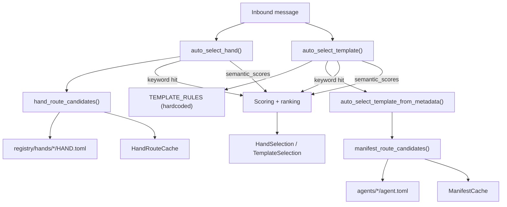

# Kernel Core — librefang-kernel-router-src

# Kernel Core — `librefang-kernel-router`

The router determines which specialist agent should handle an incoming user message. It runs on every inbound dispatch, scoring candidate agents through keyword matching and optional semantic similarity, then selecting the highest-scoring match.

## Architecture Overview



## Two Routing Layers

The module provides two independent routing entry points. Callers typically invoke one or both depending on whether they need a **hand** (a persistent multi-step agent with tools) or a **template** (a stateless specialist agent configuration).

### Hand Routing — `auto_select_hand`

```rust
pub fn auto_select_hand(
    message: &str,
    semantic_scores: Option<&HashMap<String, f32>>,
) -> HandSelection
```

Routes to a hand defined in `registry/hands/<id>/HAND.toml`. Keywords come from the `[routing]` section of each hand's manifest:

- **`aliases` / `strong_aliases`** → treated as strong phrases (weight 6)
- **`weak_aliases`** → treated as weak phrases (weight 1)
- **Description-derived phrases** → added to strong set automatically
- **ID-derived tokens** (e.g. `"data"` from `"data-scientist"`) → added to weak set, after filtering generic English words

Returns `HandSelection { hand_id, reason, score }`. When no hand reaches the minimum score threshold (`MIN_HAND_SCORE = 2`), `hand_id` is `None`.

### Template Routing — `auto_select_template`

```rust
pub fn auto_select_template(
    message: &str,
    agents_dir: &Path,
    semantic_scores: Option<&HashMap<String, f32>>,
) -> TemplateSelection
```

Routes to a template specialist. This function evaluates **three** signal sources in priority order:

1. **Hardcoded `TEMPLATE_RULES`** — a curated table of 28 specialists with bilingual regex patterns (English + Chinese). These behave like explicit aliases.
2. **Manifest metadata** — per-template `[metadata.routing]` from `agent.toml` files discovered in `agents_dir`. Supports `aliases`, `weak_aliases`, and `exclude_generated`.
3. **Semantic-only fallback** — when keyword matching yields nothing, templates with embedding cosine similarity ≥ `SEMANTIC_ONLY_THRESHOLD` (0.55) become candidates.

**Multi-domain detection**: If the message matches two different specialties equally well *and* contains tokens like "同时", "协作", "multi", or "together", the router returns `"orchestrator"` instead of picking one.

**Default**: When nothing matches, the function falls back to `"orchestrator"`.

## Scoring System

All routing uses the same scoring model:

| Signal type | Weight | Constant |
|---|---|---|
| Explicit alias / strong keyword hit | 6 | `EXPLICIT_ALIAS_WEIGHT` |
| Generated phrase (from name/tags/description) | 2 | `GENERATED_PHRASE_WEIGHT` |
| Weak alias / weak keyword hit | 1 | `WEAK_PHRASE_WEIGHT` |
| Semantic similarity bonus | 0–5 (scaled from 0.0–1.0 cosine) | `MAX_SEMANTIC_BONUS` |

For hand routing, generated phrases inherit the strong weight. For template routing from metadata, generated phrases use the lower weight of 2.

**Minimum thresholds**:
- Hand routing: `MIN_HAND_SCORE = 2` (a single weak hit is rejected as too noisy)
- Template routing: no minimum — even a single weak match produces a candidate

**Tie-breaking**: higher score wins; on equal scores, the candidate with more matching hits wins; on further ties, alphabetical order of the template/hand ID.

## Phrase Generation Pipeline

When a hand or template doesn't define explicit aliases, the router auto-generates matchable phrases:

```
description ──► split_phrase_chunks() ──► normalize_phrase_chunk()
                     │                        │
                     │                        ├─ strips leading/trailing generics
                     │                        └─ returns meaningful core words
                     │
                     └─► description_phrases() ──► ascii_phrase_candidates()
                                                     (English: word unigrams + bigrams)
                                                  or passes through as-is
                                                  (CJK: 2–32 char meaningful segments)
```

**Generic word filtering**: The `GENERIC_ENGLISH_WORDS` list (40+ entries including "a", "the", "helper", "system", "assistant") is stripped from generated English phrases so that a template named `"data-analysis-helper"` produces `"data analysis"`, not `"data analysis helper"`.

**Tag phrases**: Template tags go through `tag_phrases()`, which applies the same `ascii_phrase_candidates()` logic for ASCII tags and passes through CJK tags verbatim.

## Keyword Matching

Two matching strategies are used depending on content type:

### ASCII phrases — `phrase_matches` (regex-based)

Builds a word-boundary regex: `(^|[^a-z0-9])<escaped_phrase>([^a-z0-9]|$)` with case-insensitive matching. Spaces in the phrase become `[\s_-]+` to match `"release notes"` against `"release-notes"` or `"release_notes"`.

### CJK / Unicode phrases — substring match

Case-folded `contains()` check. Phrases between 2 and 32 characters are considered meaningful.

### Regex caching

All compiled patterns are stored in a global `REGEX_CACHE` (`OnceLock<Mutex<HashMap<String, Regex>>>`), so the same pattern compiles only once across all routing calls.

## Caching Strategy

Three global caches avoid redundant I/O and computation on every message:

| Cache | Static | Key | Invalidation |
|---|---|---|---|
| `REGEX_CACHE` | `OnceLock<Mutex<HashMap>>` | Pattern string | Never (append-only) |
| `HAND_ROUTE_CACHE` | `OnceLock<Mutex<Option<...>>>` | Home directory path | `invalidate_hand_route_cache()` |
| `MANIFEST_CACHE` | `OnceLock<Mutex<Option<...>>>` | `agents_dir` path | `invalidate_manifest_cache()` |

Call `invalidate_manifest_cache()` and `invalidate_hand_route_cache()` after config hot-reload or agent install/uninstall. Both are safe to call even if the cache hasn't been initialized yet.

## Public API Summary

### Entry Points

| Function | Returns | Purpose |
|---|---|---|
| `auto_select_hand(message, semantic_scores)` | `HandSelection` | Select the best hand for a message |
| `auto_select_template(message, agents_dir, semantic_scores)` | `TemplateSelection` | Select the best template for a message |
| `load_template_manifest(home_dir, template)` | `Result<AgentManifest, String>` | Load and parse a specific `agent.toml` |
| `all_template_descriptions(agents_dir)` | `Vec<(String, String)>` | Get `(template, embed_text)` pairs for building embeddings |

### Configuration

| Function | Purpose |
|---|---|
| `set_hand_route_home_dir(path)` | Set the LibreFang home directory for hand route loading |
| `invalidate_hand_route_cache()` | Force rebuild of hand route candidates |
| `invalidate_manifest_cache()` | Force rebuild of manifest route candidates |

### Home Directory Resolution

`resolve_hand_route_home_dir()` checks, in order:
1. `set_hand_route_home_dir()` value
2. `LIBREFANG_HOME` environment variable
3. `~/.librefang` (via `dirs::home_dir()`, falling back to temp dir)

## Output Types

```rust
pub struct HandSelection {
    pub hand_id: Option<String>,  // None when no match
    pub reason: String,           // e.g. "matched browser via open website, fill form"
    pub score: usize,
}

pub struct TemplateSelection {
    pub template: String,         // Always set (defaults to "orchestrator")
    pub reason: String,
    pub score: usize,
}
```

## Integration Points

- **`librefang_types::agent::AgentManifest`** — parsed TOML manifest structure
- **`librefang_hands::registry::parse_hand_toml_with_agents_dir`** — parses `HAND.toml` with optional agents directory for `base = "<template>"` resolution
- **`librefang_runtime::registry_sync::resolve_home_dir_for_tests`** — test-only home directory setup

The `semantic_scores` parameter on both routing functions receives pre-computed embedding cosine similarities from the kernel's embedding layer. When `None`, the router degrades gracefully to keyword-only matching — non-English input without keyword patterns simply returns no match rather than erroring.

## Excluded Templates

Templates listed in `ROUTING_EXCLUDED_TEMPLATES` (`["assistant"]`) are excluded from manifest-based routing and from `all_template_descriptions()`. They can still be loaded directly via `load_template_manifest()`.

## Security

`is_safe_template_name()` validates that template names contain only ASCII alphanumeric characters, hyphens, and underscores, preventing directory traversal in `load_template_manifest_at()`.