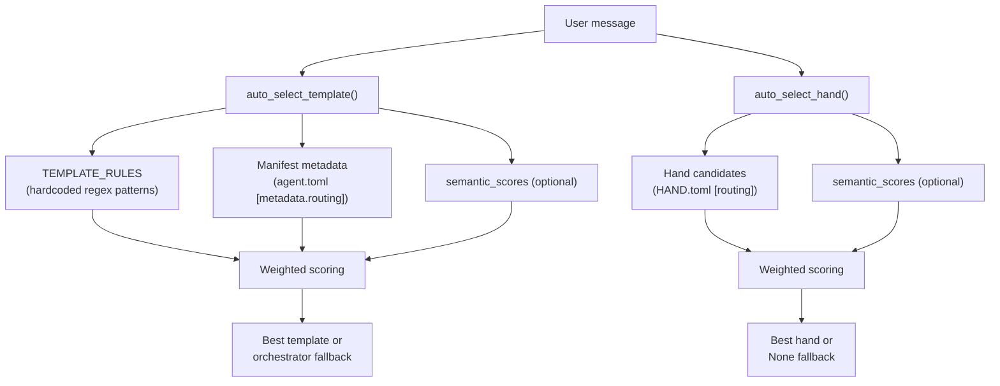

# Kernel Core — librefang-kernel-router-src

# librefang-kernel-router

Message-to-specialist routing engine. Given a user message, this module determines which agent template or hand is best suited to handle it, using a layered scoring system that blends keyword matching with optional embedding-based semantic similarity.

## Architecture



## Public API

### `auto_select_template(message, agents_dir, semantic_scores) -> TemplateSelection`

Routes a user message to the best agent template.

| Parameter | Type | Description |
|---|---|---|
| `message` | `&str` | The raw user message |
| `agents_dir` | `&Path` | Path to the agents workspace directory (e.g. `$HOME/.librefang/workspaces/agents`) |
| `semantic_scores` | `Option<&HashMap<String, f32>>` | Optional precomputed cosine similarities keyed by template name |

Returns a `TemplateSelection` containing the chosen `template` name, a human-readable `reason`, and the numeric `score`.

**Routing priority:**

1. Keyword matching against both hardcoded `TEMPLATE_RULES` and manifest `[metadata.routing]` aliases.
2. If no keyword match, semantic-only candidates with similarity ≥ `SEMANTIC_ONLY_THRESHOLD` (0.55) are considered.
3. If multiple templates score closely and the message contains multi-domain indicators (`"同时"`, `"multi"`, `"分别"`, etc.), the message is routed to `"orchestrator"`.
4. If nothing matches at all, defaults to `"orchestrator"`.

### `auto_select_hand(message, semantic_scores) -> HandSelection`

Routes a user message to the best hand. Hands are tool-using agents defined in `HAND.toml` files under `$LIBREFANG_HOME/registry/hands/`.

| Parameter | Type | Description |
|---|---|---|
| `message` | `&str` | The raw user message |
| `semantic_scores` | `Option<&HashMap<String, f32>>` | Optional cosine similarities keyed by hand ID |

Returns a `HandSelection`. When no hand scores above `MIN_HAND_SCORE` (2), `hand_id` is `None`.

### `load_template_manifest(home_dir, template) -> Result<AgentManifest, String>`

Loads and parses an `agent.toml` manifest from `$home_dir/workspaces/agents/$template/agent.toml`. Validates the template name against path-traversal characters (only `a-zA-Z0-9`, `-`, `_` allowed).

### `all_template_descriptions(agents_dir) -> Vec<(String, String)>`

Returns `(template_name, embed_text)` pairs for all routable templates (excludes `"assistant"`). The `embed_text` field concatenates name, description, and tags for embedding computation. Used by the kernel to build template embeddings for semantic routing.

### Cache Control

| Function | Purpose |
|---|---|
| `set_hand_route_home_dir(home_dir)` | Set the LibreFang home directory for hand candidate loading |
| `invalidate_hand_route_cache()` | Clear cached hand candidates; call after hand install/uninstall |
| `invalidate_manifest_cache()` | Clear cached manifest candidates; call after config hot-reload or agent changes |

## Scoring System

All routing uses the same weighted scoring model:

| Signal | Weight | Source |
|---|---|---|
| Explicit alias / strong keyword | 6 | User-configured aliases in `[metadata.routing]`, hardcoded strong patterns |
| Generated phrase | 2 | Auto-derived from template name, tags, description |
| Weak alias / weak keyword | 1 | User-configured weak aliases, id-derived tokens |
| Semantic bonus | 0–5 | `floor(similarity × MAX_SEMANTIC_BONUS)` |

### Thresholds

| Constant | Value | Purpose |
|---|---|---|
| `MIN_HAND_SCORE` | 2 | Single weak hit (score 1) is too noisy; requires strong hit or multiple weak hits |
| `MAX_SEMANTIC_BONUS` | 5.0 | Caps semantic contribution so keywords still dominate |
| `SEMANTIC_ONLY_THRESHOLD` | 0.55 | Minimum cosine similarity for a semantic-only match when no keywords hit |

### Hand candidate phrase sources

**Strong phrases** (`strong_phrases`):
- Explicit `aliases` from `[routing]` section in `HAND.toml`
- Phrases derived from the hand's `description` field via `description_phrases()`

**Weak phrases** (`weak_phrases`):
- Explicit `weak_aliases` from `[routing]` section
- Tokens from the hand ID split on `-` and `_`, filtered by length ≥ 3 and not in `GENERIC_ENGLISH_WORDS`

## Keyword Matching

### Regex-based matching (TEMPLATE_RULES)

The 30 hardcoded `RouteRule` entries each define labeled regex patterns in two tiers:

- **Strong patterns** — high-confidence intent signals like `\bdebug\b`, `代码审查`, `deploy`
- **Weak patterns** — lower-confidence signals like `\bcode\b`, `日志`, `review`

All patterns are compiled with `(?i)` (case-insensitive) and cached in `REGEX_CACHE` for reuse.

### Phrase-based matching (manifest metadata and hand routing)

Uses `phrase_matches()` which branches on content type:

- **ASCII phrases**: Wraps the phrase in word-boundary regex `(^|[^a-z0-9])phrase([^a-z0-9]|$)` with spaces mapped to `[\s_-]+`.
- **Non-ASCII phrases** (CJK, etc.): Simple case-insensitive `contains` check.

## Phrase Generation Pipeline

```
description / tags
       │
       ▼
  split_phrase_chunks()     Split on punctuation (.,;，。、etc.)
       │
       ▼
  normalize_phrase_chunk()  Strip leading/trailing generic English words
       │
       ▼
  ┌─────┴──────┐
  ASCII?       Non-ASCII
  │            │
  ▼            ▼
  ascii_phrase_candidates()  is_meaningful_unicode_phrase()
  │                           │
  ├─ english_variants()       └─ Keep if 2–32 chars
  ├─ content words (≥4 chars, non-generic)
  └─ bigram windows
       │
       ▼
     dedupe()
```

The `GENERIC_ENGLISH_WORDS` list (~45 entries including "a", "the", "helper", "specialist", "workflow") is used throughout to filter out noise from auto-generated phrases.

## Bilingual Support

`TEMPLATE_RULES` patterns cover both English and Chinese intents:

```rust
RouteRule {
    target: "coder",
    strong: &[
        ("implement", r"\bimplement\b|\bbuild\b|\brefactor\b|\bpatch\b"),
        ("写代码", r"写代码|实现功能|补丁|脚本|编码|重构|开发"),
    ],
    weak: &[
        ("code", r"\bcode\b|\bfunction\b|\bapi\b"),
        ("代码", r"代码|程序|模块|接口"),
    ],
}
```

For languages without hardcoded patterns (Japanese, Korean, etc.), routing relies on the `semantic_scores` parameter — the kernel precomputes embedding similarities against template/hand descriptions and passes them in.

## Caching Strategy

Three global `OnceLock<Mutex<...>>` caches avoid redundant work:

| Cache | Key | Invalidated by |
|---|---|---|
| `REGEX_CACHE` | Raw pattern string | Never (patterns are static) |
| `MANIFEST_CACHE` | `agents_dir` path | `invalidate_manifest_cache()` |
| `HAND_ROUTE_CACHE` | `home_dir` path string | `invalidate_hand_route_cache()` |

The incoming call graph shows that `invalidate_hand_route_cache()` is called from `install_hand` and `uninstall_hand` in the skills route handler. `invalidate_manifest_cache()` should be called on config hot-reload or agent install/uninstall.

## Template Exclusion

`ROUTING_EXCLUDED_TEMPLATES` currently contains `["assistant"]`. Templates in this list are skipped during manifest candidate building and excluded from `all_template_descriptions()`.