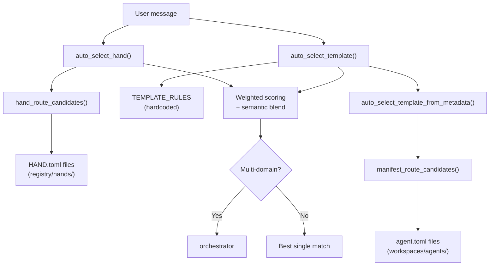

# Kernel Core — librefang-kernel-router-src

# Kernel Core — `librefang-kernel-router`

The routing engine that maps incoming user messages to the best-matching **hand** (multi-agent workflow) or **template** (single agent specialist). It combines keyword matching, manifest metadata, and optional embedding-based semantic similarity to produce a scored routing decision on every inbound message.

## Architecture Overview



## Public API

### `auto_select_hand`

```rust
pub fn auto_select_hand(
    message: &str,
    semantic_scores: Option<&HashMap<String, f32>>,
) -> HandSelection
```

Selects the best hand for a message using keyword matching against `HAND.toml` `[routing]` sections. Returns `HandSelection` with the hand ID (or `None`), a human-readable reason string, and a numeric score.

### `auto_select_template`

```rust
pub fn auto_select_template(
    message: &str,
    agents_dir: &Path,
    semantic_scores: Option<&HashMap<String, f32>>,
) -> TemplateSelection
```

Selects the best agent template using two sources in parallel:

1. **Hardcoded `TEMPLATE_RULES`** — curated regex patterns for ~30 built-in templates covering coding, testing, architecture, writing, DevOps, research, and domain-specific tasks.
2. **Manifest metadata** — dynamic rules extracted from `agent.toml` files found in `agents_dir`, driven by `[metadata.routing]` configuration.

Falls back to `"orchestrator"` when no specialist matches. Routes to `"orchestrator"` when multiple specialists match and the message contains coordination language (e.g., "同时", "分别", "multi", "together").

### `load_template_manifest`

```rust
pub fn load_template_manifest(
    home_dir: &Path,
    template: &str,
) -> Result<AgentManifest, String>
```

Loads and parses an `agent.toml` from `<home_dir>/workspaces/agents/<template>/`. Template names are validated to contain only ASCII alphanumeric characters, hyphens, and underscores.

### `all_template_descriptions`

```rust
pub fn all_template_descriptions(agents_dir: &Path) -> Vec<(String, String)>
```

Returns `(template_name, embed_text)` pairs for all routable templates (excluding `"assistant"`). The `embed_text` field concatenates the manifest name, description, and tags for use by the kernel's embedding pipeline. Call this to build the similarity vectors that get passed back into `auto_select_hand` / `auto_select_template` as `semantic_scores`.

### Cache Management

```rust
pub fn set_hand_route_home_dir(home_dir: &Path)
pub fn invalidate_hand_route_cache()
pub fn invalidate_manifest_cache()
```

The module maintains three global caches backed by `OnceLock<Mutex<...>>`:

| Cache | Static | Invalidation |
|---|---|---|
| Compiled regex patterns | `REGEX_CACHE` | Never (patterns are immutable) |
| Hand route candidates | `HAND_ROUTE_CACHE` | `invalidate_hand_route_cache()` |
| Manifest route candidates | `MANIFEST_CACHE` | `invalidate_manifest_cache()` |

Call `invalidate_hand_route_cache()` and `invalidate_manifest_cache()` after hand installs/uninstalls or config hot-reload. Both are invoked from the skills route handlers (`install_hand`, `uninstall_hand`) in the HTTP layer.

The hand route home directory defaults to `$LIBREFANG_HOME` or `~/.librefang`. Override it with `set_hand_route_home_dir` during application initialization.

## Scoring System

All routing uses a weighted scoring model with optional semantic blending:

| Signal | Weight | Source |
|---|---|---|
| Explicit alias / strong keyword | 6 | `HAND.toml` `aliases`, `TEMPLATE_RULES` strong patterns, manifest `[metadata.routing].aliases` |
| Generated phrase | 2 | Auto-derived from template name, description, and tags |
| Weak alias / weak keyword | 1 | `HAND.toml` `weak_aliases`, `TEMPLATE_RULES` weak patterns, manifest `[metadata.routing].weak_aliases` |
| Semantic similarity bonus | 0–5 | `f32` cosine similarity × `MAX_SEMANTIC_BONUS` (5.0), rounded to `usize` |

### Hand threshold

`MIN_HAND_SCORE = 2`. A single weak hit (score 1) is rejected as too noisy. At minimum one strong hit or two weak hits are required.

### Semantic-only fallback

When keyword matching produces zero candidates, the module falls back to semantic-only matching against templates/hands whose embedding similarity exceeds `SEMANTIC_ONLY_THRESHOLD` (0.55). This enables routing of non-English input (Chinese, Japanese, Korean) when embedding scores are provided.

### Multi-domain detection

When the top two scoring templates differ and the message contains coordination tokens (`"同时"`, `"分别"`, `"协作"`, `"多个"`, `"multi"`, `"together"`), the router selects `"orchestrator"` instead of either individual template.

## Phrase Extraction Pipeline

The module extracts routing phrases from three sources within each agent manifest:

```
template name ──► english_variants() ──► split on hyphens/underscores, filter generic words
description   ──► description_phrases() ──► split on punctuation/CJK separators
tags          ──► tag_phrases() ──► per-tag extraction
```

### Key extraction functions

- **`english_variants(text)`** — Produces the raw name, a space-joined variant, and individual hyphen-split tokens (length ≥ 3, not in `GENERIC_ENGLISH_WORDS`).
- **`description_phrases(description)`** — Splits on phrase separators (ASCII punctuation, CJK punctuation `、。，；：`), strips leading/trailing non-alphanumeric characters, trims generic English words from boundaries, then generates word-level and bigram candidates.
- **`tag_phrases(tags)`** — Per-tag extraction: ASCII tags produce word variants and individual words; Unicode tags are kept verbatim if they pass `is_meaningful_unicode_phrase` (2–32 characters).
- **`manifest_routing_config(manifest)`** — Reads `[metadata.routing]` from `agent.toml`, returning `(aliases, weak_aliases, exclude_generated)`. When `exclude_generated = true`, auto-generated phrases are suppressed for that template.

### Phrase matching

- **ASCII phrases**: Compiled as case-insensitive regex with word-boundary awareness (`(^|[^a-z0-9])phrase([^a-z0-9]|$)`), cached globally in `REGEX_CACHE`.
- **Unicode phrases**: Simple `str::contains` on lowercased inputs.

All compiled patterns are deduplicated via `dedupe()` which preserves insertion order.

## Hand Route Loading

Hands are discovered from `<home_dir>/registry/hands/*/HAND.toml`. The loading pipeline:

1. `hand_route_candidates()` checks the global cache, keyed by home directory path.
2. On cache miss, `build_hand_route_candidates()` delegates to `load_hand_route_candidates()`.
3. Each `HAND.toml` is parsed via `librefang_hands::registry::parse_hand_toml_with_agents_dir()` with the agents registry directory passed in so `base = "<template>"` references resolve correctly.
4. Parse failures emit a `tracing::warn` and the hand is excluded from routing (not silently dropped).
5. `hand_route_candidate_from_definition()` extracts strong phrases (explicit `aliases` + description-derived) and weak phrases (explicit `weak_aliases` + id-derived tokens).

## TEMPLATE_RULES

The hardcoded rule table contains ~30 entries. Each `RouteRule` specifies:

- **`target`** — template name (e.g., `"coder"`, `"debugger"`, `"architect"`)
- **`strong`** — labeled regex patterns with bilingual coverage (English + Chinese), scored at weight 6
- **`weak`** — lower-confidence patterns, scored at weight 1

Templates excluded from routing are listed in `ROUTING_EXCLUDED_TEMPLATES` (currently `["assistant"]`).

## Return Types

```rust
pub struct HandSelection {
    pub hand_id: Option<String>,  // None when no hand matches
    pub reason: String,           // e.g. "matched coder via implement, 写代码"
    pub score: usize,
}

pub struct TemplateSelection {
    pub template: String,         // always set; defaults to "orchestrator"
    pub reason: String,
    pub score: usize,
}
```

## Integration Points

| Caller | What it calls | When |
|---|---|---|
| HTTP skills routes | `invalidate_hand_route_cache()` | On hand install/uninstall |
| Kernel message dispatch | `auto_select_hand()`, `auto_select_template()` | Every inbound message |
| Embedding pipeline | `all_template_descriptions()` | Building/rebuilding embedding index |
| App initialization | `set_hand_route_home_dir()` | During startup |

The module depends on `librefang_types::agent::AgentManifest` for manifest deserialization, `librefang_hands` for `HandDefinition` and `parse_hand_toml_with_agents_dir`, and `regex_lite` for pattern matching.