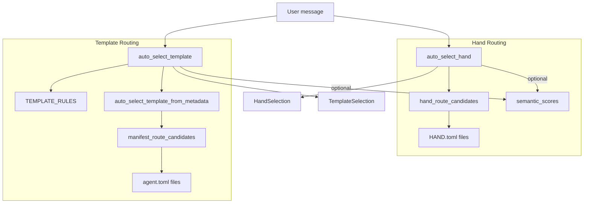

# Kernel Core — librefang-kernel-router-src

# Kernel Router (`librefang-kernel-router`)

The router is the central dispatch module in LibreFang. Given a freeform user message, it decides **which agent template** or **which hand** should handle the request. It combines keyword matching, manifest metadata analysis, and optional embedding-based semantic similarity into a single scored ranking.

## Architecture Overview



## Core Types

| Type | Purpose |
|------|---------|
| `HandSelection` | Result of hand routing — `hand_id` is `None` when no hand matches. |
| `TemplateSelection` | Result of template routing — always returns a template (falls back to `"orchestrator"`). |
| `RouteRule` | A hardcoded keyword rule with strong/weak regex pattern groups targeting a named template. |
| `HandRouteCandidate` | A hand loaded from disk, with its strong and weak phrase lists ready for matching. |
| `ManifestRouteCandidate` | A template loaded from `agent.toml`, carrying explicit aliases, generated phrases, and weak phrases. |

## Primary Public API

### `auto_select_hand(message, semantic_scores) -> HandSelection`

Routes a message to the best-matching hand. Candidates are built from `HAND.toml` files found under `$LIBREFANG_HOME/registry/hands/`.

- Strong phrases come from `[routing].aliases` plus description-derived phrases.
- Weak phrases come from `[routing].weak_aliases` plus tokenized hand ID segments.
- A minimum score of `MIN_HAND_SCORE` (2) is required. A single weak hit (score 1) is rejected as too noisy.
- When `semantic_scores` is provided, cosine similarities are blended in as bonus points (`similarity × MAX_SEMANTIC_BONUS`, rounded).

Returns `HandSelection { hand_id: None, .. }` when nothing reaches threshold.

### `auto_select_template(message, agents_dir, semantic_scores) -> TemplateSelection`

Routes a message to the best-matching agent template through a two-layer pipeline:

1. **Hardcoded rules** (`TEMPLATE_RULES`) — a curated table of 28 template rules with bilingual (English + Chinese) regex patterns. These score at the `EXPLICIT_ALIAS_WEIGHT` (6) tier.
2. **Manifest metadata** (`auto_select_template_from_metadata`) — scans `agents_dir/*/agent.toml` for `[metadata.routing]` aliases and auto-generated phrases from names/tags/descriptions.

**Multi-domain detection**: When the top two scoring templates differ and the message contains tokens like "同时", "分别", "协作", "multi", or "together", the router falls back to `"orchestrator"` to coordinate multiple specialists.

**Fallback**: If nothing matches at all, returns `"orchestrator"`.

### `load_template_manifest(home_dir, template) -> Result<AgentManifest, String>`

Reads and parses `home_dir/workspaces/agents/{template}/agent.toml`. Validates the template name against `is_safe_template_name` (ASCII alphanumeric plus `-` and `_`).

### `all_template_descriptions(agents_dir) -> Vec<(String, String)>`

Returns `(template_name, embed_text)` pairs for all routable templates (excluding `"assistant"`). Used by the kernel to precompute embedding vectors for semantic routing. The embed text combines name, description, and tags.

## Scoring Model

```
final_score = explicit_alias_hits × 6
            + generated_phrase_hits × 2
            + weak_phrase_hits × 1
            + round(semantic_similarity × 5.0)
```

| Constant | Value | Meaning |
|----------|-------|---------|
| `EXPLICIT_ALIAS_WEIGHT` | 6 | Hand-curated aliases and hardcoded rule patterns |
| `GENERATED_PHRASE_WEIGHT` | 2 | Auto-extracted phrases from tags/descriptions |
| `WEAK_PHRASE_WEIGHT` | 1 | Weak aliases and tokenized ID segments |
| `MAX_SEMANTIC_BONUS` | 5.0 | Upper bound on semantic contribution |
| `SEMANTIC_ONLY_THRESHOLD` | 0.55 | Minimum similarity for a semantic-only match |
| `MIN_HAND_SCORE` | 2 | Floor for hand routing to suppress noise |

Templates have no minimum score threshold — a single weak hit (score 1) can route, but the orchestrator fallback catches genuinely ambiguous cases.

## Phrase Extraction Pipeline

The router extracts routing phrases from agent metadata in a language-agnostic way:

1. **`description_phrases`** — Splits description text on punctuation and CJK separators (。、，；etc.), strips generic English stop words (defined in `GENERIC_ENGLISH_WORDS`), and produces matching candidates. ASCII phrases go through `ascii_phrase_candidates` for word-level and bigram extraction. CJK phrases pass through directly if 2–32 characters.

2. **`tag_phrases`** — Each tag is treated as a phrase candidate. ASCII tags are further split into sub-words and bigrams. CJK tags are kept intact.

3. **`english_variants`** — Generates space-separated and hyphen-split variants of compound names (e.g., `"release-notes"` → `["release-notes", "release notes", "release", "notes"]`).

4. **`manifest_routing_config`** — Reads `[metadata.routing]` from `agent.toml` for `aliases`, `strong_aliases`, `weak_aliases`, and the `exclude_generated` flag.

## Matching Functions

### `phrase_matches(message, phrase)`

Language-aware substring matching:
- **ASCII phrases**: Escaped as regex with word-boundary-aware patterns (`(^|[^a-z0-9])phrase([^a-z0-9]|$)`), case-insensitive. Spaces in the phrase become flexible separators (`[\s_-]+`).
- **Unicode phrases**: Simple case-insensitive `contains` check.

### `regex_matches(message, pattern)`

Compiles regex patterns lazily into a global cache (`REGEX_CACHE`). Failed compilations produce a never-match sentinel. All patterns are wrapped in `(?i)` for case-insensitivity.

## Caching

Three independent caches backed by `OnceLock<Mutex<...>>`:

| Cache | Key | Invalidation |
|-------|-----|-------------|
| `HAND_ROUTE_CACHE` | Home directory path | `invalidate_hand_route_cache()` |
| `MANIFEST_CACHE` | `agents_dir` path | `invalidate_manifest_cache()` |
| `REGEX_CACHE` | Pattern string | Never (append-only) |

The routing skill endpoints call `invalidate_hand_route_cache()` after `install_hand` / `uninstall_hand` operations. Config hot-reload should call both `invalidate_manifest_cache()` and `invalidate_hand_route_cache()`.

## Home Directory Resolution

Hand route candidates require a LibreFang home directory, resolved in order:

1. Explicitly set via `set_hand_route_home_dir()` (used by the runtime at startup).
2. `LIBREFANG_HOME` environment variable.
3. `~/.librefang` (falling back to the system temp directory if `dirs::home_dir()` returns `None`).

## Hardcoded Template Rules

The `TEMPLATE_RULES` table covers 28 specialist templates with bilingual keyword patterns:

`hello-world`, `coder`, `debugger`, `test-engineer`, `code-reviewer`, `architect`, `security-auditor`, `devops-lead`, `researcher`, `analyst`, `data-scientist`, `planner`, `writer`, `tutor`, `doc-writer`, `translator`, `email-assistant`, `meeting-assistant`, `social-media`, `sales-assistant`, `customer-support`, `recruiter`, `legal-assistant`, `personal-finance`, `recipe-assistant`, `travel-planner`, `health-tracker`, `home-automation`, `ops`, `orchestrator`.

Each rule has a `strong` list (label → regex pairs, scored at weight 6) and an optional `weak` list (scored at weight 1). Strong patterns typically include both English and Chinese variants.

The `ROUTING_EXCLUDED_TEMPLATES` list (`["assistant"]`) prevents certain templates from appearing in metadata-based routing.

## Integration Points

| Caller | When |
|--------|------|
| `install_hand` / `uninstall_hand` (skills routes) | Invalidates hand route cache after registry changes |
| Kernel startup | Calls `set_hand_route_home_dir()` to establish the hand registry path |
| Kernel routing loop | Calls `auto_select_hand()` and `auto_select_template()` per message |
| Embedding precompute | Calls `all_template_descriptions()` to build vectors for semantic routing |

## Testing Conventions

Tests use `ensure_registry()` to set up the hand route home directory via `librefang_runtime::registry_sync::resolve_home_dir_for_tests()`. The `hand()` helper wraps `auto_select_hand` without semantic scores for concise assertions.

Test categories cover:
- Per-hand keyword routing (collector, researcher, clip, predictor, trader, etc.)
- `MIN_HAND_SCORE` threshold enforcement
- Negative/boundary cases (generic greetings, short ambiguous messages)
- Semantic score blending (Chinese, Japanese, Korean fallback)
- Cache consistency
- Custom hand loading from temp directories