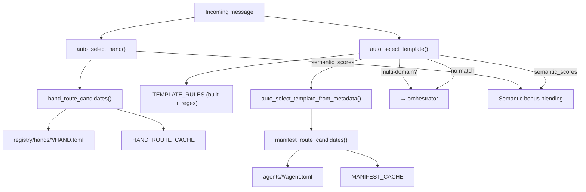

# Kernel Core — librefang-kernel-router-src

# Kernel Core — `librefang-kernel-router-src`

The routing engine that decides which specialist agent or multi-agent hand should handle an incoming user message. It layers keyword matching, manifest metadata, and optional embedding-based semantic similarity to produce a scored routing decision.

## Architecture



## Public API

### `auto_select_hand(message, semantic_scores) → HandSelection`

Selects the best hand for a message. Hands are multi-agent workflows loaded from `HAND.toml` definitions in the registry.

```rust
pub fn auto_select_hand(
    message: &str,
    semantic_scores: Option<&HashMap<String, f32>>,
) -> HandSelection
```

- **`message`** — the raw user message text.
- **`semantic_scores`** — optional map of `hand_id → cosine similarity` from an embedding model. Used to boost scores for cross-lingual matching.

Returns a `HandSelection`:
```rust
pub struct HandSelection {
    pub hand_id: Option<String>,  // None means no match
    pub reason: String,            // human-readable explanation
    pub score: usize,              // aggregate routing score
}
```

### `auto_select_template(message, agents_dir, semantic_scores) → TemplateSelection`

Selects the best single-agent template specialist. Evaluates built-in keyword rules first, then manifest metadata. Falls back to `"orchestrator"` when no single specialist clearly wins or when multi-domain intent is detected.

```rust
pub fn auto_select_template(
    message: &str,
    agents_dir: &Path,
    semantic_scores: Option<&HashMap<String, f32>>,
) -> TemplateSelection
```

Returns a `TemplateSelection`:
```rust
pub struct TemplateSelection {
    pub template: String,  // template directory name
    pub reason: String,
    pub score: usize,
}
```

### Manifest Loading

```rust
pub fn load_template_manifest(home_dir: &Path, template: &str) -> Result<AgentManifest, String>
```

Loads and parses `workspaces/agents/<template>/agent.toml`. Validates the template name against ASCII alphanumeric/dash/underscore characters via `is_safe_template_name`.

```rust
pub fn all_template_descriptions(agents_dir: &Path) -> Vec<(String, String)>
```

Returns `(template_name, embed_text)` pairs for all routable templates (excludes `"assistant"`). Used by the kernel to build embedding vectors for semantic routing.

### Cache Management

```rust
pub fn set_hand_route_home_dir(home_dir: &Path)
pub fn invalidate_hand_route_cache()
pub fn invalidate_manifest_cache()
```

Call `set_hand_route_home_dir` at startup to set the LibreFang home directory for hand loading. Call the invalidate functions after config hot-reload or agent install/uninstall to force cache rebuilds.

## Scoring System

The router uses a weighted scoring model across three signal tiers:

| Signal | Weight | Source |
|---|---|---|
| Explicit alias / strong keyword | **6** | `aliases`/`strong_aliases` in HAND.toml `[routing]`, or hand-curated regex rules |
| Generated phrase | **2** | Auto-derived from template name, description, and tags |
| Weak phrase | **1** | `weak_aliases` in config, or id-derived tokens (after filtering generic words) |
| Semantic bonus | **0–5** | `floor(similarity × 5.0)` from embedding cosine similarity |

### Thresholds

- **`MIN_HAND_SCORE = 2`** — a hand candidate must score ≥ 2 to be considered. A single weak hit (score 1) is rejected as noise.
- **`SEMANTIC_ONLY_THRESHOLD = 0.55`** — minimum similarity for semantic-only fallback when keyword matching produces zero hits.

### Multi-domain Detection

In `auto_select_template`, when the top two scored templates differ and the message contains multi-domain markers (`同时`, `分别`, `协作`, `多个`, `multi`, `together`), the router selects `"orchestrator"` instead of either specialist.

## Keyword Matching Pipeline

### Built-in Rules (`TEMPLATE_RULES`)

~30 hand-curated `RouteRule` entries, each with:
- **strong patterns** — high-confidence regex patterns (both English and Chinese)
- **weak patterns** — lower-confidence patterns
- **target** — the template name to route to

Patterns are compiled once and cached in `REGEX_CACHE` (`OnceLock<Mutex<HashMap<String, Regex>>>`). All regex matching is case-insensitive (`(?i)` prefix).

### Manifest Metadata Routing

For each template directory under `agents_dir` containing an `agent.toml`:

1. Reads `[metadata.routing]` from the manifest:
   - `aliases` / `strong_aliases` → explicit aliases (weight 6)
   - `weak_aliases` → weak phrases (weight 1)
   - `exclude_generated = true` → skip auto-generation
2. Auto-generates phrases from:
   - Template name via `english_variants()` — splits on `-` and `_`, filters tokens ≥ 3 chars that aren't in `GENERIC_ENGLISH_WORDS`
   - Description via `description_phrases()` — splits on language-aware punctuation, strips generic English stop words from edges
   - Tags via `tag_phrases()` — passes through non-ASCII tags directly, generates variants for ASCII tags
3. Scores against the message using `phrase_matches()`.

### Hand Routing from HAND.toml

Hands are loaded from `<home_dir>/registry/hands/*/HAND.toml` using `librefang_hands::registry::parse_hand_toml_with_agents_dir`. Each hand's `[routing]` section provides `aliases` and `weak_aliases`. Additional strong phrases are derived from the hand's description. Weak phrases include id-derived tokens after generic word filtering.

Parse failures are logged at WARN level (not silently swallowed) since routing runs on every inbound message.

## Phrase Matching

`phrase_matches(message, phrase)` handles two cases:

- **ASCII phrases** — builds a word-boundary regex: `(^|[^a-z0-9])<escaped>([^a-z0-9]|$)`, with spaces mapped to `[\s_-]+`. Uses the global `REGEX_CACHE`.
- **Unicode phrases** — case-insensitive `contains` check.

## Text Processing Utilities

### `description_phrases(text)`

Splits description text into chunks using language-aware separators (ASCII punctuation, CJK punctuation: `、。，；：（）–—`). For ASCII chunks, strips generic English words from leading/trailing edges via `normalize_phrase_chunk`, then generates candidates through `ascii_phrase_candidates`. For CJK chunks, passes through directly if 2–32 characters.

### `english_variants(text)`

Produces routing variants: the original lowercase form, space-separated form (replacing `-`/`_`), and individual parts ≥ 3 characters.

### `GENERIC_ENGLISH_WORDS`

A stop-list of ~45 common English words (`a`, `the`, `helper`, `specialist`, `assistant`, etc.) filtered out during phrase generation to reduce noise.

## Caching

Three `OnceLock<Mutex<...>>` caches avoid redundant work on every message:

| Cache | Key | Invalidated by |
|---|---|---|
| `REGEX_CACHE` | regex pattern string | never (grows, never stale) |
| `MANIFEST_CACHE` | `agents_dir` path | `invalidate_manifest_cache()` |
| `HAND_ROUTE_CACHE` | resolved home dir string | `invalidate_hand_route_cache()` |

The manifest and hand caches also auto-rebuild if their key (directory path) changes between calls.

## Home Directory Resolution

`resolve_hand_route_home_dir()` checks in order:
1. Explicit path set via `set_hand_route_home_dir()`
2. `LIBREFANG_HOME` environment variable
3. `~/.librefang` (falling back to temp dir if no home)

## Dependencies on Other Crates

- **`librefang_types`** — `AgentManifest` struct for parsed agent.toml manifests
- **`librefang_hands`** — `parse_hand_toml_with_agents_dir()` for HAND.toml parsing and `HandDefinition`
- **`regex_lite`** — regex compilation and matching
- **`serde_json`** — reading `[metadata.routing]` from manifest's JSON-value metadata field