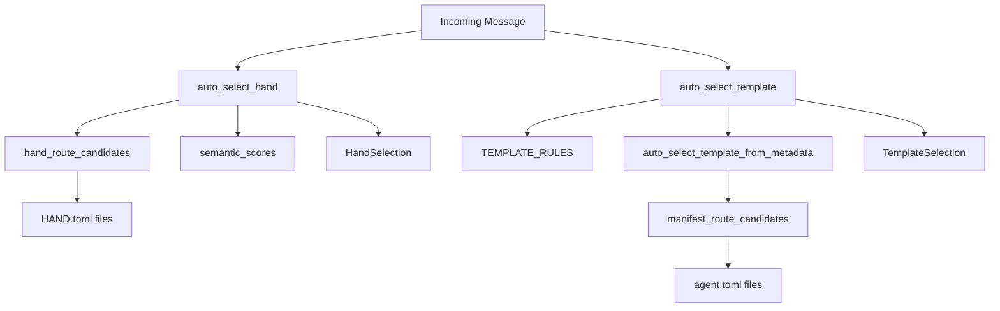

# Kernel Core — librefang-kernel-router-src

# Kernel Core — `librefang-kernel-router`

The router determines which agent or multi-agent workflow should handle an incoming user message. It combines keyword matching (English + CJK), manifest metadata, and optional embedding-based semantic similarity into a single scoring pipeline, then selects the best candidate or falls back to the orchestrator.

## Architecture Overview


```mermaid
flowchart TD
    MSG[Incoming Message] --> ASH[auto_select_hand]
    MSG --> AST[auto_select_template]

    ASH --> HRC[hand_route_candidates]
    HRC --> HANDS[HAND.toml files]
    ASH --> SEM_H[semantic_scores]

    AST --> RULES[TEMPLATE_RULES]
    AST --> META[auto_select_template_from_metadata]
    META --> MRC[manifest_route_candidates]
    MRC --> MANIFESTS[agent.toml files]

    ASH --> RESULT_H[HandSelection]
    AST --> RESULT_T[TemplateSelection]
```

Two independent routing paths exist:

| Path | Function | Source of routing data | Selects |
|---|---|---|---|
| **Hand routing** | `auto_select_hand` | `HAND.toml` `[routing]` sections | A hand (multi-agent workflow) |
| **Template routing** | `auto_select_template` | Hardcoded `TEMPLATE_RULES` + `agent.toml` metadata | A single agent template |

Both paths use the same scoring model and can blend in embedding similarity scores for cross-lingual support.

## Public API

### `auto_select_hand(message, semantic_scores) -> HandSelection`

Routes a message to a hand. Loads candidate phrases from all installed `HAND.toml` files under `$LIBREFANG_HOME/registry/hands/`, scores each candidate, and returns the best match.

```rust
let sel = auto_select_hand("deploy to production", None);
// HandSelection { hand_id: Some("devops"), reason: "matched devops via deploy", score: 6 }

let sel = auto_select_hand("こんにちは", None);
// HandSelection { hand_id: None, reason: "no hand match", score: 0 }
```

When `semantic_scores` is provided, cosine similarity values (0.0–1.0) are converted to bonus points (up to `MAX_SEMANTIC_BONUS = 5`) and added to the keyword score. This enables routing messages in languages not covered by keyword rules.

### `auto_select_template(message, agents_dir, semantic_scores) -> TemplateSelection`

Routes a message to a template agent. Runs two sub-pipelines in parallel:

1. **Hardcoded rules** (`TEMPLATE_RULES`) — curated regex patterns for ~30 built-in templates covering both English and CJK keywords.
2. **Manifest metadata** (`auto_select_template_from_metadata`) — dynamically loaded from `agent.toml` files, using user-configured aliases, auto-generated phrases from name/description/tags, and weak tokens.

If multiple specialties score equally and the message contains multi-domain cues (e.g. "同时", "协作", "multi"), the result escalates to `"orchestrator"`.

Returns a default of `"orchestrator"` when no specialist matches.

### `load_template_manifest(home_dir, template) -> Result<AgentManifest, String>`

Loads and parses an `agent.toml` for the given template name from `$home_dir/workspaces/agents/<template>/`.

### `all_template_descriptions(agents_dir) -> Vec<(String, String)>`

Returns `(template_name, embed_text)` for every routable template. The embed text combines name, description, and tags — designed for computing embedding vectors for semantic routing. Templates in `ROUTING_EXCLUDED_TEMPLATES` (currently `["assistant"]`) are excluded.

### Cache Invalidation

```rust
pub fn set_hand_route_home_dir(home_dir: &Path)  // set the base directory for hand loading
pub fn invalidate_hand_route_cache()              // clear hand candidate cache
pub fn invalidate_manifest_cache()                // clear manifest candidate cache
```

Call these after config hot-reload, agent install/uninstall, or when the home directory changes.

## Scoring Model

All routing uses a three-tier keyword system:

| Tier | Source | Weight | Constant |
|---|---|---|---|
| **Explicit aliases** | `[routing].aliases` / `[routing].strong_aliases` / hardcoded rule `strong` | 6 pts | `EXPLICIT_ALIAS_WEIGHT` |
| **Generated phrases** | Auto-extracted from name, description, tags | 2 pts | `GENERATED_PHRASE_WEIGHT` |
| **Weak phrases** | `[routing].weak_aliases` + id-derived tokens | 1 pt | `WEAK_PHRASE_WEIGHT` |

Semantic bonus is added on top: `(similarity × 5.0).round()` points, capped at 5.

### Hand Routing Threshold

Hand routing requires a minimum score of `MIN_HAND_SCORE = 2`. A single weak hit (score 1) is too noisy and is rejected. A single strong hit (score 6) always passes.

### Multi-Domain Escalation (Template Routing)

When the top two template candidates are different and the message contains multi-domain tokens (`"同时"`, `"分别"`, `"协作"`, `"多个"`, `"multi"`, `"together"`), routing escalates to `"orchestrator"` instead of picking one specialist.

### Semantic-Only Fallback

When keyword matching produces zero hits, both routing paths check `semantic_scores` for any candidate with similarity ≥ `SEMANTIC_ONLY_THRESHOLD` (0.55). The semantic bonus alone becomes the score, enabling cross-lingual routing without any keyword overlap.

## Phrase Extraction Pipeline

The router extracts routing phrases from several sources, handling both ASCII and CJK text:

```
description/tags → split_phrase_chunks → normalize_phrase_chunk → ascii_phrase_candidates / direct inclusion
```

Key functions:

- **`description_phrases(text)`** — Splits on punctuation (both ASCII and CJK: `、。，（）—` etc.), strips generic English words (`"the"`, `"helper"`, `"specialist"` etc. from `GENERIC_ENGLISH_WORDS`), and generates phrase candidates.
- **`tag_phrases(tags)`** — Similar processing for tag strings.
- **`english_variants(text)`** — For hyphenated names like `"code-reviewer"`, generates `"code reviewer"`, `"code"`, `"reviewer"`.
- **`ascii_phrase_candidates(text, min_len)`** — Extracts content words ≥ `min_len` chars and bigram windows.

All outputs pass through `dedupe()` which preserves insertion order while removing duplicates.

## Regex Cache

The router compiles regex patterns for keyword matching. To avoid unbounded memory growth (each message could trigger new pattern compilations), patterns are cached in a bounded FIFO structure:

```
RegexCache {
    entries: HashMap<String, Option<Regex>>,  // pattern → compiled (or None for invalid)
    order: VecDeque<String>,                  // insertion order for FIFO eviction
}
```

- **Capacity**: `MAX_REGEX_CACHE_ENTRIES = 4096`
- **Eviction**: FIFO — oldest pattern evicted when capacity is exceeded
- **Invalid patterns**: Cached as `None` to prevent recompilation floods
- **Case insensitivity**: All patterns are compiled with `(?i)` prefix

The cache is a global `OnceLock<Mutex<RegexCache>>` accessed via `regex_matches()`.

## Data Sources

### Hand Route Candidates

Loaded from `$LIBREFANG_HOME/registry/hands/*/HAND.toml` using `librefang_hands::registry::parse_hand_toml_with_agents_dir`. Each hand contributes:

- **Strong phrases**: `[routing].aliases` + phrases extracted from `description`
- **Weak phrases**: `[routing].weak_aliases` + tokens from the hand ID (filtered by length ≥ 3 and not in `GENERIC_ENGLISH_WORDS`)

Parse failures are logged at WARN level and the hand is excluded from routing.

### Manifest Route Candidates

Loaded from `<agents_dir>/<template>/agent.toml`. Each manifest contributes:

- **Explicit aliases**: `[metadata.routing].aliases` + `strong_aliases`
- **Generated phrases**: English variants of template name + tag phrases + description phrases (unless `exclude_generated = true`)
- **Weak phrases**: `[metadata.routing].weak_aliases` + ID-derived tokens

The `[metadata.routing]` TOML section supports:
```toml
[metadata.routing]
aliases = ["release notes"]
weak_aliases = ["changelog"]
exclude_generated = false
```

### Hardcoded Template Rules

`TEMPLATE_RULES` is a static array of `RouteRule` structs, each containing a `target` template name, `strong` regex patterns (label + regex pairs), and `weak` patterns. Each rule supports both English and CJK patterns. These ~30 rules cover built-in templates like `coder`, `debugger`, `architect`, `security-auditor`, `translator`, etc.

### Home Directory Resolution

The hand route home directory is resolved in order:

1. Explicitly set via `set_hand_route_home_dir()`
2. `LIBREFANG_HOME` environment variable
3. `~/.librefang` (falling back to temp dir if no home exists)

## Return Types

```rust
pub struct HandSelection {
    pub hand_id: Option<String>,  // None means no match
    pub reason: String,           // human-readable routing explanation
    pub score: usize,             // total routing score
}

pub struct TemplateSelection {
    pub template: String,  // always set — defaults to "orchestrator"
    pub reason: String,
    pub score: usize,
}
```

## Thread Safety

All caches use `Mutex` guards over `OnceLock`-initialized storage. The regex cache, hand route cache, and manifest cache are each independent. Lock poisoning is handled by `unwrap_or_else(|e| e.into_inner())` — a poisoned lock recovers its data rather than panicking.