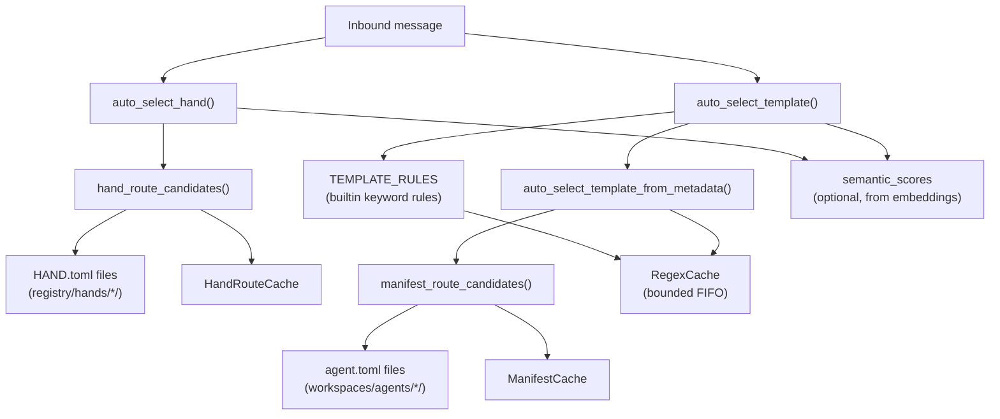

# Kernel Core — librefang-kernel-router-src

# Kernel Router (`librefang-kernel-router`)

## Purpose

The kernel router dispatches inbound user messages to the best-matching specialist agent template or hand. It combines three scoring signals—hardcoded keyword rules, dynamically loaded manifest metadata, and optional embedding-based semantic similarity—into a single ranked selection. When multiple specialists tie or the intent is ambiguous, the router falls back to the `orchestrator` template for multi-step delegation.

## Architecture Overview


```mermaid
flowchart TD
    MSG["Inbound message"] --> HAND["auto_select_hand()"]
    MSG --> TPL["auto_select_template()"]

    HAND --> HRC["hand_route_candidates()"]
    HRC --> HDIR["HAND.toml files<br/>(registry/hands/*/)"]
    HRC --> HRC_CACHE["HandRouteCache"]

    TPL --> RULES["TEMPLATE_RULES<br/>(builtin keyword rules)"]
    TPL --> META["auto_select_template_from_metadata()"]
    META --> MC["manifest_route_candidates()"]
    MC --> ADIR["agent.toml files<br/>(workspaces/agents/*/)"]
    MC --> MC_CACHE["ManifestCache"]

    HAND --> SEM["semantic_scores<br/>(optional, from embeddings)"]
    TPL --> SEM

    RULES --> RC["RegexCache<br/>(bounded FIFO)"]
    META --> RC
```

## Public API

### `auto_select_template(message, agents_dir, semantic_scores) → TemplateSelection`

The primary entry point for template routing. Given a user message, the agents directory on disk, and optional embedding similarity scores, returns a [`TemplateSelection`](#template-selection) identifying the best-matching agent template.

**Routing priority:**

1.  **Builtin keyword rules** (`TEMPLATE_RULES`) — curated regex patterns for 29 specialist templates, bilingual (English + Chinese).
2.  **Manifest metadata** — per-agent `[metadata.routing]` aliases read from `agent.toml` files on disk.
3.  **Semantic-only fallback** — when no keywords match, templates whose embedding cosine similarity exceeds `SEMANTIC_ONLY_THRESHOLD` (0.55) become candidates.
4.  **Orchestrator default** — if nothing matches, the message routes to `orchestrator`.

**Multi-domain detection:** When two different templates both score above zero and the message contains tokens like "同时", "分别", "协作", "多个", "multi", or "together", the router re-routes to `orchestrator` instead of picking a single winner.

### `auto_select_hand(message, semantic_scores) → HandSelection`

Routes a message to a [hand](#hand-routing) (a named group of agents). Loads routing phrases from `HAND.toml` files under the configured home directory. Returns [`HandSelection`](#hand-selection) with the top-scoring hand or `None` if no hand meets the minimum score threshold (`MIN_HAND_SCORE = 2`).

### `set_hand_route_home_dir(home_dir)`

Sets the LibreFang home directory used to discover `HAND.toml` files. Must be called at startup before any hand routing occurs. Falls back to `$LIBREFANG_HOME`, then `~/.librefang`.

### `invalidate_manifest_cache()` / `invalidate_hand_route_cache()`

Clear the internal caches so subsequent routing calls rebuild candidates from disk. Call after config hot-reload, agent install/uninstall, or hand definition changes.

### `load_template_manifest(home_dir, template) → Result<AgentManifest, String>`

Reads and parses `workspaces/agents/<template>/agent.toml`. Validates the template name is safe (alphanumeric, `-`, `_` only).

### `all_template_descriptions(agents_dir) → Vec<(String, String)>`

Returns `(template_name, embed_text)` pairs for every routable template (excludes `assistant`). The embed text is formatted as `"<name>: <description>. Tags: <tags>"` — designed for computing embedding vectors for semantic routing.

## Return Types

### `TemplateSelection`

| Field      | Type     | Description                                                     |
|------------|----------|-----------------------------------------------------------------|
| `template` | `String` | Selected template name (e.g., `"coder"`, `"orchestrator"`)      |
| `reason`   | `String` | Human-readable explanation of why this template was chosen      |
| `score`    | `usize`  | Aggregate routing score (higher = more confident)               |

### `HandSelection`

| Field     | Type            | Description                                              |
|-----------|-----------------|----------------------------------------------------------|
| `hand_id` | `Option<String>`| Matched hand ID, or `None` if no hand met the threshold  |
| `reason`  | `String`        | Explanation of the match or "no hand match"              |
| `score`   | `usize`         | Aggregate routing score                                  |

## Scoring System

The router uses a weighted keyword scoring model with an optional semantic bonus:

| Signal              | Weight constant                | Value |
|---------------------|-------------------------------|-------|
| Explicit alias hit  | `EXPLICIT_ALIAS_WEIGHT`       | 6     |
| Generated phrase hit| `GENERATED_PHRASE_WEIGHT`     | 2     |
| Weak alias hit      | `WEAK_PHRASE_WEIGHT`          | 1     |
| Semantic similarity | `MAX_SEMANTIC_BONUS` (scaled) | 0–5   |

For **hand routing**, the minimum score threshold is `MIN_HAND_SCORE = 2`. A single weak hit (score 1) is considered too noisy. For **template routing**, any score > 0 is sufficient, though the highest-scoring template wins.

Semantic similarity is blended additively: `bonus = round(similarity × 5.0)`. A cosine similarity of 0.9 adds 5 points; 0.4 adds 2 points.

## Template Routing in Detail

### Builtin Rules (`TEMPLATE_RULES`)

29 hardcoded `RouteRule` entries cover the most common specialist intents. Each rule defines:

-   **`target`** — template name (e.g., `"coder"`, `"debugger"`, `"architect"`)
-   **`strong`** — high-confidence regex patterns (labeled), bilingual
-   **`weak`** — lower-confidence regex patterns

Strong patterns match specific intents ("implement a Rust API", "排查报错"), while weak patterns catch broader signals ("code", "日志"). Both are scored as explicit aliases (weight 6 and 1 respectively) because they are hand-curated.

### Manifest-Based Routing

For templates not covered by builtin rules, routing phrases are extracted from `agent.toml`:

```toml
[metadata.routing]
aliases = ["release notes", "changelog generator"]
weak_aliases = ["changelog"]
exclude_generated = false
```

Three phrase tiers are built per template:

1.  **`explicit_aliases`** — from `[metadata.routing].aliases` and `strong_aliases`. Scored at weight 6.
2.  **`generated_phrases`** — auto-extracted from the template name, description, and tags (stripping generic English words). Scored at weight 2. Set `exclude_generated = true` to suppress.
3.  **`weak_phrases`** — from `[metadata.routing].weak_aliases` plus ID-derived tokens (hyphen/split, filtered by length ≥ 3 and not in `GENERIC_ENGLISH_WORDS`). Scored at weight 1.

## Hand Routing in Detail

Hands are higher-level agent groupings defined by `HAND.toml` files in `<home>/registry/hands/<hand-id>/HAND.toml`. The router:

1.  Scans all `HAND.toml` files in `registry/hands/`.
2.  Parses each via `librefang_hands::registry::parse_hand_toml_with_agents_dir` (passing the agents directory so `base = "<template>"` declarations resolve correctly).
3.  Extracts strong phrases (explicit `aliases` + description-derived phrases) and weak phrases (explicit `weak_aliases` + ID-derived tokens).
4.  Scores each hand against the message using the same weighted keyword model.

Parse failures are logged at `WARN` level so misconfigured hands are visible without crashing the router.

## Phrase Extraction

The router extracts routing phrases from free-text descriptions, tags, and template names:

-   **`description_phrases(text)`** — Splits on CJK and ASCII punctuation, filters generic English stop words, and generates phrase candidates. English text produces word-level and bigram candidates; CJK text is kept whole (2–32 characters).
-   **`tag_phrases(tags)`** — Same logic applied to individual tags.
-   **`english_variants(text)`** — For hyphenated names like `"code-reviewer"`, generates `["code-reviewer", "code reviewer", "code", "reviewer"]`.
-   **`ascii_phrase_candidates(text, min_len)`** — Extracts content words (≥ `min_len` characters, not in stop list) and adjacent-word bigrams.

Generic English words (the `GENERIC_ENGLISH_WORDS` list of 44 entries: "a", "agent", "helper", "the", etc.) are stripped from all generated phrases to reduce false positives.

## Regex Cache

All regex matching goes through a bounded FIFO cache (`RegexCache`) backed by a global `OnceLock<Mutex<RegexCache>>`:

-   **Capacity:** `MAX_REGEX_CACHE_ENTRIES = 4096` compiled patterns.
-   **Eviction:** FIFO — oldest pattern evicted when capacity is reached.
-   **Failure caching:** Invalid patterns are cached as `None` so a flood of bad patterns doesn't repeatedly invoke the regex compiler.
-   **Case insensitivity:** All patterns are compiled with the `(?i)` flag automatically.

The cache prevents unbounded memory growth from dynamically generated routing patterns (addressing the `regex-cache-unbounded` audit finding).

## Caching and Invalidation

| Cache               | Key                   | Invalidated by                     |
|---------------------|-----------------------|------------------------------------|
| `MANIFEST_CACHE`    | `agents_dir` path     | `invalidate_manifest_cache()`      |
| `HAND_ROUTE_CACHE`  | `home_dir` path       | `invalidate_hand_route_cache()`    |
| `REGEX_CACHE`       | pattern string        | FIFO eviction only                 |

Both metadata caches are keyed by the directory path they were built from. If the path changes (e.g., a different agents directory is passed), the cache rebuilds automatically. Explicit invalidation is needed when the *contents* of a directory change without the path changing (hot-reload, agent install).

## Configuration

### Environment Variables

| Variable           | Purpose                                             | Fallback             |
|--------------------|-----------------------------------------------------|----------------------|
| `LIBREFANG_HOME`   | Root directory for hand/agent discovery             | `~/.librefang`       |

### Constants

| Constant                   | Value  | Purpose                                                    |
|----------------------------|--------|------------------------------------------------------------|
| `MIN_HAND_SCORE`           | 2      | Minimum score for a hand match to be accepted              |
| `EXPLICIT_ALIAS_WEIGHT`    | 6      | Score per explicit alias / strong rule hit                 |
| `GENERATED_PHRASE_WEIGHT`  | 2      | Score per auto-generated phrase hit                        |
| `WEAK_PHRASE_WEIGHT`       | 1      | Score per weak alias hit                                   |
| `MAX_SEMANTIC_BONUS`       | 5.0    | Maximum bonus points from embedding similarity             |
| `SEMANTIC_ONLY_THRESHOLD`  | 0.55   | Minimum cosine similarity for semantic-only matching       |
| `MAX_REGEX_CACHE_ENTRIES`  | 4096   | Capacity of the compiled regex FIFO cache                  |
| `ROUTING_EXCLUDED_TEMPLATES` | `["assistant"]` | Templates excluded from routing candidate lists |

## Dependencies

-   **`librefang_types::agent::AgentManifest`** — deserialized from `agent.toml`.
-   **`librefang_hands::registry::parse_hand_toml_with_agents_dir`** — parses `HAND.toml` definitions with agent template resolution.
-   **`regex_lite::Regex`** — lightweight regex engine for pattern matching.
-   **`serde_json::Value`** — used to read `[metadata.routing]` from the manifest's metadata field.

## Adding a New Route

### New builtin template rule

Add a `RouteRule` entry to the `TEMPLATE_RULES` array with `target` set to the template name and bilingual `strong`/`weak` regex patterns:

```rust
RouteRule {
    target: "my-specialist",
    strong: &[
        ("specialist intent", r"\bmy specialist intent\b"),
        ("专员意图", r"专员意图|特定操作"),
    ],
    weak: &[("generic", r"\bgeneric\b")],
}
```

### New manifest-routed template

Create `workspaces/agents/my-specialist/agent.toml`:

```toml
name = "my-specialist"
description = "Handles specialist tasks for domain X."
tags = ["domain-x", "specialist"]
module = "builtin:chat"

[model]
provider = "default"
model = "default"
system_prompt = "..."

[metadata.routing]
aliases = ["domain x specialist", "x handler"]
weak_aliases = ["domain x"]
```

No code changes needed — the manifest scanner picks it up automatically.

### New hand route

Create `<home>/registry/hands/my-hand/HAND.toml`:

```toml
id = "my-hand"
name = "My Hand"
description = "Handles domain X operations"
category = "data"

[routing]
aliases = ["domain x operations"]
weak_aliases = ["domain x"]
```

Call `invalidate_hand_route_cache()` after installation.