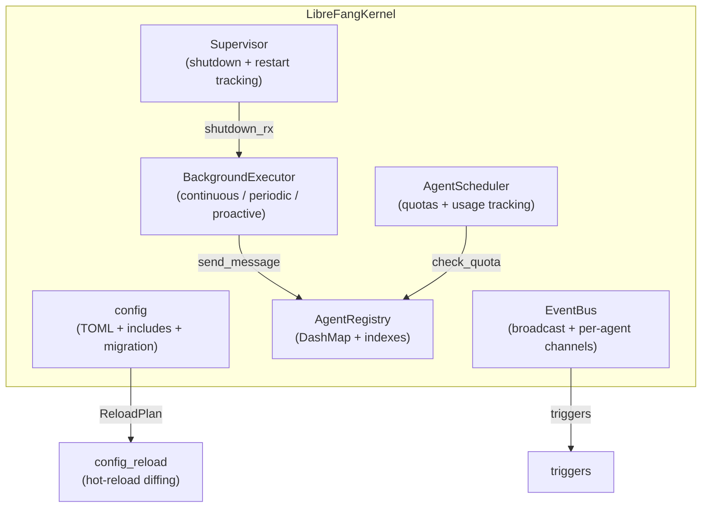

# Kernel Core — librefang-kernel-src

# Kernel Core — `librefang-kernel-src`

The central runtime for the LibreFang Agent Operating System. The kernel manages agent lifecycles, configuration, resource quotas, scheduling, inter-agent communication, and process supervision.

## Architecture



All core state structures use `DashMap` for lock-free concurrent access across tokio tasks. The kernel is designed to run as a single long-lived process (daemon), with the `Supervisor` coordinating graceful shutdown.

---

## Configuration — `config`

Loads `KernelConfig` from `~/.librefang/config.toml` (or `$LIBREFANG_HOME/config.toml`).

### Include system

The `include` field accepts an array of relative TOML paths. Included files are deep-merged first, then the root config overrides them. Security constraints:

- Absolute paths are rejected
- `..` path components are rejected
- Canonical path must stay within the config directory
- Circular includes are detected and rejected
- Maximum nesting depth is 10 (`MAX_INCLUDE_DEPTH`)

Deep merge is handled by `deep_merge_toml`: tables are merged recursively, all other types are overwritten by the overlay.

### Versioned migration

Configs carry a `config_version` integer. When the file version is behind `CONFIG_VERSION`, `run_migrations` transforms the TOML value in-place and writes the migrated config back to disk. On migration failure, the original config is used as a best-effort fallback.

### Strict vs tolerant mode

- **Tolerant** (default): unknown top-level fields are logged as warnings and ignored.
- **Strict** (`strict_config = true`): unknown fields cause the entire config to be rejected, falling back to defaults with `strict_config` preserved.

### Key functions

| Function | Purpose |
|---|---|
| `load_config(path: Option<&Path>)` | Main entry point. Returns `KernelConfig`. |
| `deep_merge_toml(base, overlay)` | Recursively merges two TOML values. |
| `default_config_path()` | Returns `$LIBREFANG_HOME/config.toml` or `~/.librefang/config.toml`. |
| `librefang_home()` | Returns the home directory, respecting the `LIBREFANG_HOME` env var. |

---

## Config Hot-Reload — `config_reload`

Produces a `ReloadPlan` by diffing two `KernelConfig` instances. Every detected change falls into one of three categories:

| Category | Examples | Behavior |
|---|---|---|
| **Restart required** | `api_listen`, `network_enabled`, `memory`, `vault`, `home_dir`, `data_dir` | Cannot be patched at runtime. |
| **Hot-reloadable** | `channels`, `skills`, `mcp_servers`, `tool_policy`, `proxy`, `default_model`, `provider_api_keys`, `approval`, `extensions` | Applied via `HotAction` enum without restart. |
| **No-op** | `log_level`, `language`, `mode`, `stable_prefix_mode`, `sanitize` | Effective immediately via config swap; no explicit action needed. |

### `ReloadPlan`

```rust
pub struct ReloadPlan {
    pub restart_required: bool,
    pub restart_reasons: Vec<String>,
    pub hot_actions: Vec<HotAction>,
    pub noop_changes: Vec<String>,
}
```

- `has_changes()` — returns true if any change was detected.
- `is_hot_reloadable()` — returns true if no restart is required.
- `log_summary()` — emits structured log lines for each category.

### Validation

`validate_config_for_reload(config)` checks:
- `api_listen` is non-empty
- `max_cron_jobs ≤ 10_000`
- Approval policy passes its own validation
- If `network_enabled`, then `network.shared_secret` must be non-empty

### Applying the plan

`should_apply_hot(mode, plan)` maps the configured `ReloadMode` (`Off`, `Restart`, `Hot`, `Hybrid`) to a boolean indicating whether the caller should apply hot actions.

---

## Agent Registry — `registry`

Thread-safe agent store backed by `DashMap` with three indexes:

- **Primary**: `AgentId → AgentEntry`
- **Name**: `String → AgentId` (enforces uniqueness)
- **Tag**: `String → Vec<AgentId>` (for tag-based lookups)

### Concurrency safety

Name uniqueness uses `DashMap::entry()` with the `Entry` API to avoid TOCTOU races between `contains_key` and `insert`. The `update_name` method atomically inserts the new name index entry before updating the agent, and rolls back if the agent ID doesn't exist.

### Mutation methods

The registry exposes granular update methods that each bump `last_active`:

| Method | What it changes |
|---|---|
| `register` / `remove` | Full entry insertion/removal (also updates indexes) |
| `set_state` / `set_mode` | Agent state/mode transitions |
| `touch` | Updates `last_active` only (for heartbeat during long operations) |
| `update_model`, `update_temperature`, `update_max_tokens` | LLM parameters |
| `update_model_and_provider`, `update_model_provider_config` | Model + connection hints together |
| `update_system_prompt` | Hot-swaps the system prompt (effective on next message) |
| `update_skills` | Replaces skill list and clears `skills_disabled` flag |
| `update_tool_filters` | Replaces allowlist/blocklist and clears `tools_disabled` flag |
| `update_name` | Renames agent (updates name index atomically) |
| `update_auto_dream_enabled` | Toggles auto-dream opt-in flag |
| `is_auto_dream_enabled` | Cheap bool-only read (no clone) — returns `false` for missing agents |
| `replace_manifest` | Wholesale manifest replacement (used by `reload_agent_from_disk`) |
| `mark_onboarding_complete` | Sets onboarding timestamp |
| `update_resources` | Partial update of budget limits (hourly/daily/monthly/tokens-per-hour) |

`list()` returns agents sorted by name for deterministic ordering.

---

## Supervisor — `supervisor`

Manages graceful shutdown and tracks process health.

### Shutdown signaling

Uses a `tokio::sync::watch::channel<bool>`. Call `subscribe()` to get a receiver that fires when `shutdown()` is invoked. Components like the `BackgroundExecutor` select on `shutdown.changed()` to break out of loops.

### Restart and panic tracking

| Counter | Method | Purpose |
|---|---|---|
| `panic_count` | `record_panic()` | Total panics caught across all agents |
| `restart_count` | `record_restart()` | Global restart counter |
| Per-agent restarts | `record_agent_restart(id, max)` | Returns `Err(count)` when `max` is exceeded |

`max_restarts = 0` means unlimited. `reset_agent_restarts(id)` clears the counter (for manual intervention).

### Health report

`health()` returns a `SupervisorHealth` snapshot with `is_shutting_down`, `panic_count`, and `restart_count`. This is consumed by the dashboard and CLI (`useMcpHealth`, `useTerminalHealth`, `fetch_health_timed`).

---

## Scheduler — `scheduler`

Enforces resource quotas and tracks per-agent usage with a rolling hourly window.

### `UsageTracker`

| Field | Window | Purpose |
|---|---|---|
| `total_tokens`, `input_tokens`, `output_tokens` | 1 hour | Token budget tracking |
| `llm_calls` | 1 hour | API call counting |
| `tool_call_timestamps` | 1 minute sliding window | Tool-call rate limiting |
| `token_timestamps` | 1 minute sliding window | Burst detection |

The hourly window auto-resets when `window_start` is older than 1 hour.

### Quota enforcement — `check_quota`

Checks three limits in order:

1. **Hourly token limit**: `total_tokens > effective_token_limit()` → `QuotaExceeded`
2. **Burst limit**: tokens in the last minute must not exceed 1/5 of the hourly budget
3. **Tool-call rate**: `tool_calls_in_last_minute >= max_tool_calls_per_minute` → `QuotaExceeded`

A value of `0` for any limit means unlimited. Agents with no registered quota are also unlimited.

### Key methods

- `register(id, quota)` — sets initial quota and usage tracker
- `update_quota(id, quota)` — replaces quota without resetting accumulated usage (for hot-reload)
- `record_usage(id, usage)` — adds token counts from an LLM response
- `record_tool_calls(id, count)` — appends timestamps to the sliding window
- `get_usage(id)` — returns a `UsageSnapshot`
- `abort_task(id)` / `unregister(id)` — cleanup

---

## Event Bus — `event_bus`

Pub/sub system with a history buffer.

### Routing

| `EventTarget` | Routing behavior |
|---|---|
| `Agent(id)` | Delivered only to that agent's channel |
| `Broadcast` | Sent to the global channel AND all agent channels |
| `Pattern(_)` | Broadcast to all (pattern matching is phase 1) |
| `System` | Sent only to the global channel |

### Capacity

- Global broadcast channel: 1024 slots
- Per-agent channels: 256 slots
- History ring buffer: 1000 events (`HISTORY_SIZE`)

When a channel is full, events are silently dropped and `dropped_count` is incremented. Drop warnings are rate-limited to once per 10 seconds.

### Lifecycle

- `subscribe_agent(id)` — creates a channel on first call for that agent
- `unsubscribe_agent(id)` — removes the channel
- `gc_stale_channels(live_agents)` — removes channels for agents no longer in the registry

---

## Background Executor — `background`

Runs autonomous agents in three modes:

| Mode | Description |
|---|---|
| `Continuous` | Self-prompts on a fixed interval (`check_interval_secs`) |
| `Periodic` | Wakes on a simplified cron schedule (parsed to seconds) |
| `Proactive` | Wakes when matching events fire (no dedicated task) |
| `Reactive` | No background task (default, message-driven only) |

### Concurrency control

A global `tokio::sync::Semaphore` limits concurrent background LLM calls to `MAX_CONCURRENT_BG_LLM` (default 5). Each tick acquires a permit before sending the self-prompt. The permit is held until the tick completes (via RAII `BusyGuard` + watcher task).

### Startup jitter

Both continuous and periodic loops apply random jitter (`0..interval`) before the first tick. This prevents all agents from loading sessions into memory simultaneously at boot.

### Pause/resume

Per-agent `AtomicBool` flags allow pausing background loops without stopping them. `pause_agent(id)` can be called before `start_agent` — the flag is pre-created so the loop starts in the paused state.

### Busy guard

The `BusyGuard` struct clears the per-agent busy flag on drop, even if the task panics. This prevents a crashed tick from permanently blocking future ticks.

---

## Other Submodules

| Module | Purpose |
|---|---|
| `approval` | Human-in-the-loop approval gate for sensitive operations |
| `auth` | Authentication and API key validation |
| `auto_dream` | Autonomous dreaming/consolidation scheduler for agents |
| `capabilities` | Capability negotiation between agents |
| `cron` | Cron job scheduling and management |
| `error` | Kernel-specific error types |
| `heartbeat` | Agent health monitoring and stale-agent detection |
| `inbox` | Message inbox management per agent |
| `kernel` | Main `LibreFangKernel` struct and `DeliveryTracker` |
| `mcp_oauth_provider` | OAuth provider for MCP server connections |
| `metering` | Re-exported from `librefang-kernel-metering` |
| `orchestration` | Multi-agent orchestration patterns |
| `pairing` | Agent pairing protocol |
| `router` | Re-exported from `librefang-kernel-router` — message routing |
| `triggers` | Pattern-based event triggers (memory deltas, key patterns) |
| `whatsapp_gateway` | WhatsApp bridge installation and lifecycle |
| `wizard` | First-run agent setup wizard (`build_plan` produces `AgentManifest`) |
| `workflow` | DAG-based workflow engine with templates, persistence, and fan-out parallelism |

---

## Public API Surface

The crate re-exports two primary types:

```rust
pub use kernel::DeliveryTracker;
pub use kernel::LibreFangKernel;
```

`LibreFangKernel` is the main entry point that owns all subsystems (registry, scheduler, event bus, supervisor, background executor) and wires them together. `DeliveryTracker` tracks message delivery status across channels.

---

## Contributing Guidelines

**Thread safety**: All shared state uses `DashMap`. Do not introduce `Mutex<HashMap<...>>` — the lock-free concurrent access is load-bearing under high agent counts.

**Adding new config fields**: After adding a field to `KernelConfig` in `librefang-types`:
1. If the field can be hot-reloaded, add a `HotAction` variant and a check in `build_reload_plan`.
2. If it requires restart, add it to the restart-required section.
3. If it's a no-op, add it to the noop section.

**Adding registry mutations**: Every mutation method must bump `last_active`. Use `get_mut` on the DashMap — do not clone-modify-reinsert (it creates a TOCTOU window).

**New background modes**: Extend `ScheduleMode` in `librefang-types`, then add a match arm in `BackgroundExecutor::start_agent`. Remember to acquire the LLM semaphore and use the `BusyGuard` pattern.