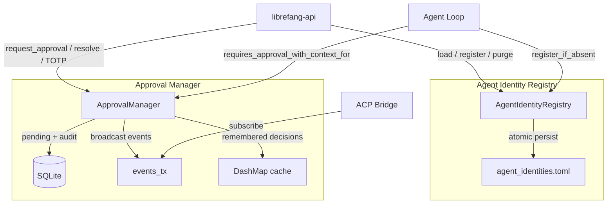
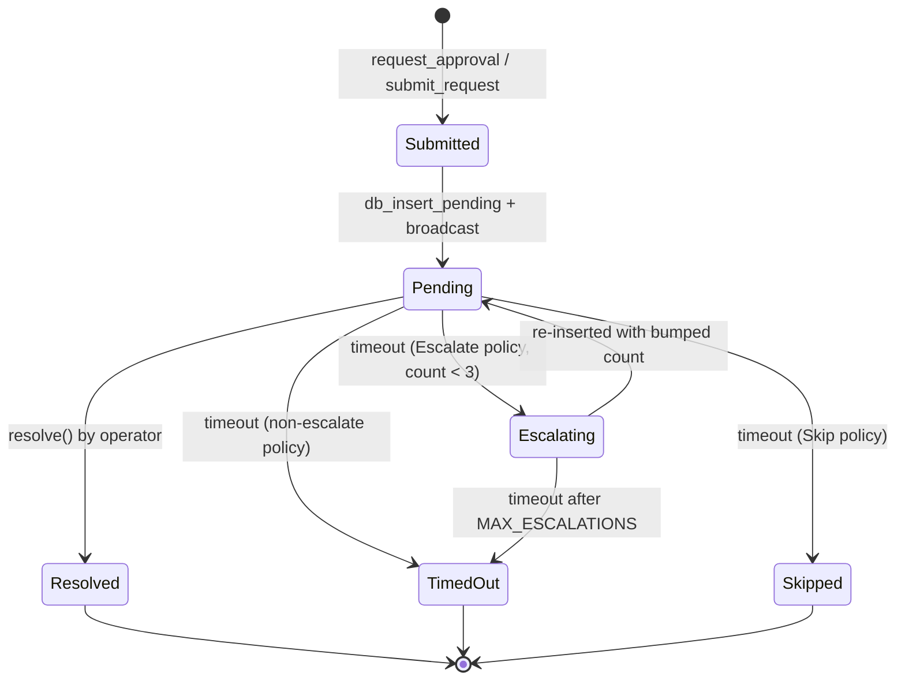

# Kernel Core — librefang-kernel-src

# Kernel Core — `librefang-kernel-src`

The kernel core provides two foundational subsystems that underpin agent identity continuity and safe tool execution: the **Agent Identity Registry** and the **Approval Manager**.

## Architecture Overview



---

## Agent Identity Registry

**File:** `agent_identity_registry.rs`

### Purpose

The registry persists `agent_name → canonical_uuid` mappings independently of the SQLite agent rows. Without it, respawning an agent (after a panic, manifest reload, or explicit kill) would generate a fresh `AgentId`, silently orphaning sessions, memories, and cron jobs keyed under the prior UUID.

While `AgentId::from_name` (UUID v5) already derives IDs deterministically from agent names, the registry adds an explicit history layer that survives derivation changes (namespace bumps, normalisation changes) and supports a **delete-vs-purge** distinction:

- **Kill agent** — keeps the registry entry intact; a later respawn reuses the same UUID, so surviving sessions remain reachable.
- **Purge agent** (`?purge_identity=true`) — drops the entry; the next spawn starts from a clean slate.

### Storage

A TOML file at `<home_dir>/agent_identities.toml`, written atomically via temp-file → fsync → rename. The schema is intentionally narrow:

```toml
[agents.nika]
canonical_uuid = "660bef7c-04d5-4480-8af2-0ce029981a14"
created_at = "2026-04-01T10:00:00Z"
```

The file is human-readable for emergency surgery but is **not** a user-editable config. A malformed file is never overwritten during `load()` — the operator gets an empty in-memory view and the original file remains on disk for manual recovery.

### Concurrency Model

- A `DashMap<String, AgentIdentityRecord>` serves reads and inserts lock-free.
- A separate `Mutex` serialises on-disk writes so two concurrent `register_if_absent` calls never produce an interleaved file.

### Key Methods

| Method | Description |
|---|---|
| `AgentIdentityRegistry::load(home_dir)` | Eagerly loads existing TOML. Load errors are logged and treated as empty — never panics or returns `Err`. |
| `AgentIdentityRegistry::in_memory()` | Creates a registry with no persistence (test helper). `persist()` becomes a no-op. |
| `register_if_absent(name, uuid)` | Inserts `name → uuid` only if no entry exists. **First UUID wins** — subsequent calls return the original. Persists on insert. |
| `get(name)` | Returns `Option<AgentId>` for a previously recorded name. |
| `purge(name)` | Removes the entry and returns the dropped UUID. Persists on success. |
| `persist()` | Snapshots the DashMap to disk via atomic write. No-op when no persist path is set. |
| `list()` | Returns a `BTreeMap` snapshot (deterministic key order for diagnostics). |

### Persistence Failure Handling

Disk errors during `register_if_absent` or `purge` are logged as warnings. The in-memory map is always authoritative for the running process — a momentarily wedged disk must not block the kernel.

---

## Approval Manager

**File:** `approval.rs`

### Purpose

The `ApprovalManager` gates dangerous tool operations (shell execution, file writes, etc.) behind human approval. It supports two execution paths:

1. **Blocking** — `request_approval()` blocks the agent loop until a human resolves the request, times out, or the request escalates.
2. **Deferred (non-blocking)** — `submit_request()` stores a `DeferredToolExecution` payload and returns immediately. Resolution via `resolve()` atomically returns both the decision and the deferred payload for the caller to execute.

### Policy Evaluation

Whether a tool requires approval is determined by `ApprovalPolicy` through a layered check:

```
1. Trusted sender?  → bypass everything
2. Channel rule?    → explicit allow/deny for (channel, tool)
3. Remembered "always" decision? → short-circuit (allow_always / reject_always)
4. Default require_approval list (supports glob patterns: "file_*", "*")
```

The agent-aware variants `requires_approval_with_context_for` and `is_tool_denied_with_context_for` consult the remembered-decisions cache before falling through to policy. This supports the ACP permission bridge (#3313), where a user's "always allow" or "always reject" choice persists for the `(agent_id, tool_name)` pair in memory.

### Request Lifecycle



**Escalation:** When `timeout_fallback` is `Escalate { extra_timeout_secs }`, a timed-out request is re-inserted with `escalation_count += 1` up to `MAX_ESCALATIONS` (3). After the final escalation, the request resolves as `TimedOut`.

**Pending limit:** Each agent is capped at 5 concurrent pending requests (`MAX_PENDING_PER_AGENT`). A 6th request is immediately denied.

### Persistence Across Restarts (#3611)

When constructed via `new_with_db`, the manager persists pending approvals and TOTP lockout state to SQLite:

- **`pending_approvals` table** — on submission, a row is inserted along with a `pending` audit entry. On resolution/expiry, the row is deleted.
- **Deferred payload serialization** — the `DeferredToolExecution` is JSON-serialized into `deferred_payload`. On daemon restart, `restore_pending_approvals` decodes and integrity-checks each row:
  - `agent_id`, `tool_name`, and `session_id` in the payload must match their respective row columns. A mismatch (indicating tampering) drops the deferred slot while keeping the pending request visible in the UI for manual investigation.
- **TOTP lockout state** — `totp_lockout` table persists `(sender_id, failures, locked_at)`. Entries whose lockout window expired during downtime are discarded at load time.

### Broadcast Events (#3313)

`ApprovalManager` exposes a `broadcast::Sender<ApprovalEvent>` (capacity 256). External transports (ACP adapter, dashboard) subscribe via `subscribe()`. Events fired:

- `ApprovalEvent::Created(request)` — on `request_approval` or `submit_request`
- `ApprovalEvent::Resolved { request_id, decision, decided_by }` — on `resolve()`

Slow consumers may see `RecvError::Lagged` and should re-sync via `list_pending()` rather than treating the broadcast as the source of truth.

### Remembered Decisions (#3313)

In-memory cache mapping `(agent_id, tool_name) → ApprovalDecision` for "always allow" / "always reject" choices made through the ACP permission UI. Not persisted across daemon restarts (follow-up tracked).

| Method | Behaviour |
|---|---|
| `remember(agent_id, tool_name, decision)` | Records an "always" decision. |
| `recall(agent_id, tool_name)` | Retrieves a cached decision, if any. |
| `forget(agent_id, tool_name)` | Removes the cached decision. |

### Session-Scoped Operations

Methods mirroring Hermes-Agent's approval model:

- `resolve_all_for_session(session_id, decision, decided_by)` — resolves every pending request belonging to a session atomically. Returns the count resolved. Does **not** handle deferred payloads; callers needing deferred execution should loop `resolve_tool_approval`.
- `list_pending_for_session(session_id)` / `has_pending_for_session(session_id)` — query/filter pending requests by session.

### TOTP Second Factor

When `ApprovalPolicy.second_factor == SecondFactor::Totp`, approvals for tools matching `totp_protected_tools` require a valid TOTP code.

**Verification flow:**
1. Caller verifies the code via `verify_totp(secret, code, issuer)` (RFC 6238, SHA-1, 6 digits, 30-second step, ±1 window).
2. Caller passes `totp_verified: true` to `resolve()`.
3. If TOTP is required but not verified, `resolve()` returns `Err`.

**Grace period:** After a successful TOTP verification, `record_totp_grace(user_id)` starts a window (`totp_grace_period_secs`) during which subsequent approvals skip TOTP. Each success resets the failure counter.

**Brute-force protection (#3372, #3584):**
- 5 consecutive failures (`TOTP_MAX_FAILURES`) triggers a 5-minute lockout (`TOTP_LOCKOUT_SECS`).
- `check_and_record_totp_failure(sender_id)` performs an atomic lockout-check + failure-record under `failure_rw_mutex`, eliminating TOCTOU races.
- Failures and lockout state persist to `totp_lockout` table. If the DB write fails, the method returns `Err` — callers must reject fail-secure.

**Replay prevention (#3359):**
- `is_totp_code_used(code)` / `record_totp_code_used(code)` track SHA-256 hashes of used codes in `totp_used_codes` with a 60-second lookback window.
- `record_totp_code_used_for(code, bound_to)` binds the code to an action key (e.g. `"approval:<uuid>"`) for audit traceability.

**Recovery codes:**
- `generate_recovery_codes()` produces 8 codes in `XXXX-XXXX-XXXX-XXXX` hex format (64 bits entropy per code from a CSPRNG).
- `verify_recovery_code(stored_json, code)` uses constant-time comparison (`subtle::ConstantTimeEq`) across all stored codes to prevent timing side-channels (#3591). On match, the code is consumed and the updated list is returned.
- `is_recovery_code_format(code)` accepts both the new hex format and the legacy `DDDD-DDDD` decimal format for backward compatibility.

### OAuth Nonce Consumption (#3944)

The manager also tracks consumed OIDC state nonces to prevent OAuth callback replay:

- `is_oauth_nonce_used(nonce)` — checks SHA-256 hash against `oauth_used_nonces` with a 1-hour window.
- `record_oauth_nonce_used(nonce)` — persists the hash and prunes entries older than 1 hour.

### Audit Logging

All resolutions (including timeouts and escalations) are written to `approval_audit` via `push_recent()`. Each entry includes the full `ApprovalAuditEntry` with request metadata, decision, decider, timestamp, and whether a second factor was used.

**Query methods:**
- `query_audit(limit, offset, agent_id, tool_name)` — paginated queries with optional filters.
- `audit_count(agent_id, tool_name)` — total count with optional filters.
- `prune_audit(older_than_days)` — hard-deletes entries older than `N` days. Uses `datetime()` comparison to handle RFC3339 variants correctly (#3468).

### Risk Classification

`classify_risk(tool_name)` returns a static risk level:

| Tool | Risk |
|---|---|
| `shell_exec` | Critical |
| `file_write`, `file_delete`, `apply_patch` | High |
| `web_fetch`, `browser_navigate` | Medium |
| Everything else | Low |

### Policy Hot-Reload

`update_policy(policy)` replaces the active `ApprovalPolicy` behind a `RwLock`. All policy checks read a snapshot, so a hot-reload takes effect on the next check without disrupting in-flight requests.

---

## Integration Points

### From `librefang-api`

The API layer is the primary consumer:

- **WebSocket handler** (`handle_agent_ws` in `ws.rs`) calls `subscribe_changes` on the registry.
- **OAuth callback** (`consume_oauth_nonce` in `oauth.rs`) calls `is_oauth_nonce_used` and `record_oauth_nonce_used`.
- **Dashboard login** (`dashboard_login` in `server.rs`) calls `verify_totp`, `is_totp_code_used`, `record_totp_code_used`, and `policy`.
- **Auth middleware** (`auth` in `middleware.rs`) calls `from_str_role` from the auth module.
- **OpenAI compatibility** (`list_models`) calls `list_arcs` on the registry.

### From the Agent Loop

- `register_if_absent` is called during agent spawn to establish or retrieve the canonical UUID.
- `requires_approval_with_context_for` is called before each tool invocation to determine whether the agent must pause for approval.

### From the ACP Bridge

- Subscribes to `ApprovalEvent` via `subscribe()` for low-latency permission prompts.
- Records remembered decisions via `remember()` on "always allow/reject" choices.